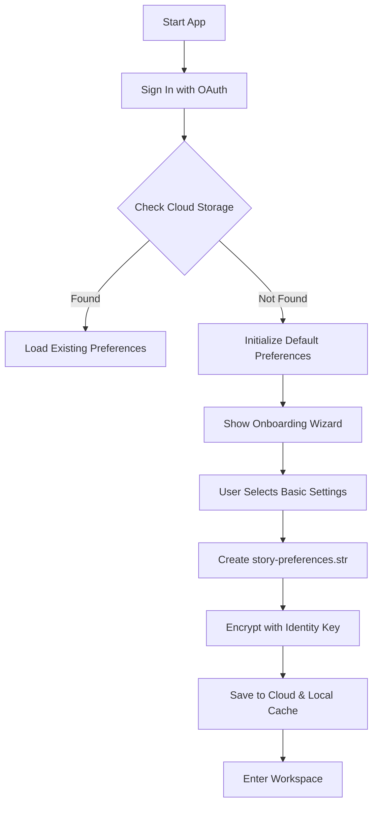

# User Preferences: First Run Experience

## Overview
This specification details the user experience for a new user encountering the Story application for the first time. It covers the creation of the initial preferences file and the onboarding setup.

## 1. User Journey: Brand New User

### 1.1 Context
- User has never used Story before.
- No `story-preferences.str` exists in their cloud storage.
- No local cache exists.

### 1.2 Flow Steps

1.  **App Launch**: User opens Story application.
2.  **Authentication**: User signs in with OAuth provider (Google/Microsoft).
3.  **Discovery Check**: System checks for existing preferences (returns `not_found`).
4.  **Initialization**:
    - System generates default preferences in memory.
    - System creates a new `story-preferences.str` file.
    - System encrypts file with identity-derived key.
5.  **Onboarding Wizard** (Optional but recommended):
    - "Welcome to Story" dialog.
    - Quick setup: Theme (Light/Dark/System), Grid preference.
6.  **Save & Sync**:
    - Preferences saved to local IndexedDB.
    - Preferences uploaded to default cloud storage location.

### 1.3 Task Flow Diagram

## 2. Default Preferences Generation

When a new file is created, it is populated with these defaults:

| Category | Setting | Default Value |
|----------|---------|---------------|
| **Appearance** | Theme | `system` |
| **Appearance** | Language | Browser/System Language |
| **Editor** | Show Grid | `true` |
| **Editor** | Snap to Grid | `true` |
| **Editor** | Grid Size | `10px` |
| **Storage** | Default Provider | Provider used for Sign-in |

## 3. Onboarding UI Elements

### 3.1 Welcome Modal
- **Header**: "Welcome to Story"
- **Body**: "Let's set up your workspace."
- **Controls**:
    - Theme Toggle (Visual cards for Light/Dark)
    - "Get Started" button (Primary action)

### 3.2 Background Processes
- While user is reading the welcome modal, the system is already:
    - Deriving encryption keys.
    - Preparing the file structure.
    - Establishing cloud connection.

## 4. Error Handling during Creation

- **Network Failure**: If cloud upload fails, save locally to IndexedDB and mark as `dirty`. Retry when online.
- **Storage Full**: Notify user, fallback to local storage only.
