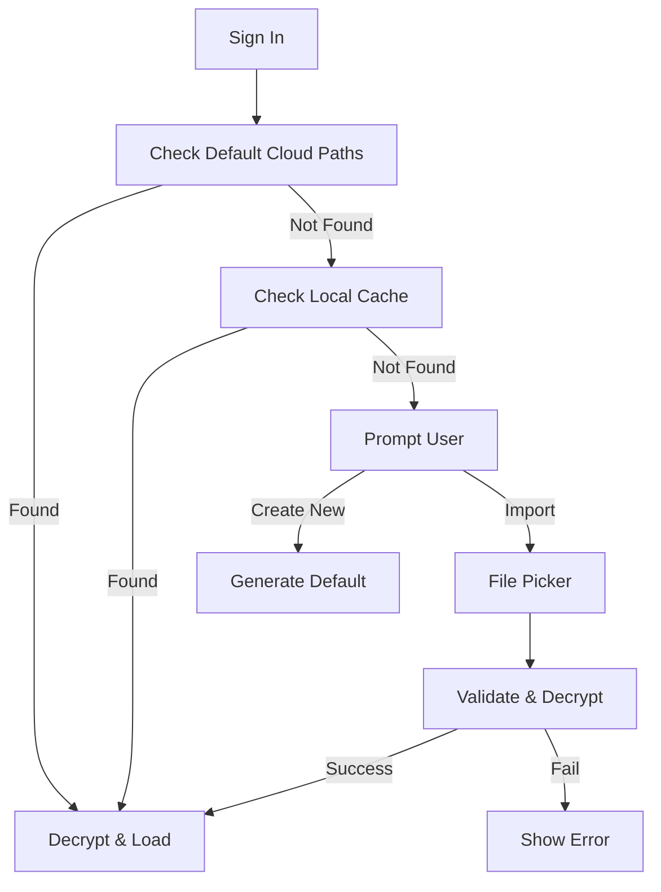

# User Preferences: Returning User & New Device Flow

## Overview
This specification details the UX for a user who already has a Story account and preferences but is accessing the application from a new device or a fresh browser session.

## 1. User Journey: New Device / Fresh Session

### 1.1 Context
- User has a `story-preferences.str` file in their cloud storage.
- User is signing in on a new laptop or cleared browser cache.
- Local IndexedDB is empty.

### 1.2 Flow Steps

1.  **App Launch**: User opens Story.
2.  **Authentication**: User signs in with OAuth.
3.  **Discovery Phase**:
    - System queries default cloud paths (`/Apps/Story/story-preferences.str`).
    - **Scenario A: File Found**:
        - System downloads file.
        - Attempts decryption with current identity.
        - **Success**: Loads preferences, populates local cache.
        - **Failure**: (See Error Handling).
    - **Scenario B: File Not Found** (but user claims to have one):
        - System prompts user: "We couldn't find your settings. Import existing preferences?"
4.  **Workspace Load**: App applies loaded preferences (Theme, Shortcuts, etc.).

### 1.3 "No Preferences Found" Scenario

If the automatic discovery fails (e.g., file moved, different folder structure):

1.  **Notification**: "No preferences found for this account."
2.  **Action Banner**:
    - "Create New" (Default)
    - "Import from File" (Secondary)
3.  **User Decision**:
    - If **Create New**: Follows [First Run Flow](./preferences-ux-first-run.md).
    - If **Import**: Opens file picker to locate `.str` file.

## 2. Opening a Presentation without Preferences

### 2.1 Context
- User opens a `presentation.str` file directly (e.g., from email or file explorer).
- User is NOT signed in, or hasn't set up preferences on this device yet.

### 2.2 Flow

1.  **File Open**: User double-clicks `presentation.str`.
2.  **App Loads**: App opens in "Guest/Default" mode.
3.  **Identity Check**:
    - App checks if `presentation.str` has a linked preference file ID.
    - **If Linked**:
        - Prompt: "This file is linked to your preferences. Sign in to load them?"
        - Action: Sign In -> OAuth -> Fetch Preferences -> Apply.
    - **If Not Linked**:
        - App runs with default settings.
        - Banner: "Sign in to save your workspace settings."

## 3. Task Flow Diagram: Discovery

## 4. Error Handling

- **Decryption Failure**: "We found a preferences file, but your current account cannot unlock it. Please sign in with the creating account or link this identity."
- **Corrupt File**: "Your preferences file appears damaged. We have loaded default settings."
