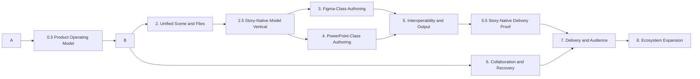

# Story Delivery Roadmap

> **Status:** Normative sequencing plan  
> **Last updated:** July 10, 2026  
> **Inputs:** [Product Specification](product-spec.md) and [Capability Audit](capability-audit.md)
> **Master execution and total-closure plan:** [Story 100% Implementation Plan](implementation-plan.md)

## 1. Roadmap Rule

The product goal cannot be reached by implementing a long list of independent controls. Story must first make document mutation, history, files, assets, collaboration, rendering, and evidence one system. Major design and presentation features are then built on that foundation in complete vertical workflows.

This roadmap is the detailed work-package catalog. The [Story 100% Implementation Plan](implementation-plan.md) consolidates these programs into six execution phases and defines the non-gameable completion standard. Where sequencing language differs, the implementation plan controls phase order and this roadmap controls work-package detail; neither may weaken the numbered specification volumes.

Priority definitions:

| Priority | Meaning |
|---|---|
| **P0** | Blocks reliable implementation of multiple product families or risks data loss and incompatible architecture. |
| **P1** | Required for the Figma-class or PowerPoint-class product promise. |
| **P2** | Deepens professional workflows after the core promise is coherent. |
| **P3** | Optional ecosystem expansion; must not block deterministic core work. |

## 2. Program Sequence

Programs 3 and 4 may run in parallel only after Programs 1, 2, and the Story-native model vertical pass their exit gates. Program 6 begins at the operation layer during Program 1 and becomes user-facing after file and scene fidelity are proven. The later Story-native delivery proof closes runtime and output tasks after the thin required adapters exist. Differentiation does not wait for parity breadth: Story Systems, base narratives, audience editions, narrative components, governed overrides, and edition-aware runtime/output are P1 foundations of the first coherent release profile.

## 3. Program 0: Honest Baseline

**Priority:** P0
**Outcome:** The repository can distinguish intended behavior, current implementation, verification, and historical material.

| Work package | Scope | Exit evidence |
|---|---|---|
| GOV-001 Documentation authority | Establish the product spec, capability audit, roadmap, glossary, specs index, and archive policy. | All active indexes route correctly; local links pass; no active document treats “specified” as “implemented.” |
| GOV-002 Capability ledger | Map every `DES`, `PRE`, and `ARC` requirement to spec, implementation owner, and evidence status. | Machine-readable or table-based ledger with dated revision and no inferred coverage. |
| GOV-003 Production conformance tests | Assert the actual initial state, routed actions, history, save/open, media hydration, and cross-surface rendering. | Tests use production Store and services rather than shape-incompatible mocks. |
| GOV-004 Remove false affordances | Audit menus and controls for actions or formats that have no handler. Disable, label experimental, or implement them. | Every enabled command reaches a valid operation and visible outcome. |
| GOV-005 Repair quality tooling | Fix performance registry paths, generated indexes, and taskflow coverage reporting. | Required scripts run from a clean checkout and produce dated evidence. |

## 3.1 Program 0.5: Product Operating Model

**Priority:** P0
**Outcome:** Product structure and interaction behavior are settled before architecture freezes user-visible assumptions.

| Work package | Scope | Exit evidence |
|---|---|---|
| UX-001 Canonical shell | Five workspace views, edit scopes, tools, panels, focus, Escape, commit, state feedback, and adaptive tiers from Volume 02. | Canonical shell/reference-screen pack approved; no competing view/mode taxonomy. |
| UX-002 Familiarity contracts | Freeze the Figma-transfer and PowerPoint-transfer tasks and accepted Story-specific divergences. | `BENCH-PRODUCT-001` pilot-ready with objective validators. |
| UX-003 Story-native model | Story Systems, base narratives, narrative components, editions, overrides, source-update review, runtime admission, and output identity. | Cross-volume flow and schema review passes; no custom-show or copied-deck substitution. |
| UX-004 R1 profile | Exact platforms, capability tiers, workflows, defaults, exclusions, and gates. | `PROFILE-R1-2026-01` accepted as a nonempty executable slice. |

## 4. Program 1: Canonical Document Core

**Priority:** P0  
**Outcome:** Every feature can rely on one versioned document and one mutation model.

### 4.1 Document Schema

| Work package | Scope | Product requirements |
|---|---|---|
| DOC-001 State boundaries | Separate persisted document, editor session, presentation runtime, identity, presence, cache, and provider state. | ARC-001 |
| DOC-002 Canonical taxonomy | Define stable types for slides, masters, layouts, elements, shapes, text, data objects, components, animation, notes, and assets. | ARC-002 |
| DOC-003 Stable sub-identities | Assign IDs to fills, strokes, effects, paths, points, segments, operands, table cells, chart series, animation steps, and ordered items. | DES-023, ARC-002 |
| DOC-004 Schema and migration | Add validation, versioning, deterministic migrations, unknown-field policy, and malformed-document diagnostics. | ARC-002, ARC-030 |
| DOC-005 Resolved inheritance | Produce non-mutating resolution for masters, layouts, themes, variables, components, instances, and slide overrides. | ARC-003, PRE-010, DES-054 |

### 4.2 Transactions and History

| Work package | Scope | Product requirements |
|---|---|---|
| TXN-001 Operation boundary | Route every document mutation through typed atomic operations. | ARC-010 |
| TXN-002 Inversion and coalescing | Define inverses or bounded snapshot fallback; coalesce drags, scrubs, drawing, and text sessions. | DES-013, ARC-011 |
| TXN-003 Ordered collections | Define insert, move, remove, and reorder operations with stable positions for layers, slides, points, effects, and animations. | ARC-011 |
| TXN-004 Local undo under collaboration | Undo local intent without restoring over accepted remote edits; define redo after rebase. | ARC-012 |
| TXN-005 Boundary validation | Validate local operations, remote operations, migrations, imports, and file loads using the same schemas. | ARC-002, ARC-011 |

### Program 1 Exit Gate

1. Every production document action is represented by a typed operation or explicitly tracked migration exception.
2. Continuous gestures produce one undo step.
3. Text, vector, style-stack, master/layout, notes, animation, and asset-reference changes survive undo/redo.
4. Replaying the same operation sequence produces the same document hash.
5. Two replicas converge for ordered edits, deletes, and concurrent property changes in deterministic tests.

## 5. Program 2: Unified Scene, Files, and Assets

**Priority:** P0  
**Outcome:** The same document meaning survives every surface and storage boundary.

### 5.1 Resolved Scene

| Work package | Scope | Product requirements |
|---|---|---|
| SCN-001 Renderer-neutral scene | Define resolved geometry, paint, text, clipping, media, data, animation, and accessibility semantics. | ARC-020 |
| SCN-002 Surface adapters | Make editor, thumbnail, presentation, presenter, export, print, and recording consume the common scene. | ARC-020 |
| SCN-003 Degradation contract | Represent unsupported output explicitly with warnings and preserved source data. | ARC-021, PRE-073 |
| SCN-004 Readiness pipeline | Resolve fonts, images, video, code, data, and embeds before they become visible or time-critical. | ARC-022 |
| SCN-005 Cross-surface fixtures | Build visual and semantic fixture decks for every element, paint, inheritance, and animation family. | ARC-020, ARC-021 |

### 5.2 Native File and Asset Lifecycle

| Work package | Scope | Product requirements |
|---|---|---|
| FIL-001 Canonical `.str` package | Specify package manifest, document shards, assets, versions, checksums, previews, and unknown-feature preservation. | ARC-032 |
| FIL-002 Production Store adapters | Ensure serializer/deserializer map every document field through the real Store boundary. | ARC-030 |
| FIL-003 Asset registry | Unify imported, generated, linked, cached, and embedded assets with reference counting and history retention. | ARC-030 |
| FIL-004 Save/open round trip | Prove save, close, reopen, migrate, hydrate, and render for masters, media, notes, themes, components, and animation. | ARC-030 |
| FIL-005 Autosave and recovery | Integrate autosave, crash recovery, conflict copies, cross-tab ownership, and interrupted-save recovery. | ARC-031 |

### Program 2 Exit Gate

1. Golden `.str` files round-trip through the production UI with stable semantic hashes.
2. Editor, thumbnail, audience, presenter, SVG/raster export, and print fixtures agree within declared tolerances.
3. Unsupported features are preserved or reported; none disappear silently.
4. Media and font failures produce deterministic fallbacks and actionable diagnostics.
5. Autosave and recovery tests prove no data loss under refresh, crash simulation, and provider interruption.

## 5.3 Program 2.5: Story-Native Model Vertical

**Priority:** P1
**Outcome:** Story proves its reason to exist before expanding parity breadth.

| Work package | Scope | Product requirements | Depends on |
|---|---|---|---|
| NAR-001 System adoption | Convert an existing deck to a base narrative without visual mutation or copied slides. | `REQ-09-171`, `REQ-09-172` | Programs 1-2 |
| NAR-002 Narrative components | Semantic slots, visual mapping, notes, motion, accessibility, and source identity. | `REQ-09-173` | DOC-005, SCN-001 |
| NAR-003 Audience editions | Stable include/exclude/reorder/substitute/localize/mode directives over one base. | `REQ-09-174`, `REQ-09-175` | NAR-001 |
| NAR-004 Update review | Compatible propagation, conflict/orphan classification, explicit reconciliation, preserved overrides. | `REQ-09-176`, `REQ-09-177` | NAR-002, NAR-003 |
| NAR-005 Edition admission contract | Deterministic resolution hash and edition-aware runtime/output job inputs, validated without requiring production delivery adapters. | `REQ-09-178` through `REQ-09-180`, `REQ-10-003`, `REQ-11-221` through `REQ-11-223` | SCN-001 through SCN-004 |

### Program 2.5 Exit Gate

The first six Story-native benchmark tasks pass through deterministic model, authoring, resolution, save/reopen, and headed UI evidence. Tasks 7-8 have complete immutable admission/output plans and negative fixtures, but their production runtime/output execution closes at Program 5.5. No copied presentation roots, custom-show aliases, or silent drift are accepted.

## 6. Program 3: Figma-Class Authoring

**Priority:** P1  
**Outcome:** A Figma user can execute complete professional design workflows with familiar interactions.

### 6.1 Interaction and Geometry

| Work package | Scope | Product requirements | Depends on |
|---|---|---|---|
| DSG-101 Geometry-aware selection | Fill/stroke/path/clipping hit testing, nested selection, cycling, deep select, and keyboard traversal. | DES-010, DES-011 | SCN-001 |
| DSG-102 Transform completion | Align, distribute, transform origin, constraints-aware resize, multi-select rules, and precision controls. | DES-012, DES-013 | TXN-001 |
| DSG-103 Vector authoring | Pen, join/open/close/reverse/scissors, segment conversion, continuity, compound paths, and path inspector. | DES-020 through DES-023 | DOC-003, TXN-003 |
| DSG-104 Text modernization | Selection-scoped rich text without deprecated commands, sizing modes, tabs, columns, direction, IME, recovery, and font policy. | DES-030 through DES-033 | DOC-002, TXN-002 |

### 6.2 Responsive Systems

| Work package | Scope | Product requirements | Depends on |
|---|---|---|---|
| DSG-110 Auto Layout model | Container direction/wrap, padding, gap, alignment, distribution, order, nested layout, and absolute children. | DES-040, DES-041 | DOC-002, TXN-003 |
| DSG-111 Sizing and constraints | Hug, fill, fixed, min/max, parent-edge constraints, aspect behavior, and slide-size response. | DES-041, DES-042 | DSG-110 |
| DSG-112 Layout UI and gestures | Inspector, canvas handles, drag insertion/reorder, measurements, feedback, keyboard, and mixed values. | DES-040 through DES-043 | DSG-110, DSG-111 |
| DSG-113 Presentation integration | Define how Auto Layout interacts with placeholders, columns, guides, masters, and layouts. | DES-043, PRE-010 | DSG-112 |

### 6.3 Reuse and Libraries

| Work package | Scope | Product requirements | Depends on |
|---|---|---|---|
| DSG-120 Components and instances | Definitions, instances, nested instances, propagation, overrides, reset, swap, and detach. | DES-050, DES-051, DES-054 | DOC-005, TXN-003 |
| DSG-121 Variants and properties | Component sets, variant axes, text/boolean/instance properties, exposed nested properties, and state preview. | DES-050, DES-051 | DSG-120 |
| DSG-122 Variables and modes | Typed variables, collections, aliases, modes, theme binding, and validation. | DES-052, DES-053 | DOC-005 |
| DSG-123 Styles and libraries | Color, typography, effect, grid, and spacing styles; publish/update/review and team distribution. | DES-052 through DES-054 | DSG-120, DSG-122 |

### 6.4 Professional Design Workflow

| Work package | Scope | Product requirements | Depends on |
|---|---|---|---|
| DSG-130 Paint and media completion | Multi-edit parity, patterns/advanced gradients decision, crop/trim/poster/playback, and effect styles. | DES-060 through DES-063 | SCN-001, FIL-003 |
| DSG-131 Layers at scale | Search, filters, range selection, isolation, auto-scroll, component hierarchy, and accessible tree semantics. | DES-070 | DSG-120 |
| DSG-132 Portable clipboard | Cut/copy/paste/paste-in-place across tabs and apps with stable IDs and asset transport. | DES-071 | DOC-003, FIL-003 |
| DSG-133 Figma/SVG interoperability | Supported editable import by default, fidelity report, degradation UX, and corpus expansion. | DES-072, DES-073 | SCN-003, DSG-132 |

### Program 3 Exit Gate

Figma-experienced users must complete benchmark tasks covering responsive card components, variant-driven states, vector icon editing, rich typography, nested instances, shared styles, and clipboard import without conceptual retraining or silent fidelity loss. Each task must pass headed workflow, file round-trip, undo, collaboration, accessibility, and output-parity gates.

## 7. Program 4: PowerPoint-Class Authoring

**Priority:** P1  
**Outcome:** A PowerPoint user can create and prepare a professional presentation without leaving Story.

### 7.1 Deck Structure and Templates

| Work package | Scope | Product requirements | Depends on |
|---|---|---|---|
| PPT-201 Slide organization | Cut/copy/paste, hide, rename, search, sections, outline, selected start, and custom shows. | PRE-001 through PRE-003 | TXN-003 |
| PPT-202 Master/layout completion | All placeholder families, reset/detach/restore, reconciliation, accessibility metadata, and responsive integration. | PRE-010 through PRE-012 | DOC-005, DSG-113 |
| PPT-203 Template system | Gallery, preview, save-as-template, branded packages, layout families, and safe application. | PRE-013 | PPT-202, DSG-123 |

### 7.2 Native Presentation Content

| Work package | Scope | Product requirements | Depends on |
|---|---|---|---|
| PPT-210 Tables | Data model, editor, formatting, selection, merge/split, paste, formulas policy, accessibility, and animation. | PRE-020 | DOC-002, SCN-001 |
| PPT-211 Charts | Data model/editor, chart families, axes, labels, themes, accessibility, animation, and compatibility mapping. | PRE-021 | DOC-002, SCN-001 |
| PPT-212 Diagrams | Structured hierarchy/process/cycle/relationship/timeline models, layout, styles, conversion, and animation. | PRE-022 | DSG-110, DSG-120 |
| PPT-213 First-class media | Audio/video objects, trim, captions, poster, playback controls, security, and offline behavior. | PRE-023 | FIL-003, SCN-004 |

### 7.3 Motion, Notes, and Recording

| Work package | Scope | Product requirements | Depends on |
|---|---|---|---|
| PPT-220 Animation model | Entrance, emphasis, exit, motion paths, media cues, state changes, and stable target identity. | PRE-031, PRE-033 | DOC-003, SCN-001 |
| PPT-221 Animation sequencer | Timeline/list authoring, trigger modes, duration, delay, repeat, grouping, reorder, preview, and copy. | PRE-032 | PPT-220, TXN-003 |
| PPT-222 Morph and transition fidelity | Stable matching, inheritance, gallery, readiness, reduced motion, and output parity. | PRE-030, PRE-033 | SCN-002 |
| PPT-223 Notes and rehearsal completion | Notes search/format/export and full recorded-timing review and show policy. | PRE-040, PRE-041 | FIL-004 |
| PPT-224 Recording | Narration, camera, ink/pointer, timing, slide retake, captions, playback, storage, and editing. | PRE-042 | PPT-221, PPT-213 |

### Program 4 Exit Gate

PowerPoint-experienced users must complete benchmark tasks covering sections, masters/layouts, branded templates, tables/charts, diagrams, animation sequencing, notes, rehearsal, recording, and show setup without leaving Story. All authored semantics must survive undo, native-file reopen, collaboration, audience playback, and declared output formats.

## 8. Program 5: Interoperability and Professional Output

**Priority:** P0 for architecture, P1 for user delivery  
**Outcome:** Story can exchange and deliver professional presentations without silent loss.

| Work package | Scope | Product requirements | Depends on |
|---|---|---|---|
| OUT-301 OOXML preservation layer | Parse/write OPC packages, relationships, themes, masters, layouts, slides, media, and extension data without discarding unknown parts. | PRE-070, PRE-073 | DOC-002, SCN-003 |
| OUT-302 PPTX semantic mapping | Map Story and OOXML text, shapes, groups, tables, charts, media, themes, transitions, and animation by fidelity tier. | PRE-070 | OUT-301, Programs 3 and 4 |
| OUT-303 Compatibility report | Preview unsupported, substituted, rasterized, and preserved-only content before irreversible export or edit. | PRE-073 | SCN-003, OUT-302 |
| OUT-304 Golden interop corpus | Maintain real-world and synthetic PPTX fixtures with semantic, package, visual, and round-trip assertions. | PRE-070 | OUT-302 |
| OUT-310 PDF and print | Deck PDF, accessible metadata where supported, notes pages, outlines, handouts, preview, ranges, and color policies. | PRE-071, PRE-072 | SCN-002, PPT-223 |
| OUT-311 Video output | Render deterministic transitions, animation, media, timings, narration, camera, captions, and audio mix. | PRE-071 | PPT-224, SCN-002 |
| OUT-312 Portable web output | Package viewer, assets, fonts, accessibility, controls, offline policy, and security boundaries. | PRE-071 | SCN-002, FIL-003 |

### Program 5 Exit Gate

1. Published PPTX fidelity tiers pass a versioned golden corpus.
2. Unknown OOXML parts survive a round trip when Story cannot edit them.
3. Compatibility reports match actual artifact degradation.
4. PDF, print, video, and web outputs are inspected semantically and visually, not only checked for file existence.

## 8.1 Program 5.5: Story-Native Delivery Proof

**Priority:** P1
**Outcome:** The differentiating Story-native model is proven through real presentation and output boundaries before broad delivery expansion.

| Work package | Scope | Product requirements | Depends on |
|---|---|---|---|
| NAR-510 Runtime admission | Bind base/edition identity, resolution hash, show plan, variable modes, locale, readiness, accessibility, capability, and privacy into `SCH-10-001`. | `REQ-09-178`, `REQ-10-003`, `REQ-10-024` | NAR-005, PPT-222, SCN-004 |
| NAR-511 Correct-edition delivery | Launch executive/customer editions with Presenter/Audience privacy, exact notes/settings/order, and recoverable audience-window loss. | `REQ-09-179`, `REQ-10-121`, `REQ-10-131`, `REQ-10-185`, `REQ-10-191` | NAR-510, RUN-502 thin adapter |
| NAR-512 Edition-aware artifacts | Produce PPTX, PDF, and portable web artifacts bound to the same admission snapshot and independent compatibility reports. | `REQ-11-221` through `REQ-11-223` | OUT-302, OUT-303, OUT-310, OUT-312 thin adapters |

### Program 5.5 Exit Gate

`BENCH-STORY-07` and `BENCH-STORY-08` pass with actual headed runtime and parsed artifacts. Wrong-edition, stale-readiness, copied-root, compatibility-misattribution, notes-leak, and tampered-snapshot fixtures all fail before audience reveal or artifact finalization.

## 9. Program 6: Collaboration, Review, and Recovery

**Priority:** P1  
**Outcome:** Teams can trust Story with shared, long-running work.

| Work package | Scope | Product requirements | Depends on |
|---|---|---|---|
| COL-401 Integrated multiplayer | Connect the production Store to the canonical operation stream, acknowledgments, offline queue, presence, and permissions. | PRE-061, ARC-012 | Program 1 |
| COL-402 Ordered and rich editing | Converge text, vectors, layers, slides, components, tables, charts, and animation under concurrent edits. | PRE-061 | COL-401, Programs 3 and 4 |
| COL-403 Comments and review | Anchored threads, mentions, replies, resolution, filters, navigation, notifications, and persistence. | PRE-060 | COL-401 |
| COL-404 Sharing semantics | Provider-independent viewer/commenter/editor roles, links, access review, revocation, and audit behavior. | PRE-062 | COL-401 |
| COL-405 Recovery and conflicts | Autosave integration, version history, conflict copies, offline reconnect, provider failure, and cross-tab ownership. | ARC-031 | FIL-005, COL-401 |

### Program 6 Exit Gate

Two or more real clients must converge after concurrent offline and online edits across every ordered and rich content family. Local undo, comments, permissions, save/reopen, and recovery must remain correct under reconnect and provider failure.

## 10. Program 7: Delivery and Audience

**Priority:** P1 baseline, P2 advanced  
**Outcome:** Story becomes exceptionally reliable and powerful in the room.

| Work package | Scope | Product requirements | Depends on |
|---|---|---|---|
| RUN-501 Show setup | All start modes, custom shows, timings, narration, loop, hidden-slide, kiosk, display, and end behavior. | PRE-050, PRE-052 | PPT-201, PPT-223 |
| RUN-502 Presenter completion | Display placement/hotplug, notes controls, remaining time, navigation, recovery, and customization. | PRE-043 | SCN-004 |
| RUN-503 Audience controls | Touch, remote, grid/history, blank screens, laser, ink, zoom, captions, and media control. | PRE-051 | PPT-213, PPT-224 |
| RUN-504 Audience services | Specify and selectively implement shared viewing, polls, Q&A, reactions, captions, moderation, privacy, and latency. | PRE-053 | COL-401 |
| RUN-505 Runtime hardening | Large-deck prefetch, bounded memory, frame budgets, display/window failure, asset failure, and observability. | ARC-022 | SCN-004 |

### Program 7 Exit Gate

Published 10-, 50-, and 100-slide benchmark decks must present without blank frames, reordered builds, uncontrolled memory growth, private presenter-state leakage, or unrecoverable display/window failure on supported environments.

## 11. Program 8: Ecosystem Expansion

**Priority:** P2 to P3  
**Outcome:** Story extends the proven differentiated core without weakening deterministic authoring or delivery.

Candidate programs include code-driven visuals, live data binding, interactive components, audience analytics, extensions, automation APIs, and AI-assisted composition. Each must use canonical transactions, permissions, file semantics, accessibility, and explicit privacy controls. AI output must remain inspectable and editable and may not become necessary to achieve core product fidelity.

## 12. Cross-Program Release Gates

Every release candidate must pass these gates:

1. **Document:** schema validation, migration, stable IDs, and semantic hash.
2. **History:** undo/redo and gesture coalescing on real workflows.
3. **Files:** save, close, reopen, assets, and unknown-field preservation.
4. **Collaboration:** operation validation, convergence, offline, and local undo where applicable.
5. **Surfaces:** editor, thumbnail, presentation, presenter, export, and print parity or declared degradation.
6. **Artifacts:** inspect native files, clipboard data, imports, exports, and recordings.
7. **Accessibility:** keyboard, focus, semantics, reading order, contrast, reduced motion, captions, and accessible output where applicable.
8. **Performance:** scenario budgets on representative small, medium, large, and prolonged-use fixtures.
9. **Reliability:** recovery under interrupted save, missing asset/font, provider failure, and presentation-window failure.
10. **Documentation:** accepted behavior, current status, evidence revision, risks, and compatibility notes.

## 13. Immediate Next Build Order

The next implementation work should begin in this order:

1. Accept the canonical shell/reference-screen pack, frozen benchmark, R1 atomic ledger, and foundational ADR packet from Program 0.5.
2. Add production conformance tests for Store state, text undo, save/open, master and asset hydration, and cross-surface parity.
3. Implement the versioned canonical document schema, stable addresses, and state separation.
4. Implement the typed transaction/operation boundary, unified history, and ordered-operation contracts.
5. Repair native-file/asset round trips and add the renderer-neutral resolved scene.
6. Implement Story System adoption, base narratives, narrative components, audience editions, and update review through the Program 2.5 model gate.
7. Attach collaboration to the canonical operation stream and prove deterministic two-client convergence.
8. Complete geometry-aware selection, text modernization, Auto Layout, components, variables, and the R1 design benchmark families.
9. Complete R1 slide structure, masters/layouts, data objects, motion sequencer, notes, rehearsal, and recording.
10. Implement thin edition-aware runtime and output adapters, then close the Program 5.5 Story-native delivery proof.
11. Complete preservation-first PPTX, PDF, portable web, compatibility reports, and the remaining R1 workflows.

This order is mandatory unless a documented dependency analysis shows that a different sequence reduces foundational risk without creating a parallel system.