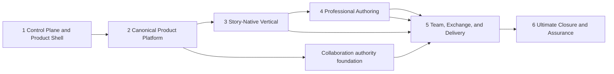

# Story 100% Implementation Plan

> **Status:** Controlled master execution plan  
> **Plan ID:** `STORY-IMPLEMENTATION-1`  
> **Version:** 1.0.0-draft  
> **Owner:** Product and Engineering  
> **Last updated:** July 10, 2026  
> **Specification baseline:** [Story Product Specification System](specification/README.md), content revision recorded by the generated traceability index  
> **Detailed work-package source:** [Story Delivery Roadmap](delivery-roadmap.md)  
> **Acceptance authority:** [Volume 15 - Acceptance and Release Conformance](specification/15-acceptance-and-release-conformance.md)

## 1. Mandate

This plan defines the finite execution path from the current repository to complete implementation of the accepted Story specification. It compresses the detailed roadmap into six meaningful product phases. It does not remove, defer, reinterpret, or lower any accepted requirement.

The target is the full product vision:

1. Figma-class visual and object authoring.
2. PowerPoint-class presentation authoring, production, and delivery.
3. Story-native systems, base narratives, narrative components, audience editions, governed overrides, update reconciliation, deterministic runtime admission, and edition-aware outputs.
4. One canonical document, mutation, scene, file, collaboration, accessibility, trust, quality, and evidence system across every surface.

At plan completion, Story is not merely a feature-complete editor. It is a supported, measurable, recoverable, accessible, secure, interoperable professional product whose implementation and evidence close the complete active specification graph.

The numbered specification volumes remain the sole owners of product behavior. This plan owns sequencing, delivery boundaries, and completion accounting only.

## 2. What “100%” Means

### 2.1 Unit of Closure

The unit of completion is an atomic `REQ-*` requirement at one exact accepted specification revision, expanded into every applicable conformance cell under Volume 15. A parent `DES-*`, `PRE-*`, or `ARC-*` capability is complete only when every active child requirement and required cell is complete.

A requirement closes only when all of the following are true:

1. Its intended behavior is accepted and non-contradictory.
2. A routed production implementation exists; mocks, dead modules, flags with no user path, and labels do not count.
3. Its same-suffix `AC-*` acceptance criterion passes.
4. Every applicable surface, lifecycle, entity, operation, durability, role, connectivity, output, runtime, platform, input, accessibility, localization, failure, and recovery cell has an explicit disposition.
5. Every required cell has a complete `TEST-*` protocol, materialized fixture, exact environment, assertions, timeout, cleanup, and negative controls.
6. Required headed browser, semantic, integration, artifact, manual/hardware/assistive-technology, performance, security, fault, and recovery evidence is current and bound to the candidate revision.
7. Every produced artifact is independently parsed or consumed and has a durable verified hash.
8. Applicable Volume 14 objectives pass and no hard-zero invariant is violated.
9. No unresolved blocking decision, finding, quarantine, expired waiver, or hidden degradation remains.
10. The implementation, criterion, protocol, evidence, and release decision reconcile in the generated ledgers.

### 2.2 Completion Score

Phase 1 creates and freezes `PROFILE-ENDSTATE-1`, the immutable full-product conformance profile used for Product 100%. It is reconciled to the exact accepted specification hash and all 16 manifest volumes. It includes every active atomic requirement and explicitly enumerates the complete surfaces, lifecycles, entity/operation families, durability boundaries, outputs, runtime modes, roles, connectivity states, platforms, browsers, devices, inputs, accessibility/internationalization profiles, failure classes, environments, quality objectives, artifacts, and decision triggers claimed by the ultimate product.

The profile generates `EXPECTED-UNIVERSE-1`, an immutable expected-universe manifest. The manifest is derived from the specification/profile hashes, canonical axis registries, owner-declared minimum applicability, feature applicability declarations, and cross-matrix expansion rules. It contains the exact expected IDs for requirements, criteria, applicability cells, protocols, fixtures, environments, artifacts/goldens, quality cells, decision triggers, and evidence classes. The editable coverage ledger is a disposition overlay on this universe; it cannot create its own denominator.

Profiles and universes are immutable versioned pairs. An accepted specification or applicability change creates `PROFILE-ENDSTATE-<N+1>` and `EXPECTED-UNIVERSE-<N+1>`; it never mutates version $N$. One governed active-version pointer identifies the pair used for planning and final conformance. Activation atomically regenerates/reviews phase subsets, invalidates affected evidence, preserves predecessor/successor links, and reprojects every open and closed ledger row into a successor row bound solely to the new pair. A predecessor result may be adopted only through an explicit unchanged-semantics/equivalent-cell decision with current successor evidence; otherwise the successor row reopens. A phase or release dossier names one exact pair and cannot mix versions.

Findings are not pre-enumerated in the expected universe. They enter an append-only candidate finding registry when discovered. Decision closure divides terminally resolved findings (`verified-closed`, `duplicate`, or `not-a-defect with evidence`) by all discovered findings, while also requiring zero unresolved tier-blocking finding. Decision triggers and required decision records remain pre-enumerated in the expected universe. Each expected decision trigger receives exactly one terminal state: `triggered-resolved` with its accepted decision record, or `not-triggered` with reviewed evidence that the trigger condition did not occur for the exact profile/candidate. Blank, pending, triggered-unresolved, or unreviewed trigger states fail closure.

Generation fails on an empty dimension, missing owner minimum, duplicate cell, unrecognized axis value, or a requirement without its mandated cross-matrix expansion. Validation requires exact set equality between expected and actual IDs. A cell that was never generated is therefore a hard failure, not an invisible omission. Validator mutation tests delete one requirement, one whole axis dimension, one cell, one artifact, one protocol, and one evidence binding and prove that 100% becomes impossible.

Progress dashboards may expose the following independent closure ratios:

| Ratio | Numerator | Denominator |
|---|---|---|
| Specification closure | Active requirements with accepted, non-contradictory owners and criteria | All active requirements |
| Implementation closure | Active requirements with complete routed production behavior | All active requirements |
| Cell closure | Expected applicability cells with final explicit dispositions | All cells in the active `EXPECTED-UNIVERSE-*` |
| Protocol closure | Expected required cells assigned release-admissible protocols | All required cells in the active `EXPECTED-UNIVERSE-*` |
| Evidence closure | Expected required cells with current admissible evidence | All required cells in the active `EXPECTED-UNIVERSE-*` |
| Artifact closure | Expected artifacts independently validated and hash-bound | All artifacts/goldens in the active `EXPECTED-UNIVERSE-*` |
| Quality closure | Expected SLO/environment cells passing | All quality cells in the active `EXPECTED-UNIVERSE-*` |
| Decision closure | Expected decisions in terminal `triggered-resolved` or reviewed `not-triggered` state, plus discovered findings with terminal accepted dispositions | Every expected decision ID plus every ID in the append-only candidate finding registry |

The program completion score is the minimum of these ratios, not their average:

```text
ProgramCompletion = min(Specification, Implementation, Cell, Protocol,
                        Evidence, Artifact, Quality, Decision)
```

This prevents strong unit-test or feature counts from concealing missing output, accessibility, recovery, interoperability, or evidence work.

### 2.3 Hard Conditions for 100%

The program reports **100%** only when all eight ratios equal 100% and all of the following are true:

- every active atomic requirement is assigned exactly once to a primary closure phase;
- the active `PROFILE-ENDSTATE-*` / `EXPECTED-UNIVERSE-*` pair is immutable, nonempty, hash-bound to the candidate, and exactly reconciles to all 16 volumes and all canonical axes;
- every active requirement has `implementationDisposition=delivered`; `missing`, `partial`, `removed`, and `unknown` all fail Product 100%;
- every expected cell has Volume 15 `applicability=required` or a reviewed normatively justified `not-applicable`; `excluded-by-profile` and `deferred-by-profile` fail Product 100%;
- every required cell has `verificationDisposition=passing`, current evidence, active fixtures, and complete protocols; `not-evaluated`, `failing`, `blocked`, `waived`, `inadmissible`, stale/expired evidence, quarantined fixtures/protocols, and unresolved flakiness all fail;
- every claimed environment/workflow has `supportDisposition=supported`; `supported-with-degradation`, `preview`, and `not-supported` fail Product 100%, while normatively legitimate `not-applicable` remains permitted;
- no completion or conformance waiver is active;
- no triggered open decision remains unresolved; a retained default is explicitly ratified and versioned;
- all hard-zero security, privacy, data-loss, convergence, artifact-validity, and audience-leakage conditions pass;
- all generated registries reconcile to the exact source hashes;
- the full product benchmark and all applicable environment matrices pass on the signed candidate;
- the exact candidate passes the R2 Supported gate and the applicable R3 Assured gate in Volume 15;
- the final signed release dossier and rollback package exist.

Changing or deleting scope to increase the percentage is forbidden. A requirement can leave the denominator only through an accepted specification revision under Volume 00, with impact review and preserved history.

### 2.4 Ultimate-Vision Boundary

The 100% target is the complete active specification, not every idea anyone may have about Story. New ideas discovered during implementation enter a future specification revision unless they are required to satisfy an existing invariant or acceptance criterion. Once such a revision is accepted, its requirements enter the denominator and the score can decrease.

## 3. Current Baseline

The July 10, 2026 baseline is:

| Area | Current fact |
|---|---|
| Specification | 16 volumes, 1,465 atomic requirements, 1,465 matching criteria, and generated traceability pass structural/hardening validation. |
| Release profile | R1 defines 24 workflows and 34 benchmark tasks; it is a selected preview slice, not end-state completion. |
| Protocols | 55 manifests exist; zero are currently release-admissible. |
| Benchmark fixture | `FIX-PRODUCT-MEDIUM-01` is specified but its six artifact families are not materialized. |
| Parent capability status | The dated audit reports 0 of 74 broad parent capabilities fully implemented because cross-surface clauses remain open. |
| Product implementation | A substantial slide editor, design core, presentation runtime, storage, themes, masters/layouts, media, collaboration modules, and tests already exist. |
| New architecture | Canonical orthogonal context axes and runtime transitions are implemented behind a legacy compatibility boundary. |
| Principal risk | Existing useful features sit on partially divergent document, history, scene, file, collaboration, and evidence paths. |

The current repository is therefore **Phase 1 in progress**. Passing existing tests is valuable baseline protection, but it does not close the phase or imply R1 conformance.

## 4. Execution Model

### 4.1 Vertical Closure Loop

Every work package executes the same loop:

1. Select exact `REQ-*`, `AC-*`, matrix cells, risks, and dependencies from the implementation ledger.
2. Resolve blocking decisions and contradictions before user-visible behavior is coded.
3. Materialize representative positive, negative, degraded, recovery, and migration fixtures.
4. Implement through canonical production boundaries.
5. Add unit/model checks at pure boundaries.
6. Add integration checks across Store, document, scene, service, file, and authority boundaries.
7. Run visible headed workflows for user-observable behavior.
8. Independently inspect files, clipboard payloads, outputs, recordings, and interchange artifacts.
9. Run applicable accessibility, internationalization, security, privacy, performance, capacity, and fault protocols.
10. Publish immutable evidence, update generated status, and close only the cells actually proven.

No phase may postpone all evidence, accessibility, persistence, collaboration, output, or recovery work to Phase 6. Those are dimensions of each feature, not final polish.

### 4.2 Work-in-Progress Rule

- At most two major vertical slices may be active concurrently.
- A shared foundation may run beside one feature vertical when the feature is its proving consumer.
- Parallel implementation is allowed only where the dependency graph and file ownership are disjoint.
- A new slice does not begin while the prior slice has untriaged failing gates, uncommitted migrations, or unexplained evidence drift.

### 4.3 Canonical-Boundary Rule

New work must use the accepted canonical context, document, transaction, scene, asset, operation, runtime-admission, and evidence boundaries. A compatibility adapter may survive a phase only at an ingress or egress boundary where it translates into or from the canonical model and owns no authoritative state, history, identity, ordering, resolution, durability, or collaboration semantics. Phase 2 permits zero authoritative production bypasses. A phase exit requires removal or a dated retirement plan for every nonauthoritative edge adapter it introduced.

### 4.4 “No Hollow Phase” Rule

A phase is not complete because models or controls exist. Its named end-to-end outcomes must work through the production UI, survive save/reopen and undo, behave under permissions/failure, render on applicable surfaces, and produce current evidence.

### 4.5 Universal Phase-Exit Invariant

Every ledger row has exactly one `implementationPhase` and one `closurePhase`, with `closurePhase >= implementationPhase`. The implementation phase owns the routed production behavior and its in-phase boundary evidence. The closure phase owns the last applicable cross-boundary cells, such as production collaboration, audience runtime, final output, hardware, or assurance. A requirement receives one completion credit only, at `closurePhase`; this is dependency ownership, not duplicate scope.

Before Phase $N$ begins, its exact implementation set, closure set, and expected-universe subsets are frozen and hash-bound. Phase $N$ cannot close until:

1. every row with `implementationPhase = N` is `delivered` for its promised in-phase production boundary and has passed its in-phase criteria/protocols/evidence;
2. every row with `closurePhase = N` satisfies the row/subset predicates: `implementationDisposition=delivered`; every expected cell is `required` or normatively justified `not-applicable`; every required cell is `passing` with current evidence, active fixtures, complete protocols, and applicable `supportDisposition=supported`; required artifacts validate; triggered decisions/findings are terminal; and blockers, active waivers, stale evidence, flakiness, quarantine, and hard-zero failures are zero;
3. every required artifact and contributing work package assigned to the phase closes; and
4. tier-blocking findings, active waivers, and unexplained reconciliation differences are zero.

Candidate-wide predicates that cannot belong to one row or subset, including the complete product benchmark, all-axis set equality, R2/R3 decision, final signed dossier, monitoring, and rollback drill, apply only to the Phase 6 Product 100% gate. They do not gate an earlier row unless that row explicitly owns the corresponding candidate-wide requirement.

Phase 1 uses one explicit bootstrap exception because its first work product is the ledger/universe needed by the general rule. Before further Phase 1 implementation, the current specification hash, all 1,465 requirement IDs, provisional Phase 1 scope, known evidence, and bootstrap authority are frozen in `BOOTSTRAP-PHASE-1`. The first Phase 1 milestone replaces that bootstrap with the accepted active profile/universe pair, reprojects all work performed under it, and runs exact-set/deletion validators. No later phase may use a bootstrap exception.

Rephasing after execution begins requires a reviewed versioned plan change, dependency and denominator regeneration, and explicit impact approval. A failed or incomplete row cannot be moved forward merely to close the phase. Phase 6 is not a catch-all for requirements assigned to earlier phases.

## 5. Six-Phase Program



| Phase | Product outcome | Consolidated roadmap programs | Primary release checkpoint |
|---:|---|---|---|
| 1 | One truthful operating model and coherent professional shell | 0 and 0.5 | Reproducible R0 internal baseline |
| 2 | One canonical, deterministic, durable product platform | 1 and 2; Program 6 authority foundations | Architecture conformance gate |
| 3 | Story’s differentiating narrative/edition model works end to end | 2.5 | Story-native model gate; first six Story tasks |
| 4 | Figma- and PowerPoint-familiar professional authoring is complete | 3 and 4 | Authoring-only familiarity gate |
| 5 | Teams can collaborate, exchange, output, present, and recover professionally | 5, 5.5, 6, and 7 | R1 Preview, then R2 candidate |
| 6 | Every remaining accepted requirement and matrix cell closes | 8 plus end-state closure across all programs | R2 Supported and applicable R3 Assured |

Phases are sequential at the exit-gate level. Work packages inside a phase may overlap only under Section 4.2.

## 6. Phase 1 - Control Plane and Product Shell

### Outcome

The team has one executable plan, one generated status truth, one canonical interaction model, and one shell in which future product capability can land without competing taxonomies or false affordances.

### Workstreams

| Workstream | Required delivery |
|---|---|
| Full implementation ledger | Generate a machine-readable row for every active `REQ-*`: owner, exactly one implementation phase, exactly one closure phase, work package, dependencies, implementation disposition, expected cells, protocol/evidence state, blocking decisions, and source hash. Fail validation on an unassigned phase, invalid phase order, or duplicate completion credit. |
| Full-product profile and expected universe | Accept and pin R1; create `PROFILE-ENDSTATE-1` and `EXPECTED-UNIVERSE-1` with exact requirement, axis, cell, artifact, quality, decision, and evidence-class sets plus deletion/self-test validators. |
| Dependency graph | Derive work-package and requirement dependencies; reject cycles, open hard prerequisites, and phase-order deadlocks. For an implementation dependency, `prerequisite.implementationPhase <= dependent.implementationPhase`; for a closure dependency, `prerequisite.closurePhase <= dependent.closurePhase`. Any forward hard edge fails validation even when the raw graph is acyclic. |
| Evidence control plane | Version protocol, fixture, environment, evidence, finding, waiver, and release manifests. Replace filename/test-count status with generated closure views. |
| Quality-tool repair | Fix stale performance-registry paths, make required scripts reproducible from a clean checkout, and preserve headed-only browser evidence rules. |
| Five-view shell | Deliver Canvas, Grid, Outline, Notes, and System as canonical workspace views, with deterministic selection/source continuity and no duplicate global navigation. |
| Context and command model | Finish migration to orthogonal view, edit scope, runtime mode, role, placement, tool, selection, focus, overlay, and window-tier state. Centralize command routing and availability. |
| Quiet Stagecraft | Implement the adaptive W4-W1 shell, stable rails/trays, component states, focus order, errors, and Cue Line structure for currently available canonical data. Use explicitly seeded reference states for future edition/runtime designs; seeded states receive design evidence only, never implementation credit. |
| Honest affordances | Every enabled command has a production route and outcome; unavailable work is disabled with a reason or omitted according to the shell contract. |
| Benchmark foundation | Materialize the benchmark harness, validator self-test harness, environment registry, and the initial immutable fixture skeleton. Feature-dependent fixture families are completed in their owning phase. |
| Baseline refresh | Re-audit production against the current commit and replace the stale parent-only baseline with generated atomic implementation status. |

### Exit Gate

Phase 1 closes only when:

1. All active requirements have exactly one implementation phase and closure phase, `closurePhase >= implementationPhase`, one completion credit, no dependency cycle, and no forward hard dependency after implementation/closure phase projection.
2. Specification, implementation, verification, evidence freshness, and release applicability are separate generated fields.
3. Every required developer command runs from a clean checkout; known baseline failures are either fixed or represented as blocking findings.
4. The canonical shell and currently implemented Cue Line states pass approved desktop/compact/touch/reference-screen, focus, hit-test, paint, and headed workflow protocols; seeded future states pass design review only.
5. Canonical context actions drive all main user entry points; no new code depends on overloaded legacy mode state.
6. R1 is accepted and pinned. `PROFILE-ENDSTATE-1`, `EXPECTED-UNIVERSE-1`, benchmark tasks, fixture plans, protocol templates, and environment profiles are nonempty hash-bound executable inputs rather than prose-only promises.
7. Expected-versus-actual set validators and their deletion mutation tests pass for every registered universe class.
8. A signed R0 internal baseline dossier identifies every open Phase 2 dependency.

### First Milestones From Today

1. Generate the full implementation-phase ledger and validator.
2. Repair the stale performance benchmark path and establish a clean baseline gate.
3. Finish the canonical context migration and remove main-path legacy mode dependencies.
4. Build the five-view shell skeleton with shared selection/source state.
5. Build the Cue Line shell from real currently available source/scope data; close live edition provenance in Phase 3 and runtime readiness in Phase 5.
6. Approve headed desktop and compact reference-screen evidence.

## 7. Phase 2 - Canonical Product Platform

### Outcome

Every later feature can rely on one versioned document, one mutation model, one renderer-neutral scene, one asset/file lifecycle, one collaboration authority contract, and one recovery model.

### Workstreams

| Workstream | Required delivery |
|---|---|
| State boundaries | Separate canonical document, authoring session, identity, provider, presence, cache, runtime admission, mutable runtime session, and recovery checkpoint state. |
| Document schema | Implement all core entities, stable addresses/sub-identities, order identities, references, unknown-field policy, validation, versioning, and deterministic migration. |
| Transactions | Route every authored mutation through typed preview/commit operations with validation, coalescing, inversion, replay, semantic hashes, and local-intent undo. |
| Resolution graph | Resolve inheritance, variables, components, editions, geometry, text, paint, media, motion, accessibility, provenance, readiness, and degradation into one scene IR. |
| Surface adapters | Make editor, thumbnail, presenter, audience, export, print, recording, and interchange preview consume the shared scene or an explicit versioned degradation adapter. |
| Native files | Implement immutable copy-on-write `.str` revisions, manifests, shards, checksums, assets, previews, preservation, save/open, migration, and verified publication. |
| Asset lifecycle | Unify imported, generated, linked, embedded, proxy, poster, cache, reference, history-retention, decode, and cleanup behavior. |
| Recovery | Integrate checkpoints, autosave, cross-tab fencing, provider interruption, conflict branches, crash recovery, and verified reopen. |
| Collaboration authority | Establish the fenced accepted-operation authority, append-only accepted log, immutable snapshots, offline queue, deterministic convergence corpus, permissions, and ephemeral presence boundary. |
| Trust and quality primitives | Enforce import/code/embed/media trust boundaries, telemetry minimization, environment fingerprints, semantic marks, performance harnesses, capacity limits, and diagnostic bundles. |

### Exit Gate

Phase 2 closes only when:

1. Zero authoritative production paths bypass the canonical document, operation/history, resolution/scene, file/asset, or collaboration-authority boundaries. Instrumentation proves every production mutation crosses the operation boundary.
2. Replaying the same accepted operation sequence yields the same semantic hash on every supported replica.
3. Golden `.str` files save, close, reopen, migrate, hydrate, and render with stable semantics and preserved unknown data.
4. Editor, thumbnail, and representative test surface adapters agree within declared semantic/visual tolerances; Phase 5 closes production presenter, audience, recording, print, and output adapters.
5. Representative existing text, vector, style-stack, master/layout, notes, animation, and asset-reference operations undo/redo and survive round trip; Phases 3-4 close newly introduced narrative, component, data, and authoring families through the same contracts.
6. The authority skeleton converges for representative property and ordered-operation fixtures, including offline, rejection, reconnect, and local undo; Phase 5 closes real multi-client coverage for every rich family.
7. Crash, interrupted save, stale writer, missing font/asset, provider failure, and corrupted package fixtures recover or fail closed without silent loss.
8. Applicable security, privacy, accessibility-foundation, performance, and prolonged-use gates pass on representative Small and Medium fixtures.

## 8. Phase 3 - Story-Native Vertical

### Outcome

Story proves its unique reason to exist before parity breadth dominates execution: one living source can produce governed audience-specific presentations without duplicate-deck drift.

### Workstreams

| Workstream | Required delivery |
|---|---|
| Story System adoption | Convert an existing presentation into a Story System/base narrative with no visual mutation or copied presentation root. |
| Narrative components | Implement semantic slots, visual mappings, notes, motion, accessibility defaults, stable source identity, instances, and governed overrides. |
| Audience editions | Implement include, exclude, reorder, substitute, localize, variable-mode, theme-mode, notes, and delivery directives over one base. |
| Provenance UI | Use System view, Cue Line, navigator, inspector, and review surfaces to expose inheritance, source, owner, local difference, conflict, orphan, stale, permission, and compatibility states. |
| Update reconciliation | Propagate compatible updates; preserve overrides; classify conflicts/orphans; preview reset/map/detach/keep-local decisions; commit atomically and reversibly. |
| Edition resolution | Produce deterministic resolved edition/show-plan hashes, readiness, accessibility, capability, privacy, locale, and variable-mode decisions. |
| Admission contract | Materialize content-addressed `SCH-10-001` snapshots and reject wrong-edition, stale, missing, tampered, private, or incompatible admissions. |
| Persistence and collaboration | Save/reopen, migrate, undo, share, concurrently edit, recover, and audit Story-native entities through canonical Phase 2 boundaries. |

### Exit Gate

Phase 3 closes only when:

1. `BENCH-STORY-01` through `BENCH-STORY-06` pass with functioning semantic and negative validators.
2. A seeded existing deck adopts without visual or semantic mutation.
3. Two materially distinct audience editions share one base and survive save/reopen, update, conflict, undo, collaboration, and recovery.
4. Copied-root, custom-show alias, lost provenance, silent drift, wrong owner, and destructive reconciliation fixtures fail.
5. Immutable admission and output plans exist for Story benchmark tasks 7 and 8, even though final runtime/output execution closes in Phase 5.
6. Story terminology and provenance-chain comprehension meet the applicable product and Cue Line objectives.

## 9. Phase 4 - Professional Authoring

### Outcome

A Figma-experienced designer and a PowerPoint-experienced presentation author can perform their complete professional authoring work in Story without conceptual retraining, fidelity loss, or leaving the product.

Phase 4 has two parallel product streams on one shared platform. Neither stream can close independently of canonical files, history, test authority adapters, accessibility, and scene fidelity. Real multi-client breadth, final audience runtime, and independently validated interchange/output close in Phase 5.

### Figma-Class Stream

- geometry-aware selection, deep selection, keyboard traversal, transform origin, align/distribute, snapping, measurements, and precision multi-edit;
- pen/path creation, stable points/segments/handles, open/close/join/reverse/scissors, continuity, compound paths, booleans, masks, and non-destructive flatten/detach policy;
- point/auto-width/auto-height/fixed text, rich selection formatting, tabs, columns, direction, language, IME, OpenType, variable fonts, missing-font repair, and portability;
- horizontal, vertical, and wrapped Auto Layout; nesting, padding, gap, alignment, distribution, order, absolute children, fixed/hug/fill, min/max, constraints, and responsive slide integration;
- components, instances, nested instances, component sets, variants, properties, overrides, reset, swap, detach, and propagation;
- typed variables, collections, aliases, modes, color/typography/effect/grid/spacing styles, document libraries, team publishing, update review, and governance;
- complete paint, strokes, effects, images, video, deterministic code visuals, layers, clipboard, editable SVG/Figma intake, and degradation reporting.

### PowerPoint-Class Stream

- complete slide CRUD/clipboard, sections, search, rename, hide, Grid/Outline/Notes/Canvas/System projections, page setup, numbering, dates, footers, selected starts, and custom shows;
- multiple masters, layouts, every placeholder family, reset/detach/restore, reconciliation, themes, templates, branded packages, preview, save-as-template, and distribution;
- native tables, formulas, charts and all specified families, structured diagrams, equations, first-class image/SVG/audio/video/web media, captions, replacement, and offline fallbacks;
- transitions, deterministic Morph, entrance/emphasis/exit/motion-path/media/state-change animation, triggers, sequencing, timing, repeat, grouping, preview, copy, and repair;
- structured notes, search, notes pages, rehearsal timings, narration, camera, screen capture where specified, ink/pointer, captions, per-slide retake, playback, storage, and editing.

### Shared Authoring Requirements

Every family must include canonical schema, operations, undo/redo, collaboration-ready accepted-operation semantics and authority test adapters, files/migration, editor/thumbnail/test scene adapters, accessibility semantics, keyboard/pointer/touch behavior, mixed/inherited/conflicted states, security, quality budgets, declared import/output mappings, positive/negative fixtures, and current authoring evidence. Phase 5 closes production multi-client, audience, and final artifact cells.

### Exit Gate

Phase 4 closes only when:

1. A separately versioned authoring-only familiarity protocol passes the authoring terminal states from the 12 Figma-transfer and 14 PowerPoint-transfer tasks with qualified users and current headed evidence. It does not truncate or claim completion of the fixed product benchmark.
2. Every specified design and presentation authoring family has a complete routed production workflow; controls and schemas without end-to-end use do not count.
3. All authored semantics survive undo/redo, save/reopen, migration, authority-adapter operation replay/convergence, recovery, and editor/thumbnail/test-scene rendering. Production multi-client offline/reconnect, audience rendering, and final output adapters remain explicit Phase 5 cells and receive no Phase 4 completion credit.
4. Accessibility checker, reading order, names/descriptions, keyboard object navigation, tables/charts/diagram semantics, captions, language, bidi, IME, forced colors, and reduced motion pass applicable matrices.
5. Medium and Large fixture authoring meets interaction, frame, memory, resolve, layout, save, and recovery budgets.
6. Familiarity thresholds pass without task substitution, hidden assistance, or degenerate fixtures.

The complete fixed 26-task Figma/PowerPoint product benchmark remains unchanged and is rerun in Phase 5 through real collaboration, presentation, recovery, interchange, and output boundaries.

## 10. Phase 5 - Team, Exchange, and Delivery

### Outcome

Teams can trust Story for shared long-running work, exchange with PowerPoint and other professional formats, produce validated artifacts, and deliver the correct presentation reliably in the room or remotely.

### Workstreams

| Workstream | Required delivery |
|---|---|
| Production collaboration | Real multi-client accepted operations for every rich/ordered family, local-intent undo, offline queues, reconnect, roles, revocation, presence, and capacity behavior. |
| Comments and review | Durable slide/object/sub-entity anchors, threads, replies, mentions, resolve/reopen, filters, navigation, subscriptions, notifications, audit, and permissions. |
| Sharing and identity | Provider-independent viewer/commenter/editor semantics, links, access review, invitations, identity linking, revocation, audit, and privacy-safe error behavior. |
| PPTX | Preservation-first OPC reader/writer, unknown-part envelope, full declared semantic mapping, compatibility report, independent Office validation, and golden corpus. |
| Professional outputs | PDF, print, notes pages, handouts, outlines, video, portable web, SVG, raster, clipboard, batches, progress, cancellation, reports, accessibility, and independent artifact validation. |
| Runtime admission | Admit only verified immutable snapshots with exact edition, show plan, readiness, capability, accessibility, locale, privacy, and target decisions. |
| Presentation runtime | Preview, Rehearsal, Recording, Presentation, and Kiosk across Audience, Presenter, Recorder controller, Remote controller, and Observer roles and all declared placements. |
| Presenter and audience | Current/next, notes, timer, navigation, displays/hotplug, recovery, touch, remote, grid/history, blank, laser, ink, zoom, captions, media, moderation, and privacy boundaries. |
| Audience services | Shared viewing, polls, Q&A, reactions, live captions, moderation, latency, abuse controls, retention, and graceful offline/permission degradation where specified. |
| Runtime hardening | 10/50/100-slide readiness, prefetch, clocks, builds, transitions, media sync, input arbitration, bounded memory, audience-window/display recovery, telemetry, and runbooks. |
| Story-native delivery | Launch the correct edition and produce PPTX/PDF/web artifacts bound to the same `SCH-10-001` snapshot and compatibility identity. |

### Exit Gate

Phase 5 closes only when:

1. `BENCH-STORY-07` and `BENCH-STORY-08` pass with actual headed runtime and independently parsed artifacts.
2. Wrong-edition, stale-readiness, copied-root, tampered-snapshot, notes/private-state leak, compatibility misattribution, and invalid-artifact fixtures fail before audience reveal or finalization.
3. Real clients converge across every supported entity/operation family under concurrent online/offline work, rejection, permissions, reconnect, and recovery.
4. Published PPTX fidelity tiers pass the golden corpus and preserve unknown content according to contract.
5. PDF, print, video, web, SVG, raster, clipboard, and recording claims pass semantic, visual, accessibility, privacy, and artifact validation.
6. 10-, 50-, and 100-slide shows meet frame, latency, clock, media, memory, readiness, and recovery gates without blank/reordered/private frames.
7. All 12 Figma-transfer and 14 PowerPoint-transfer tasks pass the unchanged fixed product benchmark through their complete runtime, collaboration, recovery, interchange, and output boundaries.
8. The complete R1 matrix closes with release-admissible protocols, materialized fixtures, current evidence, no critical blocker, and a signed `go-preview` decision.
9. The supported-profile candidate has no known architecture shortcut that prevents Phase 6 closure.

## 11. Phase 6 - Ultimate Closure and Assurance

### Outcome

Every accepted end-state requirement is implemented and proven. Story reaches the complete governed vision rather than stopping at the R1 parity slice.

### Workstreams

| Workstream | Required delivery |
|---|---|
| Full-scope activation | Close every requirement and expected cell in the active `PROFILE-ENDSTATE-*` / `EXPECTED-UNIVERSE-*` pair. Replace every remaining `deferred-by-profile`, `excluded-by-profile`, `preview`, `not-supported`, partial, missing, and compatibility-only disposition with complete implementation and evidence, or change the normative specification through governance rather than status editing. |
| Ecosystem completion | Complete specified code-driven visuals, live data, interactive components, extensions, automation APIs, audience analytics/services, AI-assisted workflows, trust boundaries, editability, determinism, permissions, privacy, and offline behavior. |
| Universal accessibility and i18n | Close all claimed keyboard, AT, reading order, alternative representation, captions/descriptions, language, bidi, IME, locale, forced-color, zoom/reflow, accessible-output, and assistive hardware cells. |
| Platform and hardware matrix | Close every claimed browser, OS, architecture, input, display, clicker/remote, capture device, Office, printer, codec, and network/power/thermal profile with current evidence. |
| Scale and reliability | Pass Small, Medium, Large, Prolonged, multi-client, multi-output, disaster recovery, rollback, migration, capacity, memory, latency, frame, durability, and error-budget objectives. |
| Security and privacy assurance | Complete threat-boundary, malicious import, code/embed, auth, sharing, recording consent, AI, telemetry, retention/deletion, abuse, audit, incident, and recovery protocols. |
| Legacy retirement | Remove parallel state/document/history/render/file/collaboration/output implementations and temporary compatibility adapters. Prove migration for every supported prior format/version. |
| Independent conformance | Complete protocol definitions, fixture/golden corpora, three-run eval requirements, evidence hashing, independent operator reruns, reproducible builds, dossier reconciliation, and release/rollback drills. |
| Product craft | Resolve remaining reference-screen, terminology, usability, familiarity, provenance, consistency, responsive, touch, error, and workflow-quality findings without weakening capability. |

### Exit Gate: Product 100%

Phase 6 and the program close only when:

1. Every active `REQ-*` and same-suffix `AC-*` closes under Section 2 against the exact active `PROFILE-ENDSTATE-*` / `EXPECTED-UNIVERSE-*` pair.
2. Actual requirement, cell, protocol, fixture, environment, artifact, quality, decision, and evidence-class ID sets equal the active expected universe exactly; every expected required cell has current admissible evidence on the exact candidate.
3. Every `TEST-*` required by the end-state profile is release-admissible and has materialized fixtures/environments.
4. Every required artifact/golden is independently validated and hash-bound.
5. Every applicable Volume 14 and Volume 15 objective passes.
6. Every benchmark task passes its positive, negative, recovery, accessibility, performance, and artifact validators.
7. Every triggered open decision is resolved or its default is explicitly ratified; no implementation choice remains hidden.
8. Every discovered finding is terminally resolved; unresolved tier-blocking findings, unresolved flakiness, quarantined release dependencies, expired evidence, active waivers, and hard-zero failures are all zero at decision time. Append-only closed finding history remains in the dossier.
9. The implementation ledger, coverage matrix, protocol registry, evidence index, artifact index, quality report, and source registries reconcile exactly.
10. The candidate passes R2 Supported and the applicable R3 Assured independent review, signed release, monitoring, and rollback drill.
11. The program completion score in Section 2.2 is exactly 100%.
12. Expected-universe deletion mutation tests prove that omitting any requirement, dimension, cell, artifact, protocol, environment, or evidence binding makes the gate fail.

## 12. Continuous Lanes Across All Phases

These lanes do not own a late “cleanup phase.” They gate each vertical slice:

| Lane | Required practice in every phase |
|---|---|
| Product and design | Resolve behavior before implementation, maintain mental-model jurisdiction, review reference screens and real workflows, and measure familiarity/Story comprehension. |
| Architecture | Enforce canonical boundaries, ADRs, schema compatibility, deterministic operations, and dependency direction. |
| Accessibility and i18n | Design semantics and interaction with the feature; test keyboard/AT/language/bidi/IME/output applicability before closure. |
| Security and privacy | Threat-model inputs, identities, sharing, code/media, recording, AI, telemetry, retention, and failure paths at design time. |
| Quality and observability | Add semantic marks, environment profiles, raw evidence, SLO gates, capacity, and diagnostics with the production route. |
| Files and artifacts | Round-trip real native files and independently inspect all durable/import/output payloads. |
| Collaboration and recovery | Exercise operations, local undo, concurrent ordering, offline/reconnect, crash, stale writer, and provider failure for every durable family. |
| Documentation and evidence | Update adopted contracts, protocols, fixtures, status, compatibility, and evidence in the same milestone as behavior. |

## 13. Requirement-to-Phase Routing

The implementation ledger created in Phase 1 is authoritative for atomic assignment. The following table is the high-level routing rule, not a substitute for that ledger:

| Specification owner | Primary phase responsibility |
|---|---|
| Volume 00 Governance | Phase 1 control plane; Phase 6 final reconciliation |
| Volume 01 Constitution | Phase 1 benchmark/promise; Phase 3 Story-native outcomes; Phase 6 full outcome proof |
| Volume 02 Experience | Phase 1 shell/context; Phases 3-5 workflow surfaces; Phase 6 craft closure |
| Volume 03 Document | Phase 2 core; Phase 3 narrative entities; Phase 4 authoring families |
| Volume 04 Mutation | Phase 2 core; Phases 3-5 feature operations/convergence |
| Volume 05 Scene | Phase 2 core; Phases 3-5 feature and output adapters |
| Volume 06 Files | Phase 2 core; Phases 3-5 family round trips/recovery |
| Volume 07 Collaboration | Phase 2 authority foundation; Phase 5 complete team workflows |
| Volume 08 Design authoring | Phase 4 |
| Volume 09 Presentation authoring | Phase 3 Story-native subset; Phase 4 complete authoring |
| Volume 10 Runtime | Phase 3 admission contract; Phase 5 complete runtime |
| Volume 11 Interchange/output | Phase 3 output identity; Phase 5 all professional outputs |
| Volume 12 Accessibility/i18n | Continuous; primary family closure in Phases 4-6 |
| Volume 13 Security/privacy | Continuous; platform assurance in Phases 2, 5, and 6 |
| Volume 14 Quality | Continuous; platform/scale closure in Phases 2, 4, 5, and 6 |
| Volume 15 Conformance | Phase 1 control plane; every phase gate; Phase 6 final decision |

An atomic requirement spanning multiple phases receives exactly one implementation phase, exactly one closure phase, and any number of prerequisite/contributing work packages. Phase 4 may deliver an authoring requirement whose final collaboration/runtime/output cells close in Phase 5; it receives no completion credit until Phase 5. The universal phase-exit invariant in Section 4.5 prevents a phase from closing while its promised implementation set or closure set remains open.

## 14. Milestones, Commits, and Review

### 14.1 Milestone Shape

A milestone is a coherent vertical capability or foundational contract with:

- exact requirement and criterion IDs;
- production behavior;
- migrations and compatibility policy;
- focused unit/integration tests;
- headed and artifact evidence where applicable;
- updated ledger/status;
- no unexplained failing gate.

### 14.2 Commit Policy

- Commit at each verified milestone; prefer several small coherent commits over one phase-sized commit.
- Keep specification/protocol/fixture changes near the implementation they control, while preserving reviewable commit boundaries.
- Do not mix unrelated refactors or generated churn into a capability commit.
- Record the requirement/work-package IDs in the commit body or linked evidence manifest when automation supports it.
- Do not mark status complete before the evidence-bearing commit exists.

### 14.3 Phase Review

Each phase ends with:

1. Generated ledger reconciliation.
2. Independent architecture review.
3. Product/design workflow review.
4. Accessibility and internationalization review.
5. Security/privacy review.
6. Quality, performance, and recovery review.
7. Artifact and migration review.
8. Signed phase decision with open dependencies for the next phase.

An exit review cannot convert a failed gate into completion. It may hold the phase, require repair, or approve a bounded release profile under Volume 15 without declaring the phase complete.

## 15. Release Progression

| Checkpoint | Earliest phase | Meaning |
|---|---:|---|
| R0 Internal | Phase 1 | Truthful developer/research baseline; no external conformance claim |
| Story-native model proof | Phase 3 | Differentiating model works, but broad authoring/delivery is incomplete |
| Authoring-complete internal | Phase 4 | Figma/PowerPoint authoring benchmark passes on canonical platform |
| R1 Preview | Phase 5 | Bounded external preview with all advertised cells and evidence closed |
| R2 Supported | Late Phase 5 or Phase 6 | Supported published profile with complete matrices, quality, recovery, and decision dossier |
| R3 Assured | Phase 6 | No waivers/quarantine, independent reruns, hardware/AT/Office/printer/codec evidence, prolonged/DR drills, and reproducible build proof |
| Product 100% | End of Phase 6 | Full active specification and end-state profile close under Section 2 |

An R1 or R2 release is a product milestone, not permission to stop the plan. Only Product 100% closes this implementation program.

## 16. Plan Maintenance

This plan is reviewed at every phase boundary and whenever an accepted specification revision changes the active requirement set or dependency graph.

A plan update must:

1. preserve requirement history and source hashes;
2. create an immutable successor end-state profile/universe pair when normative/applicability inputs change, atomically advance the governed active pointer, regenerate implementation/closure assignments and denominators, and invalidate affected evidence;
3. identify phase, dependency, fixture, protocol, environment, and evidence impact;
4. avoid silently moving failed work into a later phase;
5. record why sequence changed and why the new order lowers risk;
6. pass `npm run spec:validate` and plan-specific validators once introduced.

The [Delivery Roadmap](delivery-roadmap.md) remains the detailed work-package catalog. This document remains the controlling phase sequence and total-completion contract.