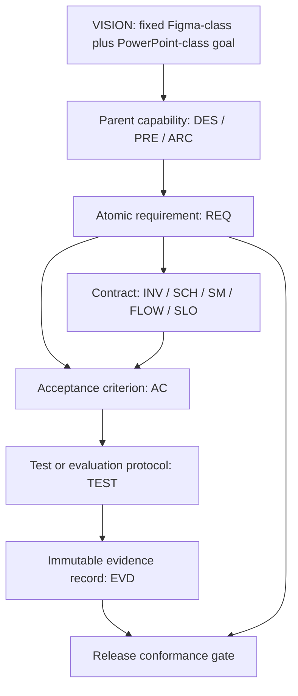

# Story Governance and Traceability

> **Specification ID:** `STORY-SPEC-00`  
> **Volume:** 00 (16 volumes total, 00-15)  
> **Status:** Normative draft  
> **Version:** 2.0.0-draft  
> **Owner:** Story Product and Engineering  
> **Approvers:** Product, Design, Engineering, Quality, Accessibility, Security  
> **Last reviewed:** July 10, 2026  
> **Review cadence:** At every accepted product change and at least once per release train  
> **Normative scope:** Specification authority, language, identifiers, maturity, ownership, change control, evidence, waivers, supersession, and traceability  
> **Explicit non-ownership:** Product strategy, workspace behavior, authored document semantics, implementation architecture, delivery sequencing, and implementation status  
> **Parent specification:** [Story Product Specification System](README.md)  
> **Supersedes:** Governance rules in the unnumbered product documents where this volume is more precise  
> **Implementation status:** Out of scope; see the dated [Capability Audit](../capability-audit.md) for evidence-backed current-state reporting

---

## Table of Contents

1. [Purpose](#1-purpose)
2. [Normative Language](#2-normative-language)
3. [Authority and Ownership](#3-authority-and-ownership)
4. [Artifact and Status Model](#4-artifact-and-status-model)
5. [Identifier System](#5-identifier-system)
6. [Requirement Authoring Contract](#6-requirement-authoring-contract)
7. [Traceability Graph](#7-traceability-graph)
8. [Invariants](#8-invariants)
9. [Lifecycle State Machines](#9-lifecycle-state-machines)
10. [Change, Conflict, and Supersession Flows](#10-change-conflict-and-supersession-flows)
11. [Evidence and Conformance](#11-evidence-and-conformance)
12. [Waivers and Exceptions](#12-waivers-and-exceptions)
13. [Review and Completeness Gates](#13-review-and-completeness-gates)
14. [Atomic Requirements](#14-atomic-requirements)
15. [Acceptance Criteria](#15-acceptance-criteria)
16. [Traceability](#16-traceability)
17. [Open Decisions](#17-open-decisions)

---

## 1. Purpose

This volume defines how Story makes product intent durable, reviewable, and testable. It is the control plane for the complete numbered specification set. It prevents four recurring failures:

1. intended behavior being mistaken for current implementation;
2. lower-level documents silently weakening the fixed product goal;
3. requirements losing their parent rationale or acceptance evidence;
4. contradictory documents being reconciled by convenience instead of an explicit decision.

This volume governs specification artifacts. It does not prescribe source-code structure, claim that a requirement is implemented, or replace the behavioral owner of any product domain.

### 1.1 Governance Thesis

Story treats a specification as an executable product contract, not a feature wish list. A valid contract has one owner, one stable identity, one independently testable outcome, explicit failure behavior, and evidence tied to a known revision and environment.

### 1.2 Fixed Constitutional Boundary

The following direction is constitutional and cannot be narrowed through routine editorial change:

- Figma-class visual authoring and PowerPoint-class presentation production and delivery are equally load-bearing goals.
- Story's native advantage is a governed narrative system that connects design-system precision to audience-specific delivery.
- The canonical document, authoring surfaces, presentation runtime, and professional outputs share one fidelity contract.
- Parity is bounded by comparable workflows and semantic outcomes, not by pixel-for-pixel imitation of another product's chrome.

Changing that boundary requires a major-version product decision approved by Product, Design, and Engineering. A roadmap, audit, implementation limitation, or release waiver cannot change it.

### 1.3 Audience

This volume is written for product managers, designers, engineers, quality engineers, accessibility specialists, security reviewers, technical writers, release owners, and anyone authoring or accepting a Story requirement.

---

## 2. Normative Language

The key words **MUST**, **MUST NOT**, **REQUIRED**, **SHALL**, **SHALL NOT**, **SHOULD**, **SHOULD NOT**, **RECOMMENDED**, **NOT RECOMMENDED**, **MAY**, and **OPTIONAL** are to be interpreted as described by BCP 14, RFC 2119, and RFC 8174 when, and only when, they appear in all capitals.

### 2.1 Strength

| Term | Meaning in Story specifications | Release consequence |
|---|---|---|
| **MUST** / **MUST NOT** | Required for conformance. | Failure blocks the applicable conformance profile unless an allowed waiver is active. |
| **SHOULD** / **SHOULD NOT** | Expected default with a documented, evidence-based reason permitted for divergence. | Divergence is reviewed and recorded; an unexplained divergence blocks acceptance. |
| **MAY** | Permitted behavior whose presence cannot be assumed by another requirement unless promoted to a stronger contract. | Absence does not block conformance. If present, all applicable safety, accessibility, fidelity, and evidence requirements still apply. |

Lowercase uses of "must", "should", and "may" are explanatory prose and are not independent requirements.

### 2.2 Normative and Informative Content

- A statement with an atomic `REQ-*` identifier is normative.
- An `INV-*`, `SCH-*`, `SM-*`, `FLOW-*`, or `SLO-*` definition is normative when an atomic requirement adopts it.
- An `AC-*` statement is a pass/fail interpretation of one or more requirements and is normative for acceptance.
- Examples, diagrams, rationales, implementation notes, benchmark observations, audits, and historical descriptions are informative unless an atomic requirement explicitly adopts them.
- A heading such as "Goal", "Principle", "Target", or "Complete" does not create a normative obligation by itself.

### 2.3 Atomic Keyword Rule

Each atomic requirement has exactly one primary all-capitals RFC 2119 keyword in its normative statement. Supporting fields can constrain scope, surfaces, lifecycle, and acceptance, but cannot add a second independently testable outcome. If a sentence needs two independently rejectable outcomes, it is split into two requirements.

---

## 3. Authority and Ownership

### 3.1 Authority Order

When two active artifacts conflict, authority is resolved in this order:

1. the newest accepted numbered volume within its declared sole responsibility;
2. an accepted decision record explicitly adopted by that volume;
3. an accepted domain specification explicitly adopted by that volume;
4. the unnumbered [Product Specification](../product-spec.md) for parent capabilities not yet decomposed;
5. the normative [Glossary](../glossary.md) for terminology not yet moved into a numbered owner;
6. production behavior as evidence of current behavior only;
7. audits, roadmaps, taskflows, plans, tests, and archived material as informative inputs.

Recency matters only between artifacts with equal authority and overlapping ownership. A newer lower-authority document does not override a numbered volume.

### 3.2 One Concept, One Owner

Every user-visible behavior, data semantic, quality target, and governance rule has one normative owner. Another volume can:

- link to the owner;
- define an application of the owned contract in its own domain;
- add a stricter local constraint that does not contradict the owner;
- identify a conflict and request a decision.

Another volume cannot restate the concept with altered terminology, defaults, state transitions, or acceptance thresholds. Repeated summaries are informative and link back to the owner.

### 3.3 Numbered Volume Responsibilities

The responsibility table in [the specification index](README.md#3-normative-volumes) is normative. The relevant ownership boundaries for these first three volumes are:

| Volume | Sole responsibility | Explicit non-ownership |
|---|---|---|
| 00 | Authority, requirement mechanics, change control, evidence, and traceability | Product strategy, shell behavior, document schema, implementation status |
| 01 | Vision, users, jobs, primary wedge, Story-native model, parity boundary, principles, non-goals, and product outcomes | Detailed shell behavior, persisted schema, runtime implementation |
| 02 | Workspace information architecture, interaction grammar, modes, focus, panels, adaptation, UI language, and interface direction | Canonical document schema, mutation algorithms, renderer internals |

### 3.4 Parent Capabilities

The existing `DES-*`, `PRE-*`, and `ARC-*` identifiers in the [Product Specification](../product-spec.md) are immutable parent capabilities. Numbered volumes decompose them; they do not renumber or redefine them. A parent remains valid until an accepted major-version decision explicitly retires it.

### 3.5 Adopted Domain Specifications

A numbered volume can adopt a lower-level document by naming:

1. the file and exact sections or concepts adopted;
2. the authority granted;
3. conflicts resolved by the volume;
4. content explicitly excluded, including implementation status claims;
5. the version or repository revision when stability requires it.

Adoption never converts a historical implementation claim into product evidence.

### 3.6 Editorial Versus Behavioral Change

An editorial change corrects spelling, links, formatting, or wording without changing any observable outcome, state, default, threshold, permission, data meaning, compatibility result, or acceptance test. Every other change is behavioral and follows the full change flow.

---

## 4. Artifact and Status Model

### 4.1 Artifact Classes

| Artifact | Namespace or form | Purpose | Can create product scope? |
|---|---|---|---|
| Vision | `VISION` | Fixed product direction | Yes, through constitution approval |
| Parent capability | `DES-*`, `PRE-*`, `ARC-*` | Stable scope and rationale | Yes |
| Atomic requirement | `REQ-<volume>-<sequence>` | Independently testable normative outcome | Yes |
| Invariant | `INV-*` | Truth that holds across operations or surfaces | Only when adopted by a requirement |
| Schema | `SCH-*` | Data or message contract | Only when adopted by a requirement |
| State machine | `SM-*` | States, events, guards, and transitions | Only when adopted by a requirement |
| Flow | `FLOW-*` | User, data, recovery, or governance sequence | Only when adopted by a requirement |
| Service objective | `SLO-*` | Quantified quality target | Only when adopted by a requirement |
| Observation contract | `OBS-*` | Named event, dimensions, privacy class, and measurement boundary without a target | No |
| Acceptance criterion | `AC-*` | Observable pass/fail interpretation | No new scope; interprets requirements |
| Test protocol | `TEST-*` | Repeatable verification method | No |
| Evidence record | `EVD-*` | Immutable result at a revision and environment | No |
| Decision record | `ADR-*` | Accepted resolution and consequences | Only when adopted by the owner |
| Work package | `WP-*` | Sequenced delivery work | No |
| Audit | Dated report | Current-state finding | No |
| Roadmap | Controlled plan | Dependency and delivery order | No |
| Taskflow | Scenario inventory | User-observable input to requirements and tests | No |

### 4.2 Independent Status Axes

These axes are never collapsed into one badge:

| Axis | Allowed values | Question answered |
|---|---|---|
| Specification maturity | proposed, draft, accepted, superseded, retired, rejected | Has the intended behavior been approved? |
| Delivery disposition | unplanned, sequenced, in progress, delivered, removed | What does the controlled plan say about delivery? |
| Verification disposition | not evaluated, failing, passing, waived, not applicable | What did the applicable protocol conclude? |
| Evidence freshness | current, stale, expired, missing | Is the conclusion tied to an admissible current revision and environment? |
| Release applicability | core, profile-specific, deferred-by-profile, excluded-by-product | Which declared conformance profile includes it? |

"Accepted" never means implemented. "Delivered" never means verified. "Passing" never means the specification is accepted. "Current" never means complete.

### 4.3 Specification Maturity

| State | Entry condition | Permitted use | Exit condition |
|---|---|---|---|
| proposed | Problem and owner identified | Discussion and exploration | Scope is authorized or rejected |
| draft | Owner, parents, requirements, and initial acceptance exist | Implementation planning and prototype evaluation, clearly marked draft | Required reviewers approve or request revision |
| accepted | All review gates pass and decision is recorded | Normative implementation and release basis | Superseded by an accepted replacement or retired by major decision |
| superseded | Replacement and migration links exist | Historical traceability only | Terminal |
| retired | Capability intentionally removed with compatibility and migration decision | Historical traceability only | Terminal |
| rejected | Proposal declined with rationale | Historical learning only | A new proposal receives a new ID |

### 4.4 Status Reporting

Status reports identify the exact requirement revision, evidence revision, environment, conformance profile, and observation date. Counts without those dimensions are summaries, not evidence.

---

## 5. Identifier System

### 5.1 Grammar

| Namespace | Grammar | Example |
|---|---|---|
| Atomic requirement | `REQ-<two-digit-volume>-<three-digit-sequence>` | Volume 02, sequence 014 |
| Invariant | `INV-<two-digit-volume>-<three-digit-sequence>` | Volume 02, sequence 003 |
| Schema | `SCH-<two-digit-volume>-<three-digit-sequence>` | `SCH-03-008` |
| State machine | `SM-<two-digit-volume>-<three-digit-sequence>` | `SM-10-002` |
| Flow | `FLOW-<two-digit-volume>-<three-digit-sequence>` | Volume 02, sequence 006 |
| Service objective | `SLO-<two-digit-volume>-<three-digit-sequence>` | `SLO-14-011` |
| Observation contract | `OBS-<two-digit-volume>-<three-digit-sequence>` | `OBS-04-003` |
| Acceptance criterion | `AC-<two-digit-volume>-<three-digit-sequence>` | Volume 02, sequence 014 |
| Test protocol | `TEST-<domain>-<sequence>` | `TEST-PI-004` |
| Evidence record | `EVD-<date>-<sequence>` | `EVD-20260710-003` |
| Decision record | `ADR-<four-digit-sequence>` | `ADR-0027` |

### 5.2 Allocation Rules

- Sequences are monotonically increasing within a namespace and volume.
- An allocated identifier is never reused, even if its artifact is rejected, retired, or deleted from the active view.
- Moving an atomic requirement between volumes requires a new requirement ID and an explicit supersession link because the owner changed.
- Splitting a requirement retires the original through explicit `superseded-by` links to all replacements.
- Merging requirements creates a new ID and explicit `supersedes` links to every predecessor.
- Renaming without semantic change retains the ID and records an editorial change.
- Acceptance criteria can be many-to-many, but every criterion names all requirements it evaluates.

### 5.3 Human-Readable Titles

Titles communicate intent but are not identity. Renaming a title does not alter references. IDs remain visible in headings, traceability tables, test metadata, evidence records, compatibility reports, and release conformance outputs.

---

## 6. Requirement Authoring Contract

### 6.1 Required Fields

Each atomic requirement contains:

| Field | Required content |
|---|---|
| ID and title | Stable identifier and concise outcome name |
| Parent | At least one linked `DES-*`, `PRE-*`, or `ARC-*` capability |
| Normative statement | One outcome and exactly one primary RFC 2119 keyword |
| Rationale | Why the outcome matters; informative |
| Applies to | Relevant users, surfaces, modes, scopes, and conformance profiles |
| Lifecycle | Create, edit, undo, save, reopen, collaborate, resolve, present, export, recover, or other applicable boundaries |
| Failure behavior | What the user and system observe when the happy path cannot complete |
| Related contract | Adopted invariant, schema, state machine, flow, or SLO IDs |
| Acceptance | One or more linked `AC-*` identifiers |

Compact requirement tables can combine these fields when no meaning is lost.

### 6.2 Atomicity Test

A requirement is atomic only if all of these are true:

1. a reviewer can accept or reject it independently;
2. one observable outcome can prove or disprove it;
3. it has one normative verb at one strength;
4. failure has one coherent user or system consequence;
5. moving it would move one ownership responsibility;
6. its acceptance does not depend on interpreting "and so on", "where appropriate", "intuitive", or another undefined qualifier.

### 6.3 Prohibited Requirement Language

Atomic statements do not use:

- implementation status such as "currently", "already", or "implemented";
- vague quality claims such as "fast", "modern", "seamless", "beautiful", or "user-friendly" without a metric or observable interpretation;
- open placeholders such as "TBD", "future", "as needed", or "etc.";
- component or library names unless the product contract truly depends on that technology;
- screenshots, mockups, or another product's pixels as the sole behavioral definition;
- roadmap phase as a reason to weaken a required outcome;
- compound lists whose members can fail independently.

### 6.4 State Completeness

Every affected workflow accounts for the applicable states below:

| State family | Minimum questions |
|---|---|
| Empty | What exists before the first item, selection, result, or document? |
| Loading | What remains usable, what is announced, and can the operation be canceled? |
| Partial | What has arrived, what is pending, and what can safely be edited? |
| Offline | Which local actions continue and how is reconnection represented? |
| Conflict | What differs, who owns resolution, and how is work preserved? |
| Permission | What is visible, disabled, requestable, or redacted? |
| Error | What failed, what was preserved, and what recovery action is available? |
| Stale | What changed since the view or snapshot was produced? |
| Success | What durable outcome occurred and where can it be verified? |
| Recovery | What was restored, what might be missing, and what is the next safe action? |

### 6.5 Surface Completeness

Requirements identify applicability to editor, navigator, canvas, property inspector, thumbnail, notes, grid/sorter, master/layout editing, audience view, Presenter View, recording, export, print, native file, clipboard, and interchange. "All surfaces" is used only when every listed surface is genuinely intended.

### 6.6 No Hidden Product Decisions

An accepted specification does not leave an implementer to choose user-visible defaults, terms, focus destinations, Escape behavior, commit boundaries, loss policy, permissions, responsive collapse order, unsupported-feature behavior, or error recovery. If evidence cannot support a final choice, the specification supplies a safe default in force and records the remaining product question as an open decision with an owner and review trigger.

---

## 7. Traceability Graph

### 7.1 Required Graph

### 7.2 Directionality

Traceability is bidirectional:

- every child links to its parent;
- every accepted parent can enumerate its active children;
- every requirement links to acceptance;
- every acceptance criterion links to a protocol or explicitly records that no protocol exists yet;
- every evidence record links to protocol version, requirement revision, environment, and artifact;
- every release decision can enumerate the evidence used and the requirements not satisfied.

### 7.3 Coverage Semantics

Coverage is not inferred from a filename, test title, code symbol, menu item, screenshot, or green build. Coverage exists only when a maintained mapping names the exact requirement and the protocol exercises its observable outcome at the applicable lifecycle boundaries.

### 7.4 Derived Views

Indexes, parent-capability status, coverage dashboards, `MUST` indexes, roadmap summaries, and release reports are derived views. They never become a second editable source of truth. A derived view declares its source revision and generation or review date.

### 7.5 Traceability Health

The specification set is traceability-healthy when:

- no accepted requirement is parentless;
- no accepted requirement lacks acceptance;
- no passing verification lacks current admissible evidence;
- no active evidence points only to superseded requirement text;
- no parent capability is marked complete while active child requirements are failing, missing, stale, or waived without disclosure;
- no requirement is counted twice because it appears in multiple summaries.

---

## 8. Invariants

### INV-00-001 - Single Normative Owner

At any accepted revision, one concept has exactly one numbered normative owner.

### INV-00-002 - Immutable Identity

An allocated identifier is never reassigned to a different semantic outcome.

### INV-00-003 - Constitutional Direction

No lower-level specification, plan, audit, profile, or waiver can reduce the equal Figma-class and PowerPoint-class product goal.

### INV-00-004 - Status Separation

Specification maturity, delivery disposition, verification disposition, and evidence freshness remain independent facts.

### INV-00-005 - No Silent Narrowing

Deferred, unsupported, waived, or profile-excluded behavior remains visible in traceability rather than being deleted from accepted scope.

### INV-00-006 - No Orphan Acceptance

Every active acceptance criterion evaluates at least one active requirement, and every accepted requirement has at least one active acceptance criterion.

### INV-00-007 - Evidence Immutability

An evidence record is append-only; a rerun produces a new record rather than modifying the prior result.

### INV-00-008 - Revision Specificity

Every conformance claim identifies the specification revision and product revision to which it applies.

### INV-00-009 - Observable Claims

A user-facing capability claim is supported by user-observable workflow and artifact evidence where artifacts are produced.

### INV-00-010 - Explicit Conflict Resolution

Contradictory accepted behavior is resolved through the normative owner and an adopted decision record, not by implementation preference.

### INV-00-011 - Default in Force

Every open decision that could affect implementation has a documented default behavior in force until the decision is accepted.

### INV-00-012 - Terminology Stability

Canonical terms retain one meaning across requirements, UI copy, schemas, tests, and evidence; legacy terms are explicitly qualified.

---

## 9. Lifecycle State Machines

### 9.1 Specification Maturity - `SM-00-001`

| Current state | Event | Guard | Next state | Required record |
|---|---|---|---|---|
| proposed | authorize drafting | owner and problem are named | draft | proposal link and owner |
| proposed | decline | rationale is recorded | rejected | rejection rationale |
| draft | request revision | review finding remains | draft | review comments |
| draft | accept | completeness and approval gates pass | accepted | approval revision and reviewers |
| draft | abandon | rationale is recorded | rejected | disposition rationale |
| accepted | replace | accepted successor and migration exist | superseded | `superseded-by` links |
| accepted | remove capability | major decision and migration exist | retired | decision, compatibility, migration |
| superseded | any | terminal | superseded | none |
| retired | any | terminal | retired | none |
| rejected | repropose | semantic outcome is reconsidered | proposed with new ID | predecessor link |

Direct transitions from proposed to accepted, accepted to draft, or superseded back to accepted are invalid.

### 9.2 Verification Disposition - `SM-00-002`

| Current state | Event | Next state | Notes |
|---|---|---|---|
| not evaluated | admissible protocol fails | failing | Evidence identifies the failing observation. |
| not evaluated | admissible protocol passes | passing | Evidence covers every criterion assertion. |
| failing | corrected product is rerun and passes | passing | Prior failure remains immutable. |
| passing | product or requirement revision changes materially | not evaluated | Prior evidence becomes stale. |
| any non-terminal state | approved waiver applies | waived | Waiver scope and expiry are visible. |
| any | criterion is proven irrelevant to profile | not applicable | Rationale and profile are recorded. |
| waived | waiver expires | not evaluated | Release cannot rely on expired waiver. |

### 9.3 Evidence Freshness - `SM-00-003`

| State | Definition | Transition trigger |
|---|---|---|
| current | Evidence matches accepted requirement revision, product revision range, protocol, and environment profile. | Any dependency changes materially. |
| stale | Evidence can inform diagnosis but cannot prove current conformance. | Compatible rerun restores current state. |
| expired | Policy-defined age or waiver deadline has elapsed. | New admissible evidence is produced. |
| missing | No admissible evidence exists. | First admissible record is attached. |

---

## 10. Change, Conflict, and Supersession Flows

### 10.1 Requirement Change - `FLOW-00-001`

1. The proposer identifies the normative owner and affected parent capabilities.
2. The proposer states the user or system problem, observed evidence, desired outcome, and affected requirements.
3. The owner classifies the change as editorial or behavioral.
4. For a behavioral change, the owner performs impact analysis across document semantics, mutation/history, files, collaboration, rendering surfaces, accessibility, security, performance, compatibility, and recovery.
5. The owner updates atomic requirements, contracts, acceptance criteria, and traceability in the same change set.
6. Required reviewers evaluate product coherence and downstream impact.
7. Acceptance records the exact revision, approvers, and effective conformance profile.
8. Existing evidence is marked stale when its assumptions or assertions changed.
9. Derived indexes and status views regenerate from the accepted sources.

### 10.2 Conflict Resolution - `FLOW-00-002`

1. Record both conflicting statements without silently editing either.
2. Identify each artifact's authority, maturity, date, and declared ownership.
3. Route the conflict to the numbered owner of the concept.
4. Compare the fixed constitution, parent capabilities, user evidence, interoperability constraints, accessibility, safety, and data-preservation consequences.
5. Choose one coherent behavior; do not average incompatible interaction grammars.
6. Record the decision and rejected alternatives in an `ADR-*`.
7. Update the owner, mark displaced text superseded or informative, and add migration behavior if users or files are affected.
8. Update acceptance and invalidate evidence whose expected behavior changed.

### 10.3 Evidence Production - `FLOW-00-003`

1. Resolve the accepted requirement and criterion revisions.
2. Select a protocol that observes the actual user, product, integration, and artifact boundaries.
3. Record environment, browser or host, input modality, locale, theme, permissions, data fixture, product revision, and feature configuration.
4. Execute without substituting mocks for a boundary the criterion intends to prove.
5. Capture agenda-free raw-enough observations before detector judgments.
6. Apply pass/fail detectors after capture.
7. Store immutable outputs, logs, screenshots or video when visual behavior matters, DOM or accessibility state when semantics matter, and file or clipboard artifacts when persistence matters.
8. Publish an `EVD-*` record with result, limitations, and hashes or durable artifact references.

### 10.4 Waiver - `FLOW-00-004`

1. The release owner identifies the exact failing requirements and profile.
2. Product, Engineering, and the relevant specialist assess user harm, data loss, security, privacy, accessibility, compatibility, and recovery risk.
3. The owner records rationale, bounded scope, mitigation, user disclosure, accountable owner, issue link, expiry, and retest condition.
4. Required approvers accept or reject the waiver.
5. Accepted waivers appear in release conformance and user-facing compatibility information when user decisions are affected.
6. Expiry returns verification to not evaluated or failing; it never silently renews.

### 10.5 Supersession - `FLOW-00-005`

1. Create the successor requirement or volume without deleting the predecessor.
2. State whether the successor preserves, broadens, narrows, or changes behavior.
3. Link predecessor and successor bidirectionally.
4. Define migration for documents, settings, commands, UI language, tests, and evidence.
5. Mark the predecessor superseded only when the successor is accepted.
6. Rebind tests and derived views; retain historical evidence against the predecessor revision.

---

## 11. Evidence and Conformance

### 11.1 Evidence Record Schema

Every `EVD-*` record contains at least:

| Field | Meaning |
|---|---|
| Evidence ID | Immutable `EVD-*` identity |
| Observed at | UTC timestamp |
| Product revision | Commit, build, and dirty-state disclosure |
| Specification revision | Version and content revision |
| Requirements | Exact `REQ-*` revisions evaluated |
| Criteria | Exact `AC-*` assertions evaluated |
| Protocol | `TEST-*` identity and version |
| Environment | OS, browser/host, viewport/window, device/input, locale, theme, network, permissions |
| Fixture | Stable fixture identity, generation inputs, and semantic hash where applicable |
| Result | pass, fail, blocked, or inconclusive |
| Observations | Raw-enough facts in execution order |
| Detectors | Post-capture judgments and thresholds |
| Artifacts | Durable references and hashes |
| Limitations | Unobserved boundaries, flakiness, substitutions, or environmental constraints |
| Operator | Human or automation identity |

### 11.2 Admissible Evidence

Evidence is admissible only when it observes the boundary claimed:

| Claim | Minimum admissible observation |
|---|---|
| A command exists | Real input reaches the routed command and produces the expected state and visible result. |
| A control is usable | It is visible, enabled when applicable, hit-testable, keyboard reachable, named, and produces the expected result. |
| A visual state is correct | Computed paint or pixels on the real rendered surface, not token presence alone. |
| A workflow is complete | Entry, action, durable outcome, recovery or failure state, and return path. |
| A file round-trips | Save, close, reopen, semantic comparison, and rendered comparison at declared tolerances. |
| Collaboration converges | Independent real clients receive accepted operations and produce equivalent semantic state. |
| Export is supported | The produced artifact is parsed or inspected semantically and visually; existence alone is insufficient. |
| Accessibility conforms | Keyboard behavior, focus, names/roles/states, assistive-technology semantics, contrast, and output semantics where applicable. |
| Performance conforms | Published fixture, environment, percentile, sample count, warm/cold condition, and threshold. |

### 11.3 Visual and Browser Evidence

User-observable browser workflows use a visible headed browser. Screenshots supplement, but do not replace, DOM state, hit-testing, focus, event outcome, document state, or artifact inspection. A passing unit test cannot alone prove a cross-surface workflow.

### 11.4 Negative Evidence

Conformance suites include discriminating fixtures and negative assertions. Examples include ensuring named algorithms do not collapse to identical outputs, unsupported content does not disappear, disabled controls do not activate, presenter-private content does not reach the audience surface, and mixed-value controls do not silently edit only the first selected object.

### 11.5 Release Conformance

A release conformance record lists:

- profile and supported environment matrix;
- accepted requirements included;
- current passing, failing, missing, stale, and waived criteria;
- compatibility and degradation disclosures;
- known recovery limitations;
- all active waivers and expiries;
- the final release decision and approvers.

The record never converts a missing requirement into "not applicable" merely because it was not implemented.

---

## 12. Waivers and Exceptions

### 12.1 Waivable Conditions

A requirement can be waived for a bounded release profile only when all of these are true:

- the failure does not create an undisclosed risk of data loss, security compromise, privacy violation, inaccessible critical workflow, or silent interchange loss;
- a usable mitigation or explicit compatibility disclosure exists;
- the waiver has an accountable owner, issue, expiry, and retest condition;
- Product, Engineering, and every affected specialist approve it;
- the fixed constitutional product direction remains unchanged.

### 12.2 Non-Waivable Conditions

The following cannot be waived into a conforming claim:

- silent deletion or corruption of authored content;
- authentication or authorization bypass;
- undisclosed transmission of user content;
- inaccessible access to the only path for a critical workflow;
- private Presenter View content leaking to the audience;
- claiming a fidelity tier higher than the produced artifact;
- claiming evidence that was not observed;
- narrowing the equal Figma-class and PowerPoint-class product goal.

### 12.3 Story-Specific Exceptions

A deliberate difference from a benchmark product is not automatically a waiver. It is an accepted Story-specific exception only when the normative owner documents the overlapping behavior, the benchmark convention, Story's chosen behavior, measurable user benefit, migration or learning cost, and acceptance evidence. Otherwise it is a parity gap.

---

## 13. Review and Completeness Gates

### 13.1 Required Review Lenses

| Lens | Required questions |
|---|---|
| Product | Does this preserve the fixed direction and solve a named user job? |
| Experience | Are entry, hierarchy, states, focus, commit, Escape, adaptation, and recovery decided? |
| Architecture | Are canonical state, identity, operations, files, collaboration, scene, and runtime boundaries coherent? |
| Accessibility | Are keyboard, focus, semantics, contrast, reduced motion, language, and outputs covered? |
| Security and privacy | Are trust, permissions, data transfer, embeds, recording, and retention explicit? |
| Interoperability | Are fidelity, preservation, degradation, compatibility reporting, and artifacts explicit? |
| Quality | Are metrics, fixtures, protocols, negative cases, and evidence admissibility defined? |
| Operations | Are migration, diagnostics, recovery, observability, and support consequences defined? |

### 13.2 Specification-Complete Gate

A domain is specification-complete only when it includes:

1. named users and jobs;
2. entry points and information architecture;
3. happy, alternate, failure, and recovery flows;
4. state coverage from Section 6.4;
5. pointer, keyboard, touch, pen, and assistive-technology behavior where applicable;
6. focus, Escape, commit, undo, redo, and collaboration semantics;
7. persisted schema, identity, migration, and unknown-field policy where content is authored;
8. editor, thumbnail, presentation, presenter, recording, export, print, file, clipboard, and interchange applicability;
9. adaptive window and input-modality behavior;
10. security, privacy, permissions, and offline behavior;
11. measurable performance, reliability, usability, and fidelity targets;
12. atomic requirements, acceptance criteria, protocols, and required evidence;
13. explicit supersession and unresolved decisions with defaults in force.

### 13.3 Review Outcome

Reviewers return one of four outcomes: accept, accept with non-blocking editorial corrections, revise, or reject. "Approve later", "mostly complete", and percentage-complete labels are not maturity states.

---

## 14. Atomic Requirements

Each row is one atomic normative outcome. The linked criterion is defined in Section 15.

### 14.1 Authority and Constitutional Control

| ID | Parent capability | Atomic normative statement | Applies to | Acceptance |
|---|---|---|---|---|
| `REQ-00-001` | [DES-001](../product-spec.md#51-canvas-and-viewport), [PRE-001](../product-spec.md#61-slide-and-deck-organization) | The specification system **MUST** preserve Figma-class authoring and PowerPoint-class production and delivery as equal constitutional pillars. | All volumes, profiles, plans, and release claims | `AC-00-001` |
| `REQ-00-002` | [ARC-002](../product-spec.md#71-canonical-document-model) | Every normative concept **MUST** have exactly one numbered owner at an accepted revision. | Numbered volumes and adopted domain specifications | `AC-00-002` |
| `REQ-00-003` | [ARC-002](../product-spec.md#71-canonical-document-model) | The authority resolver **MUST** use the precedence order defined in Section 3.1 for active conflicts. | Specification review and conflict resolution | `AC-00-003` |
| `REQ-00-004` | [ARC-002](../product-spec.md#71-canonical-document-model) | A lower-authority artifact **MUST NOT** narrow an accepted parent capability without an adopted decision by its numbered owner. | Specs, roadmaps, audits, taskflows, plans | `AC-00-004` |
| `REQ-00-005` | [ARC-002](../product-spec.md#71-canonical-document-model) | A numbered volume **MUST** declare its normative scope, explicit non-ownership, supersession, owner, maturity, and version metadata. | Every numbered volume | `AC-00-005` |

### 14.2 Requirement Quality and Identity

| ID | Parent capability | Atomic normative statement | Applies to | Acceptance |
|---|---|---|---|---|
| `REQ-00-006` | [ARC-002](../product-spec.md#71-canonical-document-model) | Every atomic requirement **MUST** contain exactly one primary all-capitals RFC 2119 keyword in its normative statement. | All `REQ-*` artifacts | `AC-00-006` |
| `REQ-00-007` | [ARC-002](../product-spec.md#71-canonical-document-model) | Every atomic requirement **MUST** express one independently acceptable or rejectable outcome. | All `REQ-*` artifacts | `AC-00-007` |
| `REQ-00-008` | [ARC-002](../product-spec.md#71-canonical-document-model) | Every atomic requirement **MUST** link to at least one immutable `DES-*`, `PRE-*`, or `ARC-*` parent capability. | All `REQ-*` artifacts | `AC-00-008` |
| `REQ-00-009` | [ARC-002](../product-spec.md#71-canonical-document-model) | Every allocated specification identifier **MUST** remain reserved for its original semantic outcome. | All controlled namespaces | `AC-00-009` |
| `REQ-00-010` | [ARC-002](../product-spec.md#71-canonical-document-model) | A requirement moved to a different normative volume **MUST** receive a new ID with bidirectional supersession links. | Requirement ownership changes | `AC-00-010` |
| `REQ-00-011` | [ARC-020](../product-spec.md#73-rendering-and-fidelity) | Every accepted requirement **MUST** identify its applicable surfaces and lifecycle boundaries. | User-visible and data-semantic requirements | `AC-00-011` |
| `REQ-00-012` | [ARC-030](../product-spec.md#74-storage-and-recovery) | Every accepted requirement **MUST** define observable failure or recovery behavior for each applicable non-happy-path state. | Workflows, persistence, providers, runtime | `AC-00-012` |

### 14.3 Traceability and Status

| ID | Parent capability | Atomic normative statement | Applies to | Acceptance |
|---|---|---|---|---|
| `REQ-00-013` | [ARC-002](../product-spec.md#71-canonical-document-model) | Every accepted requirement **MUST** link to at least one pass/fail acceptance criterion. | All accepted `REQ-*` artifacts | `AC-00-013` |
| `REQ-00-014` | [ARC-002](../product-spec.md#71-canonical-document-model) | Every active acceptance criterion **MUST** identify every requirement it evaluates. | All `AC-*` artifacts | `AC-00-014` |
| `REQ-00-015` | [ARC-002](../product-spec.md#71-canonical-document-model) | Traceability **MUST** remain navigable in both parent-to-child and child-to-parent directions. | Vision through release evidence | `AC-00-015` |
| `REQ-00-016` | [ARC-002](../product-spec.md#71-canonical-document-model) | Specification maturity **MUST** remain independent from delivery, verification, freshness, and release-applicability status. | Status ledgers, audits, dashboards, reports | `AC-00-016` |
| `REQ-00-017` | [ARC-002](../product-spec.md#71-canonical-document-model) | A conformance claim **MUST** identify the exact product revision, specification revision, environment profile, and observation date. | Audits, evidence, release records | `AC-00-017` |
| `REQ-00-018` | [ARC-002](../product-spec.md#71-canonical-document-model) | A derived status or coverage view **MUST** declare its source revision and generation or review date. | Indexes, dashboards, reports, generated ledgers | `AC-00-018` |
| `REQ-00-019` | [ARC-002](../product-spec.md#71-canonical-document-model) | Deferred, unsupported, or waived accepted scope **MUST** remain visible in traceability. | Roadmaps, profiles, release records | `AC-00-019` |
| `REQ-00-020` | [ARC-020](../product-spec.md#73-rendering-and-fidelity) | Coverage **MUST NOT** be inferred solely from filenames, labels, controls, screenshots, source symbols, or test titles. | Audits and conformance reports | `AC-00-020` |

### 14.4 Change and Decision Control

| ID | Parent capability | Atomic normative statement | Applies to | Acceptance |
|---|---|---|---|---|
| `REQ-00-021` | [ARC-002](../product-spec.md#71-canonical-document-model) | Every behavioral specification change **MUST** follow `FLOW-00-001`. | Accepted and draft normative artifacts | `AC-00-021` |
| `REQ-00-022` | [ARC-002](../product-spec.md#71-canonical-document-model) | Every conflict between accepted normative statements **MUST** follow `FLOW-00-002`. | Cross-volume and adopted-spec conflicts | `AC-00-022` |
| `REQ-00-023` | [ARC-002](../product-spec.md#71-canonical-document-model) | Every accepted behavior-changing decision **MUST** record rationale, alternatives, consequences, and affected IDs in an adopted `ADR-*`. | Product and architecture decisions | `AC-00-023` |
| `REQ-00-024` | [ARC-030](../product-spec.md#74-storage-and-recovery) | Superseding a requirement **MUST** define migration for every affected durable or learned user contract. | Documents, files, settings, commands, UI language, tests | `AC-00-024` |
| `REQ-00-025` | [ARC-002](../product-spec.md#71-canonical-document-model) | An accepted open decision that can affect implementation **MUST** state a default behavior in force, owner, and review trigger. | Open-decision registers | `AC-00-025` |
| `REQ-00-026` | [ARC-002](../product-spec.md#71-canonical-document-model) | An editorial change **MUST NOT** alter an observable outcome, default, state, threshold, permission, data meaning, or acceptance result. | Editorial review path | `AC-00-026` |

### 14.5 Evidence and Conformance

| ID | Parent capability | Atomic normative statement | Applies to | Acceptance |
|---|---|---|---|---|
| `REQ-00-027` | [ARC-020](../product-spec.md#73-rendering-and-fidelity) | Every evidence record **MUST** contain the minimum fields defined in Section 11.1. | `EVD-*` records | `AC-00-027` |
| `REQ-00-028` | [ARC-020](../product-spec.md#73-rendering-and-fidelity) | Evidence used for conformance **MUST** observe the actual boundary claimed by the acceptance criterion. | Tests, evals, inspections, benchmarks | `AC-00-028` |
| `REQ-00-029` | [ARC-020](../product-spec.md#73-rendering-and-fidelity) | User-observable browser evidence **MUST** be captured in a visible headed browser. | Browser workflow acceptance | `AC-00-029` |
| `REQ-00-030` | [ARC-030](../product-spec.md#74-storage-and-recovery) | A workflow that produces a file, clipboard payload, recording, or exported artifact **MUST** include semantic artifact inspection in its acceptance evidence. | Durable output workflows | `AC-00-030` |
| `REQ-00-031` | [ARC-020](../product-spec.md#73-rendering-and-fidelity) | A visual conformance claim **MUST** include rendered paint or pixel evidence on the applicable real surface. | Editor, thumbnail, audience, presenter, export, print | `AC-00-031` |
| `REQ-00-032` | [ARC-012](../product-spec.md#72-transactions-history-and-collaboration) | A collaboration conformance claim **MUST** include independent-client operation and convergence evidence. | Multiplayer behavior | `AC-00-032` |
| `REQ-00-033` | [ARC-020](../product-spec.md#73-rendering-and-fidelity) | Every conformance suite **MUST** include at least one discriminating negative case for each material product claim. | Release verification | `AC-00-033` |
| `REQ-00-034` | [ARC-020](../product-spec.md#73-rendering-and-fidelity) | Rerunning a protocol **MUST** create a new immutable evidence record. | Evidence storage | `AC-00-034` |

### 14.6 Waivers, Review, and Terminology

| ID | Parent capability | Atomic normative statement | Applies to | Acceptance |
|---|---|---|---|---|
| `REQ-00-035` | [PRE-073](../product-spec.md#68-import-export-print-and-compatibility) | A waiver **MUST** include bounded scope, rationale, mitigation, disclosure, owner, issue, expiry, retest condition, and approvals. | Release waivers | `AC-00-035` |
| `REQ-00-036` | [PRE-073](../product-spec.md#68-import-export-print-and-compatibility) | A release **MUST NOT** claim conformance by waiving a non-waivable condition from Section 12.2. | Release decisions and compatibility claims | `AC-00-036` |
| `REQ-00-037` | [ARC-002](../product-spec.md#71-canonical-document-model) | An accepted domain specification **MUST** pass every applicable completeness item in Section 13.2. | Domain acceptance review | `AC-00-037` |
| `REQ-00-038` | [DES-002](../product-spec.md#51-canvas-and-viewport), [PRE-002](../product-spec.md#61-slide-and-deck-organization) | A deliberate difference from a benchmark convention **MUST** be documented as an accepted Story-specific exception or remain classified as a parity gap. | Comparable Figma and PowerPoint workflows | `AC-00-038` |
| `REQ-00-039` | [ARC-002](../product-spec.md#71-canonical-document-model) | Canonical terminology **MUST** use one meaning across requirements, UI copy, schemas, tests, and evidence. | All active product artifacts | `AC-00-039` |
| `REQ-00-040` | [ARC-002](../product-spec.md#71-canonical-document-model) | Every release conformance record **MUST** disclose included, failing, missing, stale, waived, and profile-excluded accepted requirements. | Release gates | `AC-00-040` |

---

## 15. Acceptance Criteria

Each criterion is pass/fail. Unless stated otherwise, inspection uses the candidate accepted revision of the complete specification graph.

| ID | Requirement | Pass condition |
|---|---|---|
| `AC-00-001` | `REQ-00-001` | Automated search plus human review finds both constitutional pillars in every volume or profile that summarizes product direction, and finds no statement making either pillar optional or subordinate. |
| `AC-00-002` | `REQ-00-002` | A concept-ownership inventory reports exactly one numbered owner for every sampled normative concept and zero unresolved duplicate owners. |
| `AC-00-003` | `REQ-00-003` | Three seeded conflict fixtures at different authority levels resolve to the owner prescribed by Section 3.1, with the losing text retained as displaced evidence. |
| `AC-00-004` | `REQ-00-004` | A lower-level narrowing proposal is rejected unless its change set includes owner approval and an adopted decision referencing the affected parent capability. |
| `AC-00-005` | `REQ-00-005` | A metadata parser finds specification ID, volume, status, version, owner, scope, non-ownership or equivalent boundary, parent, supersession, and review date in every numbered volume. |
| `AC-00-006` | `REQ-00-006` | A requirement parser reports exactly one primary all-capitals RFC 2119 keyword in every atomic normative statement. |
| `AC-00-007` | `REQ-00-007` | Reviewers can assign one acceptance result to every requirement without needing a partial-pass result; compound failures are split before acceptance. |
| `AC-00-008` | `REQ-00-008` | Every `REQ-*` record contains at least one working link labeled with a valid immutable `DES-*`, `PRE-*`, or `ARC-*` parent. |
| `AC-00-009` | `REQ-00-009` | The identifier ledger contains no duplicate active meanings and retains tombstones for every rejected, superseded, or retired identifier. |
| `AC-00-010` | `REQ-00-010` | A seeded cross-volume move produces a new volume-scoped ID and reciprocal predecessor/successor links; retaining the old ID fails validation. |
| `AC-00-011` | `REQ-00-011` | Every sampled accepted requirement names concrete surfaces and lifecycle boundaries or explicitly records why a boundary is not applicable. |
| `AC-00-012` | `REQ-00-012` | State review finds observable error or recovery behavior for every applicable empty, loading, partial, offline, conflict, permission, error, stale, and recovery state. |
| `AC-00-013` | `REQ-00-013` | Traceability validation reports zero accepted requirements without at least one active `AC-*` link. |
| `AC-00-014` | `REQ-00-014` | Traceability validation reports zero active criteria without one or more valid requirement links. |
| `AC-00-015` | `REQ-00-015` | Starting from any sampled parent, requirement, criterion, protocol, or evidence record, a reviewer can navigate to both adjacent graph levels without free-text search. |
| `AC-00-016` | `REQ-00-016` | Status schema exposes separate fields for all five axes in Section 4.2 and rejects a single aggregate completion status as a substitute. |
| `AC-00-017` | `REQ-00-017` | Every sampled conformance claim includes product revision, specification revision, environment profile, and date; omission of any field invalidates the claim. |
| `AC-00-018` | `REQ-00-018` | Every derived view displays or embeds source revision and generation or review date, and a stale-source fixture is visibly identified. |
| `AC-00-019` | `REQ-00-019` | A deferred and a waived accepted requirement remain queryable in active traceability and appear in the applicable release report. |
| `AC-00-020` | `REQ-00-020` | A fixture containing only a menu label, source module, screenshot, and test filename remains "not evaluated" until boundary-observing evidence is linked. |
| `AC-00-021` | `REQ-00-021` | Every sampled behavioral change includes all nine records or updates from `FLOW-00-001`; missing impact analysis or evidence invalidation blocks acceptance. |
| `AC-00-022` | `REQ-00-022` | Every sampled accepted conflict has a recorded owner decision, one coherent surviving behavior, displaced-text disposition, and updated acceptance. |
| `AC-00-023` | `REQ-00-023` | Each accepted behavior-changing `ADR-*` identifies rationale, considered alternatives, consequences, owner, and all affected requirement or contract IDs. |
| `AC-00-024` | `REQ-00-024` | Supersession review enumerates every affected durable and learned contract and supplies a migration or explicit no-impact rationale for each. |
| `AC-00-025` | `REQ-00-025` | Every open decision with implementation impact includes an unambiguous default in force, accountable owner, and event or date that triggers review. |
| `AC-00-026` | `REQ-00-026` | Before/after behavioral diff for an editorial change reports no changed outcome, default, state, threshold, permission, data meaning, or acceptance result. |
| `AC-00-027` | `REQ-00-027` | Evidence-schema validation rejects records missing any field in Section 11.1 and accepts a complete fixture. |
| `AC-00-028` | `REQ-00-028` | For each claim class in Section 11.2, the linked protocol reaches and observes the claimed real boundary without substituting an unobserved mock. |
| `AC-00-029` | `REQ-00-029` | Browser-workflow evidence records headed execution and contains a visible browser capture tied to the same run; headless-only evidence is inadmissible. |
| `AC-00-030` | `REQ-00-030` | Each sampled durable-output workflow includes a parsed semantic inspection and, when visual, a rendered comparison of the produced artifact. |
| `AC-00-031` | `REQ-00-031` | Each sampled visual claim includes computed paint or pixel evidence from the applicable real surface; token-value-only evidence fails. |
| `AC-00-032` | `REQ-00-032` | Collaboration evidence uses at least two independent clients, records accepted operations, and compares converged semantic state. |
| `AC-00-033` | `REQ-00-033` | Every material claim category has a fixture designed to fail a plausible false implementation, and the detector fails that fixture. |
| `AC-00-034` | `REQ-00-034` | Two runs of the same protocol produce two distinct immutable evidence IDs while preserving the first record byte-for-byte. |
| `AC-00-035` | `REQ-00-035` | Waiver-schema validation rejects a waiver missing any required field or approval and accepts a fully bounded fixture. |
| `AC-00-036` | `REQ-00-036` | Release-gate fixtures for every condition in Section 12.2 remain non-conforming even when a waiver record is attached. |
| `AC-00-037` | `REQ-00-037` | Domain acceptance review records pass or explicit not-applicable rationale for all thirteen completeness items, with zero unresolved implementer-facing choices. |
| `AC-00-038` | `REQ-00-038` | Every sampled divergence from a comparable benchmark is linked either to an accepted exception containing measurable benefit and learning cost or to an active parity gap. |
| `AC-00-039` | `REQ-00-039` | Terminology lint and human review find no unqualified conflicting meaning for canonical terms across sampled requirements, UI strings, schemas, tests, and evidence. |
| `AC-00-040` | `REQ-00-040` | A release report enumerates all six required dispositions and reconciles their counts to the active accepted requirement set without omission or double counting. |

---

## 16. Traceability

### 16.1 Parent-Capability Coverage

| Requirement range | Primary parent capabilities | Governance outcome |
|---|---|---|
| `REQ-00-001` through `REQ-00-005` | `DES-001`, `PRE-001`, `ARC-002` | Constitutional direction, ownership, authority, and volume metadata |
| `REQ-00-006` through `REQ-00-012` | `ARC-002`, `ARC-020`, `ARC-030` | Atomic language, identity, parentage, surfaces, failure, and recovery |
| `REQ-00-013` through `REQ-00-020` | `ARC-002`, `ARC-020` | Bidirectional traceability and honest status |
| `REQ-00-021` through `REQ-00-026` | `ARC-002`, `ARC-030` | Behavioral change, conflicts, decisions, supersession, and defaults |
| `REQ-00-027` through `REQ-00-034` | `ARC-012`, `ARC-020`, `ARC-030` | Admissible, immutable, boundary-appropriate evidence |
| `REQ-00-035` through `REQ-00-040` | `DES-002`, `PRE-002`, `PRE-073`, `ARC-002` | Waivers, completeness, parity exceptions, terminology, and release disclosure |

### 16.2 Adopted Source Material

| Source | Adopted authority | Excluded content or resolution |
|---|---|---|
| [Specification System README](README.md) | Volume ownership, hierarchy, authority rules, completeness standard | This volume makes governance mechanics more precise. |
| [Product Specification](../product-spec.md) | Fixed product direction and immutable parent capability IDs | Any implementation or current-state implication is excluded. |
| [Glossary](../glossary.md) | Canonical terms until moved into their numbered owners | Legacy implementation names remain qualified only. |
| [Capability Audit](../capability-audit.md) | Evidence that current-state reporting must remain separate | Audit findings do not create or narrow requirements. |
| [Delivery Roadmap](../delivery-roadmap.md) | Dependency ordering and the rule that plans cannot weaken requirements | Dates, phases, and work packages do not prove implementation. |
| [Feature Specification Index](../../specs/README.md) | Domain ownership and cross-cutting contract inventory | Domain status labels and overlapping source-of-truth claims are excluded. |
| [Interaction Patterns](../../specs/ui-system/interaction-patterns.md) | Requirement input for focus, state, feedback, overlay, and input evidence | Code examples and old token values are not governance authority. |
| [Keyboard Shortcut Ledger](../../specs/core/keyboard-shortcuts-ledger.md) | Evidence for separating intended, labeled, and implemented states | Ledger implementation codes are informative only. |

### 16.3 Internal Contract Links

- Requirements `REQ-00-001` through `REQ-00-040` adopt invariants `INV-00-001` through `INV-00-012` where their subjects overlap.
- Requirements `REQ-00-016`, `REQ-00-021`, `REQ-00-022`, `REQ-00-027`, and `REQ-00-035` adopt state machines or flows `SM-00-001` through `SM-00-003` and `FLOW-00-001` through `FLOW-00-005` as named in their sections.
- Acceptance criteria `AC-00-001` through `AC-00-040` are the complete acceptance set for this revision of Volume 00.

---

## 17. Open Decisions

No open decision in this revision blocks product or implementation behavior. The following governance questions retain defaults in force:

| ID | Decision/question | Default in force | Owner | Review trigger | Affected requirements/contracts | Blocking class |
|---|---|---|---|---|---|---|
| `OD-00-001` | Should accepted specification releases receive cryptographic signatures in addition to repository revision identity? | Repository revision, protected review, and immutable release tag are authoritative. | Engineering and Security | Introduction of external regulatory attestation or distribution outside the trusted repository | `REQ-00-017`, `REQ-00-027`, Volume 15 release records | `non-blocking` |
| `OD-00-002` | Should traceability be stored in Markdown tables, generated structured data, or both? | Numbered Markdown volumes are authoritative; `traceability-index.json` and Markdown are generated read-only derivatives. | Product Operations and Engineering | First editable machine-readable coverage ledger beyond the generated index | `REQ-00-015`, `REQ-00-018`, `REQ-15-001` through `REQ-15-010` | `non-blocking` |
| `OD-00-003` | What maximum age makes otherwise compatible evidence expire? | Each owning quality volume or release profile sets the age; absent a stricter rule, any material product, protocol, environment, or requirement change makes evidence stale immediately. | Quality | First accepted external conformance profile or evidence-store implementation | `REQ-00-017`, `REQ-00-027` through `REQ-00-034`, Volume 15 evidence freshness | `pre-implementation` |