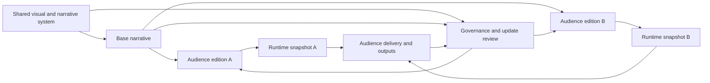
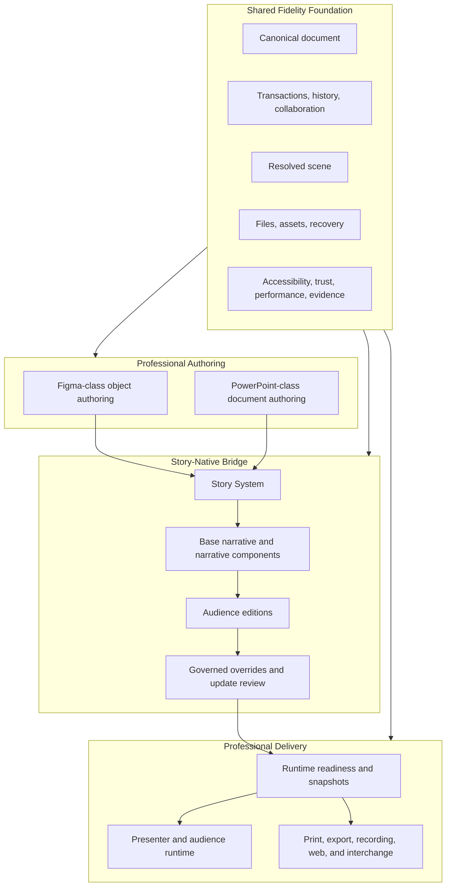

# Story Product Constitution

> **Specification ID:** `STORY-SPEC-01`  
> **Volume:** 01 (16 volumes total, 00-15)  
> **Status:** Normative draft  
> **Version:** 2.0.0-draft  
> **Owner:** Story Product  
> **Approvers:** Product, Design, Engineering, Quality, Accessibility, Security  
> **Last reviewed:** July 10, 2026  
> **Review cadence:** At every product-direction change and at least annually  
> **Normative scope:** Vision, market posture, users, jobs, primary wedge, Story-native advantage, product principles, bounded parity, non-goals, and governing outcomes  
> **Explicit non-ownership:** Workspace interaction details, persisted schemas, operation algorithms, renderer behavior, file layout, collaboration protocol, and implementation status  
> **Parent specification:** [Story Product Specification System](README.md)  
> **Governed by:** [Volume 00 - Governance and Traceability](00-governance-and-traceability.md)  
> **Supersedes:** Product thesis, promise, users, principles, scope, non-goals, and success criteria in the unnumbered [Story Product Specification](../product-spec.md) only where this volume is more precise; parent `DES-*`, `PRE-*`, and `ARC-*` capabilities remain immutable  
> **Implementation status:** Out of scope; see the dated [Capability Audit](../capability-audit.md)

---

## Table of Contents

1. [Purpose and Constitutional Force](#1-purpose-and-constitutional-force)
2. [Product Thesis](#2-product-thesis)
3. [Primary Wedge and Market Posture](#3-primary-wedge-and-market-posture)
4. [Users and Jobs](#4-users-and-jobs)
5. [Mental-Model Jurisdiction](#5-mental-model-jurisdiction)
6. [The Story-Native Model](#6-the-story-native-model)
7. [Capability Map](#7-capability-map)
8. [Journey and Emotional Arc](#8-journey-and-emotional-arc)
9. [Product Principles](#9-product-principles)
10. [Bounded Parity](#10-bounded-parity)
11. [Product Invariants](#11-product-invariants)
12. [Product States](#12-product-states)
13. [Governing Flows](#13-governing-flows)
14. [Non-Goals](#14-non-goals)
15. [Success and Usability Measures](#15-success-and-usability-measures)
16. [Atomic Requirements](#16-atomic-requirements)
17. [Acceptance Criteria](#17-acceptance-criteria)
18. [Traceability](#18-traceability)
19. [Open Decisions](#19-open-decisions)

---

## 1. Purpose and Constitutional Force

This volume defines what Story is for, whom it serves first, which familiar mental models it preserves, where it deliberately differs, and how product success is judged. It is the constitutional filter for every lower-level requirement and product decision.

The key words **MUST**, **MUST NOT**, **SHOULD**, **SHOULD NOT**, and **MAY** are interpreted under BCP 14, RFC 2119, and RFC 8174 as governed by [Volume 00](00-governance-and-traceability.md#2-normative-language).

### 1.1 Decision Test

A proposed capability belongs in Story only when it does at least one of the following without weakening the others:

1. increases professional visual-authoring capability;
2. increases presentation production or delivery capability;
3. strengthens the governed bridge between reusable design, narrative structure, audience adaptation, and deterministic delivery;
4. protects fidelity, accessibility, trust, performance, or recovery across that complete workflow.

Novelty, engagement, feature count, and superficial competitor resemblance are not sufficient reasons.

### 1.2 Fixed Direction

The fixed direction is:

> **Story is the professional environment where teams design with Figma-class control, author and deliver with PowerPoint-class completeness, and maintain the result as one governed narrative system across audiences and outputs.**

The two parity pillars are adoption floors. The governed bridge is the reason to choose Story.

### 1.3 Constitutional Change

The equal-pillar direction, primary wedge, and Story-native model can change only through a major-version decision under Volume 00. A roadmap phase, implementation constraint, experiment, commercial packaging choice, or release waiver cannot silently narrow them.

---

## 2. Product Thesis

### 2.1 The Problem

Professional presentations are commonly split across systems that optimize different parts of the work:

- design tools provide precise objects, responsive layout, reusable components, variables, and collaborative craft but do not own the complete presentation document and delivery lifecycle;
- presentation tools provide slides, masters, notes, motion, rehearsal, Presenter View, audience playback, print, and interchange but often make design-system reuse and multi-audience maintenance fragile;
- duplicated presentation files create copy drift, brand drift, stale evidence, contradictory claims, and last-minute delivery risk;
- screenshots, flattened exports, and manual rebuilds sever editability and provenance at handoff boundaries.

The core problem is not merely drawing better slides or playing them full screen. It is maintaining one trustworthy narrative system from visual system through audience-specific delivery.

### 2.2 The Product Promise

Story provides one coherent workflow in which a user can:

1. create, import, or open a professional presentation;
2. establish reusable themes, masters, layouts, styles, variables, and visual components;
3. structure a base narrative from slides and semantic narrative components;
4. create audience editions as governed differences rather than document copies;
5. review inherited values, intentional overrides, conflicts, and compatibility risks;
6. validate readiness and create a deterministic runtime snapshot;
7. rehearse, record, present, print, publish, and exchange from the same authored meaning;
8. update shared sources and reconcile affected editions without silent drift.

### 2.3 Product Category

Story is a **presentation design and narrative-systems environment**. It is not positioned as a generic drawing canvas, a lightweight slide maker, a website builder, or an AI document generator.

### 2.4 Source-of-Truth Promise

The authoring document remains the source of truth. Editor, navigator, thumbnail, notes, master/layout, audience, Presenter View, recording, export, print, clipboard, and interchange surfaces consume the same semantic contract or declare an observable bounded degradation.

---

## 3. Primary Wedge and Market Posture

### 3.1 Primary Wedge

The primary wedge is:

> **Design-led teams that repeatedly adapt high-stakes presentations for multiple audiences while preserving brand, narrative intent, editability, and live-delivery confidence.**

The wedge requires all of these conditions:

- the presentation matters enough that visual and delivery quality are professionally reviewed;
- the content is reused or adapted, not created once and abandoned;
- at least two audiences, contexts, locales, or delivery profiles require legitimate differences;
- shared content or visual-system updates must propagate without destroying intentional local choices;
- delivery, interchange, or output fidelity has real business consequences.

### 3.2 Initial Team Shape

The primary team contains at least two responsibilities, even when one person performs both:

| Responsibility | Core concern | Story promise |
|---|---|---|
| System owner | Brand, reusable visual language, narrative structure, governance | Shared changes remain controlled, explainable, and reviewable. |
| Presentation author | Audience relevance, content composition, notes, motion, output | Adaptation remains fast without severing the source. |
| Reviewer or subject expert | Accuracy, approval, accessibility, risk | Review addresses the intended edition and exact content revision. |
| Presenter | Readiness, timing, privacy, recovery, audience control | Delivery behaves predictably under real room conditions. |

### 3.3 Representative Wedge Work

Representative work includes product launches, sales and solution narratives, consulting and strategy readouts, executive reviews, investor and board material, training systems, conference talks, and recurring research or operational briefings.

The product does not optimize one industry-specific template at the expense of the general model. The common thread is governed reuse across audiences and delivery contexts.

### 3.4 Expansion Order

Story expands outward from the wedge in this order:

1. reliable individual authoring and delivery;
2. governed multi-audience reuse within a team;
3. shared libraries, collaboration, review, and organizational controls;
4. professional interchange and output ecosystems;
5. optional automation, live data, audience services, extensions, and AI assistance.

Differentiation never bypasses the deterministic authoring and delivery core.

### 3.5 Value Exchange

Story creates value by reducing:

- duplicate deck creation;
- manual synchronization effort;
- unintended audience or brand divergence;
- visual rebuild between design and presentation tools;
- last-minute compatibility surprises;
- presenter uncertainty about what will appear and how it will behave.

Story increases:

- reusable authored meaning;
- speed of legitimate audience adaptation;
- confidence in source propagation and overrides;
- deterministic runtime readiness;
- fidelity across professional outputs.

---

## 4. Users and Jobs

### 4.1 Primary User Archetypes

| User | Existing mental model | Functional job | Emotional job | Story obligation |
|---|---|---|---|---|
| Visual designer | Figma, Sketch, Illustrator | Build precise visual systems and expressive slides | Preserve craft and control through handoff | Familiar canvas grammar, responsive systems, components, variables, styles, and editable output |
| Presentation author | PowerPoint, Keynote, Google Slides | Organize, author, animate, rehearse, deliver, and exchange a deck | Feel fluent and credible under deadline | Familiar slides, masters, notes, motion, show setup, Presenter View, print, and PPTX-oriented compatibility |
| Narrative system owner | Brand system plus recurring deck family | Maintain one source across teams and audiences | Trust that reuse will not erase intent | Story Systems, governance, editions, provenance, update review, and compatibility visibility |
| Reviewer or subject expert | Comments, approval workflows, PDFs | Verify accuracy, appropriateness, and accessibility | Know exactly what version and audience they approved | Edition-aware review, stable anchors, revision identity, and actionable findings |
| Presenter | Presenter View and rehearsal | Deliver confidently and recover from room failures | Remain composed and in control | Private presenter state, deterministic playback, readiness, and rapid recovery |
| Technical creator | Code, data, interactive media | Integrate dynamic or programmable material | Retain inspectability and deterministic output | Native visual editing around governed data and explicit trust boundaries |

### 4.2 Core Jobs to Be Done

#### Job A - Design a reusable presentation language

When a team needs a recognizable and adaptable presentation family, it needs to define visual rules once and compose with them repeatedly, so quality does not depend on copying the last deck.

#### Job B - Shape one narrative for distinct audiences

When the same underlying story must serve executives, customers, partners, trainees, or regions, an author needs to include, exclude, reorder, substitute, and localize content without forking the source into unmanaged files.

#### Job C - Preserve legitimate exceptions

When an audience or moment requires a local deviation, an author needs to understand what is inherited, what is intentionally overridden, what changed upstream, and what now conflicts, so adaptation remains deliberate rather than accidental.

#### Job D - Move from craft to delivery without translation

When visual design is ready, an author needs to add presentation structure, notes, motion, rehearsal, recording, and show setup in the same environment, so editability and fidelity survive the transition.

#### Job E - Enter the room with a known artifact

When presentation stakes are high, a presenter needs assurance that assets, fonts, media, builds, displays, private notes, and fallback behavior are ready, so the live result matches the reviewed intent.

#### Job F - Exchange without silent loss

When collaborators or recipients require PPTX, PDF, print, video, web, image, SVG, or clipboard output, an author needs to know what remains editable, substituted, preserved-only, rasterized, or unsupported before crossing an irreversible boundary.

### 4.3 Accessibility as a User Job

People using keyboard, assistive technology, touch, pen, captions, high contrast, reduced motion, language direction, or alternative input are primary users, not edge cases. Authors also need to create accessible presentations and outputs without maintaining a separate inaccessible source.

### 4.4 Organizational Buyer Job

An organization needs presentation quality, brand control, permissions, auditability, privacy, and interoperability without turning every legitimate adaptation into a central bottleneck. Governance therefore means bounded freedom with provenance, not blanket lock-down.

---

## 5. Mental-Model Jurisdiction

Story resolves overlapping conventions by assigning jurisdiction to the product whose model best matches the user's current object of intent.

### 5.1 Jurisdiction Rule

| Jurisdiction | Owns the familiar model for | Story interpretation |
|---|---|---|
| **Figma owns object authoring** | Canvas navigation, selection depth, transforms, vector and text editing, Auto Layout, components, instances, variants, variables, styles, layers, and mixed-value property editing | Story preserves recognizable object-authoring grammar where the features overlap. |
| **PowerPoint owns document and delivery** | Slides, sections, masters, layouts, placeholders, themes, notes, tables, charts, diagrams, transitions, animations, rehearsal, recording, Presenter View, show setup, print, and PPTX exchange | Story preserves recognizable presentation structure and delivery grammar where the features overlap. |
| **Story owns the bridge** | Story Systems, semantic narratives, narrative components, audience editions, governed overrides, update review, runtime snapshots, cross-surface readiness, and explicit compatibility boundaries | Story introduces a coherent native grammar rather than disguising these capabilities as copies of unrelated features. |

### 5.2 Collision Resolution

When conventions collide:

1. identify whether the user is acting on an object, the presentation document, live delivery, or the Story bridge;
2. apply the jurisdictional convention for that intent;
3. preserve one visible context and one command outcome;
4. avoid assigning the same gesture to two actions within the same context;
5. explain any deliberate divergence through UI feedback, shortcut disclosure, and an accepted Story-specific exception.

### 5.3 Examples

| Collision | Governing decision |
|---|---|
| A frame-like container versus a slide | It is a **slide** when it participates in deck order and playback; object containers retain object-authoring behavior inside the slide. |
| Object Auto Layout versus slide layout | Auto Layout owns child arrangement; master/layout/placeholders own presentation inheritance. Neither impersonates the other. |
| Component state versus object animation | Component state is reusable object semantics; animation sequencing is presentation timing. A transition between them uses an explicit bridge. |
| Canvas selection versus slide selection | The focused scope owns selection commands; the shell visibly identifies the scope before destructive actions. |
| Escape in nested contexts | Escape unwinds the topmost interaction layer or editing depth first; it does not skip directly to an unrelated global action. |

### 5.4 Familiarity Standard

Familiarity is measured through successful transfer of prior knowledge, not resemblance of chrome. Experienced users should predict the result of common overlapping tasks, locate the relevant surface, and recover from mistakes without learning a contradictory grammar.

---

## 6. The Story-Native Model

### 6.1 Story System

A **Story System** is the user-facing product model for a governed presentation family. It combines, through the canonical document and approved library references:

- presentation structure: themes, masters, layouts, placeholders, sections, slides, notes, motion, and show setup;
- visual system: styles, variables, components, responsive layout, media, and authored content;
- narrative system: ordered semantic narrative items and reusable narrative components;
- audience model: one or more non-destructive audience editions;
- governance model: inheritance, governed overrides, provenance, review, permissions, and compatibility policy;
- delivery model: readiness, runtime snapshots, presenter/audience behavior, and declared outputs.

"Story System" names the governed family. "Presentation" remains the canonical user term for the authored document and familiar file-level unit. The UI does not rename every presentation a system; it introduces system language when reuse, editions, governance, or libraries are in scope.

### 6.2 Base Narrative

The **base narrative** is the canonical ordered story from which editions derive. Its items have semantic roles such as opening, context, evidence, comparison, decision, action, appendix, or a user-defined role. Semantic role does not force a visual template.

### 6.3 Narrative Component

A **narrative component** is reusable semantic presentation content with named slots, states, accessibility expectations, and source identity independent of any one visual realization. It can express a recurring evidence block, comparison, decision frame, call to action, or other narrative role while delegating visual expression to approved components and tokens.

A narrative component is not merely a copied group, a slide thumbnail, or a JavaScript UI component.

### 6.4 Audience Edition

An **audience edition** is a named, audience-scoped set of non-destructive differences from a base narrative. It can include, exclude, reorder, substitute, localize, select variable modes, and apply governed overrides while leaving the base narrative unchanged.

An edition is not a duplicated presentation file, hidden-slide convention with no audience identity, or untracked custom show. A custom show can remain a delivery subset, but an edition owns audience-specific authored differences and provenance.

### 6.5 Governed Override

A **governed override** is an intentional local difference with:

- a stable source and target address;
- an owner or actor provenance;
- a scope such as instance, slide, narrative item, edition, locale, or delivery profile;
- a reason or policy classification when governance requires it;
- an explicit state: inherited, overridden, conflicted, orphaned, reset, promoted, or detached as applicable;
- deterministic behavior when the source changes.

Governance does not prohibit local choice. It makes the choice visible, bounded, reviewable, and recoverable.

### 6.6 Runtime Snapshot

A **runtime snapshot** is the immutable, validated, delivery-bound input admitted for one presentation run or deterministic output job. It binds:

- the exact canonical document revision or semantic hash;
- selected narrative or slide sequence and audience edition;
- resolved variable modes, locale, accessibility preferences, and reduced-motion policy;
- show configuration and capability profile;
- asset, font, media, and embed readiness results;
- declared fallbacks, compatibility diagnostics, and privacy boundaries.

A runtime snapshot is not the canonical authored document, an undo snapshot, a collaboration checkpoint, a DOM capture, or mutable playback state. Editing after snapshot creation invalidates or creates a new snapshot; it does not mutate a run already admitted.

### 6.7 The Native Advantage

The native advantage is the closed loop:

The loop turns reuse into a product behavior rather than a file-naming discipline.

### 6.8 Canonical Data Boundary

Volume 03 owns the canonical schema for narratives, narrative components, editions, and stable overrides. Later volumes own mutation, resolution, runtime, files, collaboration, and acceptance details. This constitution owns their user-facing purpose and the invariant that the model remains non-destructive and explainable.

---

## 7. Capability Map

### 7.1 Product Capability Architecture

### 7.2 Load-Bearing Capability Families

| Family | User outcome | Failure if absent |
|---|---|---|
| Object authoring | Precise, responsive, reusable visual craft | Story becomes a conventional slide editor with decorative vector controls. |
| Presentation authoring | Complete slide, structure, motion, notes, rehearsal, recording, and output workflow | Story becomes a design canvas with a slideshow button. |
| Native bridge | One governed source across audiences and delivery | Story competes only by aggregating parity features and inherits copy drift. |
| Fidelity foundation | Meaning survives edit, undo, file, collaboration, runtime, and output | Surface breadth becomes unreliable and unsafe. |

### 7.3 Product Sequencing Principle

Foundational capability precedes breadth when breadth would create a second state, mutation, file, rendering, or runtime path. This ordering governs delivery planning but does not remove accepted end-state scope.

---

## 8. Journey and Emotional Arc

### 8.1 End-to-End Journey

| Stage | User question | Desired emotional movement | Product obligation | Failure to avoid |
|---|---|---|---|---|
| 1. Enter | "Can I start from what I have?" | Skepticism to recognition | Open, import, template, and recent-work entry points use familiar presentation language and disclose fidelity. | A marketing-style welcome surface that hides the actual editor or import risk. |
| 2. Orient | "Where are my slides, objects, and properties?" | Uncertainty to fluency | Canonical shell exposes deck structure, canvas, tools, and context-sensitive properties with predictable jurisdiction. | Competing modes or duplicated controls with unclear scope. |
| 3. Establish | "How do I make this reusable?" | Fragmentation to control | Themes, masters, layouts, components, styles, variables, and narrative structure can be adopted incrementally. | Requiring an all-or-nothing migration before useful work. |
| 4. Compose | "Can I make the exact thing I intend?" | Concentration to flow | Direct manipulation, precise properties, structured content, notes, and motion respond immediately and remain undoable. | Hidden commits, lag, surprise selection changes, or lossy shortcuts. |
| 5. Adapt | "How do I tailor this without forking it?" | Copy anxiety to leverage | Editions show base, differences, audience, and propagation consequences before commit. | Silent source mutation or duplicate-file creation as the default path. |
| 6. Govern | "What changed, why, and who owns it?" | Fear of breakage to trust | Inheritance, override, conflict, compatibility, permissions, and review state are visible and actionable. | Lock-down without escape or freedom without provenance. |
| 7. Validate | "Will this work in the room and in the file I send?" | Doubt to readiness | Readiness checks bind exact content, assets, fonts, motion, displays, accessibility, and output policy. | A generic green check that ignores degraded or stale content. |
| 8. Deliver | "Can I stay in control?" | Exposure to command | Audience and Presenter View remain deterministic, private, responsive, and recoverable. | Blank frames, private-state leakage, lost place, or irreversible window failure. |
| 9. Evolve | "Can I update the system without starting over?" | Maintenance burden to continuity | Source updates identify affected editions and preserve legitimate overrides for review. | Unexplained resets, stale copies, or invisible divergence. |

### 8.2 Journey Continuity

The user does not cross an invisible product boundary between design, deck authoring, adaptation, and delivery. Context can change, but selection ownership, provenance, undo expectations, terminology, and the source-of-truth relationship remain intelligible.

### 8.3 Progressive Mastery

The first successful workflow uses familiar slides, canvas tools, notes, and presentation commands. Story-native systems appear at the point of reuse or audience adaptation, with contextual explanation and reversible adoption. Advanced governance is progressively disclosed; it is never hidden after it becomes consequential.

---

## 9. Product Principles

### 9.1 Familiar Before Novel

Use Figma-familiar object-authoring behavior and PowerPoint-familiar presentation behavior when the tasks overlap. Introduce Story-native concepts only where the bridge creates a distinct user job.

### 9.2 One Authored Meaning, Many Surfaces

The same semantic source drives editing, thumbnails, presentation, Presenter View, recording, export, print, and interchange. Surface adapters can differ; authored meaning cannot silently fork.

### 9.3 Systems Over Copies

Reuse is source-linked by default. An explicit duplicate, detach, flatten, or export remains available when the user intentionally crosses that boundary.

### 9.4 Non-Destructive by Default

Components, masks, booleans, styles, variables, masters, layouts, editions, narrative components, media crops, motion, and overrides remain editable until the user performs an explicit destructive action.

### 9.5 Governance Means Explainable Freedom

Users can make audience-appropriate choices. Story preserves source, scope, provenance, policy, and reconciliation rather than preventing every variation.

### 9.6 Runtime Is a First-Class Product

Presentation is not an editor preview. It is a deterministic runtime with readiness, privacy, input, sequencing, display, fallback, performance, and recovery contracts.

### 9.7 Compatibility Before Irreversibility

Users see supported, editable, substituted, preserved-only, rasterized, and unsupported outcomes before import, export, detach, flatten, or format conversion becomes irreversible.

### 9.8 Power Without Fragmentation

New capabilities use shared document, operation, selection, focus, command, token, accessibility, file, collaboration, and rendering contracts. Product breadth never justifies a parallel editor.

### 9.9 Evidence Over Claims

A label, module, mock, screenshot, test title, or accepted specification is not implementation evidence. Product claims require the boundary-appropriate evidence governed by Volume 00.

### 9.10 Accessibility Is Authored Quality

Accessible operation and accessible output are part of professional quality. Alternative descriptions, reading order, captions, language, reduced motion, contrast, keyboard operation, and assistive-technology semantics are designed into the source and runtime.

### 9.11 Trust Is Visible

Permissions, external content, recording devices, data transfer, AI requests, embeds, telemetry, retention, and compatibility loss use least privilege and informed user choice. Story does not make trust consequential only after failure.

### 9.12 Interaction Hot Paths Stay Pure

Selection, pointer movement, transforms, text input, timeline control, and slide advance do not synchronously trigger unrelated indexing, network, whole-document serialization, or other heavy work.

### 9.13 AI Assists; Determinism Owns

AI can propose, transform, summarize, or automate with consent. It cannot become necessary to preserve, edit, resolve, present, or export the authored document, and its output remains inspectable and editable.

---

## 10. Bounded Parity

### 10.1 Meaning of Parity

Story uses three parity dimensions:

| Dimension | Meaning | Proof |
|---|---|---|
| Behavioral familiarity | Experienced users can predict and complete comparable tasks using transferred mental models. | Moderated and instrumented task benchmarks |
| Semantic capability | The authored model supports the professional meaning of the comparable feature across lifecycle boundaries. | Schema, workflow, file, collaboration, runtime, and output evidence |
| Interchange fidelity | Supported source and target formats preserve declared editable, rendered, preserved-only, or substituted semantics. | Golden corpus, package inspection, semantic comparison, and visual tolerances |

Chrome similarity, menu count, or screenshot resemblance is not parity.

### 10.2 Figma-Class Boundary

Included overlap:

- canvas navigation and direct manipulation;
- selection depth, geometry-aware hit testing, transforms, snapping, and precision controls;
- vector and rich-text authoring;
- responsive object layout and constraints;
- components, instances, variants, properties, variables, styles, and libraries;
- layers, mixed-value property editing, collaboration, and editable clipboard/SVG workflows.

Bounded or explicitly excluded:

- pixel-for-pixel Figma chrome;
- private APIs, proprietary metadata, undocumented quirks, or plugin compatibility as a blanket promise;
- CAD, NURBS, full desktop-publishing imposition, or arbitrary browser-SVG behavior outside published fidelity tiers;
- a flattened image as evidence of editable support.

### 10.3 PowerPoint-Class Boundary

Included overlap:

- slides, sections, outline, sorter/grid, notes, masters, layouts, placeholders, themes, templates, and page setup;
- native tables, charts, diagrams, media, equations, and supported embeds;
- transitions, object animation, sequencing, Morph, rehearsal, recording, captions, and timings;
- show setup, Presenter View, audience controls, multi-display behavior, kiosk, print, handouts, and professional outputs;
- PPTX preservation, mapping, compatibility reporting, and round-trip evidence.

Bounded or explicitly excluded:

- pixel-for-pixel PowerPoint chrome;
- every obsolete or platform-specific legacy feature before a reliable modern core;
- VBA execution, ActiveX, arbitrary binary add-ins, or unsafe embedded code as automatic compatibility promises;
- silent discard of unsupported OOXML parts;
- a visual screenshot as evidence that imported content remains editable or round-trippable.

### 10.4 Parity Floor and Story Advantage

Parity is reached only when representative professional workflows are complete across authoring, undo, save/reopen, collaboration, runtime, and declared outputs. Story's advantage is reached when the same source also supports governed audience editions, narrative components, update reconciliation, and runtime snapshots with lower copy drift and adaptation effort.

### 10.5 Honest Boundaries

Every release publishes supported environments and fidelity tiers. A bounded capability remains visible as bounded; it is not removed from the product goal, presented as complete, or hidden behind a generic warning.

---

## 11. Product Invariants

### `INV-01-001` - Equal Pillars

Figma-class object authoring and PowerPoint-class document and delivery capability remain equally load-bearing.

### `INV-01-002` - One Source

Audience adaptation does not require duplicating the canonical presentation.

### `INV-01-003` - Base Preservation

An audience edition cannot mutate its base narrative merely by resolving or presenting it.

### `INV-01-004` - Semantic Independence

A narrative component retains role, slots, state, accessibility contract, and identity independently of visual realization.

### `INV-01-005` - Override Locality

A governed override changes only its declared scope and never silently rewrites its source.

### `INV-01-006` - Override Survival

Compatible source updates preserve intentional overrides; incompatible updates create reviewable conflict or orphan states.

### `INV-01-007` - Runtime Immutability

A runtime snapshot admitted for delivery is immutable; later authoring creates a new candidate snapshot.

### `INV-01-008` - Runtime Privacy

Private presenter information never enters the audience output unless the author explicitly publishes it as audience content.

### `INV-01-009` - No Silent Loss

No authored or imported meaning disappears at save, reopen, collaboration, presentation, export, print, or interchange without an actionable prior disclosure and declared policy.

### `INV-01-010` - Familiar Jurisdiction

Comparable object-authoring behavior follows Figma jurisdiction; comparable document and delivery behavior follows PowerPoint jurisdiction; native bridge behavior follows Story jurisdiction.

### `INV-01-011` - Deterministic Meaning

The same admitted document revision, edition, runtime context, and capability profile produce equivalent semantic output.

### `INV-01-012` - Accessibility Continuity

Accessibility semantics remain authored meaning across editor, runtime, and supported outputs.

### `INV-01-013` - Explicit Destruction

Detach, flatten, outline, rasterize, discard, and lossy conversion require an explicit user boundary and remain undoable until an external irreversible commit where technically possible.

### `INV-01-014` - Evidence Honesty

Specification, implementation, verification, and evidence freshness remain separate product facts.

### `INV-01-015` - Deterministic Core

Core authoring, preservation, resolution, delivery, and output do not depend on AI availability.

### `INV-01-016` - App, Presentation, and Audience Themes Stay Distinct

App appearance cannot alter authored presentation theme semantics, and an audience edition cannot silently become an app preference.

---

## 12. Product States

These are user-visible product states. Volume 03 owns persisted entities; later volumes own operation and runtime mechanics.

### 12.1 Story System Readiness - `SM-01-001`

| State | User-visible meaning | Allowed next states | Required explanation |
|---|---|---|---|
| `unstructured` | A presentation can be edited, but reusable visual or narrative sources are absent or not yet adopted. | `system-defined`, `compatibility-blocked` | What can be promoted or linked without changing current appearance |
| `system-defined` | Shared presentation, visual, and narrative sources exist and validate. | `edition-prepared`, `review-required`, `compatibility-blocked` | Which source governs each inherited value or item |
| `edition-prepared` | A named audience edition resolves without unresolved directive or override errors. | `runtime-ready`, `review-required`, `compatibility-blocked` | Audience, differences from base, selected modes, and unresolved warnings |
| `runtime-ready` | Exact content, runtime policy, required assets, fonts, media, permissions, and fallbacks are admitted into a runtime snapshot. | `delivering`, `review-required` | Snapshot revision, readiness result, and bounded degradations |
| `delivering` | An immutable runtime snapshot is active in audience or deterministic output execution. | `runtime-ready`, `review-required` | Current edition, sequence, mode, and recovery controls without exposing private content |
| `review-required` | Upstream, local, permission, accessibility, or compatibility changes require a user decision before a new ready snapshot. | `system-defined`, `edition-prepared`, `runtime-ready`, `compatibility-blocked` | Exact affected source, target, consequence, and available resolutions |
| `compatibility-blocked` | Required meaning cannot be safely edited, resolved, delivered, or converted under the selected profile. | `unstructured`, `system-defined`, `edition-prepared`, `review-required` | Preserved content, blocked action, reason, and safe alternatives |

Readiness is derived for a specific document revision, edition, environment, and output profile. It is not a permanent badge on a presentation.

### 12.2 Governed Override Lifecycle - `SM-01-002`

| State | Meaning | User actions | Source-update behavior |
|---|---|---|---|
| `inherited` | Effective value comes from the source. | Override, navigate to source | Compatible source change flows through. |
| `overridden` | A scoped intentional local value differs. | Reset, edit, promote, detach where allowed | Source changes preserve local value and expose relevant comparison. |
| `conflicted` | Source and local intent cannot be reconciled automatically. | Keep local, accept source, map, merge, detach | No silent winner. |
| `orphaned` | Stable source target no longer resolves. | Map, keep local, reset, detach | Provenance and local value remain preserved. |
| `reset` | Local difference is removed. | Re-override | Current compatible source becomes effective. |
| `promoted` | Local value becomes an approved shared source change through explicit review. | Review resulting downstream impact | Downstream consumers receive a source update, not a hidden reverse mutation. |
| `detached` | User explicitly severs source linkage. | Edit independently; relink through explicit mapping | No propagation is implied. |

### 12.3 Compatibility Disposition - `SM-01-003`

| State | Meaning | Product behavior |
|---|---|---|
| `editable` | Story preserves supported authored semantics and can modify them. | Normal authoring with round-trip expectations declared. |
| `rendered` | Story renders semantics but editing is bounded. | Preserve source data and identify non-editable portions. |
| `preserved-only` | Story cannot fully render or edit but can retain source representation. | Prevent accidental loss and disclose the limitation. |
| `substituted` | A declared compatible fallback replaces unsupported behavior. | Preview and report the substitution before commit. |
| `rasterized` | Content becomes pixels by explicit policy or choice. | Show lost editability and preserve source where the format permits. |
| `unsupported` | No safe interpretation or preservation path exists. | Block the irreversible action or require explicit lossy consent under policy. |

---

## 13. Governing Flows

### 13.1 Build a Story System - `FLOW-01-001`

1. Create, open, or import a presentation with an explicit fidelity result.
2. Preserve the user's immediate ability to edit slides; system adoption is incremental.
3. Establish or link presentation theme, master, layouts, styles, variables, and visual components.
4. Identify the base narrative and semantic roles without forcing a visual rewrite.
5. Convert repeated semantic structures into narrative components where reuse has value.
6. Review inherited values, local values, and existing detachments before governance is applied.
7. Validate the resulting Story System and disclose unresolved compatibility or accessibility issues.
8. Save and reopen without changing semantic meaning or source relationships.

### 13.2 Create and Deliver an Audience Edition - `FLOW-01-002`

1. Start from a named base narrative or an existing edition.
2. Name the audience and optional locale or audience tags.
3. Preview inherited sequence, content, visual modes, notes, and show policy.
4. Include, exclude, reorder, substitute, localize, or override through edition-scoped operations.
5. Show each difference from base and whether it is inherited, overridden, conflicted, or detached.
6. Run content, accessibility, compatibility, asset, font, media, permission, and runtime readiness checks.
7. Resolve blocking findings or choose an allowed, explicitly disclosed fallback.
8. Create an immutable runtime snapshot tied to the exact edition and revision.
9. Rehearse, record, present, print, or export from that snapshot or a newly validated equivalent.
10. Return delivery observations to the system without mutating the delivered snapshot.

### 13.3 Propagate a Shared Update - `FLOW-01-003`

1. Change an approved source such as a component, variable, style, master, layout, narrative component, or base item.
2. Preview affected slides, narrative items, editions, outputs, and compatibility profiles.
3. Preserve compatible local overrides by stable semantic identity.
4. Classify incompatible local states as conflicts or orphans with provenance.
5. Let authorized users accept source, keep local, map, merge, promote, reset, or detach where meaningful.
6. Commit the source update and all chosen resolutions as explicit undoable intents.
7. Invalidate only runtime snapshots whose admitted meaning or readiness assumptions changed.
8. Record which editions are ready and which require review.

### 13.4 Cross an Interchange Boundary - `FLOW-01-004`

1. Identify source format, target format, requested editability, and output purpose.
2. Analyze content against the declared fidelity tier and capability profile.
3. Classify every material feature as editable, rendered, preserved-only, substituted, rasterized, or unsupported.
4. Preview visual and semantic consequences before an irreversible action.
5. Offer a safer format or preserve-source option when available.
6. Require explicit consent for allowed lossy conversion.
7. Produce and inspect the artifact.
8. Attach the compatibility report to the result and preserve unknown source data where promised.

### 13.5 Recover Delivery Confidence - `FLOW-01-005`

1. Detect a stale snapshot, missing asset, font substitution, display loss, permission change, media failure, or window failure.
2. Keep private presenter state isolated from the audience.
3. Preserve the current navigable position and accepted audience output where possible.
4. Explain the failed dependency and the consequence of each recovery option.
5. Use a validated fallback, reconnect a display, reopen the audience surface, or stop safely.
6. Record diagnostics without storing presentation content beyond the declared policy.
7. Require a new runtime snapshot when authored or resolved meaning changes.

---

## 14. Non-Goals

Story is not pursuing these outcomes as part of the fixed product contract:

- pixel-for-pixel cloning of Figma, PowerPoint, or another product's interface;
- a generic infinite whiteboard, diagram canvas, website builder, desktop-publishing suite, video editor, or digital-audio workstation unrelated to presentation jobs;
- parity claims based on control count, screenshots, imported pixels, or menu labels;
- support for every unsafe, obsolete, undocumented, proprietary, or platform-specific legacy behavior before a reliable modern core;
- flattened screenshots, video, or raster output as a substitute for editable semantic content;
- duplicate presentation files as the default audience-variation model;
- central brand lock-down that prevents legitimate, attributable audience adaptation;
- arbitrary automation or AI generation that bypasses permissions, provenance, accessibility, determinism, or editability;
- an AI dependency for opening, editing, resolving, presenting, saving, or exporting a presentation;
- a second editor, renderer, file model, history model, or collaboration model for a novel feature;
- silent fallback, silent unsupported-content deletion, or optimistic fidelity labels;
- full precision authoring on every phone-sized device at the expense of a professional desktop workspace; smaller-device obligations are defined by explicit adaptive tiers in Volume 02;
- treating implementation plans, status labels, or feature flags as product acceptance.

---

## 15. Success and Usability Measures

Volume 14 owns benchmark infrastructure and release thresholds at scale. The constitutional measures below define the minimum product outcomes that later quality targets cannot weaken.

### 15.1 Benchmark Cohorts

The normative task set, fixture, scoring, comparison-product method, anti-gaming rules, and product-outcome targets are frozen in [Familiarity and Story-Native Benchmark Protocol](benchmarks/familiarity-and-story-native.md). Section 15 defines constitutional thresholds; the benchmark protocol defines exactly how they are measured.

Usability benchmarks use at least three cohorts:

| Cohort | Minimum experience | Representative tasks |
|---|---|---|
| Design-transfer cohort | At least one year of weekly Figma-class tool use | Canvas navigation, responsive card, vector edit, component variant, style/variable update, mixed-value edit |
| Presentation-transfer cohort | At least one year of weekly PowerPoint-class tool use | Slides/sections, master/layout, table/chart, animation, notes, show setup, Presenter View, output |
| Story-native cohort | Professional presentation experience; no prior Story-native model required | Build base narrative, create two editions, govern an override, propagate update, validate and deliver |

Each summative cohort contains at least 12 non-employee participants. Tasks use representative medium presentations, realistic content, and supported environments. Assistance, abandonment, errors, reversals, time on task, confidence, and post-task ease are recorded.

### 15.2 Constitutional Usability Objectives

| ID | Objective | Passing threshold |
|---|---|---|
| `SLO-01-001` | Figma knowledge transfer | At least 85% of design-transfer participants complete at least 80% of overlapping tasks without moderator intervention; median Single Ease Question score is at least 5.5/7. |
| `SLO-01-002` | PowerPoint knowledge transfer | At least 85% of presentation-transfer participants complete at least 80% of overlapping tasks without moderator intervention; median Single Ease Question score is at least 5.5/7. |
| `SLO-01-003` | Story-native wedge completion | At least 80% of Story-native participants create a base plus two materially distinct audience editions, apply one shared update, reconcile one override, and launch the correct edition without duplicating the presentation. |
| `SLO-01-004` | Mental-model prediction | At least 90% of participants correctly predict whether a sampled action changes an object, the presentation source, an edition, or runtime-only state before committing it. |
| `SLO-01-005` | Edition efficiency | From a prepared base narrative, median time to create and validate a second edition with at least three differences is no more than 5 minutes and no more than 35% of the median duplicate-and-manually-edit baseline. |
| `SLO-01-006` | Update confidence | At least 90% of participants correctly identify all intentionally affected editions and preserve the seeded legitimate override during a shared-source update task. |
| `SLO-01-007` | Readiness comprehension | At least 90% of presenters correctly identify the selected edition, snapshot freshness, blocking findings, and declared fallbacks before launch. |
| `SLO-01-008` | Delivery recovery | At least 90% of presenters recover from a seeded audience-window or display interruption within 30 seconds without exposing private presenter content or losing the current narrative position. |
| `SLO-01-009` | Compatibility comprehension | At least 90% of authors correctly identify which seeded interchange features remain editable, substituted, preserved-only, rasterized, or unsupported before export. |
| `SLO-01-010` | Copy-drift prevention | In the wedge benchmark, zero unintended duplicate presentation documents are created and zero seeded base/edition differences are silently lost. |

### 15.3 Outcome Metrics

Product analytics, where consented and privacy-safe, can measure:

- percentage of recurring presentation families represented by one base plus editions rather than duplicate files;
- median time from source update to all affected editions reaching reviewed or ready disposition;
- rate of unresolved or orphaned overrides at delivery attempt;
- runtime starts blocked or warned by readiness category;
- compatibility actions changed after users view a report;
- recovery success after interrupted save, provider failure, or audience-window failure;
- accessibility findings resolved before delivery;
- reuse of narrative components across distinct editions and presentations.

Metrics never capture raw slide content, speaker notes, recordings, or audience identity without explicit purpose, consent, minimization, and retention policy.

### 15.4 Anti-Metrics

The product does not optimize raw slide count, time spent in editor, number of generated variants, number of AI actions, or total feature usage as primary success measures. These can reward duplication, complexity, and rework rather than successful communication.

---

## 16. Atomic Requirements

Each row contains one atomic normative outcome, immutable parent capability links, and a linked acceptance criterion.

### 16.1 Fixed Direction and Market Wedge

| ID | Parent capability | Atomic normative statement | Applies to | Acceptance |
|---|---|---|---|---|
| `REQ-01-001` | [DES-001](../product-spec.md#51-canvas-and-viewport), [PRE-001](../product-spec.md#61-slide-and-deck-organization) | Story **MUST** treat Figma-class visual authoring and PowerPoint-class presentation production and delivery as equal product pillars. | All product scope, prioritization, packaging, and conformance claims | `AC-01-001` |
| `REQ-01-002` | [ARC-020](../product-spec.md#73-rendering-and-fidelity) | Story **MUST** provide one coherent bridge from reusable visual and narrative systems to deterministic audience delivery. | Authoring through runtime and output | `AC-01-002` |
| `REQ-01-003` | [ARC-020](../product-spec.md#73-rendering-and-fidelity) | The authoring presentation **MUST** remain the semantic source of truth across editor, runtime, and professional outputs. | All product surfaces and artifacts | `AC-01-003` |
| `REQ-01-004` | [PRE-001](../product-spec.md#61-slide-and-deck-organization) | The primary product wedge **MUST** serve design-led teams that repeatedly adapt high-stakes presentations for multiple audiences. | Product strategy, onboarding, benchmark selection | `AC-01-004` |
| `REQ-01-005` | [PRE-073](../product-spec.md#68-import-export-print-and-compatibility) | Product positioning **MUST NOT** claim parity from chrome resemblance, control count, or flattened visual output. | Marketing, in-product claims, release notes, compatibility UI | `AC-01-005` |
| `REQ-01-006` | [ARC-010](../product-spec.md#72-transactions-history-and-collaboration) | Optional automation or AI **MUST NOT** become required for deterministic core authoring, preservation, delivery, or output. | AI, automation, offline, degraded-service behavior | `AC-01-006` |

### 16.2 Users and Jobs

| ID | Parent capability | Atomic normative statement | Applies to | Acceptance |
|---|---|---|---|---|
| `REQ-01-007` | [DES-002](../product-spec.md#51-canvas-and-viewport) | Story **MUST** let experienced visual designers transfer common object-authoring knowledge without relearning contradictory core interactions. | Canvas, tools, layers, inspector, libraries | `AC-01-007` |
| `REQ-01-008` | [PRE-002](../product-spec.md#61-slide-and-deck-organization) | Story **MUST** let experienced presentation authors transfer common document and delivery knowledge without leaving Story for core workflows. | Deck organization, authoring, notes, motion, show, output | `AC-01-008` |
| `REQ-01-009` | [PRE-043](../product-spec.md#65-notes-rehearsal-recording-and-presenter-tools) | Story **MUST** give presenters deterministic readiness, private state, navigation, and recovery for high-stakes delivery. | Presenter View and audience runtime | `AC-01-009` |
| `REQ-01-010` | [PRE-060](../product-spec.md#67-review-and-collaboration) | Story **MUST** let reviewers identify the exact edition, revision, audience scope, and anchored content under review. | Comments, approvals, accessibility review, compatibility review | `AC-01-010` |
| `REQ-01-011` | [PRE-062](../product-spec.md#67-review-and-collaboration) | Story **MUST** let organizations govern shared sources and permissions without preventing attributable audience-specific adaptation. | Libraries, sharing, editions, overrides | `AC-01-011` |
| `REQ-01-012` | [PRE-071](../product-spec.md#68-import-export-print-and-compatibility) | Story **MUST** treat accessible operation and accessible presentation output as primary professional user jobs. | Editor, runtime, export, print, interchange | `AC-01-012` |

### 16.3 Mental-Model Jurisdiction

| ID | Parent capability | Atomic normative statement | Applies to | Acceptance |
|---|---|---|---|---|
| `REQ-01-013` | [DES-002](../product-spec.md#51-canvas-and-viewport) | Comparable object-authoring interactions **MUST** follow Figma jurisdiction unless an accepted Story-specific exception demonstrates measurable benefit. | Canvas, tools, layers, object inspector, components | `AC-01-013` |
| `REQ-01-014` | [PRE-002](../product-spec.md#61-slide-and-deck-organization) | Comparable presentation-document and delivery interactions **MUST** follow PowerPoint jurisdiction unless an accepted Story-specific exception demonstrates measurable benefit. | Slides, masters, notes, motion, show, output | `AC-01-014` |
| `REQ-01-015` | [ARC-003](../product-spec.md#71-canonical-document-model) | Story-native bridge interactions **MUST** use a coherent native model for systems, narratives, editions, overrides, and runtime snapshots. | Story-native workflows | `AC-01-015` |
| `REQ-01-016` | [DES-002](../product-spec.md#51-canvas-and-viewport), [PRE-002](../product-spec.md#61-slide-and-deck-organization) | A cross-jurisdiction command collision **MUST** resolve according to the user's visible object of intent and active scope. | Commands, shortcuts, menus, focus, selection | `AC-01-016` |
| `REQ-01-017` | [DES-002](../product-spec.md#51-canvas-and-viewport) | A deliberate jurisdictional divergence **MUST** disclose its behavior at the point of learning and in the command reference. | Tooltips, menus, help, onboarding | `AC-01-017` |

### 16.4 Story-Native Model

| ID | Parent capability | Atomic normative statement | Applies to | Acceptance |
|---|---|---|---|---|
| `REQ-01-018` | [DES-054](../product-spec.md#56-components-styles-and-variables), [PRE-013](../product-spec.md#62-masters-layouts-themes-and-templates) | Story **MUST** expose a Story System as the governed relationship among reusable visual, presentation, narrative, audience, and delivery semantics. | System setup, libraries, editions, readiness | `AC-01-018` |
| `REQ-01-019` | [PRE-001](../product-spec.md#61-slide-and-deck-organization) | A base narrative **MUST** preserve explicit semantic order and role independently of any one audience edition. | Narrative authoring and resolution | `AC-01-019` |
| `REQ-01-020` | [DES-054](../product-spec.md#56-components-styles-and-variables) | A narrative component **MUST** preserve semantic role, slots, states, accessibility contract, and source identity independently of visual realization. | Reuse, libraries, editions, output | `AC-01-020` |
| `REQ-01-021` | [PRE-001](../product-spec.md#61-slide-and-deck-organization) | An audience edition **MUST** represent audience-specific differences as non-destructive deltas from a base narrative. | Edition authoring, files, collaboration, runtime | `AC-01-021` |
| `REQ-01-022` | [DES-051](../product-spec.md#56-components-styles-and-variables), [PRE-010](../product-spec.md#62-masters-layouts-themes-and-templates) | A governed override **MUST** expose stable source, target, scope, provenance, and reconciliation state. | Instances, slides, editions, narrative items | `AC-01-022` |
| `REQ-01-023` | [ARC-022](../product-spec.md#73-rendering-and-fidelity) | A runtime snapshot **MUST** bind an immutable validated document revision, edition, context, readiness result, and capability profile. | Presentation, recording, export, print, web output | `AC-01-023` |
| `REQ-01-024` | [ARC-022](../product-spec.md#73-rendering-and-fidelity) | Authoring after runtime admission **MUST** create or require a new snapshot rather than mutate the admitted snapshot. | Live delivery and deterministic output jobs | `AC-01-024` |
| `REQ-01-025` | [DES-054](../product-spec.md#56-components-styles-and-variables) | Compatible shared-source updates **MUST** preserve intentional local overrides by stable semantic identity. | Components, styles, variables, masters, narrative components | `AC-01-025` |
| `REQ-01-026` | [DES-054](../product-spec.md#56-components-styles-and-variables) | Incompatible shared-source updates **MUST** produce reviewable conflict or orphan states without choosing a silent winner. | Update review and resolution | `AC-01-026` |
| `REQ-01-027` | [PRE-001](../product-spec.md#61-slide-and-deck-organization) | Creating an audience variation **MUST NOT** duplicate the presentation unless the user explicitly chooses an independent copy boundary. | Edition creation and Save As | `AC-01-027` |
| `REQ-01-028` | [PRE-001](../product-spec.md#61-slide-and-deck-organization) | Edition authoring **MUST** show the selected audience and material differences from the base before readiness validation. | Edition workspace | `AC-01-028` |
| `REQ-01-029` | [PRE-073](../product-spec.md#68-import-export-print-and-compatibility) | Every irreversible interchange or destructive conversion boundary **MUST** disclose lost editability and semantic degradation before commit. | Import, export, detach, flatten, rasterize | `AC-01-029` |
| `REQ-01-030` | [ARC-020](../product-spec.md#73-rendering-and-fidelity) | Story-native semantics **MUST** remain traceable through editor, runtime, and supported artifact surfaces. | Complete lifecycle | `AC-01-030` |

### 16.5 Product Principles and Trust

| ID | Parent capability | Atomic normative statement | Applies to | Acceptance |
|---|---|---|---|---|
| `REQ-01-031` | [DES-013](../product-spec.md#52-selection-and-direct-manipulation) | Destructive authoring transformations **MUST** require explicit intent and one recoverable transaction before external irreversible commit. | Flatten, detach, outline, rasterize, discard | `AC-01-031` |
| `REQ-01-032` | [ARC-020](../product-spec.md#73-rendering-and-fidelity) | A new capability **MUST** use the shared document and surface fidelity contract rather than create an isolated semantic path. | All feature programs | `AC-01-032` |
| `REQ-01-033` | [ARC-010](../product-spec.md#72-transactions-history-and-collaboration) | Interaction hot paths **MUST NOT** synchronously perform unrelated indexing, network, whole-document serialization, or equivalent heavy work. | Pointer, keyboard, text, timeline, slide advance | `AC-01-033` |
| `REQ-01-034` | [ARC-030](../product-spec.md#74-storage-and-recovery) | User content **MUST NOT** leave the declared trust boundary without informed consent, purpose, minimization, and retention policy. | AI, telemetry, embeds, cloud, recording, collaboration | `AC-01-034` |
| `REQ-01-035` | [PRE-053](../product-spec.md#66-slide-show-and-audience-runtime) | Private presenter state **MUST NOT** appear on the audience surface without explicit publication as authored audience content. | Live delivery, recording, streaming | `AC-01-035` |
| `REQ-01-036` | [PRE-071](../product-spec.md#68-import-export-print-and-compatibility) | Accessibility semantics **MUST** remain authored, reviewable meaning across supported editor, runtime, and output surfaces. | Authoring through artifact | `AC-01-036` |
| `REQ-01-037` | [ARC-031](../product-spec.md#74-storage-and-recovery) | Core local authoring **MUST** degrade predictably when authentication, network, or cloud providers are unavailable. | Offline and provider failure | `AC-01-037` |
| `REQ-01-038` | [ARC-020](../product-spec.md#73-rendering-and-fidelity) | Product capability claims **MUST** use evidence admissible under Volume 00 for the exact boundary claimed. | Product UI, release notes, marketing, audits | `AC-01-038` |

### 16.6 Bounded Parity and Non-Goals

| ID | Parent capability | Atomic normative statement | Applies to | Acceptance |
|---|---|---|---|---|
| `REQ-01-039` | [DES-010](../product-spec.md#52-selection-and-direct-manipulation) | Figma-class parity **MUST** cover the representative professional object-authoring workflows listed in Section 10.2. | Design-authoring conformance | `AC-01-039` |
| `REQ-01-040` | [PRE-002](../product-spec.md#61-slide-and-deck-organization) | PowerPoint-class parity **MUST** cover the representative professional document and delivery workflows listed in Section 10.3. | Presentation conformance | `AC-01-040` |
| `REQ-01-041` | [PRE-070](../product-spec.md#68-import-export-print-and-compatibility) | Every parity boundary **MUST** classify bounded or unsupported behavior without deleting it from accepted scope. | Capability and compatibility reporting | `AC-01-041` |
| `REQ-01-042` | [DES-072](../product-spec.md#58-layers-clipboard-and-interoperability) | A flattened raster or screenshot **MUST NOT** satisfy an editable-authoring parity claim. | Import, clipboard, components, vector, text | `AC-01-042` |
| `REQ-01-043` | [PRE-070](../product-spec.md#68-import-export-print-and-compatibility) | Unsupported imported source data **MUST** be preserved according to the declared fidelity tier or reported before loss. | PPTX, SVG, clipboard, native file | `AC-01-043` |
| `REQ-01-044` | [ARC-001](../product-spec.md#71-canonical-document-model) | A novel capability **MUST NOT** introduce a second authoritative document, history, rendering, file, or collaboration model. | Extensions, AI, data, audience services | `AC-01-044` |

### 16.7 Governing Outcomes

| ID | Parent capability | Atomic normative statement | Applies to | Acceptance |
|---|---|---|---|---|
| `REQ-01-045` | [DES-002](../product-spec.md#51-canvas-and-viewport) | Design-authoring knowledge transfer **MUST** meet `SLO-01-001`. | Summative usability conformance | `AC-01-045` |
| `REQ-01-046` | [PRE-002](../product-spec.md#61-slide-and-deck-organization) | Presentation-authoring knowledge transfer **MUST** meet `SLO-01-002`. | Summative usability conformance | `AC-01-046` |
| `REQ-01-047` | [PRE-001](../product-spec.md#61-slide-and-deck-organization) | The primary wedge workflow **MUST** meet `SLO-01-003`, `SLO-01-005`, and `SLO-01-010`. | Story-native benchmark | `AC-01-047` |
| `REQ-01-048` | [DES-051](../product-spec.md#56-components-styles-and-variables) | Source, scope, and update comprehension **MUST** meet `SLO-01-004` and `SLO-01-006`. | Mental-model and governance benchmark | `AC-01-048` |
| `REQ-01-049` | [PRE-043](../product-spec.md#65-notes-rehearsal-recording-and-presenter-tools) | Readiness and delivery recovery **MUST** meet `SLO-01-007` and `SLO-01-008`. | Presenter benchmark | `AC-01-049` |
| `REQ-01-050` | [PRE-073](../product-spec.md#68-import-export-print-and-compatibility) | Interchange consequence comprehension **MUST** meet `SLO-01-009`. | Compatibility benchmark | `AC-01-050` |

---

## 17. Acceptance Criteria

Each criterion is pass/fail and evaluates the corresponding requirement at this revision.

| ID | Requirement | Pass condition |
|---|---|---|
| `AC-01-001` | `REQ-01-001` | Scope and prioritization review finds both parity pillars represented as required end-state outcomes, with neither marked optional, subordinate, or replaceable by the other. |
| `AC-01-002` | `REQ-01-002` | A representative workflow moves from shared visual/narrative source through edition and validated delivery without an external rebuild or semantic fork. |
| `AC-01-003` | `REQ-01-003` | Editor, audience, presenter, and two declared outputs resolve from the same document revision and either match semantics or report every bounded degradation. |
| `AC-01-004` | `REQ-01-004` | The primary benchmark and product narrative both require high-stakes recurring multi-audience adaptation and do not reduce the wedge to one-off slide creation. |
| `AC-01-005` | `REQ-01-005` | Claim review rejects any parity statement whose only support is chrome resemblance, feature count, labels, screenshots, or raster output. |
| `AC-01-006` | `REQ-01-006` | With all AI and optional automation unavailable, the benchmark document opens, edits, saves, resolves, presents, and exports through deterministic paths. |
| `AC-01-007` | `REQ-01-007` | The design-transfer cohort meets `SLO-01-001` and no common task requires a contradictory, undisclosed interaction convention. |
| `AC-01-008` | `REQ-01-008` | The presentation-transfer cohort meets `SLO-01-002` across organization, master/layout, content, motion, notes, show setup, Presenter View, and output tasks. |
| `AC-01-009` | `REQ-01-009` | Presenter tests identify exact readiness, preserve private state, navigate builds/slides deterministically, and recover under `SLO-01-008`. |
| `AC-01-010` | `REQ-01-010` | A reviewer can identify edition, audience, revision, and anchor for every seeded comment and approval without opening an ambiguous duplicate file. |
| `AC-01-011` | `REQ-01-011` | An authorized author creates a legitimate audience override while policy, provenance, scope, and downstream review remain visible; unauthorized source mutation is blocked. |
| `AC-01-012` | `REQ-01-012` | A keyboard/assistive-technology author completes the critical workflow and the produced supported artifact retains the authored accessibility semantics. |
| `AC-01-013` | `REQ-01-013` | Comparable object tasks pass the documented Figma-transfer benchmark or link to an accepted exception with measured benefit and learning cost. |
| `AC-01-014` | `REQ-01-014` | Comparable document and delivery tasks pass the documented PowerPoint-transfer benchmark or link to an accepted exception with measured benefit and learning cost. |
| `AC-01-015` | `REQ-01-015` | Users distinguish and successfully operate Story System, base narrative, edition, governed override, and runtime snapshot concepts in the wedge benchmark. |
| `AC-01-016` | `REQ-01-016` | Seeded command collisions produce one result determined by visible scope, and destructive actions identify that scope before commit. |
| `AC-01-017` | `REQ-01-017` | Every accepted divergence is discoverable at first use and in the command reference using the same terminology and behavior description. |
| `AC-01-018` | `REQ-01-018` | A user navigates from a Story System overview to visual sources, presentation sources, narrative, editions, governance findings, and delivery profiles without treating them as duplicate documents. |
| `AC-01-019` | `REQ-01-019` | Two editions with different sequence and content resolve from one unchanged base narrative semantic hash. |
| `AC-01-020` | `REQ-01-020` | One narrative component uses two approved visual realizations while retaining identical semantic role, slots, states, accessibility contract, and identity. |
| `AC-01-021` | `REQ-01-021` | Creating, editing, saving, and presenting two editions leaves the base narrative unchanged except through an explicit base edit. |
| `AC-01-022` | `REQ-01-022` | Every sampled override exposes its source, stable target, scope, actor/provenance, current state, and applicable reconciliation actions. |
| `AC-01-023` | `REQ-01-023` | Runtime evidence identifies one immutable document hash, edition, context, readiness report, and capability profile for the complete run. |
| `AC-01-024` | `REQ-01-024` | An edit after admission leaves the active run unchanged, marks the candidate stale where applicable, and requires a newly identified snapshot for changed delivery. |
| `AC-01-025` | `REQ-01-025` | A source update changes inherited consumers while preserving all compatible seeded overrides and their stable addresses. |
| `AC-01-026` | `REQ-01-026` | A source deletion and incompatible type change create visible orphan/conflict states with no silent reset, retarget, or last-writer selection. |
| `AC-01-027` | `REQ-01-027` | The standard edition flow creates zero new presentation documents; an independent copy requires a separately labeled explicit command and confirmation of severed linkage. |
| `AC-01-028` | `REQ-01-028` | Before validation, the edition workspace shows audience identity and complete material base differences for sequence, substitution, modes, and overrides. |
| `AC-01-029` | `REQ-01-029` | Detach, flatten, rasterize, and lossy-export fixtures show exact editability and semantic consequences before the confirming action. |
| `AC-01-030` | `REQ-01-030` | A sampled edition and narrative component retain inspectable source/provenance identifiers through editor, runtime diagnostics, and supported artifact reporting. |
| `AC-01-031` | `REQ-01-031` | Each destructive command is explicit, creates one undoable transaction before external commit, and restores the complete pre-action authored state on undo. |
| `AC-01-032` | `REQ-01-032` | Architecture review finds the feature represented in the shared document and surface contract with no feature-only authoritative state or renderer. |
| `AC-01-033` | `REQ-01-033` | Instrumented interaction tests show no synchronous unrelated index, network, whole-document serialize, or equivalent heavy-work call in each sampled hot path. |
| `AC-01-034` | `REQ-01-034` | Trust-boundary tests block undeclared content transfer and verify consent, purpose, minimized payload, and retention disclosure for every allowed transfer. |
| `AC-01-035` | `REQ-01-035` | Seeded notes, next slide, timer, controls, diagnostics, and private annotations never appear in audience pixels, semantics, recording, or stream unless explicitly authored for the audience. |
| `AC-01-036` | `REQ-01-036` | Reading order, descriptions, decorative state, language, captions, reduced-motion intent, and structured-content semantics survive all declared supported surfaces or report bounded degradation. |
| `AC-01-037` | `REQ-01-037` | Offline/provider-failure tests preserve supported local authoring, identify unavailable actions, queue or reject safely, and recover without silent content loss. |
| `AC-01-038` | `REQ-01-038` | Every sampled public capability claim links to current evidence that observes its actual workflow, state, rendering, integration, or artifact boundary. |
| `AC-01-039` | `REQ-01-039` | The design parity suite covers every included family in Section 10.2 with task, undo, save/reopen, collaboration where applicable, accessibility, and output evidence. |
| `AC-01-040` | `REQ-01-040` | The presentation parity suite covers every included family in Section 10.3 with task, save/reopen, runtime, accessibility, and artifact evidence. |
| `AC-01-041` | `REQ-01-041` | Capability and compatibility reports enumerate every bounded or unsupported fixture and never convert missing behavior to supported through omission. |
| `AC-01-042` | `REQ-01-042` | An imported screenshot that visually matches a component fails editable parity until structure, properties, source linkage, and lifecycle behavior are preserved. |
| `AC-01-043` | `REQ-01-043` | Unsupported fixture data either round-trips byte- or semantic-equivalently under its preservation contract or is disclosed before any operation that would remove it. |
| `AC-01-044` | `REQ-01-044` | Architecture inspection finds exactly one authoritative document, operation/history, resolved-scene, file, and collaboration path for a sampled novel feature. |
| `AC-01-045` | `REQ-01-045` | A summative study satisfying Section 15.1 meets every threshold in `SLO-01-001`. |
| `AC-01-046` | `REQ-01-046` | A summative study satisfying Section 15.1 meets every threshold in `SLO-01-002`. |
| `AC-01-047` | `REQ-01-047` | The Story-native cohort meets `SLO-01-003`, `SLO-01-005`, and `SLO-01-010` on one representative medium presentation. |
| `AC-01-048` | `REQ-01-048` | The same study meets `SLO-01-004` and `SLO-01-006`, including a compatible update and a seeded incompatible update. |
| `AC-01-049` | `REQ-01-049` | Presenter studies meet `SLO-01-007` and `SLO-01-008` across normal launch, stale snapshot, and display/window interruption. |
| `AC-01-050` | `REQ-01-050` | Interchange studies meet `SLO-01-009` before participants can confirm the export or conversion. |

---

## 18. Traceability

### 18.1 Parent-Capability Coverage

| Requirement range | Primary parent capabilities | Constitutional outcome |
|---|---|---|
| `REQ-01-001` through `REQ-01-006` | `DES-001`, `PRE-001`, `PRE-073`, `ARC-010`, `ARC-020` | Fixed direction, wedge, source of truth, honest positioning, deterministic core |
| `REQ-01-007` through `REQ-01-012` | `DES-002`, `PRE-002`, `PRE-043`, `PRE-060`, `PRE-062`, `PRE-071` | User transfer, review, presentation confidence, organization, accessibility |
| `REQ-01-013` through `REQ-01-017` | `DES-002`, `PRE-002`, `ARC-003` | Figma, PowerPoint, and Story jurisdiction |
| `REQ-01-018` through `REQ-01-030` | `DES-051`, `DES-054`, `PRE-001`, `PRE-010`, `PRE-013`, `PRE-073`, `ARC-020`, `ARC-022` | Story Systems, narratives, editions, overrides, snapshots, propagation, traceability |
| `REQ-01-031` through `REQ-01-038` | `DES-013`, `PRE-053`, `PRE-071`, `ARC-010`, `ARC-020`, `ARC-030`, `ARC-031` | Non-destruction, shared architecture, performance, trust, privacy, accessibility, offline, evidence |
| `REQ-01-039` through `REQ-01-044` | `DES-010`, `DES-072`, `PRE-002`, `PRE-070`, `ARC-001` | Bounded parity and explicit non-goals |
| `REQ-01-045` through `REQ-01-050` | `DES-002`, `DES-051`, `PRE-001`, `PRE-002`, `PRE-043`, `PRE-073` | Measurable transfer, wedge, governance, readiness, recovery, and compatibility outcomes |

### 18.2 Adopted Source Material

| Source | Adopted authority | Exclusions or decisions |
|---|---|---|
| [Specification System README](README.md) | Equal pillars, Story-native advantage, volume responsibility | This volume makes strategy, wedge, and outcomes precise. |
| [Product Specification](../product-spec.md) | Product promise, users, principles, immutable parent capabilities, non-goals | Implementation-independent only; this volume supersedes its constitutional summaries where more precise. |
| [Glossary](../glossary.md) | Presentation, document state, resolved scene, slide, master, layout, component, instance, theme, runtime, fidelity, compatibility terminology | New Story-native terms in Section 6 extend rather than redefine existing terms. |
| [Delivery Roadmap](../delivery-roadmap.md) | Foundation-before-breadth dependency principle | Programs and phases sequence scope but do not define constitutional completion. |
| [Capability Audit](../capability-audit.md) | Evidence that parity and status claims require real workflows | Current implementation findings do not enter normative product requirements. |
| [Volume 03 - Canonical Document Model](03-canonical-document-model.md) | Canonical narrative, narrative component, edition, stable override, and immutable resolver-input semantics | This volume owns user purpose and value; Volume 03 owns schema. |
| [Volume 08 - Figma-Class Design Authoring](08-figma-class-design-authoring.md) | Behavioral-familiarity boundary, one canvas model, non-destructive authoring, editability-first interoperability | Design-authoring implementation detail remains in Volume 08 and its adopted domain specs. |
| [Product Principles](../principles.md) | One singular app, token/component consistency, trust, hot-path discipline, lifecycle compatibility | Implementation-specific token names and current theme plans are not constitutional requirements. |

### 18.3 Internal Contract Links

- `REQ-01-018` through `REQ-01-030` adopt `INV-01-002` through `INV-01-011`, `SM-01-001` through `SM-01-003`, and `FLOW-01-001` through `FLOW-01-005` as applicable.
- `REQ-01-045` through `REQ-01-050` adopt `SLO-01-001` through `SLO-01-010` as named in their statements.
- `AC-01-001` through `AC-01-050` are the complete acceptance set for this revision of Volume 01.

---

## 19. Open Decisions

No open decision in this revision changes the fixed product goal, primary wedge, jurisdiction model, or Story-native semantics. Defaults below remain in force until an accepted decision supersedes them.

| ID | Decision/question | Default in force | Owner | Review trigger | Affected requirements/contracts | Blocking class |
|---|---|---|---|---|---|---|
| `OD-01-001` | When should the UI introduce the term "Story System" rather than familiar "Presentation" language? | Use "Presentation" for document/file actions; introduce "Story System" only in reuse, narrative, edition, governance, library, and readiness contexts. | Product and Content Design | First end-to-end Story System onboarding study | `REQ-01-015`, `REQ-01-018`, `SLO-01-004`, `SLO-14-062` | `R1-blocking` |
| `OD-01-002` | Should an edition be allowed to derive from another edition? | Editions derive directly from one base narrative; users may duplicate edition directives as a starting operation, but inheritance does not chain. | Product and Document Architecture | Evidence that direct-base editions cannot support a validated enterprise workflow | `REQ-01-021`, `REQ-09-174` through `REQ-09-180`, `PROFILE-R1-2026-01` | `non-blocking` |
| `OD-01-003` | Should usage analytics identify audience labels or edition names? | No. Telemetry may record pseudonymous counts and state categories only; labels, names, notes, and content are excluded. | Product, Privacy, and Analytics | Accepted privacy review for an opt-in organizational analytics feature | `REQ-01-034`, Volume 13, `OUTCOME-001` through `OUTCOME-008` | `non-blocking` |
| `OD-01-004` | Should AI-generated audience adaptations be allowed to commit automatically? | No. AI suggestions remain previews and require an authorized user to review exact edition deltas before one explicit commit. | Product, AI Safety, and Trust | Summative evidence demonstrates reliable review comprehension and an accepted trust policy | `REQ-01-006`, `REQ-01-021`, `REQ-09-175`, Volume 13 AI contracts | `non-blocking` |