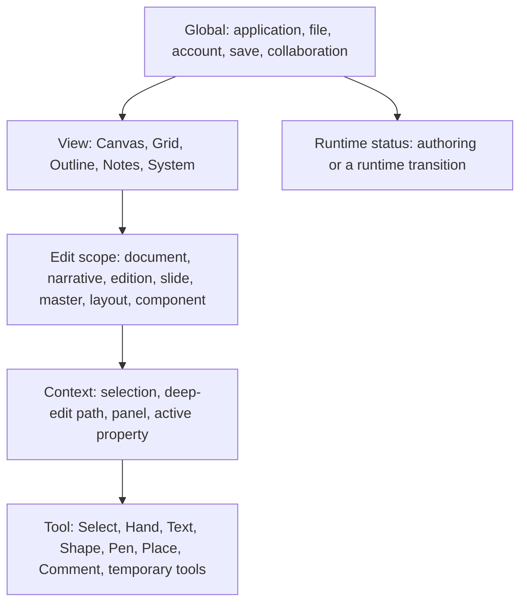

# Story Experience Architecture

> **Specification ID:** `STORY-SPEC-02`  
> **Volume:** 02 (16 volumes total, 00-15)  
> **Status:** Normative draft  
> **Version:** 2.0.0-draft  
> **Owner:** Story Product Design  
> **Approvers:** Product, Design, Engineering, Quality, Accessibility  
> **Last reviewed:** July 10, 2026  
> **Review cadence:** At every shell, navigation, interaction-grammar, or adaptive-tier change  
> **Normative scope:** Workspace information architecture, canonical shell, mental-model jurisdiction, views, edit scopes, tools, runtime modes, commands, selection, focus, Escape, commit grammar, panels, progressive disclosure, state presentation, adaptive behavior, UI language, and product-level visual direction  
> **Explicit non-ownership:** Persisted document schemas, transaction algorithms, renderer implementation, file/package layout, collaboration protocol, presentation playback algorithms, exact release performance budgets, and implementation status  
> **Parent specification:** [Story Product Specification System](README.md)  
> **Governed by:** [Volume 00 - Governance and Traceability](00-governance-and-traceability.md)  
> **Constitutional dependency:** [Volume 01 - Product Constitution](01-product-constitution.md)  
> **Supersedes:** Product-level interaction and workspace direction in older UI, toolbar, inspector, and shortcut documents where this volume resolves a conflict; adopted domain detail remains active where compatible  
> **Implementation status:** Out of scope; see the dated [Capability Audit](../capability-audit.md)

---

## Table of Contents

1. [Purpose and Experience Thesis](#1-purpose-and-experience-thesis)
2. [Information Architecture](#2-information-architecture)
3. [Canonical Shell](#3-canonical-shell)
4. [View Model](#4-view-model)
5. [Edit-Scope Model](#5-edit-scope-model)
6. [Tool Model](#6-tool-model)
7. [Runtime-Mode and Surface-Role Model](#7-runtime-mode-and-surface-role-model)
8. [Mental-Model Jurisdiction](#8-mental-model-jurisdiction)
9. [Selection and Inspector Grammar](#9-selection-and-inspector-grammar)
10. [Command and Shortcut Architecture](#10-command-and-shortcut-architecture)
11. [Focus Architecture](#11-focus-architecture)
12. [Escape and Commit Grammar](#12-escape-and-commit-grammar)
13. [Panels and Progressive Disclosure](#13-panels-and-progressive-disclosure)
14. [State Coverage and Feedback](#14-state-coverage-and-feedback)
15. [Adaptive Window and Device Tiers](#15-adaptive-window-and-device-tiers)
16. [Accessibility and Input Modalities](#16-accessibility-and-input-modalities)
17. [UI Language](#17-ui-language)
18. [Quiet Stagecraft](#18-quiet-stagecraft)
19. [Product-Level Design Tokens](#19-product-level-design-tokens)
20. [Invariants](#20-invariants)
21. [State Machines](#21-state-machines)
22. [Governing Flows](#22-governing-flows)
23. [Usability Measures](#23-usability-measures)
24. [Atomic Requirements](#24-atomic-requirements)
25. [Acceptance Criteria](#25-acceptance-criteria)
26. [Traceability](#26-traceability)
27. [Open Decisions](#27-open-decisions)

---

## 1. Purpose and Experience Thesis

This volume defines the stable experience frame within which Story's Figma-class object authoring, PowerPoint-class document and delivery workflows, and Story-native narrative systems coexist without becoming three separate products.

The key words **MUST**, **MUST NOT**, **SHOULD**, **SHOULD NOT**, and **MAY** are interpreted under BCP 14, RFC 2119, and RFC 8174 as governed by [Volume 00](00-governance-and-traceability.md#2-normative-language).

### 1.1 Experience Thesis

Story is a professional instrument, not a landing page wrapped around an editor. The authored presentation is the dominant first-viewport signal. Structure sits to its left, precise properties sit to its right, commands stay above, and direct-manipulation tools stay close to the stage without covering it.

The experience has three simultaneous obligations:

1. **Immediate familiarity:** a presentation author recognizes slides, notes, masters, show controls, and output; a visual designer recognizes the canvas, tools, layers, properties, components, and direct manipulation.
2. **Visible jurisdiction:** the shell always communicates what the user is viewing, which source they are editing, which tool interprets input, and whether a runtime is active.
3. **Progressive power:** common work remains direct and compact; substantial system, edition, compatibility, and delivery workflows receive dedicated space rather than being compressed into nested panels.

### 1.2 Design Goal

A user should be able to answer these questions at a glance:

- Which presentation and revision am I in?
- Which view am I using?
- What source or audience edition will this edit affect?
- Which object, slide, or narrative item is selected?
- Which tool will receive my next canvas input?
- Is this a preview, an authored change, or an active presentation runtime?
- Is the document saved, shared, offline, conflicted, or ready to present?

### 1.3 Non-Goals of the Shell

The shell does not imitate the chrome of Figma or PowerPoint, expose implementation architecture, turn every feature into a top-level tab, use marketing copy as orientation, or optimize maximum simultaneous panel count at the expense of the authored stage.

---

## 2. Information Architecture

### 2.1 Product Spaces

Story has three user-facing spaces:

| Space | Purpose | Primary content | Entry behavior |
|---|---|---|---|
| **Document Hub** | Open, create, import, recover, and resume presentations | Recent work, templates, import, recovery, provider state | Appears only when no document is open; retains the app shell and uses task-oriented controls, not a marketing hero |
| **Authoring Workspace** | Structure, design, adapt, review, and prepare a presentation | Canvas, slide/narrative views, navigator, inspector, notes, system and edition workflows | Default space after opening or creating a presentation |
| **Presentation Runtime** | Preview, rehearse, record, present, or run unattended delivery | Audience surface, Presenter View, recording controls, runtime navigation | Entered from an exact document revision and delivery context after readiness evaluation |

The Document Hub and Authoring Workspace share global file, account, provider, and recovery commands. Presentation Runtime is a distinct non-authoring environment and restores the prior authoring context on exit.

### 2.2 Authoring Workspace Hierarchy



The hierarchy is not a single enum. View, edit scope, tool, runtime mode, surface role, selection, and overlay context are orthogonal state axes with explicit compatibility rules.

### 2.3 Navigation Levels

| Level | Surface | Content | Back path |
|---|---|---|---|
| L0 | Product space | Document Hub, Authoring Workspace, Presentation Runtime | File/runtime exit command |
| L1 | Workspace view | Canvas, Grid, Outline, Notes, System | Persistent view switcher |
| L2 | Edit scope | Base source, edition, slide, master, layout, component, narrative component | Scope breadcrumb and Done/Escape grammar |
| L3 | Deep edit or focused workflow | Text, vector, group, mask, instance, compatibility review, export setup | Breadcrumb, Done, or one-level Escape |
| L4 | Transient control | Menu, dropdown, picker, popover, tooltip | Selection, outside click where safe, or Escape |

No navigation level can disappear without a visible return path. A modal is not used as an L2 or L3 workspace.

### 2.4 Story-Native IA

Story-native work is not hidden inside the property inspector. The **System view** owns base narrative structure, narrative components, audience editions, governed differences, source-update review, and readiness across editions. Canvas, Grid, Outline, and Notes project the selected base or edition context for detailed work.

---

## 3. Canonical Shell

### 3.1 Spatial Composition

```text
+--------------------------------------------------------------------------------+
| Global command bar: app/file | document + save | view/scope | review | Present |
+----------------------+-----------------------------------------+----------------+
|                      | Workspace context bar                   |                |
| Navigator rail       +-----------------------------------------+ Inspector rail |
|                      |                                         |                |
| Slides / Layers /    |                                         | Selection or   |
| Outline / Narrative  |          Primary workspace              | scope-specific |
| / Masters / Library  | Canvas / Grid / Outline / Notes/System | properties     |
|                      |                                         |                |
|                      |        [bottom-centered tool dock]      |                |
+----------------------+-----------------------------------------+----------------+
| Optional notes/timeline tray | status, zoom, readiness, announcements          |
+--------------------------------------------------------------------------------+
```

Docked regions are full-height or full-width bands separated by borders and tonal changes. They are not floating cards. The only routinely floating shell element is the compact tool dock, which has a stable reserved safe area in canvas fit calculations.

### 3.2 Global Command Bar

The top command bar is always present in the Authoring Workspace and contains five ordered zones:

1. **Application and file:** Story menu, document hub, file commands.
2. **Document identity:** editable presentation name, provider/location status, save state.
3. **Context identity:** current view, edit-scope breadcrumb, base or edition identity.
4. **Team and review:** collaborators, comments/review, permissions, share.
5. **Delivery:** readiness indicator and a split **Present** command with current-slide/default-profile action plus setup choices.

The bar prioritizes state and commands; it does not contain promotional copy, decorative branding, or document-formatting controls.

### 3.3 Workspace Context Bar

The context bar sits directly above the primary workspace and shows:

- current view name;
- edit-scope breadcrumb;
- base or audience-edition chip when applicable;
- deep-edit breadcrumb when depth is greater than zero;
- local actions for the view or scope;
- an explicit **Done** action when the current scope is not the default slide scope.

The breadcrumb uses stable user names but exposes type when names collide, for example `Master: Product / Layout: Title and content`.

### 3.4 Navigator Rail

The left rail owns structure and selection navigation. Its content is view- and scope-aware:

| Context | Primary navigator | Available companion tab |
|---|---|---|
| Canvas, slide scope | Sections and slide thumbnails | Layers |
| Canvas, master/layout scope | Master and layout hierarchy | Layers |
| Canvas, component scope | Component set/definition hierarchy | Layers |
| Canvas, edition scope | Narrative sequence and edition differences | Layers |
| Grid | Sections, filters, and selected-slide summary | None; layers are inapplicable |
| Outline | Sections and slide outline tree | Narrative roles where present |
| Notes | Slide thumbnails and notes search/results | Outline |
| System | Base narrative, narrative components, editions, review queues | Libraries where applicable |

Tabs change navigator content without changing the primary view or edit scope. Navigator selection and workspace selection remain synchronized where they address the same entity.

### 3.5 Primary Workspace

The center region receives the largest stable area and owns the active view. In Canvas view it contains pasteboard and slide stage. In Grid, Outline, Notes, and System views it becomes the actual task workspace, not a preview card inside a dashboard.

### 3.6 Inspector Rail

The right rail answers "What is selected or scoped, and what can I change?" It shows:

1. target identity and source/provenance;
2. high-frequency properties in stable section order;
3. inherited, overridden, mixed, not-applicable, invalid, and permission states truthfully;
4. scope properties when no object is selected;
5. deeper settings through bounded popovers or dedicated views according to Section 13.

The inspector never becomes a second navigator, history log, asset browser, or compatibility report.

### 3.7 Tool Dock

The bottom-centered tool dock appears only in direct-manipulation views and compatible scopes. It contains compact icon tools, split tools for families such as shapes, and resource/place entry points. Tooltips show the tool name and truthful platform shortcut.

The dock:

- reserves a canvas safe inset so Fit commands never hide authored content behind it;
- does not move when a label, badge, or selected state changes;
- uses a maximum corner radius of 8 CSS pixels;
- uses overflow or a More menu before shrinking controls below their density target;
- becomes edge-docked in focused layouts where floating placement would obscure work.

### 3.8 Notes and Timeline Tray

Speaker notes are a first-class optional bottom tray in Canvas view and a full workspace in Notes view. Animation sequencing can use the same tray region but never replaces notes without an explicit tab selection. Tray height is user-resizable and editor-session state, not presentation content.

### 3.9 Status and Announcements

The shell persistently exposes document save/provider state, current zoom where relevant, and runtime readiness state. Transient announcements use a non-blocking region unless user action is required. Screen-reader announcements are semantically equivalent to visible feedback.

### 3.10 No-Document State

When no presentation is open, the center workspace becomes the Document Hub with prominent **New presentation**, **Open**, **Import**, **Recover**, recent presentations, and templates. The global bar and provider/account state remain available. The hub has no oversized hero, value-proposition headline, decorative illustration, or feature-tour cards.

---

## 4. View Model

A **view** changes the representation and task layout of the current presentation. It does not by itself change document ownership, selected edition, or runtime mode.

### 4.1 Canonical Views

| View | Primary job | Center workspace | Default navigator | Default inspector |
|---|---|---|---|---|
| **Canvas** | Precise visual authoring | One active slide/source on a pasteboard | Slides or source hierarchy | Selection, then active slide/scope |
| **Grid** | Scan, compare, select, organize, and section slides | Responsive slide grid with stable thumbnail aspect ratios | Sections and filters | Multi-slide, slide, or section properties |
| **Outline** | Edit and evaluate semantic text and narrative order | Hierarchical title/body/role outline linked to slides | Sections and outline tree | Text, role, slide, or section properties |
| **Notes** | Author, review, search, and format speaker notes | Notes workspace with slide reference and notes content | Slides and notes search | Notes, slide, and accessibility properties |
| **System** | Govern reuse and multi-audience adaptation | Base narrative, edition diff, narrative-component, update, and readiness workspaces | Narrative/system hierarchy | Selected system entity or finding |

### 4.2 View Switching

View switching preserves the current document, base/edition context, applicable selection, and compatible edit scope. When the selected entity cannot appear in the target view, Story preserves it as context when useful and explains the replacement selection rather than silently selecting an unrelated entity.

### 4.3 View-Specific Direct Manipulation

- Canvas supports object tools and direct transforms.
- Grid supports slide selection, range selection, reorder, section movement, and direct presentation start.
- Outline supports text and narrative-structure editing but not pixel geometry tools.
- Notes supports rich notes editing and slide navigation but not slide-object transforms.
- System supports narrative/edition/system commands, diff review, and source navigation but not canvas drawing tools.

### 4.4 View Discoverability

The view switcher uses icons with labels in wide/standard layouts and labeled tooltips in compact/focused layouts. View names are nouns, remain stable across scopes, and never use "mode" as a synonym.

---

## 5. Edit-Scope Model

An **edit scope** identifies the authored source that mutations target. It is independent from view and tool.

### 5.1 Scope Types

| Scope | Mutation target | Typical entry | Required visible identity |
|---|---|---|---|
| **Document** | Deck-level metadata, page setup, theme/library references, show defaults | No local item selected in System or setup workflow | Presentation name |
| **Base narrative** | Ordered semantic narrative and roles | System view, Edit base | Base narrative name |
| **Audience edition** | Edition directives, edition modes, edition-scoped overrides | System edition selection, Edit edition | Edition and audience label plus base |
| **Slide** | Slide-local elements, notes, transition, overrides | Select slide in Canvas | Slide number/title and edition projection if active |
| **Slide master** | Master-owned background, guides, defaults, layouts | Edit master command | Master name and source badge |
| **Layout** | Layout-owned placeholders, elements, guides, defaults | Edit layout command | Parent master and layout name |
| **Component definition** | Reusable visual definition, variants, properties | Go to main component / library edit | Component set and definition/variant |
| **Narrative component** | Semantic role, slots, states, accessibility contract, visual mapping | System view, Edit narrative component | Narrative component name and role |

Group, mask, boolean, vector, text, table, chart, and instance deep editing are nested edit depths inside one of these ownership scopes; they are not new top-level modes.

### 5.2 Scope Entry

Entering a scope:

- does not mutate the document;
- captures prior view, scope, selection, deep-edit path, viewport, and tool for restoration;
- displays the new source in the context bar before mutation is possible;
- preserves inherited surroundings as read-only context where useful;
- routes attempted out-of-scope edits to the owner or offers an explicit local override when allowed.

### 5.3 Scope Exit

**Done**, breadcrumb navigation, or one-level Escape exits only the current scope/depth, commits or cancels the active edit according to Section 12, and restores the nearest valid prior context. Scope exit never discards accepted changes merely because a different view is selected.

### 5.4 Edition Scope

Edition scope is visually unmistakable. The context bar and inspector show the edition audience, base source, and whether the selected value or item is inherited, edition-overridden, conflicted, orphaned, or detached. A command that changes the base while an edition is active says **Edit base** and changes scope before accepting input.

### 5.5 Master and Layout Language

The canonical UI uses **Edit master**, **Edit layout**, **Master**, and **Layout**. "Master mode" may appear only in migration/help text describing legacy behavior. Master and layout are edit scopes rendered through compatible views, not values in the runtime-mode axis.

---

## 6. Tool Model

A **tool** interprets direct workspace input. Tool changes are editor-session state and never mutate authored content by themselves.

### 6.1 Canonical Tool Families

| Tool | Purpose | Compatible views/scopes | Cursor/feedback |
|---|---|---|---|
| **Select** | Select, move, transform, enter deep edit | Canvas and compatible visual scopes | Arrow plus geometry-specific handles |
| **Hand** | Pan the workspace without changing authored content | Canvas; temporary in zoomable views | Open/closed hand |
| **Text** | Create text or enter text insertion behavior | Canvas visual scopes | Text/crosshair according to hover target |
| **Shape** | Create rectangle, ellipse, line, arrow, polygon, star, and registered shape kinds | Canvas visual scopes | Crosshair plus live geometry preview |
| **Pen** | Create and continue vector paths | Canvas visual scopes | Pen cursor with point/segment feedback |
| **Place** | Place image, video, audio, SVG, data, or another supported asset | Compatible Canvas scopes | Loaded-asset preview or explicit placeholder |
| **Comment** | Create an anchored review comment without editing content | Canvas, Grid, Outline, Notes, System where anchorable | Comment cursor and anchor preview |
| **Temporary tools** | Eyedropper, zoom, space-hand, presentation pointer/ink | Owning context only | Distinct temporary state and return behavior |

### 6.2 Persistent and Temporary Tools

Select, Hand, Text, Shape, Pen, Place, and Comment remain active until the user selects another tool, presses `V` for Select, or unwinds the tool with Escape. A temporary tool returns to the immediately preceding compatible tool when its key/button is released or its operation ends.

### 6.3 Creation Lifecycle

Creation is press-drag-release or click-place according to the content type:

1. activation changes tool and cursor only;
2. pointer down begins a transient preview;
3. movement updates preview without an undo entry;
4. release validates geometry and commits one authored transaction;
5. the created object becomes the selection;
6. the creation tool remains active for repeated creation until explicitly changed;
7. Escape during preview cancels; Escape with no preview returns to Select.

Invalid zero/near-zero geometry cancels without creating an object. Line-like tools use segment length rather than both bounding dimensions for the threshold.

### 6.4 Shape Split Tool

The Shape slot uses one stable dock position. Clicking the primary area activates the last-used shape kind; clicking the disclosure opens the registered shape list with names and shortcuts. The icon and tooltip reflect the last-used kind without resizing the dock.

### 6.5 Tool Availability

An incompatible tool is hidden from a view-specific dock or disabled with a reason when preserving its position supports learning. Single-key tool shortcuts do not fire in text inputs, content editing, menus, dialogs, runtime, or another higher-priority context.

### 6.6 Tool and Selection Relationship

Changing tools preserves the current selection unless the new operation creates a replacement selection or a scope transition makes the selection invalid. Switching tools cannot delete, detach, flatten, or otherwise mutate selected content.

---

## 7. Runtime-Mode and Surface-Role Model

A **runtime mode** controls delivery behavior. A **surface role** controls what a particular window or display may show. Neither is an edit scope.

### 7.1 Runtime Modes

Authoring is the product state in which no delivery runtime is active; it is not a runtime mode. The complete runtime-mode enum is Preview, Rehearsal, Recording, Presentation, and Kiosk.

| Runtime mode | Purpose | Authored mutation | Typical surface roles |
|---|---|---|---|
| **Preview** | Quickly inspect resolved playback from authoring | Forbidden except explicit return-to-authoring commands | Preview audience, optional controller |
| **Rehearsal** | Practice delivery and optionally capture timings | Only explicit rehearsal artifacts after user acceptance | Audience plus presenter/controller |
| **Recording** | Capture narration, camera, ink/pointer, captions, and timings | Only explicit recording artifacts and accepted retakes | Audience capture plus recorder/controller |
| **Presentation** | Live, presenter-controlled delivery | Forbidden; saved ink or audience data requires explicit post-run commit | Audience and Presenter View |
| **Kiosk** | Restricted unattended or self-running delivery | Forbidden during run | Audience/kiosk controller |

### 7.2 Surface Roles

| Surface role | May show | Must never show |
|---|---|---|
| **Editor** | Authoring shell, private document state permitted by role | Audience-only guarantees do not apply while authoring |
| **Audience** | Resolved slide, declared audience controls, captions, approved interaction | Notes, next slide, private timer, presenter diagnostics, hidden controls, unreleased content |
| **Presenter** | Current/next, notes, timer, navigation, readiness/recovery, audience controls | Secrets or content outside the presenter's permission |
| **Recorder controller** | Capture devices, retake, levels, timeline, consent, preview | Unconsented camera/microphone capture |
| **Remote controller** | Minimal authenticated navigation and approved presenter controls | Slide source, private notes beyond explicit policy, authoring commands |

### 7.3 Runtime Entry

Runtime entry identifies start location, audience edition, show profile, surface roles, display target, timing/narration policy, and readiness disposition before the audience surface becomes visible. If a browser permission or second display is unavailable, Story offers explicit windowed or single-screen fallback without pretending the requested mode succeeded.

### 7.4 Runtime Exit and Restoration

Exit restores the prior Authoring view, edit scope, selection, deep-edit path where still valid, viewport, tool, open persistent panels, and focus region. Runtime-only state is discarded except authored rehearsal, recording, saved ink, or audience results that the user explicitly accepts through a canonical commit.

### 7.5 Runtime Input Isolation

Authoring shortcuts cannot mutate the document while a runtime surface owns input. Runtime overlays such as grid navigation, pointer palette, or show menu close before Escape exits the runtime.

---

## 8. Mental-Model Jurisdiction

Volume 01 defines the constitutional jurisdiction. This volume applies it to shell and interaction choices.

### 8.1 Applied Jurisdiction Matrix

| User intent | Governing mental model | Shell owner | Examples |
|---|---|---|---|
| Manipulate visual objects | Figma-class object authoring | Canvas, Layers navigator, Inspector, Tool dock | Select, deep select, resize, Auto Layout, components, mixed properties |
| Organize and author a presentation | PowerPoint-class document authoring | Slides navigator, Grid, Outline, Notes, master/layout scopes | Sections, slides, layouts, notes, transitions, animations |
| Adapt and govern narratives | Story-native bridge | System view plus edition context in all views | Base narrative, audience editions, narrative components, overrides, update review |
| Deliver to an audience | PowerPoint-class delivery plus Story runtime guarantees | Runtime surfaces and readiness | Show setup, Presenter View, runtime snapshot, recovery |

### 8.2 Collision Rules

1. Focused scope wins over a broader scope.
2. Active text or inline control editing wins over canvas commands.
3. Runtime input wins over authoring input while runtime is active.
4. The same shortcut cannot invoke two commands in one context.
5. A benchmark convention can be changed only through an accepted Story-specific exception.
6. The UI uses literal Story terminology; competitor names never appear in user-facing labels or explanations.

### 8.3 Resolved Shortcut Collisions

- `Cmd/Ctrl+Enter` is reserved for **New slide** outside text editing.
- `Cmd/Ctrl+Enter` commits and exits while canvas text editing owns focus.
- `Cmd/Ctrl+Shift+Enter` starts presentation from the current slide when authoring owns focus.
- Start from beginning remains available through the Present split button and application menu rather than intercepting browser reload keys.
- Story-specific panel toggles do not occupy benchmark-reserved copy/place-image shortcuts.

Exact platform mappings remain generated from the canonical shortcut ledger; displayed labels never outrun routed commands.

---

## 9. Selection and Inspector Grammar

### 9.1 Selection Scopes

Story distinguishes:

- object selection inside the current visual edit scope;
- slide selection in the navigator or Grid;
- text/range selection in text editing;
- narrative-item or edition-difference selection in System/Outline;
- property/list-row selection inside the inspector;
- runtime navigation focus, which is not authored selection.

The focused region and selection indicator make the active scope visible before Delete, Duplicate, Copy, Paste, or Select All executes.

### 9.2 Selection Synchronization

Canvas and Layers selection are two views of the same object selection. Slide navigator and Grid selection are two views of the same slide selection where the same multi-selection can be represented. A selection change updates all compatible surfaces without stealing keyboard focus from an active valid input.

### 9.3 Inspector Target Precedence

The inspector resolves target in this order:

1. active inline/deep-edit target;
2. selected object or compatible multi-selection;
3. selected slide, section, narrative item, or system entity;
4. active edit scope;
5. document defaults.

The header names the resolved target and source. It never shows stale properties from the prior selection.

### 9.4 Multi-Selection States

Every property control resolves one of `uniform`, `mixed`, `unset`, or `not applicable`:

| State | Numeric/text | Dropdown | Toggle | Segmented group | List property |
|---|---|---|---|---|---|
| Uniform | Value | Selected option | On/off | One selected | Normal rows |
| Mixed | Dash or "Mixed" | "Mixed", no stale highlight | Indeterminate | None selected | Truthful row- or list-level mixed state |
| Unset | Empty placeholder | Placeholder | Property default policy | None | Empty state |
| Not applicable | Disabled with reason or hidden by section rule | Disabled | Disabled | Disabled | Section hidden or explicit inapplicability |

Typing or choosing a value is an absolute set across all applicable targets. Arrow, scrub, and slider deltas preserve each target's starting difference. Partial application is forbidden unless the control explicitly states the subset before commit.

### 9.5 Inheritance and Overrides

Inherited values show source identity and a linked state without relying on color. Editing an inherited value creates an allowed local override; Reset removes only the addressed override. Conflicts and orphaned values remain visible and offer only semantically valid resolution actions.

### 9.6 Selection State and Permission

Locked or inherited objects can remain navigable in Layers even when canvas hit testing excludes them. Read-only users can inspect selectable content and provenance without receiving editable controls that fail after interaction.

---

## 10. Command and Shortcut Architecture

### 10.1 Canonical Command

Every user command has one stable command ID, user-facing label, context predicate, permission predicate, availability reason, handler contract, undo/commit policy, and optional shortcut. Menus, toolbar buttons, context menus, inspector actions, and shortcuts invoke the same command rather than duplicating behavior.

### 10.2 Command States

| State | Presentation | Interaction |
|---|---|---|
| Available | Normal label and icon | Activates through all registered surfaces |
| Unavailable | Disabled but visible when discoverability matters; reason in tooltip/status | Does not activate or mutate |
| Hidden | Used only when the command is nonsensical or unauthorized to disclose | Not focusable |
| Busy | Stable dimensions, progress state, `aria-busy` | Duplicate activation prevented; cancellation exposed when safe |
| Toggled | Pressed/checked state plus text/ARIA | Reinvocation follows declared toggle behavior |
| Destructive | Literal target and consequence | Confirmation only when consequence is hard to reverse or ambiguous |

### 10.3 Context Routing Priority

Highest priority receives the event and stops lower contexts only when it handles the event:

1. operating system, browser-reserved, and active IME composition;
2. blocking modal or permission chooser;
3. nested menu, context menu, dropdown, picker, or popover;
4. focused input, rich text, table cell, chart data editor, or inline rename;
5. active Presentation Runtime surface;
6. focused docked/overlay panel or tray;
7. focused workspace view and edit scope;
8. global application commands.

### 10.4 Shortcut Rules

- Critical browser shortcuts such as close tab/window, new tab, reload, dev tools, and browser navigation are not intercepted.
- Single-key tools run only when an authoring workspace owns focus and no text/composition context is active.
- Platform notation is localized: `Cmd` on macOS, `Ctrl` on Windows/Linux, and literal key names for the current layout where available.
- A shortcut shown in a menu, tooltip, or overlay is routable in the displayed context.
- Conflicting registrations fail specification/command validation rather than resolving by listener order.
- Users can discover shortcuts through `?`, `Cmd/Ctrl+/`, Help, and contextual tooltips.
- The shortcut overlay is generated from the canonical command/shortcut model, filters by context, supports search, traps focus, and restores focus on close.

### 10.5 Menu Grammar

Menus group actions in this order where applicable: create/open, edit, transform/arrange, format, navigate/view, collaboration/review, output/delivery, destructive. Destructive commands appear last. Submenus are limited to one meaningful hierarchy level unless a deeper model is unavoidable and keyboard-tested.

### 10.6 Command Feedback

Immediate visible and assistive feedback identifies the affected scope and result. A command that cannot complete states the cause, confirms what was preserved, and offers the next safe action. Success toasts are reserved for outcomes that are not otherwise visible.

---

## 11. Focus Architecture

### 11.1 Primary Focus Regions

The Authoring Workspace has these ordered focus regions:

1. global command bar;
2. navigator rail;
3. workspace context bar;
4. primary workspace;
5. inspector rail;
6. tool dock;
7. notes/timeline tray when open;
8. status and notification actions.

`F6` moves to the next present region and `Shift+F6` moves to the previous present region. Tab and Shift+Tab move within the current region according to reading order. Region cycling never enters every canvas object; object traversal is owned by the workspace's accessible object-navigation command.

### 11.2 Focus Indicators

Keyboard focus is visible on every interactive element using a non-color-only indicator with at least a 2 CSS-pixel boundary and 3:1 contrast against adjacent colors. Pointer activation does not suppress subsequent keyboard focus visibility.

### 11.3 Focus Entry

- Opening a menu focuses the first enabled item or the current selection.
- Opening a searchable dialog focuses its primary search/input when doing so will not discard context.
- Entering a scope focuses the primary workspace or first meaningful item, not the application body.
- Entering text edit places the caret at the invoked position.
- Entering runtime focuses the runtime controller, while audience surfaces remain free of editor focus chrome.

### 11.4 Focus Trapping and Inertness

Modal dialogs trap focus and make background regions inert. Popovers trap focus only when they contain a multi-control interaction; simple menus use roving focus. Non-modal rails and trays never trap focus.

### 11.5 Focus Restoration

Closing a transient surface restores focus to its invoker if the invoker remains available. If it no longer exists, focus returns to the nearest valid region and the change is announced. Scope and runtime exit restore captured focus context where valid.

### 11.6 Selection Is Not Focus

Visual selection and keyboard focus can coexist on different but related entities. A canvas object remains selected while the inspector input has focus; Delete edits text in the input rather than deleting the selected object because focus routing wins.

---

## 12. Escape and Commit Grammar

### 12.1 One Escape, One Level

One press of Escape resolves exactly one highest-priority cancellable layer. It never closes two overlays, exits a scope, and clears selection in the same key event.

### 12.2 Escape Ladder

After platform/IME handling, Escape applies in this order:

1. cancel the active pointer/keyboard preview and restore gesture-start state;
2. cancel the focused draft value or active IME composition according to the editor contract;
3. close the deepest submenu, picker, dropdown, or popover and restore focus;
4. close the parent menu or context menu;
5. close a dismissible dialog; a blocking dialog remains and announces the required choice;
6. leave one deep-edit level such as vector, mask, boolean, instance, table cell, chart data, or text edit;
7. leave one non-default edit scope and restore prior context;
8. return a persistent creation/temporary tool to Select or its preceding tool;
9. clear the active selection in the focused workspace;
10. close a non-modal overlay rail/tray opened temporarily;
11. in runtime, close the top runtime overlay, then exit runtime on the next Escape when no overlay remains.

Only applicable steps participate; the first applicable step wins.

### 12.3 Draft, Preview, and Commit

| Interaction | Draft/preview | Commit | Escape/cancel | History boundary |
|---|---|---|---|---|
| Inspector scalar/text input | Local draft while typing; valid live preview may render | Enter, Tab, or valid blur | Restore focus-entry value | One commit |
| Numeric arrows | Immediate relative preview | Key event or coalesced repeat end | Restore pre-repeat value if canceled during active repeat | One logical repeat sequence |
| Scrub/slider/color drag | Continuous transient preview | Pointer release | Restore gesture-start values | One gesture |
| Canvas move/resize/rotate/create | Continuous transient preview | Pointer release | Restore gesture-start authored state and selection | One gesture |
| Dropdown/menu choice | Highlight only while navigating | Activate item | Close with no change | One command |
| Toggle/segmented control | No separate draft | Activation | Undo, not Escape after activation | One command |
| Modal form | Local form draft | Explicit primary action or documented Enter | Cancel discards form draft | One transaction on accept |
| Inline rename | Local text draft | Enter or valid blur | Restore original name | One transaction |
| Canvas rich-text edit | Accepted text operations remain in editing session; active composition remains provisional | Text operation boundaries; `Cmd/Ctrl+Enter` commits composition and exits | Escape cancels active composition, preserves previously accepted text operations, and exits one edit depth | Coalesced semantic text operations |
| Reorder drag | Live insertion indicator and transient order preview | Drop | Restore original order | One transaction |

### 12.4 Blur Policy

Blur commits only a valid, unambiguous input whose control contract declares blur commit. Invalid input remains focused with an error or reverts to the last valid value according to the property policy. Selection changes never silently commit malformed drafts.

### 12.5 Outside Click Policy

Outside click can dismiss a non-modal transient surface only when:

- it does not lose an invalid or destructive draft;
- completed gestures inside it are already committed;
- an active gesture is canceled or completed according to its control contract;
- focus restoration and announcement remain deterministic.

### 12.6 Undo Relationship

Escape cancels uncommitted work; Undo reverses committed work. The UI never labels Undo as Cancel or uses Escape to reverse an already committed unrelated command.

---

## 13. Panels and Progressive Disclosure

### 13.1 Surface Taxonomy

| Surface | Use | Persistence | Focus model |
|---|---|---|---|
| **Rail** | Persistent structure or properties beside the workspace | User/session preference | Normal region, no trap |
| **Tray** | Persistent horizontal work such as notes or sequence | User/session preference | Normal region, no trap |
| **Tool dock** | Direct input tools | View/scope-derived | Roving group or normal toolbar |
| **Popover/flyout** | Bounded settings tied to one control or property | Transient | Roving or trapped only for multi-control content |
| **Drawer/sheet** | Temporarily expose a rail on constrained layouts | Transient with retained panel state | Focus contained while modal to workspace |
| **Dialog** | Short blocking decision, permission, confirmation, or focused setup | Until resolved | Modal trap |
| **Full view** | Substantial workflow with navigation, comparison, or many decisions | View state | Primary workspace |
| **Runtime overlay** | Presentation navigation/control without entering authoring | Runtime state | Runtime-owned |

### 13.2 Disclosure Decision Rules

- Put a frequent single-step command on the nearest toolbar, menu, or context surface.
- Put selection-bound scalar and small-list properties in the inspector.
- Put bounded secondary controls for one property in a popover.
- Put persistent contextual reference or repeated editing in a rail or tray.
- Put a short blocking confirmation or permission decision in a dialog.
- Put multi-step, navigable, comparative, or artifact-producing work in a full view.

System/edition management, compatibility review, template/library management, substantial export setup, recording, and accessibility review are full views or dedicated workspaces, not nested inspector cards.

### 13.3 Overlay Rules

- One transient popover chain is active per window.
- Opening an unrelated popover closes the prior chain using the commit/cancel grammar.
- Menus, popovers, dialogs, tooltips, notifications, and runtime overlays use semantic layer roles rather than escalating arbitrary z-index values.
- A child picker can appear above its owning popover, but cannot escape an active modal's inert boundary.
- No visible interactive surface can be clipped by a rail's scroll container.

### 13.4 Panel State

Rail width, tray height, collapse state, selected panel tab, scroll position, and floating placement are editor-session/user-preference state. They are not authored presentation content and do not affect collaboration convergence or runtime output.

### 13.5 Section Behavior

Inspector sections use a stable order by semantic frequency. Collapse state can persist by selection type. Expanding or collapsing a section preserves the scroll anchor and never changes the selected object or property.

### 13.6 No Card Nesting

Docked page regions and inspector sections use bands, rows, separators, and whitespace. Cards are reserved for repeated selectable items, bounded previews, or modal objects. A card cannot contain another decorative card, and a full page section is never styled as a floating card.

---

## 14. State Coverage and Feedback

### 14.1 Shell and Document States

| State | Persistent shell signal | Primary workspace | Allowed action |
|---|---|---|---|
| No document | No document identity; provider/account available | Document Hub | New, open, import, recover |
| Opening | File identity and determinate/indeterminate progress | Stable skeleton or last safe content | Cancel when safe; no editing partial state unless declared |
| Empty presentation | Saved/dirty state as applicable | First slide with actionable placeholders or blank canvas | Add content, choose layout/template |
| Dirty | Unsaved indicator adjacent to document identity | Fully editable | Save, continue, close with protection |
| Saving | Stable busy indicator; document remains usable under declared policy | No layout shift | Continue supported edits or show bounded lock |
| Saved | Quiet confirmation in document identity | No interruption | Continue |
| Save failed | Error state with preserved local work | Editing remains available where safe | Retry, Save As, inspect provider, download recovery copy |
| Offline | Offline state and last durable save boundary | Supported local authoring | Queue, save locally, reconnect |
| Read-only | Role and reason visible | Inspect/select/comment if allowed | Request access, duplicate under policy |
| Conflict | Conflict count and affected scope | Non-conflicting work preserved | Review, keep, merge, copy, retry |
| Recovery available | Recovery source, age, and difference visible | Compare or restore flow | Restore, inspect, dismiss without deletion |
| Compatibility blocked | Blocking feature and preservation state visible | Read-only or bounded workflow | Choose safe profile, preserve, cancel |

### 14.2 Selection States

| State | Canvas/navigator | Inspector | Announcement |
|---|---|---|---|
| None | No object bounds; active slide/scope remains visible | Slide/scope/document properties | Current scope |
| Single | One target and source affordances | Full applicable properties | Name and type |
| Multiple uniform | Shared bounds/list selection | Shared values | Count and common type |
| Multiple mixed | Shared bounds/list selection | Truthful mixed states | Count and mixed-property context on focus |
| Locked | Distinct lock state; selectable through structure | Inspectable, editing disabled with reason | Locked and source |
| Inherited | Source-linked indicator | Source, inherited values, override action | Inherited from named source |
| Conflicted/orphaned | Warning badge without hiding content | Resolution state and actions | Exact conflict/orphan reason |
| Remote-selected | Collaborator color plus non-color identity | Local inspector remains locally owned unless following | Collaborator and target when requested |

### 14.3 Control States

Every interactive control supports applicable default, hover, focus-visible, pressed, selected/toggled, mixed/indeterminate, disabled, busy, invalid, warning, success, and permission-denied states. Hover cannot be the only way to expose an essential command.

### 14.4 Loading and Partial Content

Loading preserves geometry so controls do not shift. Partial content identifies what is usable and what remains pending. A thumbnail, font, media, library, or provider placeholder never impersonates loaded content.

### 14.5 Error Message Formula

An actionable error states:

1. what could not complete;
2. the concrete cause when known;
3. what content or state was preserved;
4. the primary safe next action;
5. a secondary diagnostic or recovery path when needed.

The UI does not use "Oops", blame the user, expose raw stack traces as primary copy, or say "Something went wrong" when a specific cause is known.

### 14.6 Notification Policy

- Inline feedback owns local validation and recoverable property errors.
- Status bar/command bar owns durable file, provider, collaboration, and readiness state.
- Toasts own transient outcomes not already visible.
- Banners own persistent cross-workspace degradation requiring awareness but not immediate blocking.
- Dialogs own decisions that block safe continuation.
- Audience surfaces show only audience-safe failures; presenter surfaces receive actionable detail.

---

## 15. Adaptive Window and Device Tiers

Adaptation is driven by effective workspace size, input modality, zoom, and user density preference. Device names are capability hints, not layout truth.

### 15.1 Window Tiers

| Tier | Effective viewport | Shell composition | Precision-authoring posture |
|---|---|---|---|
| **W4 Expansive** | Width >= 1440 and height >= 800 CSS px | Both rails docked; optional tray; labeled views; full command zones | Full |
| **W3 Standard** | Width 1100-1439 and height >= 700 CSS px | Both rails available; one may be narrower; secondary actions overflow | Full |
| **W2 Compact** | Width 760-1099 or height 560-699 CSS px | At most one docked rail; other rail becomes drawer; tray overlays/resizes; compact command bar | Full when center stage remains at least 480 x 360 CSS px |
| **W1 Focused** | Width < 760 or height < 560 CSS px | One primary region at a time; rails become full-height sheets; tool dock edge-docks; secondary commands use menus | Bounded; no full-precision parity claim |

If browser zoom or system text scaling reduces usable space, Story selects the resulting effective tier rather than clipping the W3/W4 layout.

### 15.2 Deterministic Collapse Order

When space decreases, Story adapts in this order:

1. move secondary command-bar actions into labeled overflow menus;
2. reduce optional whitespace within the current density token set;
3. convert the notes/timeline tray to an overlay sheet;
4. collapse the less recently used side rail to an icon/labeled trigger;
5. convert the inspector to an on-demand drawer while retaining target state;
6. convert the navigator to an on-demand drawer while retaining selection;
7. enter W1 single-region navigation;
8. bound unavailable precision workflows with an explanation rather than shrinking controls or overlapping the stage.

Save state, document identity, active view/scope/edition, undo/redo access, and runtime exit are never removed; their presentation can become compact.

### 15.3 Device and Input Tiers

| Tier | Capability signal | Required experience |
|---|---|---|
| **D3 Precision** | Fine pointer plus keyboard, usually hover-capable | Full professional authoring, all shortcuts, dense controls with accessible hit regions |
| **D2 Hybrid** | Touch or pen primary, optional keyboard/fine pointer | Full supported authoring on adequate W2-W4 space; 44px hit targets, pen/touch gestures, no hover dependency |
| **D1 Companion** | Coarse pointer on W1 handset-sized space | Open, navigate, review, comment, present/remote, read notes, respond to approvals, and make bounded emergency text/property corrections; no claim of full vector/layout authoring parity |

Connecting a keyboard or fine pointer can enhance input density without changing document state. Input modality is detected per interaction when possible; a touch-capable laptop is not forced into touch density while using a mouse.

### 15.4 View Adaptation

| View | W4/W3 | W2 | W1 |
|---|---|---|---|
| Canvas | Docked navigator + canvas + inspector | One rail docked, one drawer | Canvas, Navigator, or Inspector as one selected region |
| Grid | Multi-column grid plus filters/inspector | Fewer stable columns; inspector drawer | One/two-column grid with full-screen slide actions |
| Outline | Two-pane outline plus inspector | Outline plus inspector drawer | Single outline tree/editor |
| Notes | Slide reference, notes editor, navigator, inspector | Notes editor plus slide drawer | Notes-first editor with slide preview toggle |
| System | Hierarchy, comparison workspace, inspector | Hierarchy drawer plus full comparison | One step at a time: hierarchy, difference, or resolution |

Thumbnail aspect ratio remains stable at every tier. Text labels wrap or truncate with accessible full names; they never overlap neighboring controls.

### 15.5 Runtime Adaptation

Audience content remains full-bleed within its declared fit/letterbox policy. Presenter View changes from multi-pane to tabbed regions as space narrows. Runtime controls use touch-size targets when coarse input is active, auto-hide without removing keyboard access, and never cover essential audience content permanently.

### 15.6 Reflow and Zoom

At 200% browser zoom on a 1280 x 720 CSS-pixel reference window, every critical authoring and delivery setup workflow remains operable without two-dimensional page scrolling or clipped controls. At 400% zoom, W1 single-region navigation preserves document navigation, target inspection, text/property editing, save, readiness inspection, and runtime exit.

---

## 16. Accessibility and Input Modalities

### 16.1 Conformance Baseline

The shell and all authored controls target WCAG 2.2 AA where applicable. Canvas-specific semantics supplement rather than replace ordinary named controls, focus, keyboard operation, and reading order.

### 16.2 Target Size and Density

- Fine-pointer visual controls can be 28 or 32 CSS pixels high when adjacent targets satisfy WCAG spacing and retain a minimum 24 x 24 CSS-pixel hit area.
- Coarse-pointer controls use at least a 44 x 44 CSS-pixel hit area.
- Icon glyphs remain optically centered and do not enlarge the layout on hover, focus, loading, or selection.
- User-selected comfortable or touch density can increase targets without changing authored geometry.

### 16.3 Keyboard Completeness

Every critical workflow has a keyboard path. Custom widgets follow platform patterns: roving focus for toolbars/menus, arrows within composite controls, Enter/Space activation, Home/End where ordered, and Escape according to Section 12. Browser-reserved shortcuts remain available.

### 16.4 Canvas Accessibility

The workspace exposes a semantic object tree with name, role/type, hierarchy, order, visibility, lock, selection, bounds summary, and source/inheritance state. Keyboard users can traverse, select, enter/leave hierarchy, move/nudge, resize through numeric properties, and invoke context commands without pointer hit testing.

### 16.5 Touch and Pen

- Tap maps to primary selection/activation.
- Long press opens context actions without being the only path.
- Two-finger pan and pinch zoom do not mutate content.
- Pen drawing/editing distinguishes barrel/eraser behavior only when supported and always provides controls.
- Palm rejection and pointer cancellation cannot commit unintended geometry.

### 16.6 Visual Access

All text and controls meet contrast requirements in light, dark, high-contrast, and forced-color environments. Focus, selection, warnings, collaborators, mixed values, and inheritance do not rely on hue alone. At 200% text scaling, labels and values reflow without overlap or loss.

### 16.7 Motion and Time

Reduced-motion preference removes nonessential transitions and substitutes cuts/fades for spatial movement without changing timing semantics. No shell animation delays input, focus, or content availability. Auto-dismiss messages with required information remain available in a persistent log or status surface.

### 16.8 Language and Direction

UI layout supports translated strings, bidirectional direction, locale-aware numbers, and IME composition. Shortcut parsing uses physical/logical key policy declared by the shortcut owner; UI copy never assumes English string length.

---

## 17. UI Language

### 17.1 Canonical Terms

The UI uses the [product glossary](../glossary.md) plus these Story-native terms:

| Use | Meaning | Avoid in the same meaning |
|---|---|---|
| Presentation | Complete authored document | Project, design file, deck as formal UI noun |
| Slide | Ordered presentation page | Frame when it participates in playback |
| Slide master | Source for layouts and inherited defaults | Theme master unless qualifying legacy data |
| Layout | Master-owned reusable slide structure | Preset when it is an actual layout |
| Canvas | Interactive visual authoring workspace | Stage in UI labels; stage is philosophy only |
| Layer | User-facing hierarchy item | DOM node, scene node in ordinary UI |
| Story System | Governed presentation family and bridge | Workspace, project, template |
| Base narrative | Canonical ordered semantic story | Master deck, source deck |
| Narrative component | Reusable semantic presentation content | Slide template, UI component |
| Audience edition | Audience-scoped non-destructive delta | Copy, version, custom show |
| Override | Intentional local difference from source | Unlink, custom value when source remains |
| Runtime snapshot | Exact validated delivery input | Autosave, checkpoint, preview cache |
| Presenter View | Private presenter surface | Presentation Mode as a whole |

Competitor names can appear in internal specifications, compatibility help, or import/export labels when legally and contextually required. They do not appear as general user-facing design guidance.

### 17.2 Labels and Commands

- Commands begin with a concrete verb: **Add slide**, **Edit master**, **Reset override**, **Start from current slide**.
- Navigation and panel labels use nouns: **Slides**, **Layers**, **Outline**, **Notes**, **System**, **Properties**.
- Sentence case is the default.
- Ellipsis appears only when a command opens a required follow-up before execution, such as **Export...** or **Open...**.
- Toggle labels describe the state controlled, not the click action.
- Destructive confirmations name the target, count, scope, and recoverability.
- Tooltips name the control and shortcut; they do not serve as the only label for unfamiliar, high-consequence actions.

### 17.3 Source and State Copy

Use explicit phrases:

- **Inherited from Layout: Title and content**
- **Overridden in Executive edition**
- **Mixed across 4 objects**
- **Read only: Viewer access**
- **Presentation changed since readiness check**
- **Preserved, but not editable in Story**

Avoid vague terms such as **Custom**, **Local**, **Linked**, **Synced**, or **Unsupported** without naming the source, scope, or consequence.

### 17.4 Error and Empty Copy

Empty states state what is absent and provide the next relevant command. They do not explain obvious interface mechanics, advertise features, use jokes, or display decorative emoji. Errors follow Section 14.5.

### 17.5 Status Honesty

The UI distinguishes **Specified**, **Available**, **Experimental**, **Read only**, **Preserved**, **Ready**, **Stale**, **Failed**, and **Waived** where those facts are relevant. It does not use **Complete**, **Supported**, or a green check without a declared scope and current evidence.

---

## 18. Quiet Stagecraft

### 18.1 Named Philosophy

Story's visual philosophy is **Quiet Stagecraft**.

In professional theatre, the audience experiences the story while rigging, wings, cues, and control systems make precision possible without competing for attention. Story uses the same spatial discipline:

- the authored slide or active narrative is the **stage** and receives visual primacy;
- navigation and source hierarchy occupy the **left wing**;
- precision properties and provenance occupy the **right workbench**;
- direct-manipulation tools sit close to the stage as a compact **tool dock**;
- global state, cues, review, and delivery commands form a restrained **control line** above;
- notes and timelines rise from below only when the task requires them.

These metaphors guide composition only. User-facing labels remain literal and professional.

### 18.2 Spatial Principles

1. **Stage first:** the center workspace is the largest uninterrupted region.
2. **Rails, not cards:** persistent chrome forms aligned bands with shared edges.
3. **One active depth:** overlays and edit scopes clearly reveal which layer owns input.
4. **Stable geometry:** hover, focus, loading, badges, long labels, and mixed values do not resize controls or shift neighboring regions.
5. **Visible continuation:** navigator lists, grids, and system sequences reveal that more content exists through cropping, scroll affordance, or partial next items without decorative clutter.
6. **Task-sized surfaces:** a substantial workflow receives a substantial workspace; a bounded choice receives a bounded control.

### 18.3 Master-Craft Standard

Craft is judged at the joints:

- rail dividers align through the command bar and tray;
- icon optical centers, text baselines, fields, and section headers share consistent geometry;
- canvas safe insets account for every dock and transient control;
- popovers align to their triggers and flip without detaching visually;
- selection, focus, and hover remain distinct in every theme;
- long localized labels wrap or truncate intentionally and expose full text accessibly;
- no state causes text or controls to overlap;
- dense controls remain readable rather than merely small.

### 18.3.1 Signature: The Cue Line

Quiet Stagecraft spends its visual distinctiveness on one functional element: the **Cue Line**. It is a restrained, continuous context/provenance line aligned with the top edge of the stage. It communicates the chain currently governing the work:

```text
Presentation -> Base narrative -> Executive edition -> Slide 07 -> Runtime snapshot
                   inherited          3 differences       ready       current
```

The Cue Line is not decoration, a progress bar, or a breadcrumb duplicate. It:

- reveals source, edition, edit scope, and readiness provenance in one scan path;
- uses shape, labels, and semantic state in addition to color;
- lets users navigate to each owning source without changing content accidentally;
- shows breaks as conflict, orphan, stale, permission, or compatibility markers at the exact relationship;
- collapses to the nearest three context nodes at constrained widths while exposing the full chain on focus or activation;
- never appears in audience output, exported slide pixels, or presentation content;
- becomes the recognizable Story-specific bridge between design-system provenance and presentation delivery.

Every canonical reference screen must demonstrate the Cue Line in at least one inherited, overridden, conflicted, or runtime-ready state. If research shows it does not improve source/scope prediction under `SLO-14-062`, the visual treatment may change through an ADR, but the requirement for one scanable provenance chain remains.

### 18.4 Color Direction

The default shell is neutral and material, using cool graphite and paper-white families rather than a monochrome blue or purple wash. A clear cobalt interaction accent identifies focus, selection, and active tools. Green, amber, and red are reserved for success, warning, and danger. Collaboration identities use an accessible multi-hue set distinct from semantic status colors.

Slide content keeps its authored colors; the app shell never recolors it. The pasteboard/stage surround creates enough tonal separation to inspect light and dark slides without a decorative gradient.

### 18.5 Surface and Elevation

Docked rails, bars, trays, and sections use tonal steps and one-pixel semantic separators. Shadows are reserved for transient floating layers such as menus, popovers, dialogs, and the tool dock. Glass blur, decorative gradients, gradient orbs, bokeh, deep card stacks, and oversized rounded containers are excluded.

### 18.6 Typography Direction

The default app typography uses a deliberately selected professional grotesk or humanist sans plus a compatible monospace for shortcuts, code, and alignment-critical diagnostic values. The selected pair must feel precise and editorial rather than generic, remain distinct from presentation content, and pass text-metric, localization, reflow, density, and accessibility evaluation. Typeface selection is recorded in an ADR and approved reference-screen pack; the product contract does not depend on one vendor font.

UI typography is compact but not compressed:

- 11px metadata and secondary labels only when contrast and text scaling are verified;
- 12px body and control values;
- 13px section and emphasized control labels;
- 14px panel and context titles;
- 16px dialog titles;
- 20px maximum for functional Document Hub headings.

Font size does not scale with viewport width. Letter spacing is zero; uppercase labels and negative tracking are not used as hierarchy substitutes.

### 18.7 Iconography

Story uses one coherent stroked icon family with 16px default optical size and 12/20px supported variants. Familiar symbols replace text in compact tool buttons when comprehension is established. Unfamiliar or consequential icons include labels or tooltips. Emoji and hand-drawn one-off SVG symbols are not interface icons.

### 18.8 Motion

Motion communicates state or spatial origin:

- focus and value feedback are immediate;
- hover and pressed color changes complete within 100ms;
- menus and popovers use 100-160ms opacity/short translation;
- drawers and scope transitions use at most 240ms;
- geometry does not scale on press;
- repeated list/grid content can use one restrained entry sequence, never perpetual decoration;
- reduced motion removes translation and nonessential sequencing.

---

## 19. Product-Level Design Tokens

Exact component tokens live in the UI system. This section governs semantic roles, reference scales, and default-theme direction. A theme can vary values only while preserving role, contrast, geometry, and adaptive constraints.

### 19.1 Default Neutral and Semantic Roles

| Role | Light reference | Dark reference | Product use |
|---|---:|---:|---|
| App background | `#F1F3F5` | `#181A1D` | Shell perimeter and inactive base |
| Panel surface | `#FAFBFC` | `#202328` | Docked rails and trays |
| Stage surround | `#E3E6EA` | `#111317` | Pasteboard around authored slides |
| Control surface | `#FFFFFF` | `#2A2E34` | Inputs and bounded controls |
| Elevated surface | `#FFFFFF` | `#30353C` | Menus, popovers, dialogs |
| Primary text | `#191C20` | `#F3F5F7` | Labels and values |
| Secondary text | `#5D646E` | `#A9B0BA` | Metadata and helper state |
| Border | `#CDD2D8` | `#40464F` | Region and control separation |
| Interaction accent | `#176BFF` | `#4D8DFF` | Selection, active tool, focus relationship |
| Success | `#147A52` | `#46C993` | Confirmed positive state only |
| Warning | `#A85F00` | `#F0AD4E` | Attention and bounded degradation |
| Danger | `#C33636` | `#FF6B6B` | Error and destructive consequence |

Reference values are calibration candidates, not accepted brand constants or permission to hardcode component colors. The approved reference-screen pack and design-token ADR select final values. Implementations use semantic tokens and pass contrast checks in every supported app theme.

### 19.2 Spacing and Geometry

| Family | Reference scale | Rule |
|---|---|---|
| Spacing | 2, 4, 8, 12, 16, 24, 32 CSS px | 4px rhythm with 2px optical corrections only where documented |
| Radius | 2, 4, 6, 8 CSS px | 8px maximum for rectangular cards, panels, dialogs, and dock; full only for circles, toggles, or semantic pills |
| Control height | 28, 32, 40 CSS px | Dense, standard, emphasized pointer controls |
| Touch hit target | 44 CSS px minimum | Visual glyph/control may remain smaller inside the hit region |
| Icon | 12, 16, 20 CSS px | One optical family; no viewport scaling |
| Border | 1 and 2 CSS px | 1px structure; 2px focus/emphasis |
| Motion | 0, 100, 160, 240ms | Instant, micro, transient layer, major shell transition |

### 19.3 Stable Shell Dimension Contracts

| Region | Calibration candidate | Required behavior |
|---|---:|---|
| Global command bar | 40px high | Can grow to two lines only at accessibility scaling; never horizontally overlap |
| Workspace context bar | 32px high | Wraps into compact two-row context only at W1/W2 |
| Navigator rail | 248px wide | User-resizable 200-360px at W3/W4; drawer at constrained tiers |
| Inspector rail | 280px wide | User-resizable 240-400px at W3/W4; drawer at constrained tiers |
| Tool dock | 44px visual height | 44px hit targets in touch density; reserved safe inset at all placements |
| Notes/timeline tray | 180px initial height | User-resizable 120px to 50% of workspace; overlay at W1/W2 |

### 19.4 Theme Axes

An app theme can define:

- semantic color palette;
- UI and mono typography families within tested metric bounds;
- spacing/density rhythm;
- radii and shadow character;
- light and dark modes.

Theme switching cannot alter presentation-theme data, canvas geometry, selection identity, command meaning, focus order, target minimums, or information hierarchy.

### 19.5 Required Reference-Screen Pack

Before shell or design-system implementation is accepted, Product Design produces and approves a versioned visual pack for:

1. W3 Canvas view with slide/layers navigator, selection, inspector, tool dock, and inherited Cue Line.
2. W2 compact Canvas view with one docked rail and one drawer.
3. Grid view with sections, multi-selection, hidden state, and transition/timing summary.
4. System view during first Story System adoption.
5. System view during source-update conflict review across two editions.
6. Notes plus Motion focused workflow with the tray expanded.
7. Presentation setup/readiness with selected edition and blocking/degradable issues.
8. Presenter and audience surfaces during a recoverable audience-window failure.
9. Compatibility review before PPTX export with editability and preservation findings.
10. Forced-colors, 200% zoom, keyboard focus, and screen-reader semantic variants of critical screens.

Each reference records viewport, density, theme, token version, font decision, content fixture, state, focus, and approved exceptions. Mockups are visual acceptance inputs, not substitutes for behavior, accessibility, or responsive evidence.

### 19.6 Component State Tokens

Every component maps semantic tokens for default, hover, pressed, focus-visible, selected, disabled, mixed, invalid, warning, success, busy, and destructive states. Selection and focus use related but distinguishable treatments. Hover uses a subtle accent or neutral response; full accent is reserved for selected/active state, primary commands, and focus relationships.

---

## 20. Invariants

### `INV-02-001` - Orthogonal Axes

View, edit scope, tool, runtime mode, surface role, selection, and overlay context remain independently identifiable state axes.

### `INV-02-002` - Visible Ownership

Before a mutation, the shell exposes the source or edition scope that will own it.

### `INV-02-003` - Stage Primacy

In authoring layouts, the primary workspace receives the largest contiguous region after required controls and adaptive constraints.

### `INV-02-004` - One Command

Every command surface invokes one canonical command identity and outcome.

### `INV-02-005` - One Escape Level

One Escape key event unwinds at most one interaction, overlay, depth, scope, selection, or runtime layer.

### `INV-02-006` - Cancel Is Lossless

Canceling an uncommitted preview restores authored state, selection, and relevant UI state to the preview start.

### `INV-02-007` - One Gesture, One Commit

A continuous user gesture creates at most one authored transaction.

### `INV-02-008` - Selection and Focus Independence

Moving focus does not clear valid selection, and selection changes do not steal focus from a valid active editor.

### `INV-02-009` - Truthful Mixed State

Multi-selection controls never display a single value as shared when applicable values differ.

### `INV-02-010` - No Hidden Partial Edit

An edit never affects only a subset of the apparent selection unless that subset is disclosed before commit.

### `INV-02-011` - Runtime Isolation

Presentation Runtime input cannot invoke authoring mutations.

### `INV-02-012` - Audience Privacy

Audience surfaces never render private presenter UI or data.

### `INV-02-013` - Adaptive Continuity

Changing window tier preserves document, view, scope, selection, drafts, and committed work unless an explicit capability boundary is disclosed.

### `INV-02-014` - No Essential Hover

Essential state and commands remain available without hover.

### `INV-02-015` - Stable Geometry

Interaction states, dynamic labels, and progress indicators do not resize fixed-format shell controls or shift the workspace unexpectedly.

### `INV-02-016` - Theme Separation

App-theme changes cannot change authored presentation-theme semantics.

### `INV-02-017` - Canonical Language

One concept uses one canonical UI term across labels, commands, help, errors, and accessibility names.

### `INV-02-018` - State Beyond Color

Focus, selection, mixed, warning, error, inheritance, conflict, and collaborator identity remain distinguishable without color.

### `INV-02-019` - Panel State Is Ephemeral

Panel placement, size, collapse, scroll, and tab state are not authored presentation data.

### `INV-02-020` - Browser Safety

Story does not intercept critical browser or operating-system shortcuts.

---

## 21. State Machines

### 21.1 Context Axes - `SM-02-001`

The composite context is:

```text
Context = ProductSpace
        x View
        x EditScope
        x DeepEditStack
        x Tool
        x SelectionScope
        x OverlayStack
        x RuntimeMode
        x SurfaceRole
```

Transitions change only the named axes plus explicitly listed dependent cleanup. Invalid combinations are rejected with no document mutation.

| Event | Required axis change | Preserved context | Required cleanup |
|---|---|---|---|
| Switch view | `View` | Document, edition, compatible scope/selection | Close view-owned transient overlay |
| Enter master/layout/component | `EditScope`, optional `View` | Prior context snapshot | End incompatible deep edit; keep document |
| Activate tool | `Tool` | View, scope, valid selection | Cancel active incompatible preview |
| Enter runtime | `ProductSpace`, `RuntimeMode`, `SurfaceRole` | Captured authoring context | Close authoring transient overlays; validate readiness |
| Exit runtime | `ProductSpace=Authoring`, `RuntimeMode=Authoring` | Restore captured context | Dispose runtime-only overlays/state |
| Resize/reflow | Window tier only | All semantic axes and drafts | Re-home panels without closing valid work |

### 21.2 Overlay and Escape - `SM-02-002`

| State | Escape result | Next state |
|---|---|---|
| Active preview | Revert preview | Owning editor remains focused |
| Active draft | Revert draft | Control remains/returns focused according to contract |
| Nested transient | Close deepest transient | Parent overlay remains |
| Menu/popover | Close and restore invoker focus | Underlying context |
| Dismissible dialog | Discard dialog draft and restore focus | Underlying context |
| Blocking dialog | Announce required decision | Same state |
| Deep edit depth N | Exit depth N only | Depth N-1 |
| Non-default edit scope | Exit current scope | Captured prior scope |
| Persistent creation tool | Activate Select | Same view/scope |
| Selection | Clear focused selection | Same view/scope |
| Runtime overlay | Close overlay | Runtime continues |
| Runtime with no overlay | Exit runtime | Restored authoring context |

### 21.3 Edit Session - `SM-02-003`

| State | Entry | Update | Commit | Cancel/failure |
|---|---|---|---|---|
| `idle` | Focus/gesture start | None | None | None |
| `drafting` | Text/input edit | Local draft, optional valid preview | Enter/Tab/valid blur/primary action | Revert invalid or Escape |
| `previewing` | Pointer/slider/scrub/create | Transient visual/model preview | Pointer release/drop | Escape/pointercancel restores start |
| `validating` | Commit requested | Stable busy feedback | One transaction accepted | Preserve draft and show addressable error |
| `committed` | Acceptance succeeds | Views synchronize from canonical state | Return idle | Undo is available |

### 21.4 Panel Lifecycle - `SM-02-004`

| State | Meaning | Transition |
|---|---|---|
| `closed` | Surface absent | Open -> docked/overlay/modal/full-view according to tier/task |
| `docked` | Persistent region | Collapse, resize, move to overlay on tier change |
| `collapsed` | Trigger remains visible | Expand to prior size |
| `overlay` | Temporary drawer/sheet | Dismiss to closed/collapsed; pin where tier permits |
| `modal` | Blocking dialog | Resolve or allowed dismiss |
| `full-view` | Primary workspace owns task | Switch view or return to prior view |

### 21.5 Runtime Readiness Indicator - `SM-02-005`

| State | Shell treatment | Present action |
|---|---|---|
| `unchecked` | Neutral readiness label | Runs check before launch |
| `checking` | Stable progress, cancel if safe | Disabled or queues one launch request |
| `ready` | Ready plus edition/profile and timestamp/revision access | Launches bound snapshot |
| `warnings` | Warning count and summary | Launch allowed only under declared policy |
| `blocked` | Blocking count and reason | Opens readiness resolution; no audience launch |
| `stale` | Explicit changed-since-check state | Recheck required before launch |
| `launching` | Stable busy state | Duplicate launch prevented; cancel where safe |

---

## 22. Governing Flows

### 22.1 Open and Orient - `FLOW-02-001`

1. Open/create/import/recover from the Document Hub.
2. Show file identity, save/provider state, default Canvas view, slide scope, Select tool, and no runtime.
3. Fit the active slide into the unobscured center workspace.
4. Select the active slide in the navigator and show slide properties when no object is selected.
5. Restore user panel/density preferences only after validating they fit the current tier.
6. Move focus to the primary workspace or recovery decision, announce document and scope, and keep all return paths visible.

### 22.2 Change Edit Scope - `FLOW-02-002`

1. Invoke an explicit scope command such as **Edit master**, **Edit layout**, **Go to main component**, or **Edit edition**.
2. Resolve unsaved local drafts using Section 12; do not discard them silently.
3. Capture view, scope, selection, deep-edit path, viewport, tool, panels, and focus.
4. Update context bar and navigator before enabling mutation.
5. Show inherited/referenced surroundings as context and explain edit routing.
6. On Done/Escape/breadcrumb, leave one depth and restore the nearest valid captured context.

### 22.3 Invoke a Command - `FLOW-02-003`

1. Resolve the topmost input context and canonical command ID.
2. Check browser reservation, scope compatibility, permission, selection, and busy state.
3. If unavailable, preserve state and expose the specific reason.
4. If available, preview consequence or request required input according to command policy.
5. Execute through the canonical command handler and one commit policy.
6. Synchronize all views from the accepted state.
7. Restore or intentionally move focus and announce the result.

### 22.4 Edit a Property - `FLOW-02-004`

1. Focus the inspector control without clearing canvas selection.
2. Resolve uniform, mixed, unset, inherited, overridden, conflicted, and applicability states.
3. Capture per-target start values and source/provenance.
4. Produce local draft or transient preview while the canvas updates without history spam.
5. Commit one absolute-set or relative-delta transaction according to control semantics.
6. On Escape/invalid commit, restore start values and focus without changing selection.
7. Update inspector, canvas, layers, thumbnails, and system provenance from accepted state.

### 22.5 Create and Review an Audience Edition - `FLOW-02-005`

1. Enter System view and choose **New audience edition** from a base narrative.
2. Name audience and optional locale/tags in a focused setup dialog.
3. Open edition scope with base comparison visible.
4. Use System, Outline, Grid, or Canvas view for appropriate difference types.
5. Keep edition identity persistent in the context bar and inspector.
6. Review difference summary, override states, accessibility, compatibility, and readiness.
7. Return to base through **Edit base** or breadcrumb; never mutate base implicitly.

### 22.6 Enter and Exit Presentation - `FLOW-02-006`

1. Invoke the Present split action or an unambiguous shortcut/menu command.
2. Choose/confirm start point, edition, show profile, surface roles, display, timings, and narration when not already bound.
3. Evaluate readiness and resolve blocking findings.
4. Capture authoring context and create/admit the runtime snapshot.
5. Open audience first only when a stable first frame is ready; open/synchronize Presenter View as requested.
6. Route runtime input exclusively within runtime contexts.
7. On exit, close runtime surfaces, preserve accepted rehearsal/recording artifacts only, and restore authoring context and focus.

### 22.7 Adapt to Window/Input Change - `FLOW-02-007`

1. Recompute effective window and input tiers without changing semantic axes.
2. Preserve active draft, selection, view, scope, scroll anchors, and tool.
3. Apply the deterministic collapse order.
4. Re-home docked surfaces to drawers/sheets while retaining target and panel state.
5. Recalculate canvas safe area and fit only when the user requested fit or the prior content would become unreachable.
6. Announce material layout-mode changes to assistive technology without interrupting editing.

### 22.8 Recover from Save/Provider Failure - `FLOW-02-008`

1. Show failure next to document identity and in an actionable status surface.
2. Preserve all local authored work and current context.
3. State cause, last durable boundary, and whether local operations continue.
4. Offer Retry, Save As/local recovery copy, provider reauthentication, conflict review, or cancel as applicable.
5. Never block safe local inspection merely to force provider resolution.
6. Confirm the new durable boundary after recovery and clear only resolved warnings.

---

## 23. Usability Measures

Summative studies use at least 12 non-employee participants per relevant cohort, representative medium presentations, supported light/dark themes, and a mix of precision and hybrid input. Accessibility studies include keyboard-only and assistive-technology participants appropriate to the workflow.

Volume 14 is the sole normative owner of the applicable thresholds: `SLO-14-053` through `SLO-14-064`. This volume owns the experience behavior and study scenarios those objectives evaluate; it does not restate or fork their values.

---

## 24. Atomic Requirements

Each row contains one atomic normative outcome, at least one immutable parent-capability link, and one acceptance criterion.

### 24.1 Information Architecture and Canonical Shell

| ID | Parent capability | Atomic normative statement | Applies to | Acceptance |
|---|---|---|---|---|
| `REQ-02-001` | [PRE-002](../product-spec.md#61-slide-and-deck-organization) | The Authoring Workspace **MUST** use the canonical command-bar, navigator, primary-workspace, inspector, tool-dock, and optional-tray shell defined in Section 3. | Authoring views and scopes | `AC-02-001` |
| `REQ-02-002` | [PRE-001](../product-spec.md#61-slide-and-deck-organization) | A no-document session **MUST** present the task-oriented Document Hub inside the app shell rather than a marketing landing page. | Startup, close-document, recovery | `AC-02-002` |
| `REQ-02-003` | [ARC-031](../product-spec.md#74-storage-and-recovery) | The global command bar **MUST** keep document identity, durable save/provider state, context identity, and delivery entry available. | Authoring Workspace | `AC-02-003` |
| `REQ-02-004` | [PRE-001](../product-spec.md#61-slide-and-deck-organization), [DES-070](../product-spec.md#58-layers-clipboard-and-interoperability) | The navigator **MUST** adapt its structure to the current view and edit scope without creating a second selection model. | Left rail and compact drawers | `AC-02-004` |
| `REQ-02-005` | [DES-001](../product-spec.md#51-canvas-and-viewport) | The primary workspace **MUST** receive the largest contiguous authoring region permitted by active accessibility and adaptive constraints. | Canvas, Grid, Outline, Notes, System | `AC-02-005` |
| `REQ-02-006` | [DES-063](../product-spec.md#57-paint-effects-and-media) | The inspector **MUST** show properties for the current selection or edit scope with truthful source, mixed, applicability, and permission states. | Right rail/drawer | `AC-02-006` |
| `REQ-02-007` | [DES-002](../product-spec.md#51-canvas-and-viewport) | Direct-manipulation views **MUST** provide one stable tool dock whose state and shortcuts match the active tool model. | Canvas-compatible views/scopes | `AC-02-007` |
| `REQ-02-008` | [PRE-040](../product-spec.md#65-notes-rehearsal-recording-and-presenter-tools) | Speaker notes **MUST** be available as both an optional authoring tray and a dedicated Notes view. | Notes authoring | `AC-02-008` |
| `REQ-02-009` | [DES-001](../product-spec.md#51-canvas-and-viewport) | Canvas fit operations **MUST** use the unobscured workspace after accounting for docked rails, trays, overlays, and the tool-dock safe inset. | Fit slide/selection/content | `AC-02-009` |
| `REQ-02-010` | [ARC-001](../product-spec.md#71-canonical-document-model) | Shell layout preferences **MUST NOT** become authored presentation state. | Rail, tray, panel, density, view chrome | `AC-02-010` |

### 24.2 View, Scope, Tool, and Runtime Axes

| ID | Parent capability | Atomic normative statement | Applies to | Acceptance |
|---|---|---|---|---|
| `REQ-02-011` | [PRE-002](../product-spec.md#61-slide-and-deck-organization) | Story **MUST** represent Canvas, Grid, Outline, Notes, and System as independent workspace views. | View model | `AC-02-011` |
| `REQ-02-012` | [PRE-002](../product-spec.md#61-slide-and-deck-organization) | Switching views **MUST** preserve document, base/edition context, compatible edit scope, and compatible selection. | View transitions | `AC-02-012` |
| `REQ-02-013` | [ARC-001](../product-spec.md#71-canonical-document-model) | Story **MUST** represent the authored mutation owner as an edit scope independent from view and runtime mode. | All authoring contexts | `AC-02-013` |
| `REQ-02-014` | [DES-051](../product-spec.md#56-components-styles-and-variables), [PRE-010](../product-spec.md#62-masters-layouts-themes-and-templates) | A non-default edit scope **MUST** remain visibly identified before and during every allowed mutation. | Master, layout, component, narrative, edition scopes | `AC-02-014` |
| `REQ-02-015` | [PRE-010](../product-spec.md#62-masters-layouts-themes-and-templates) | Master and layout authoring **MUST** use edit-scope transitions rather than an overloaded global runtime-mode value. | Edit master/layout | `AC-02-015` |
| `REQ-02-016` | [PRE-001](../product-spec.md#61-slide-and-deck-organization) | Edition scope **MUST** keep audience identity, base source, and difference state visible in every compatible view. | Audience-edition authoring | `AC-02-016` |
| `REQ-02-017` | [DES-002](../product-spec.md#51-canvas-and-viewport) | Activating a tool **MUST** change input interpretation without mutating authored content. | Tool dock and shortcuts | `AC-02-017` |
| `REQ-02-018` | [DES-002](../product-spec.md#51-canvas-and-viewport) | A temporary tool **MUST** restore the immediately preceding compatible tool when the temporary interaction ends. | Space-hand, eyedropper, zoom, runtime pointer | `AC-02-018` |
| `REQ-02-019` | [DES-020](../product-spec.md#53-vector-and-shape-authoring) | The Shape tool **MUST** use one stable split-tool slot for all registered shape kinds. | Tool dock | `AC-02-019` |
| `REQ-02-020` | [DES-013](../product-spec.md#52-selection-and-direct-manipulation) | A successful creation gesture **MUST** commit exactly one object transaction and select the created object. | Text, shape, pen, place tools | `AC-02-020` |
| `REQ-02-021` | [PRE-050](../product-spec.md#66-slide-show-and-audience-runtime) | Preview, Rehearsal, Recording, Presentation, and Kiosk **MUST** be represented as runtime modes independent from authoring edit scopes. | Runtime entry, controls, restoration | `AC-02-021` |
| `REQ-02-022` | [PRE-043](../product-spec.md#65-notes-rehearsal-recording-and-presenter-tools) | Editor, Audience, Presenter, Recorder controller, and Remote controller **MUST** be represented as explicit surface roles with separate visibility policy. | Multi-window/display runtime | `AC-02-022` |
| `REQ-02-023` | [ARC-022](../product-spec.md#73-rendering-and-fidelity) | Exiting runtime **MUST** restore the nearest valid captured authoring context and focus. | Runtime exit and failure recovery | `AC-02-023` |

### 24.3 Jurisdiction, Selection, and Commands

| ID | Parent capability | Atomic normative statement | Applies to | Acceptance |
|---|---|---|---|---|
| `REQ-02-024` | [DES-002](../product-spec.md#51-canvas-and-viewport) | Comparable object-authoring shell behavior **MUST** follow Figma jurisdiction or an accepted Story-specific exception. | Canvas, Layers, Inspector, Tool dock | `AC-02-024` |
| `REQ-02-025` | [PRE-002](../product-spec.md#61-slide-and-deck-organization) | Comparable presentation-document and delivery shell behavior **MUST** follow PowerPoint jurisdiction or an accepted Story-specific exception. | Slides, views, masters, notes, runtime | `AC-02-025` |
| `REQ-02-026` | [ARC-003](../product-spec.md#71-canonical-document-model) | Story Systems, narratives, editions, governed overrides, and runtime snapshots **MUST** use the Story-native interaction model in this volume. | System view and edition contexts | `AC-02-026` |
| `REQ-02-027` | [DES-010](../product-spec.md#52-selection-and-direct-manipulation) | Canvas, Layers, Grid, and navigator surfaces **MUST** synchronize selections when they address the same entities. | Selection model | `AC-02-027` |
| `REQ-02-028` | [DES-063](../product-spec.md#57-paint-effects-and-media) | Multi-selection controls **MUST** implement the uniform, mixed, unset, and not-applicable model in Section 9.4. | Inspector and contextual controls | `AC-02-028` |
| `REQ-02-029` | [DES-063](../product-spec.md#57-paint-effects-and-media) | A relative multi-selection edit **MUST** preserve each target's gesture-start difference. | Arrow, scrub, slider, relative transform | `AC-02-029` |
| `REQ-02-030` | [ARC-010](../product-spec.md#72-transactions-history-and-collaboration) | Every menu, shortcut, toolbar, context-menu, and inspector invocation of an action **MUST** route through one canonical command identity. | Command system | `AC-02-030` |
| `REQ-02-031` | [DES-002](../product-spec.md#51-canvas-and-viewport) | A displayed shortcut **MUST** invoke its labeled command in the displayed context. | Menus, tooltips, shortcut overlay | `AC-02-031` |
| `REQ-02-032` | [DES-002](../product-spec.md#51-canvas-and-viewport) | Shortcut routing **MUST** follow the context priority in Section 10.3. | Keyboard handling | `AC-02-032` |
| `REQ-02-033` | [DES-002](../product-spec.md#51-canvas-and-viewport) | Story **MUST NOT** intercept the critical browser and operating-system shortcuts reserved in Section 10.4. | Browser-hosted app | `AC-02-033` |

### 24.4 Focus, Escape, and Commit

| ID | Parent capability | Atomic normative statement | Applies to | Acceptance |
|---|---|---|---|---|
| `REQ-02-034` | [DES-010](../product-spec.md#52-selection-and-direct-manipulation) | The Authoring Workspace **MUST** expose the ordered primary focus regions and F6 navigation defined in Section 11.1. | Keyboard navigation | `AC-02-034` |
| `REQ-02-035` | [DES-010](../product-spec.md#52-selection-and-direct-manipulation) | Closing a transient surface **MUST** restore focus to its valid invoker or nearest valid region. | Menus, popovers, dialogs, drawers | `AC-02-035` |
| `REQ-02-036` | [DES-010](../product-spec.md#52-selection-and-direct-manipulation) | A modal dialog **MUST** trap focus and make background regions inert until resolution. | Blocking dialogs and permissions | `AC-02-036` |
| `REQ-02-037` | [DES-002](../product-spec.md#51-canvas-and-viewport) | One Escape key event **MUST** unwind exactly one highest-priority applicable level from Section 12.2. | All interactive contexts | `AC-02-037` |
| `REQ-02-038` | [DES-013](../product-spec.md#52-selection-and-direct-manipulation) | Canceling an active preview **MUST** restore the complete gesture-start authored and selection state. | Create, transform, scrub, reorder, color | `AC-02-038` |
| `REQ-02-039` | [DES-013](../product-spec.md#52-selection-and-direct-manipulation) | Escape in a draft inspector or inline-rename control **MUST** restore the focus-entry value without changing the broader selection. | Property and rename inputs | `AC-02-039` |
| `REQ-02-040` | [DES-033](../product-spec.md#54-text-and-typography) | Escape from canvas rich-text editing **MUST** preserve accepted text operations while canceling only active composition and leaving one edit depth. | Canvas text editor | `AC-02-040` |
| `REQ-02-041` | [DES-013](../product-spec.md#52-selection-and-direct-manipulation) | Enter, Tab, and blur **MUST** follow the control-specific valid-commit policy in Section 12.3. | Inputs and inline editors | `AC-02-041` |
| `REQ-02-042` | [DES-013](../product-spec.md#52-selection-and-direct-manipulation) | A continuous interaction **MUST** produce at most one committed authored transaction. | Pointer, key repeat, scrub, drag, draw | `AC-02-042` |

### 24.5 Panels, States, and Progressive Disclosure

| ID | Parent capability | Atomic normative statement | Applies to | Acceptance |
|---|---|---|---|---|
| `REQ-02-043` | [PRE-002](../product-spec.md#61-slide-and-deck-organization) | A feature workflow **MUST** use the smallest surface type that preserves its required context and decisions under Section 13.2. | Rails, trays, popovers, dialogs, full views | `AC-02-043` |
| `REQ-02-044` | [DES-063](../product-spec.md#57-paint-effects-and-media) | An inspector popover **MUST** remain bounded to one property or tightly coupled property group. | Property inspector | `AC-02-044` |
| `REQ-02-045` | [PRE-001](../product-spec.md#61-slide-and-deck-organization) | A navigable, comparative, or multi-step system workflow **MUST** use a dedicated full view rather than nested panels or dialogs. | System, compatibility, export, recording, libraries | `AC-02-045` |
| `REQ-02-046` | [DES-002](../product-spec.md#51-canvas-and-viewport) | A window **MUST** maintain at most one active unrelated transient popover chain. | Menus, pickers, flyouts | `AC-02-046` |
| `REQ-02-047` | [ARC-001](../product-spec.md#71-canonical-document-model) | Panel placement, size, collapse, scroll, and selected-tab state **MUST** remain editor-session or user-preference state. | Panel system | `AC-02-047` |
| `REQ-02-048` | [ARC-031](../product-spec.md#74-storage-and-recovery) | The shell **MUST** represent every applicable document state in Section 14.1 with a visible next safe action. | File/provider/recovery states | `AC-02-048` |
| `REQ-02-049` | [DES-063](../product-spec.md#57-paint-effects-and-media) | Every interactive control **MUST** expose all applicable interaction, validation, permission, busy, and mixed states from Section 14.3. | UI component system | `AC-02-049` |
| `REQ-02-050` | [ARC-031](../product-spec.md#74-storage-and-recovery) | An error message **MUST** identify the failed outcome, known cause, preserved state, and primary safe recovery action. | Inline, banner, toast, dialog, runtime | `AC-02-050` |

### 24.6 Adaptive and Accessible Experience

| ID | Parent capability | Atomic normative statement | Applies to | Acceptance |
|---|---|---|---|---|
| `REQ-02-051` | [DES-001](../product-spec.md#51-canvas-and-viewport) | Shell adaptation **MUST** use the effective W4-W1 tiers and deterministic collapse order in Section 15. | Window resize, zoom, embedded host | `AC-02-051` |
| `REQ-02-052` | [DES-001](../product-spec.md#51-canvas-and-viewport) | Adaptive reflow **MUST** preserve semantic context, valid drafts, selection, and committed work. | Tier changes and orientation changes | `AC-02-052` |
| `REQ-02-053` | [DES-002](../product-spec.md#51-canvas-and-viewport) | Input density **MUST** adapt to the current interaction modality without treating all touch-capable devices as coarse-pointer sessions. | D3/D2 hybrid devices | `AC-02-053` |
| `REQ-02-054` | [PRE-051](../product-spec.md#66-slide-show-and-audience-runtime) | The D1 companion tier **MUST** support the bounded navigation, review, comment, notes, presentation, and emergency-correction workflows in Section 15.3. | Handset-sized devices | `AC-02-054` |
| `REQ-02-055` | [DES-010](../product-spec.md#52-selection-and-direct-manipulation) | Critical workflows **MUST** remain operable at the browser zoom and reflow conditions in Section 15.6. | Authoring and delivery setup | `AC-02-055` |
| `REQ-02-056` | [DES-010](../product-spec.md#52-selection-and-direct-manipulation) | Every critical workflow **MUST** provide a complete keyboard path with visible focus. | Shell, views, panels, runtime controls | `AC-02-056` |
| `REQ-02-057` | [DES-010](../product-spec.md#52-selection-and-direct-manipulation) | Coarse-pointer interactions **MUST** provide at least 44 by 44 CSS-pixel hit targets without relying on hover. | D2/D1 touch and pen | `AC-02-057` |
| `REQ-02-058` | [PRE-071](../product-spec.md#68-import-export-print-and-compatibility) | Focus, selection, state, source, warnings, errors, and collaborator identity **MUST** remain perceivable without color alone. | All themes and forced colors | `AC-02-058` |

### 24.7 Language, Visual Direction, and Measurable Quality

| ID | Parent capability | Atomic normative statement | Applies to | Acceptance |
|---|---|---|---|---|
| `REQ-02-059` | [PRE-002](../product-spec.md#61-slide-and-deck-organization) | User-facing labels **MUST** use the canonical terms and command grammar in Section 17. | UI copy, accessibility names, help | `AC-02-059` |
| `REQ-02-060` | [ARC-020](../product-spec.md#73-rendering-and-fidelity) | The shell **MUST** implement the Quiet Stagecraft spatial and craft principles in Section 18. | All app themes and views | `AC-02-060` |
| `REQ-02-061` | [ARC-020](../product-spec.md#73-rendering-and-fidelity) | App themes **MUST** implement the semantic roles and geometry constraints in Section 19 without changing authored presentation semantics. | Light, dark, density, branded app themes | `AC-02-061` |
| `REQ-02-062` | [DES-002](../product-spec.md#51-canvas-and-viewport) | Context orientation and shell findability **MUST** meet `SLO-14-053` and `SLO-14-054`. | Summative usability conformance | `AC-02-062` |
| `REQ-02-063` | [DES-013](../product-spec.md#52-selection-and-direct-manipulation) | Command, Escape, and commit predictability **MUST** meet `SLO-14-055`, `SLO-14-056`, and `SLO-14-057`. | Interaction-grammar conformance | `AC-02-063` |
| `REQ-02-064` | [DES-010](../product-spec.md#52-selection-and-direct-manipulation), [PRE-002](../product-spec.md#61-slide-and-deck-organization) | Property, focus, adaptive, state, language, visual-consistency, and touch outcomes **MUST** meet `SLO-14-058` through `SLO-14-064`. | End-to-end experience conformance | `AC-02-064` |

---

## 25. Acceptance Criteria

Each criterion is pass/fail and evaluates the corresponding requirement at this revision.

| ID | Requirement | Pass condition |
|---|---|---|
| `AC-02-001` | `REQ-02-001` | Each authoring view renders the required shell regions or its documented adaptive equivalent, with one center workspace and no duplicate global command surface. |
| `AC-02-002` | `REQ-02-002` | A no-document launch exposes New, Open, Import, Recover, recent work, templates, account/provider, and app menu without a hero, marketing claim, or decorative feature cards. |
| `AC-02-003` | `REQ-02-003` | Across Canvas, Grid, Outline, Notes, and System, users can identify document, save/provider, context, and Present entry; adaptive tiers retain compact access to all four. |
| `AC-02-004` | `REQ-02-004` | Switching navigator tabs/views changes representation while selection IDs remain synchronized and no second independent selection appears. |
| `AC-02-005` | `REQ-02-005` | Layout measurements at W4-W1 show the primary workspace as the largest contiguous non-overlay region permitted by required controls and target sizes. |
| `AC-02-006` | `REQ-02-006` | No-selection, single, multi-uniform, multi-mixed, inherited, read-only, conflict, and not-applicable fixtures show correct target and properties with no stale prior value. |
| `AC-02-007` | `REQ-02-007` | Canvas-compatible contexts expose one stable dock; click and shortcut activation agree on tool, cursor, tooltip, pressed state, and accessibility name. |
| `AC-02-008` | `REQ-02-008` | The same slide notes are editable from tray and Notes view, retain selection/source, and round-trip without creating duplicate note content. |
| `AC-02-009` | `REQ-02-009` | Fit-slide and fit-selection pixel bounds remain fully visible outside every active rail, tray, dock safe area, and non-dismissed overlay. |
| `AC-02-010` | `REQ-02-010` | Changing rail width, tray height, density, tabs, or panel placement leaves the canonical document semantic hash unchanged. |
| `AC-02-011` | `REQ-02-011` | The persistent view switcher exposes exactly Canvas, Grid, Outline, Notes, and System with the workspaces defined in Section 4. |
| `AC-02-012` | `REQ-02-012` | A seeded view round trip preserves document, edition, compatible scope, selection, and source identity; incompatible selection replacement is explained and reversible. |
| `AC-02-013` | `REQ-02-013` | State inspection and UI evidence show separate view, edit-scope, and runtime fields; changing one does not implicitly overwrite the others. |
| `AC-02-014` | `REQ-02-014` | Every mutation in master, layout, component, narrative-component, and edition fixtures occurs only after the context bar and inspector name that owner. |
| `AC-02-015` | `REQ-02-015` | Entering Edit master/layout leaves runtime mode Authoring, records master/layout as scope, and restores the prior scope on exit. |
| `AC-02-016` | `REQ-02-016` | Canvas, Grid, Outline, Notes, and System projections of an edition all display edition/audience and base identity plus material difference state. |
| `AC-02-017` | `REQ-02-017` | Activating every tool changes only editor-session/tool state and leaves the document semantic hash and history length unchanged. |
| `AC-02-018` | `REQ-02-018` | Holding/releasing each temporary tool restores the exact preceding compatible tool, cursor, and pressed state with no document mutation. |
| `AC-02-019` | `REQ-02-019` | All registered shapes appear under one fixed dock slot; selecting a kind updates icon/name/shortcut without changing dock geometry. |
| `AC-02-020` | `REQ-02-020` | Each supported creation fixture produces one entity and one undo step, selects it, and produces no entity for canceled/under-threshold geometry. |
| `AC-02-021` | `REQ-02-021` | Runtime entry changes the runtime axis to the requested mode while preserving the captured authoring edit scope for restoration. |
| `AC-02-022` | `REQ-02-022` | Multi-window tests assign explicit roles and verify each role's allowed and forbidden content at DOM/semantic and pixel levels. |
| `AC-02-023` | `REQ-02-023` | Normal exit and three recovery exits restore the nearest valid prior view, scope, selection, viewport, tool, panels, and focus. |
| `AC-02-024` | `REQ-02-024` | Comparable object-authoring shell tasks match the adopted interaction contract or link to an accepted measured exception. |
| `AC-02-025` | `REQ-02-025` | Comparable slide/document/delivery shell tasks match the adopted interaction contract or link to an accepted measured exception. |
| `AC-02-026` | `REQ-02-026` | System and edition tasks use the terms, states, hierarchy, and flows in this volume and do not disguise editions as duplicate files or custom shows. |
| `AC-02-027` | `REQ-02-027` | Selecting/reordering through Canvas, Layers, Grid, and navigator yields identical compatible selection IDs and one selection-changed event sequence. |
| `AC-02-028` | `REQ-02-028` | Numeric, dropdown, toggle, segmented, color, and list fixtures render all four state classes truthfully and expose equivalent accessible state. |
| `AC-02-029` | `REQ-02-029` | Two targets with distinct seeded values retain their exact difference after arrow, scrub, slider, and relative-transform commits and undo as one step. |
| `AC-02-030` | `REQ-02-030` | Invoking a sampled action through five surfaces records one command ID, identical permission/availability policy, equivalent result, and equivalent undo behavior. |
| `AC-02-031` | `REQ-02-031` | Automated ledger/UI comparison finds zero displayed shortcuts without a routed command in that context and zero mismatched labels. |
| `AC-02-032` | `REQ-02-032` | Seeded identical key events across all eight priority contexts execute only the highest applicable handler and leave lower contexts untouched. |
| `AC-02-033` | `REQ-02-033` | Browser tests verify close/new/reopen tab, reload, dev tools, and browser navigation remain unprevented while Story handles only declared context-valid commands. |
| `AC-02-034` | `REQ-02-034` | F6/Shift+F6 traverses every present region once in order, skips absent regions, and meets `SLO-14-059`. |
| `AC-02-035` | `REQ-02-035` | Closing each transient surface restores its invoker; deleting the invoker during the surface lifetime restores a deterministic nearest region and announces it. |
| `AC-02-036` | `REQ-02-036` | Tab/Shift+Tab cannot leave a modal, background regions are inert to pointer and assistive navigation, and close restores focus. |
| `AC-02-037` | `REQ-02-037` | Each Escape-ladder fixture changes exactly one applicable state per key event and never combines close, scope exit, selection clear, or runtime exit. |
| `AC-02-038` | `REQ-02-038` | Cancel at every sampled preview frame restores authored semantic hash, geometry/order, selection, and history length to gesture-start values. |
| `AC-02-039` | `REQ-02-039` | Escape from numeric, text, color-hex, and rename drafts restores focus-entry values while preserving object/slide selection and source scope. |
| `AC-02-040` | `REQ-02-040` | After two accepted text operations and one active composition, Escape cancels only composition, preserves accepted text, exits one depth, and keeps the text object selected. |
| `AC-02-041` | `REQ-02-041` | Each control fixture commits on only its declared Enter/Tab/blur paths, blocks/reverts invalid input, and never silently commits malformed data on selection change. |
| `AC-02-042` | `REQ-02-042` | Pointer, key-repeat, scrub, drag, draw, color, and reorder gestures each add at most one history transaction and undo completely in one action. |
| `AC-02-043` | `REQ-02-043` | Surface review maps sampled tasks to the taxonomy and finds no task compressed below the context/decision complexity required by Section 13.2. |
| `AC-02-044` | `REQ-02-044` | Every inspector popover edits one property group, has no independent navigation hierarchy, and returns focus/target to its invoking property. |
| `AC-02-045` | `REQ-02-045` | System, compatibility, export, recording, and library fixtures use primary workspace/full-view layouts with return paths and no nested modal/panel workflow. |
| `AC-02-046` | `REQ-02-046` | Opening an unrelated popover closes the previous chain according to commit/cancel policy; nested pickers remain inside one owning chain. |
| `AC-02-047` | `REQ-02-047` | Every panel preference can change and synchronize as user preference without document mutation, collaboration operation, or runtime-output change. |
| `AC-02-048` | `REQ-02-048` | Fixtures for all states in Section 14.1 show a persistent state signal and at least one safe applicable action without loss of local work. |
| `AC-02-049` | `REQ-02-049` | Component-state coverage renders and exercises every applicable state with stable geometry, visible paint, correct hit testing, and accessible names/roles/states. |
| `AC-02-050` | `REQ-02-050` | Error-copy review finds failed outcome, known cause, preserved state, and safe primary action in every sampled error and finds no vague substitute when cause is known. |
| `AC-02-051` | `REQ-02-051` | Automated viewport matrix selects the declared W4-W1 layouts and collapse order at every boundary with no overlapping or unreachable required controls. |
| `AC-02-052` | `REQ-02-052` | Resizing/orientation/zoom across all tiers during text draft, property preview, multi-selection, edition scope, and notes editing loses no semantic context or work. |
| `AC-02-053` | `REQ-02-053` | A touch-capable laptop uses precision density for mouse interactions and touch targets for touch interactions without a reload or document-state change. |
| `AC-02-054` | `REQ-02-054` | D1 tests complete open, navigate, review, comment, notes, remote/present, and bounded emergency correction while precision-only commands are clearly bounded. |
| `AC-02-055` | `REQ-02-055` | At the Section 15.6 zoom matrix, all critical controls remain reachable, text does not overlap, and each named workflow completes without two-dimensional page scrolling. |
| `AC-02-056` | `REQ-02-056` | Keyboard-only tests complete open, navigate, object select, property edit, notes, edition review, save/recovery, readiness, present, and exit with visible focus. |
| `AC-02-057` | `REQ-02-057` | Computed hit regions for every D2/D1 interactive target are at least 44 x 44 CSS px and the same actions are available without hover. |
| `AC-02-058` | `REQ-02-058` | Grayscale, forced-color, and color-vision simulations plus semantic inspection distinguish every named state using shape, text, border, icon, or pattern in addition to hue. |
| `AC-02-059` | `REQ-02-059` | Terminology/copy lint and task review find canonical terms, sentence-case labels, correct ellipses, literal destructive targets, and no competing term for the same concept. |
| `AC-02-060` | `REQ-02-060` | Visual review across every view confirms center-stage primacy, aligned rails, stable geometry, task-sized surfaces, no nested decorative cards, and master-craft joint alignment. |
| `AC-02-061` | `REQ-02-061` | Light, dark, compact, comfortable, touch, and one alternate app theme preserve contrast, hierarchy, target size, focus order, shell geometry, and unchanged presentation semantic hash. |
| `AC-02-062` | `REQ-02-062` | A summative study satisfying Section 23 meets every threshold in `SLO-14-053` and `SLO-14-054`. |
| `AC-02-063` | `REQ-02-063` | A summative interaction study meets every threshold in `SLO-14-055`, `SLO-14-056`, and `SLO-14-057` with zero committed-data-loss event. |
| `AC-02-064` | `REQ-02-064` | Relevant summative, accessibility, adaptive, visual, and touch studies meet every threshold in `SLO-14-058` through `SLO-14-064`. |

---

## 26. Traceability

### 26.1 Parent-Capability Coverage

| Requirement range | Primary parent capabilities | Experience outcome |
|---|---|---|
| `REQ-02-001` through `REQ-02-010` | `DES-001`, `DES-002`, `DES-063`, `DES-070`, `PRE-001`, `PRE-002`, `PRE-040`, `ARC-001`, `ARC-031` | Canonical shell and document-stage primacy |
| `REQ-02-011` through `REQ-02-023` | `DES-002`, `DES-013`, `DES-020`, `DES-051`, `PRE-001`, `PRE-010`, `PRE-043`, `PRE-050`, `ARC-001`, `ARC-022` | Orthogonal views, scopes, tools, modes, and roles |
| `REQ-02-024` through `REQ-02-033` | `DES-002`, `DES-010`, `DES-063`, `PRE-002`, `ARC-003`, `ARC-010` | Jurisdiction, selection, mixed states, canonical commands, browser safety |
| `REQ-02-034` through `REQ-02-042` | `DES-002`, `DES-010`, `DES-013`, `DES-033` | Focus, Escape, cancel, commit, and history grammar |
| `REQ-02-043` through `REQ-02-050` | `DES-002`, `DES-063`, `PRE-001`, `PRE-002`, `ARC-001`, `ARC-031` | Progressive disclosure, panel ownership, complete states, actionable errors |
| `REQ-02-051` through `REQ-02-058` | `DES-001`, `DES-002`, `DES-010`, `PRE-051`, `PRE-071` | Adaptive tiers, modality, reflow, keyboard, touch, non-color semantics |
| `REQ-02-059` through `REQ-02-064` | `DES-002`, `DES-010`, `DES-013`, `PRE-002`, `ARC-020` | Canonical language, Quiet Stagecraft, tokens, and measurable usability |

### 26.2 Adopted Source Material

| Source | Adopted authority | Exclusions or resolutions |
|---|---|---|
| [Volume 00 - Governance and Traceability](00-governance-and-traceability.md) | RFC 2119, authority, IDs, acceptance, evidence, open-decision defaults | None |
| [Volume 01 - Product Constitution](01-product-constitution.md) | Primary wedge, Story-native model, mental-model jurisdiction, bounded parity | This volume translates policy into workspace behavior. |
| [Product Glossary](../glossary.md) | Canonical presentation, document, canvas, object, theme, runtime, and compatibility terms | Section 17 resolves UI terms and extends Story-native language. |
| [Core Interaction Model](../../specs/core/interaction-model.md) | Selection, direct manipulation, inspector synchronization, interaction-state inputs | Implementation-specific Store and bounds behavior are not adopted as target architecture. |
| [Keyboard Shortcuts](../../specs/core/keyboard-shortcuts.md) and [ledger](../../specs/core/keyboard-shortcuts-ledger.md) | Context routing, discoverability, tool and presentation input, truthful labels | Section 8.3 resolves `Cmd/Ctrl+Enter` and panel-binding conflicts; implementation status codes are excluded. |
| [Browser Conflict Resolution](../../specs/core/keyboard-shortcuts-conflict-resolution.md) | Critical browser reservation and input-context protection | Runtime detection proposals and implementation snippets are informative. |
| [Canvas Interaction](../../specs/canvas/canvas-interaction.md) | Pan/zoom, creation, direct manipulation, gizmo, snapping, multi-selection input | Exact rendering technology and magic-number values are not product direction. |
| [Toolbar Redesign](../../specs/ui-system/toolbar/toolbar-redesign.md) and [Shapes Toolbar UX](../../specs/shapes/39-toolbar-tools-and-creation-ux.md) | Bottom-centered compact tool dock, tool families, shape split tool, shortcuts, cursors | Pill styling, current-state constraints, and implementation status are superseded by Quiet Stagecraft and the canonical tool model. |
| [Property Inspector v2](../../specs/ui-system/property-inspector-v2/README.md), [interactions](../../specs/ui-system/property-inspector-v2/12-interactions.md), [visual design](../../specs/ui-system/property-inspector-v2/14-visual-design.md), and [mixed state](../../specs/ui-system/property-inspector-v2/17-multi-selection-and-mixed-state.md) | Inspector sections, synchronized state, scrubbing, mixed values, focus, adaptive input | Conflicting current-state claims, dark-only direction, first-element mixed display, and exact old visual values are superseded. |
| [UI Interaction Patterns](../../specs/ui-system/interaction-patterns.md) | Input, selection, drag, keyboard, focus, feedback, modal, overlay, and touch patterns | Section 12 resolves conflicting Escape/commit rules. |
| [Design System Overview](../../specs/ui-system/design-system-overview.md), [tokens](../../specs/ui-system/design-tokens-reference.md), and [theme architecture](../../specs/ui-system/theme-architecture.md) | Semantic token architecture, constrained scales, theme separation, reusable components | Section 18-19 supersedes old default font, one-note accent treatment, dark-first bias, oversized radii, implementation status, and proposed token claims at product direction level. |
| [App Menu](../../specs/ui-system/toolbar/app-menu.md) and [Context Menu System](../../specs/core/context-menu-system.md) | Menu information hierarchy, context-aware availability, keyboard navigation, disabled/destructive patterns | Emoji diagrams, conflicting shortcut labels, and implementation claims are excluded. |
| [Layer Management](../../specs/canvas/layer-management.md) and [Layer Panel UX](../../specs/shapes/32-layer-panel-ux.md) | Hierarchical layers, synchronized selection, reordering, visibility, locking, deep context | Current data shapes and status claims are excluded. |
| [Slides Index](../../specs/slides/00-index.md) and [Presentation Mode outline](../../specs/slides/presentation-mode/00-master-outline.md) | Slides/master/navigation ownership and runtime mode/surface expectations | Runtime algorithms and delivery status remain with later owners. |

### 26.3 Internal Contract Links

- `REQ-02-011` through `REQ-02-023` adopt `INV-02-001` through `INV-02-004`, `SM-02-001`, and `FLOW-02-001`, `FLOW-02-002`, `FLOW-02-005`, `FLOW-02-006` where applicable.
- `REQ-02-034` through `REQ-02-042` adopt `INV-02-005` through `INV-02-008`, `SM-02-002`, `SM-02-003`, and `FLOW-02-003`, `FLOW-02-004`.
- `REQ-02-043` through `REQ-02-058` adopt `INV-02-009` through `INV-02-020`, `SM-02-004`, `SM-02-005`, and `FLOW-02-007`, `FLOW-02-008` where applicable.
- `REQ-02-062` through `REQ-02-064` adopt `SLO-14-053` through `SLO-14-064` as named in their statements.
- `AC-02-001` through `AC-02-064` are the complete acceptance set for this revision of Volume 02.

---

## 27. Open Decisions

No open decision in this revision leaves an implementer to choose shell composition, state axes, focus/Escape/commit behavior, adaptive collapse order, canonical terminology, or default visual direction. Defaults below remain in force until an accepted decision supersedes them.

| ID | Decision/question | Default in force | Owner | Review trigger | Affected requirements/contracts | Blocking class |
|---|---|---|---|---|---|---|
| `OD-02-001` | Should users be able to pin both rails simultaneously at W2 when the center stage falls below 480 x 360 CSS px? | No. One rail remains docked and the other is a drawer; stage minimum wins. | Product Design and Accessibility | Evidence from a supported specialized large-tablet workflow | `REQ-02-046` through `REQ-02-050`, `SLO-14-060` | `non-blocking` |
| `OD-02-002` | Should the System view expose a user-customizable dashboard? | No. It exposes task-specific narrative, edition, update, and readiness workspaces; decorative or generic dashboard cards are excluded. | Product Design | Validated need for a repeatable monitoring job that cannot fit a named workspace | `REQ-02-011`, `REQ-02-012`, `FLOW-09-005`, `FLOW-09-006` | `non-blocking` |
| `OD-02-003` | Which app type family and monospace pair express Quiet Stagecraft? | Use a licensed professional grotesk/humanist sans plus compatible monospace only after the reference-screen pack and metric tests pass; no vendor font is normative before that ADR. | Design Systems | Approval of the first reference-screen pack | Section 18.6, Section 19.5, `REQ-02-060`, `SLO-14-063` | `R1-blocking` |
| `OD-02-004` | Should D1 companion devices support geometric object transforms? | Only numeric position/size edits that fit the focused inspector are allowed by default; direct precision transform handles remain bounded until touch studies meet the full-authoring bar. | Product Design and Input Engineering | D1 research demonstrates parity-level precision without blocking companion workflows | `REQ-02-046` through `REQ-02-050`, `PROFILE-R1-2026-01` Section 3 | `non-blocking` |