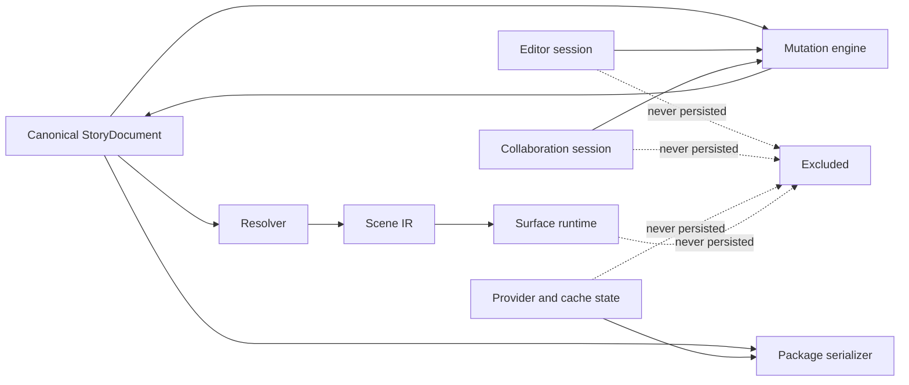
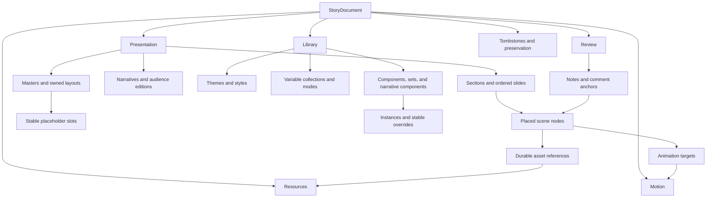
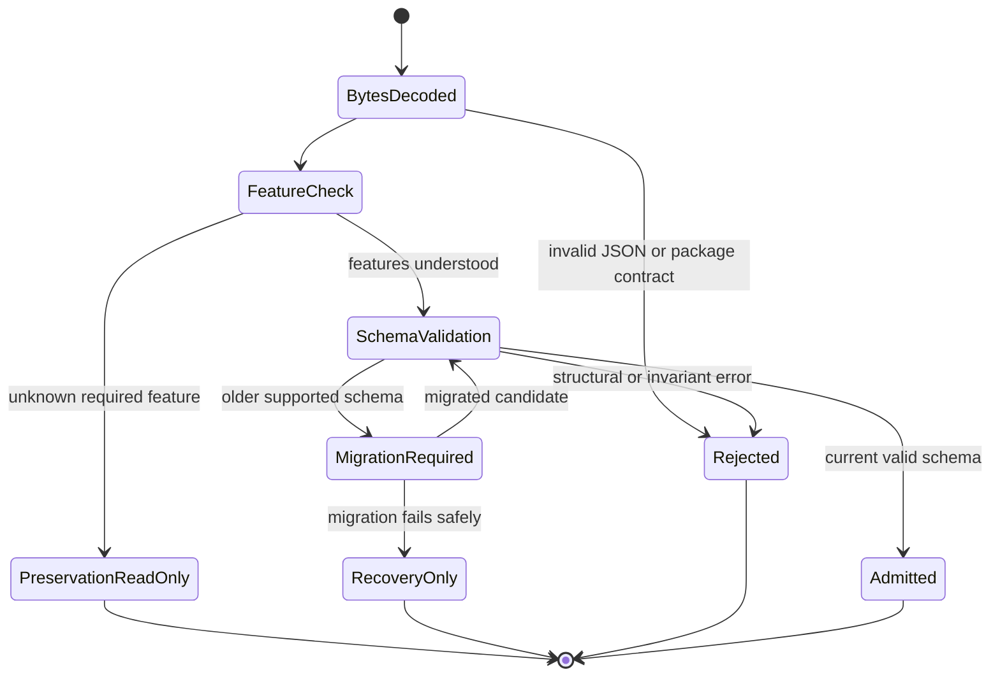
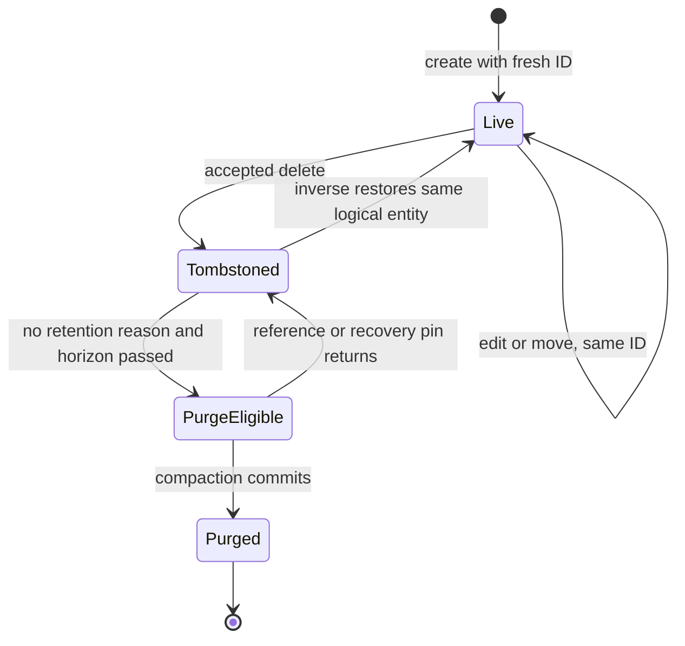
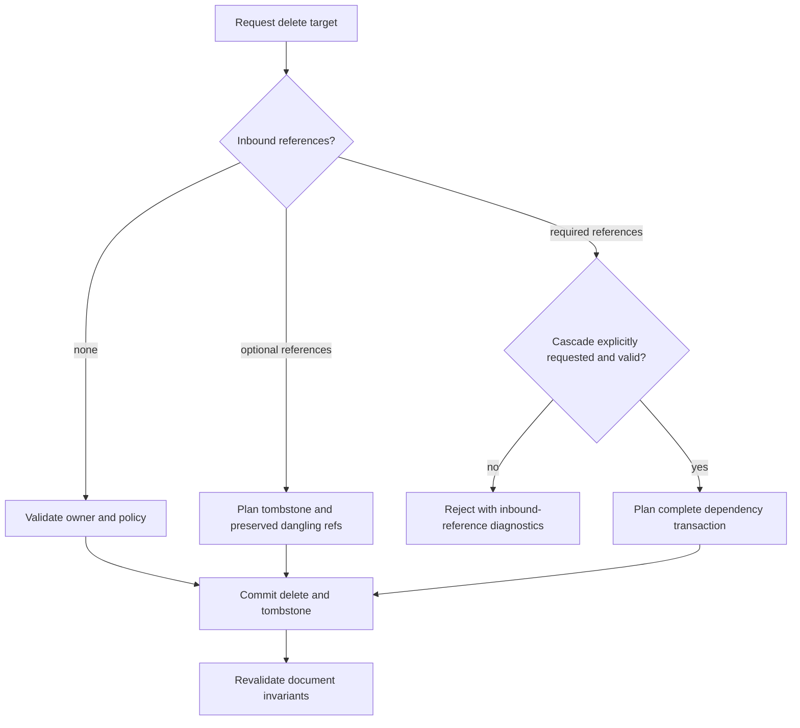
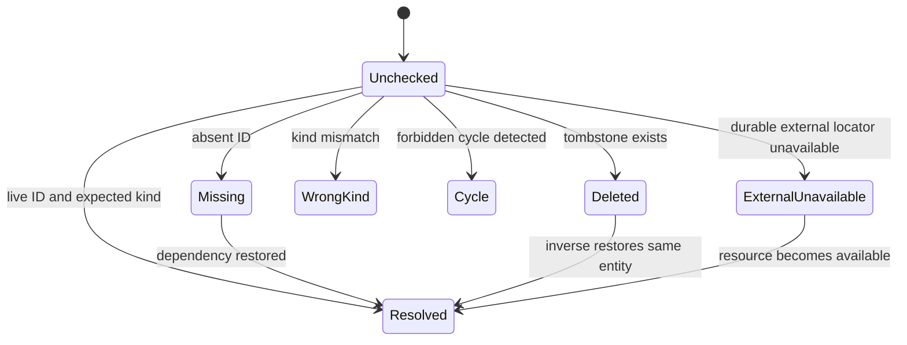
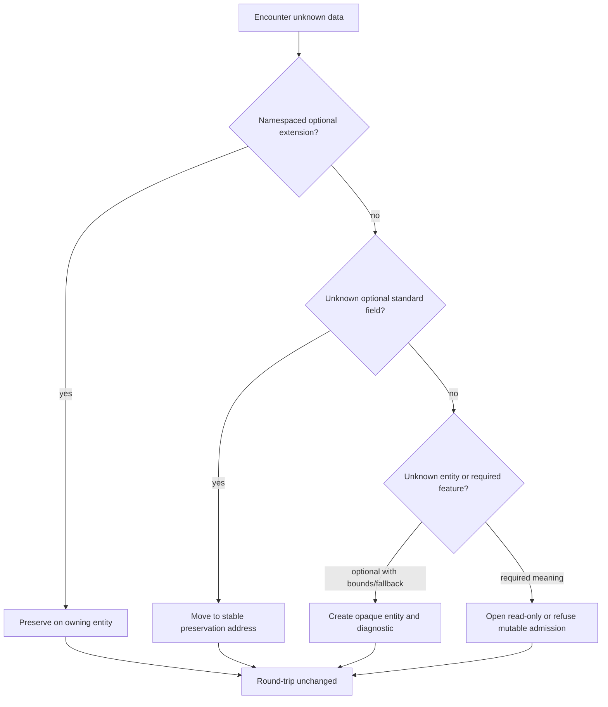
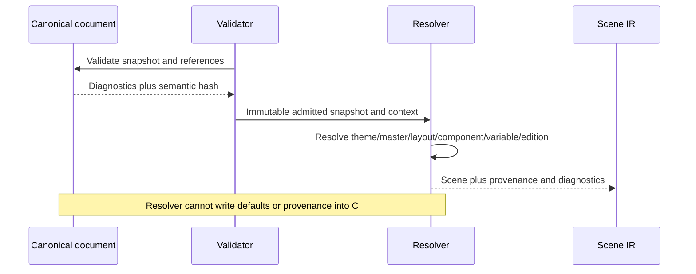

# Volume 03: Canonical Document Model

> **Specification ID:** `STORY-SPEC-03`  
> **Volume:** 03 (16 volumes total, 00-15)  
> **Status:** Normative draft  
> **Version:** 2.0.0-draft  
> **Owner:** Document Architecture  
> **Approvers:** Product, Design, Engineering, Quality, Accessibility, Security  
> **Last reviewed:** July 10, 2026  
> **Review cadence:** At every accepted document-schema change and at least once per release train  
> **Normative scope:** Canonical authored entities, identities, ordering, references, inheritance inputs, overrides, editions, narrative components, motion data, comments, deletion, migration, and semantic hashing  
> **Explicit non-ownership:** Mutation transport and undo algorithms, scene resolution and rendering, package bytes and durable publication, collaboration authority, implementation status, and release evidence  
> **Parent specification:** [Story Product Specification System](README.md)  
> **Governed by:** [Volume 00 - Governance and Traceability](00-governance-and-traceability.md)  
> **Supersedes:** Conflicting canonical-document claims in active core, shape, slide, theme, and storage specifications where this volume is more precise

## 1. Purpose and Authority

This volume defines the authored meaning of a Story presentation. It owns the canonical persisted document root, entity taxonomy, identity, order, references, inheritance inputs, overrides, forward-compatible preservation, deletion, migration, and semantic canonicalization. It does not define how mutations are transported, how a resolved scene is rendered, how package bytes are committed, or how replicas converge.

The key words **MUST**, **MUST NOT**, **SHOULD**, **SHOULD NOT**, and **MAY** are normative.

### 1.1 Normative boundary

| This volume owns | Owned elsewhere |
|---|---|
| Authored entities and property meaning | Transactions, operation replay, undo, and rejection: [Volume 04](04-mutation-history-and-determinism.md) |
| Persisted inheritance inputs and override records | Resolution precedence and scene production: [Volume 05](05-resolution-scene-and-rendering.md) |
| Asset descriptors and durable asset references | Package layout, asset bytes, saves, autosave, and recovery: [Volume 06](06-files-assets-and-recovery.md) |
| Comment content and anchors | Identity, permissions, notifications, and concurrent comment policy: Volume 07 |
| Animation authoring data | Playback clocks, show control, and runtime recovery: Volume 10 |
| Semantic canonical form | Quality thresholds and release evidence: Volumes 14 and 15 |

### 1.2 Adopted inputs and compatibility sources

This volume adopts terminology and compatible semantics from the [product glossary](../glossary.md), [core data structures](../../specs/core/data-structures.md), [shape data model](../../specs/shapes/02-data-model-and-serialization.md), [shape coordinate systems](../../specs/shapes/03-coordinate-systems.md), [slide architecture](../../specs/slides/01-architecture.md), [slide notes](../../specs/slides/05-slide-notes.md), and [linked properties](../../specs/slides/themes/linked-properties-system.md). Where they conflict, this volume is the forward contract.

The state shapes accepted by [Store](../../../src/core/Store.js), [InitialState](../../../src/core/store/InitialState.js), [ShapeSchema](../../../src/core/shapes/ShapeSchema.js), [PresentationSerializer](../../../src/core/storage/serialization/PresentationSerializer.js), and [PresentationDeserializer](../../../src/core/storage/serialization/PresentationDeserializer.js) are migration inputs, not alternate canonical schemas.

### 1.3 Design principles

1. Authored meaning is independent of UI, renderer, provider, and process lifetime.
2. Identity is stable; array position, object address, name, and render order are not identity.
3. Source data remains editable; derived geometry, resolved styles, and caches are reproducible outputs.
4. Missing, empty, inherited, explicitly cleared, invalid, and unknown are distinct states.
5. A reader either preserves meaning or reports why it cannot; it never silently guesses or discards.
6. Canonicalization is deterministic and does not depend on locale, wall clock, object insertion order, or device.

## 2. Atomic Requirements

Each requirement has one primary normative outcome and one immutable parent-capability link.

| ID | Requirement | Parent capability | Acceptance |
|---|---|---|---|
| `REQ-03-001` | A Story presentation **MUST** have exactly one valid `StoryDocument` root conforming to `SCH-03-001`. | [ARC-002](../product-spec.md#71-canonical-document-model) | `AC-03-001` |
| `REQ-03-002` | Persisted authored state **MUST** exclude editor, identity, presence, provider, cache, decoded-resource, and playback state. | [ARC-001](../product-spec.md#71-canonical-document-model) | `AC-03-002` |
| `REQ-03-003` | Every independently addressable authored entity and sub-entity **MUST** have a stable document-wide identifier governed by `SCH-03-002`. | [ARC-002](../product-spec.md#71-canonical-document-model) | `AC-03-003` |
| `REQ-03-004` | Every semantically ordered collection **MUST** use the identity-preserving collection contract in `SCH-03-003`. | [ARC-002](../product-spec.md#71-canonical-document-model) | `AC-03-004` |
| `REQ-03-005` | Every persisted spatial, angular, temporal, scalar, and color value **MUST** use the units and coordinate conventions in `SCH-03-004`. | [DES-023](../product-spec.md#53-vector-and-shape-authoring) | `AC-03-005` |
| `REQ-03-006` | Every cross-entity relationship **MUST** use a typed reference and the dangling-reference behavior in `SCH-03-005`. | [ARC-002](../product-spec.md#71-canonical-document-model) | `AC-03-006` |
| `REQ-03-007` | Readers and writers **MUST** preserve unknown compatible fields and opaque entities according to `SCH-03-006`. | [ARC-030](../product-spec.md#74-storage-and-recovery) | `AC-03-007` |
| `REQ-03-008` | Each optional property **MUST** distinguish omission, empty value, explicit clear, invalid value, and unresolved reference as specified by its schema. | [ARC-002](../product-spec.md#71-canonical-document-model) | `AC-03-008` |
| `REQ-03-009` | Document metadata and page setup **MUST** conform to `SCH-03-007` without making display names or timestamps part of identity. | [PRE-003](../product-spec.md#61-slide-and-deck-organization) | `AC-03-009` |
| `REQ-03-010` | Slides, sections, and custom shows **MUST** retain stable membership and independent semantic order. | [PRE-001](../product-spec.md#61-slide-and-deck-organization) | `AC-03-010` |
| `REQ-03-011` | Slide masters, layouts, and placeholders **MUST** use explicit ownership and inheritance references conforming to `SCH-03-008`. | [PRE-010](../product-spec.md#62-masters-layouts-themes-and-templates) | `AC-03-011` |
| `REQ-03-012` | Presentation themes and reusable styles **MUST** store authored tokens separately from app-theme or resolved paint values. | [PRE-012](../product-spec.md#62-masters-layouts-themes-and-templates) | `AC-03-012` |
| `REQ-03-013` | Variables, collections, modes, aliases, and bindings **MUST** conform to the typed acyclic contract in `SCH-03-009`. | [DES-053](../product-spec.md#56-components-styles-and-variables) | `AC-03-013` |
| `REQ-03-014` | Component definitions, component sets, variants, and component properties **MUST** conform to `SCH-03-010`. | [DES-050](../product-spec.md#56-components-styles-and-variables) | `AC-03-014` |
| `REQ-03-015` | Component instances and inherited slide content **MUST** express local differences as stable override records conforming to `SCH-03-011`. | [DES-051](../product-spec.md#56-components-styles-and-variables) | `AC-03-015` |
| `REQ-03-016` | Reusable narrative components **MUST** preserve semantic roles, slots, states, and source identity independently of their visual realization. | [DES-054](../product-spec.md#56-components-styles-and-variables) | `AC-03-016` |
| `REQ-03-017` | Audience editions **MUST** express inclusion, ordering, content substitution, and variable-mode choices as non-destructive deltas from a base narrative. | [PRE-001](../product-spec.md#61-slide-and-deck-organization) | `AC-03-017` |
| `REQ-03-018` | Every placed element **MUST** use one base node contract plus exactly one registered element payload kind. | [DES-020](../product-spec.md#53-vector-and-shape-authoring) | `AC-03-018` |
| `REQ-03-019` | Ordered fills, strokes, effects, paths, points, segments, operands, cells, series, animation steps, and other editable sub-items **MUST** retain sub-identities across reorder and value edits. | [DES-023](../product-spec.md#53-vector-and-shape-authoring) | `AC-03-019` |
| `REQ-03-020` | Rich text **MUST** persist content, paragraph structure, character spans, list identity, language, direction, and bindings without relying on renderer markup. | [DES-033](../product-spec.md#54-text-and-typography) | `AC-03-020` |
| `REQ-03-021` | Tables, charts, diagrams, and linked data objects **MUST** preserve structured source data and stable row, cell, series, node, and relationship identities. | [PRE-020](../product-spec.md#63-presentation-content-primitives) | `AC-03-021` |
| `REQ-03-022` | Media-bearing content **MUST** reference asset descriptors by durable asset identity rather than object URL, cache key, provider URL, or decoded bytes. | [DES-062](../product-spec.md#57-paint-effects-and-media) | `AC-03-022` |
| `REQ-03-023` | Object animation **MUST** persist stable targets, triggers, timing, effect parameters, and deterministic sequence membership using `SCH-03-012`. | [PRE-033](../product-spec.md#64-transitions-and-object-animation) | `AC-03-023` |
| `REQ-03-024` | Slide transitions **MUST** persist authored transition intent separately from runtime readiness, frame, or clock state. | [PRE-030](../product-spec.md#64-transitions-and-object-animation) | `AC-03-024` |
| `REQ-03-025` | Speaker notes and comment threads **MUST** persist as structured authored content with stable anchors and lifecycle state. | [PRE-060](../product-spec.md#67-review-and-collaboration) | `AC-03-025` |
| `REQ-03-026` | Reading order, alternative descriptions, decorative state, language, captions, and table-header semantics **MUST** be first-class authored properties where applicable. | [PRE-071](../product-spec.md#68-import-export-print-and-compatibility) | `AC-03-026` |
| `REQ-03-027` | Deletion **MUST** produce an addressable tombstone whenever history, collaboration, recovery, interchange, or an extant reference can still require the deleted identity. | [ARC-002](../product-spec.md#71-canonical-document-model) | `AC-03-027` |
| `REQ-03-028` | Schema validation **MUST** return deterministic, addressable diagnostics without partially mutating the candidate document. | [ARC-002](../product-spec.md#71-canonical-document-model) | `AC-03-028` |
| `REQ-03-029` | Every schema migration **MUST** be deterministic, idempotent, version-gated, diagnosable, and preservation-safe. | [ARC-030](../product-spec.md#74-storage-and-recovery) | `AC-03-029` |
| `REQ-03-030` | Semantically equivalent documents **MUST** produce the same canonical semantic hash under `SCH-03-015`. | [ARC-030](../product-spec.md#74-storage-and-recovery) | `AC-03-030` |
| `REQ-03-031` | Copy, paste, duplicate, import, and template instantiation **MUST** remap owned identities while preserving declared external and shared references. | [DES-071](../product-spec.md#58-layers-clipboard-and-interoperability) | `AC-03-031` |
| `REQ-03-032` | Derived resolution, layout, tessellation, thumbnail, search, decode, and render-cache data **MUST NOT** be authoritative fields in the canonical document. | [ARC-003](../product-spec.md#71-canonical-document-model) | `AC-03-032` |

### 2.1 Applicability profiles

These profiles are part of every requirement in the stated range and identify its surfaces and lifecycle boundaries.

| Requirement range | Applies to surfaces | Lifecycle boundaries |
|---|---|---|
| `REQ-03-001` through `REQ-03-009` | Every canonical-document producer and consumer, including editor, import, collaboration, native file, resolver, and output preflight | Create, admit, validate, edit, duplicate, serialize, reopen, migrate, and reject |
| `REQ-03-010` through `REQ-03-017` | Navigator, master/layout/theme/library authoring, component authoring, edition authoring, resolver, and every resolved output surface | Create, reorder, inherit, override, detach, update, collaborate, save/reopen, and resolve |
| `REQ-03-018` through `REQ-03-026` | Canvas, text/data/media/motion/review authoring, accessibility tooling, resolver, audience, presenter, export, print, and recording | Author, target, reorder, animate, comment, undo/redo, collaborate, save/reopen, resolve, and output |
| `REQ-03-027` through `REQ-03-032` | Mutation, migration, validation, collaboration, package, recovery, compaction, and evidence systems | Delete, restore, copy/remap, validate, migrate, hash, compact, recover, and round-trip |

## 3. Persisted and Runtime State Boundary

### `INV-03-001` Authored-state closure

Every value reachable from `StoryDocument` is JSON-safe authored data, a typed durable reference, or a preservation envelope. Functions, promises, DOM nodes, object URLs, file handles, access tokens, provider SDK objects, decoded media, and cyclic object references are forbidden.

### `INV-03-002` Runtime exclusion

The following are never canonical authored fields:

- active slide, active master, selection, deep-edit stack, caret, hover, focus, tool, panel, viewport, pan, zoom, pointer, drag, and transient preview;
- authentication identity, authorization token, sharing session, presence, cursor, and network connection;
- current provider, file handle, upload session, ETag cache, write lock, and cross-tab lease;
- presentation position, build cursor, elapsed time, laser, ink-in-progress, black/white screen, presenter window, and fullscreen state;
- object URLs, decoded images, media elements, font faces, render nodes, text measurements, tessellation, hit regions, thumbnails, and memoized resolution.

Authored rehearsal timings, recorded ink, saved captions, and intentional presentation setup remain document data because they are user-created content, not transient playback state.



## 4. Canonical Root and Common Types

### `SCH-03-001` StoryDocument root

The following TypeScript-like notation is conceptual and normative. `Record<K,V>` is a JSON object keyed by a canonical string ID. `Ordered<T>` is defined by `SCH-03-003`.

```ts
type StoryDocument = {
  kind: "story.document";
  schema: {
    version: SemVer;
    minimumReaderVersion: SemVer;
    requiredFeatures: FeatureId[];
    optionalFeatures: FeatureId[];
  };
  documentId: DocumentId;
  metadata: DocumentMetadata;
  pageSetup: PageSetup;

  presentation: {
    sections: Ordered<Section>;
    slides: Ordered<Slide>;
    masters: Ordered<SlideMaster>;
    layouts: Record<LayoutId, SlideLayout>;
    customShows: Ordered<CustomShow>;
    narratives: Ordered<Narrative>;
    editions: Ordered<Edition>;
    defaultNarrativeId: NarrativeId | null;
    defaultEditionId: EditionId | null;
  };

  library: {
    themes: Ordered<PresentationTheme>;
    styles: Ordered<ReusableStyle>;
    variableCollections: Ordered<VariableCollection>;
    componentSets: Ordered<ComponentSet>;
    components: Ordered<ComponentDefinition>;
    narrativeComponents: Ordered<NarrativeComponent>;
  };

  resources: {
    assets: Record<AssetId, AssetDescriptor>;
    dataSources: Record<DataSourceId, DataSourceDescriptor>;
  };

  motion: {
    timelines: Record<TimelineId, AnimationTimeline>;
    transitions: Record<TransitionId, SlideTransition>;
  };

  review: {
    notesBySlideId: Record<SlideId, NotesDocument>;
    commentThreads: Record<CommentThreadId, CommentThread>;
  };

  tombstones: Record<EntityId, Tombstone>;
  preservation: PreservationEnvelope;
  extensions: ExtensionMap;
};
```

Root collections are present even when empty. There is no second `deck`, `presentation`, `store`, or `state` root. Package revision, provider, and save metadata are outside this root.



### `SCH-03-002` Identity contract

```ts
type EntityId = string;       // lowercase UUIDv7 text
type SubEntityId = string;    // lowercase UUIDv7 text
type OrderEntryId = string;   // lowercase UUIDv7 text
type AssetId = `sha256:${LowerHex64}`;
type FeatureId = `${ReverseDnsName}/${FeatureName}`;

type EntityBase<K extends string, I extends string = EntityId> = {
  id: I;
  kind: K;
  schemaVersion: PositiveInteger;
  name?: string;
  provenance?: {
    importedFrom?: string;
    externalStableId?: string;
  };
  extensions: ExtensionMap;
};
```

Identity rules:

1. Entity, sub-entity, and order-entry IDs are unique across the whole document, including tombstones.
2. IDs are opaque and case-sensitive after canonical lowercase validation.
3. Names, indexes, paths, hashes, source IDs, timestamps, and array positions are not entity IDs.
4. An entity keeps its ID through edits, moves, reparenting, resolution, save/open, and schema migration.
5. Duplicate, paste, import, detach, or instantiate creates new owned IDs and records provenance only when useful.
6. Asset identity is content-addressed; two different byte sequences cannot intentionally share an `AssetId`.
7. A deleted ID is never reused for a different logical entity.

### `SCH-03-003` Identity-preserving ordered collection

```ts
type Ordered<T extends EntityBase<string>> = {
  byId: Record<EntityId, T>;
  entriesById: Record<OrderEntryId, {
    id: OrderEntryId;
    valueId: EntityId;
  }>;
  order: OrderEntryId[];
};

type OrderedReferenceList<I extends EntityId> = {
  entriesById: Record<OrderEntryId, {
    id: OrderEntryId;
    valueId: I;
  }>;
  order: OrderEntryId[];
};
```

`order` is authoritative semantic order. An `OrderEntryId` survives moves so history and collaboration can address a move independently from the entity. `OrderedReferenceList` supplies the same stable order-entry semantics for entities owned by another collection. Unless a collection explicitly permits aliases, `valueId` appears exactly once. Map serialization order has no meaning.

### `INV-03-003` Ordered-collection closure

Each order ID resolves to one entry, each entry resolves to one live value, and each live value has the permitted number of entries. A missing map with a present order is invalid; an empty collection is `{ "byId": {}, "entriesById": {}, "order": [] }`.

### `SCH-03-004` Units, coordinates, transforms, and numeric values

| Domain | Canonical representation |
|---|---|
| Geometry | finite decimal Story design units (`du`), where `144 du = 1 inch` and `2 du = 1 typographic point` |
| Default widescreen page | `1920 du x 1080 du`, equivalent to $13\frac{1}{3}$ inches by $7.5$ inches |
| Origin and axes | top-left origin; positive x right; positive y down |
| Angle | finite decimal degrees, positive clockwise |
| Time | non-negative integer milliseconds |
| Opacity and normalized ratios | finite decimal in `[0,1]` |
| Scale | finite non-zero decimal; negative scale represents reflection only where allowed |
| Color | tagged color value with explicit color space and alpha; never an untagged renderer string |
| Matrix | six finite decimals `[a,b,c,d,e,f]` using column-vector affine semantics |

```ts
type Frame = { x: DU; y: DU; width: NonNegativeDU; height: NonNegativeDU };
type Transform2D = {
  rotationDeg: number;
  skewXDeg: number;
  skewYDeg: number;
  scaleX: number;
  scaleY: number;
  origin: { xRatio: number; yRatio: number }; // each normally in [0,1]
};
```

Node-local geometry starts at `(0,0)` inside `frame.width x frame.height`. The local-to-parent transform order is:

$$
M = T(x,y)\,T(o_x,o_y)\,R(\theta)\,K_x\,K_y\,S(s_x,s_y)\,T(-o_x,-o_y)
$$

where $o_x = width \cdot xRatio$ and $o_y = height \cdot yRatio$. Children store coordinates in their immediate parent space. Snapped positions replace authored values only on commit; snap candidates and screen pixels are runtime data. `NaN`, infinities, negative zero, locale-formatted numbers, and numeric strings are invalid.

### `SCH-03-005` Typed references

```ts
type Ref<K extends string, I extends string = EntityId> = {
  kind: K;
  id: I;
  expectedRevisionHash?: SemanticHash;
};

type ReferenceStatus =
  | { state: "resolved"; targetId: EntityId }
  | { state: "missing"; targetId: EntityId }
  | { state: "deleted"; targetId: EntityId; tombstoneId: EntityId }
  | { state: "wrong-kind"; targetId: EntityId; actualKind: string }
  | { state: "cycle"; targetId: EntityId; cycle: EntityId[] }
  | { state: "unavailable-external"; locator: string };
```

`kind` names an exact registered kind or registered super-kind accepted by the field. `I` permits non-UUID durable identities such as content-addressed assets without weakening target-kind checks. References never contain a pointer to an in-memory object. Required references failing to resolve invalidate the owning semantic feature. Optional references failing to resolve remain preserved and produce diagnostics plus the feature-specific fallback from Volume 05. A tombstone is not a live target.

### `INV-03-004` Reference-kind safety

A reference resolves only when the target ID exists, is live, and has a kind allowed by the referring field. Coercing a wrong-kind target is forbidden.

## 5. Absence, Empty, Error, Conflict, and Unknown Data

### `INV-03-005` No overloaded null

`null` is legal only where the schema names its meaning. It commonly means "no selection" for a nullable root default or "no parent" for a root relationship. Inheritance and explicit clearing use tagged values, not ambiguous null.

```ts
type CascadeValue<T> =
  | { state: "inherit" }
  | { state: "value"; value: T }
  | { state: "clear" };
```

| Input state | Meaning | Validator/resolver behavior |
|---|---|---|
| Property omitted and optional | Producer did not author it | Use schema default or preserve absence as specified |
| `state: "inherit"` | Ask next source in the cascade | Continue resolution |
| `state: "clear"` | Explicitly suppress inherited value | Resolve to property-defined empty/none |
| Empty string/list/map | Authored empty value | Keep empty; never reinterpret as missing |
| `null` where not declared | Schema error | Reject candidate; do not default silently |
| Missing required property | Schema error | Reject candidate with exact address |
| Dangling reference | Preserved broken relationship | Diagnostic and declared fallback/read-only behavior |
| Concurrent incompatible values | Operation-layer conflict | Do not encode both values into a normal property |
| Unknown compatible value | Forward-compatible data | Preserve and round-trip |
| Unknown required feature | Meaning cannot be guaranteed | Open preservation-safe read-only or refuse with diagnostics |

### `SCH-03-006` Unknown fields, extensions, and opaque entities

```ts
type ExtensionMap = Record<`${ReverseDnsName}/${string}`, JsonValue>;

type PreservationEnvelope = {
  unknownFields: Array<{
    address: StableAddress;
    value: JsonValue;
    declaredByFeature?: FeatureId;
  }>;
  opaqueEntities: Record<EntityId, {
    id: EntityId;
    kind: string;
    rawCanonicalJson: JsonObject;
    declaredBounds?: Frame;
    previewAssetId?: AssetId;
    requiredFeature?: FeatureId;
  }>;
};
```

Known fields are emitted in the current schema location. Unknown namespaced extensions remain on their owning entity. Unknown standard fields remain in the preservation envelope at a stable address. A writer may move a now-known field out of preservation only through a declared migration. Editing a known sibling does not alter opaque bytes after canonical JSON normalization.

### `SM-03-001` Document admission



## 6. Metadata, Page Setup, and Presentation Organization

### `SCH-03-007` Metadata and page setup

```ts
type DocumentMetadata = {
  title: string;
  description: string;
  language: Bcp47Tag;
  tags: string[];
  createdAt: IsoUtcInstant;
  modifiedAt: IsoUtcInstant;
  contributors: Array<{ displayName: string; identityHint?: string }>;
  accessibilityTitle?: string;
};

type PageSetup = {
  width: PositiveDU;
  height: PositiveDU;
  orientation: "landscape" | "portrait";
  numbering: { startAt: integer; show: boolean };
  dateTime: CascadeValue<{ mode: "fixed" | "updated"; value?: string }>;
  header: CascadeValue<RichTextId>;
  footer: CascadeValue<RichTextId>;
};
```

`createdAt` is stable after creation. `modifiedAt` is informational package/document metadata and is excluded from the semantic hash. Orientation must agree with dimensions. Changing page size does not implicitly rewrite node coordinates; resize policy is an explicit transaction.

```ts
type Section = EntityBase<"story.section"> & {
  slideIds: OrderedReferenceList<SlideId>;
  collapsedByDefault: boolean;
};

type Slide = EntityBase<"story.slide"> & {
  layoutRef: Ref<"story.layout">;
  frameOverride?: { width: PositiveDU; height: PositiveDU };
  nodes: Ordered<SceneNode>;
  background: CascadeValue<PaintStack>;
  overrides: Ordered<OverrideRecord>;
  transitionRef: Ref<"story.transition"> | null;
  timelineRef: Ref<"story.animation-timeline"> | null;
  hidden: boolean;
  readingOrder: OrderEntryId[];
};

type CustomShow = EntityBase<"story.custom-show"> & {
  slideRefs: OrderedReferenceList<SlideId>;
};
```

Sections partition the base slide sequence: every base slide belongs to exactly one section, and concatenating section membership in section order equals the root slide order. Custom shows and narratives may reference a slide more than once only when their schema explicitly permits repeated playback.

### `INV-03-006` Organization consistency

No slide is duplicated or omitted by the section partition, hidden slides remain in base order, and custom shows never change base ownership.

## 7. Masters, Layouts, Themes, Styles, and Variables

### `SCH-03-008` Master, layout, and placeholder ownership

```ts
type SlideMaster = EntityBase<"story.master"> & {
  themeRef: Ref<"story.theme">;
  layoutIds: OrderedReferenceList<LayoutId>;
  nodes: Ordered<SceneNode>;
  background: CascadeValue<PaintStack>;
  guides: Ordered<Guide>;
};

type SlideLayout = EntityBase<"story.layout"> & {
  ownerMasterRef: Ref<"story.master">;
  nodes: Ordered<SceneNode>;
  background: CascadeValue<PaintStack>;
  placeholders: Ordered<PlaceholderContract>;
  guides: Ordered<Guide>;
};

type PlaceholderContract = EntityBase<"story.placeholder"> & {
  role: "title" | "subtitle" | "body" | "picture" | "media" |
        "chart" | "table" | "diagram" | "content" | "date" |
        "footer" | "slide-number";
  slotId: SubEntityId;
  frame: Frame;
  accepts: ElementKind[];
  defaultContentRef?: Ref<"story.node">;
  accessibility: AccessibilityMetadata;
};
```

A layout belongs to exactly one master and appears exactly once in that master's ordered `layoutIds`. A slide references exactly one layout. A placeholder `slotId` is the inheritance identity across master/layout/slide content; an optional default content reference resolves to a node owned by the same layout. A placed override does not borrow the source node's entity ID. Detach creates an independent node and records the former slot as provenance. Restore creates an override for the current compatible slot through an explicit transaction.

### `INV-03-007` Acyclic presentation inheritance

The only presentation inheritance chain is `theme -> master -> layout -> slide -> edition`. Masters do not inherit from layouts, layouts do not own masters, and no chain may cycle.

```ts
type PresentationTheme = EntityBase<"story.theme"> & {
  colorTokens: Record<TokenId, ColorValue>;
  fontTokens: Record<TokenId, FontDescriptor>;
  effectTokens: Record<TokenId, EffectValue>;
  spacingTokens: Record<TokenId, DU>;
  background: CascadeValue<PaintStack>;
};

type ReusableStyle = EntityBase<"story.style"> & {
  styleKind: "color" | "text" | "effect" | "grid" | "spacing";
  value: JsonObject;
  variableBindings: PropertyBinding[];
};
```

Presentation themes are authored content. App light/dark mode, accent color, UI density, and panel typography are forbidden theme fields.

### `SCH-03-009` Variables and bindings

```ts
type VariableType = "boolean" | "number" | "string" | "color" | "dimension";

type VariableCollection = EntityBase<"story.variable-collection"> & {
  modes: Ordered<VariableMode>;
  variables: Ordered<Variable>;
  defaultModeId: VariableModeId;
};

type Variable = EntityBase<"story.variable"> & {
  valueType: VariableType;
  valuesByModeId: Record<VariableModeId, VariableValue>;
};

type VariableValue =
  | { kind: "literal"; value: boolean | number | string | ColorValue }
  | { kind: "alias"; variableRef: Ref<"story.variable"> };

type PropertyBinding = {
  id: SubEntityId;
  address: StableAddress;
  variableRef: Ref<"story.variable">;
  fallback: JsonValue;
};
```

Alias graphs must be acyclic for every active mode. Type mismatches are validation errors. A missing alias does not erase the authored fallback. Modes are selected by theme, component state, edition, or explicit runtime input according to Volume 05; the selected mode itself is not duplicated into resolved values.

### `INV-03-008` Binding source preservation

Resolving a binding never replaces its variable reference or fallback in the document.

## 8. Components, Instances, Narrative Components, and Editions

### `SCH-03-010` Component definitions and variants

```ts
type ComponentDefinition = EntityBase<"story.component"> & {
  componentSetRef: Ref<"story.component-set"> | null;
  variantValues: Record<VariantAxisId, VariantOptionId>;
  properties: Ordered<ComponentPropertyDefinition>;
  rootNodes: Ordered<SceneNode>;
  exposedNestedAddresses: StableAddress[];
};

type ComponentSet = EntityBase<"story.component-set"> & {
  axes: Ordered<VariantAxis>;
  componentRefs: OrderedReferenceList<ComponentId>;
  defaultComponentRef: Ref<"story.component">;
};

type ComponentPropertyDefinition = EntityBase<"story.component-property"> & {
  propertyType: "text" | "boolean" | "instance-swap" | "variant" | "number";
  defaultValue: JsonValue;
  targetAddresses: StableAddress[];
};
```

Variant tuples are unique within a component set. Nested component references form an acyclic expansion graph unless an explicit bounded-recursion feature is introduced by a future required feature flag.

### `SCH-03-011` Stable override addresses

Raw array indexes and renderer paths are forbidden override addresses.

```ts
type StableAddress = {
  ownerId: EntityId;
  lineage: Array<{
    relation: "node" | "slot" | "instance" | "sub-entity" | "cell" |
              "series" | "text-marker" | "animation-step" | "comment-anchor";
    id: EntityId | SubEntityId;
  }>;
  property: string[]; // registered schema property tokens, never numeric indexes
};

type OverrideRecord = EntityBase<"story.override"> & {
  sourceRef: Ref<string>;
  address: StableAddress;
  action: "set" | "clear" | "hide" | "swap" | "detach";
  value?: JsonValue;
  sourceSemanticHash?: SemanticHash;
};

type ComponentInstanceNode = SceneNodeBase<"story.node.component-instance"> & {
  componentRef: Ref<"story.component">;
  selectedVariant: Record<VariantAxisId, VariantOptionId>;
  propertyValues: Record<ComponentPropertyId, JsonValue>;
  overrides: Ordered<OverrideRecord>;
};
```

`set` requires a value. `clear`, `hide`, and `detach` forbid a value. `swap` requires a typed replacement reference. An unresolved address remains preserved and is reported as orphaned; it is never retargeted by name or nearest index.

### `INV-03-009` Override locality

An override changes only its addressed property or relationship. It cannot mutate the source master, layout, component, theme, variable, or narrative component.

### `INV-03-010` Override survival

Source edits preserve valid override records. If the addressed source disappears, the override becomes orphaned and diagnosable. If the source later returns with the same identity and compatible kind, resolution may reactivate the override.

### Narrative model

```ts
type Narrative = EntityBase<"story.narrative"> & {
  items: Ordered<NarrativeItem>;
};

type NarrativeItem = EntityBase<"story.narrative-item"> & {
  role: "opening" | "context" | "evidence" | "comparison" | "decision" |
        "action" | "appendix" | "custom";
  source: Ref<"story.slide"> | Ref<"story.narrative-component">;
  semanticLabel?: string;
};

type NarrativeComponent = EntityBase<"story.narrative-component"> & {
  role: NarrativeItem["role"];
  slots: Ordered<NarrativeSlot>;
  states: Ordered<NarrativeState>;
  visualComponentRef: Ref<"story.component"> | null;
  accessibilityContract: AccessibilityMetadata;
};

type Edition = EntityBase<"story.edition"> & {
  baseNarrativeRef: Ref<"story.narrative">;
  audience: { label: string; locale?: Bcp47Tag; tags: string[] };
  itemDirectives: Ordered<EditionDirective>;
  variableModes: Record<VariableCollectionId, VariableModeId>;
};

type EditionDirective = EntityBase<"story.edition-directive"> & {
  targetItemRef: Ref<"story.narrative-item">;
  action: "include" | "exclude" | "move-after" | "substitute" | "override";
  afterItemRef?: Ref<"story.narrative-item"> | null;
  substituteRef?: Ref<"story.slide"> | Ref<"story.narrative-component">;
  overrides?: Ordered<OverrideRecord>;
};
```

### `INV-03-011` Edition non-destruction

An edition leaves its base narrative unchanged. Edition directives are applied in persisted directive order. Contradictory directives for the same target and property are invalid unless a future schema explicitly defines composition.

## 9. Elements and Structured Content

### Base node contract

```ts
type SceneNodeBase<K extends string> = EntityBase<K> & {
  parentRef: Ref<"story.node.group"> | Ref<"story.node.frame"> | null;
  frame: Frame;
  transform: Transform2D;
  visible: boolean;
  locked: boolean;
  opacity: number;
  blendMode: BlendMode;
  fills: Ordered<FillLayer>;
  strokes: Ordered<StrokeLayer>;
  effects: Ordered<EffectLayer>;
  clipsContent: boolean;
  accessibility: AccessibilityMetadata;
};

type SceneNode =
  | ShapeNode | VectorNode | TextNode | ImageNode | VideoNode | AudioNode
  | GroupNode | FrameNode | BooleanNode | MaskNode | SvgNode | CodeVisualNode
  | TableNode | ChartNode | DiagramNode | EquationNode | ComponentInstanceNode
  | OpaqueNode;
```

Exactly one discriminated payload kind is legal. A rectangle is a shape node with `shapeKind: "rectangle"`, not a second top-level `rect` entity kind. Booleans and masks reference stable child/operand IDs and remain non-destructive. Groups own hierarchy without imposing layout; layout frames declare layout behavior explicitly.

### `INV-03-012` One parent and one owner

Every live placed node has exactly one owning node collection and at most one parent. Parent and child relationships agree, form no cycle, and do not rely on DOM containment.

### `INV-03-013` Stable editable sub-items

Each fill, stroke, effect, vector path, point, segment, boolean operand, mask member, table row, table column, table cell, chart series, chart datum, diagram node, diagram edge, text paragraph, list item, animation step, and comment message has a stable sub-entity ID when independently editable or referenceable.

### Rich text

```ts
type RichTextDocument = EntityBase<"story.rich-text"> & {
  blocks: Ordered<TextBlock>;
  markers: Record<SubEntityId, TextMarker>;
};

type TextBlock = EntityBase<"story.text-block"> & {
  blockType: "paragraph" | "list-item";
  listRef?: Ref<"story.text-list">;
  listLevel?: NonNegativeInteger;
  language?: Bcp47Tag;
  direction: "auto" | "ltr" | "rtl";
  runs: Ordered<TextRun>;
  paragraphStyle: ParagraphStyle;
};

type TextRun = EntityBase<"story.text-run"> & {
  text: string; // Unicode scalar-value sequence, NFC normalized
  characterStyle: CharacterStyle;
  bindings: PropertyBinding[];
};

type TextMarker = {
  id: SubEntityId;
  blockId: EntityId;
  runId: EntityId;
  scalarOffset: NonNegativeInteger;
  affinity: "before" | "after";
  stickiness: "to-previous" | "to-next";
};
```

Persistent comment/range anchors use marker identity. Text operations deterministically move, split, or orphan markers as runs change; offsets count Unicode scalar values and must fall on a valid boundary. Renderer HTML, browser selection offsets, UTF-16 offsets as durable identity, and contenteditable markup are forbidden. Empty paragraphs are represented by an empty run sequence plus block identity; placeholder text is separate from authored text.

### Structured data

Tables use independent ordered row and column collections plus cells keyed by stable cell ID and row/column references. Merges identify a master cell and a rectangular covered-cell set; overlapping merges are invalid. Charts preserve a typed dataset, stable series and datum IDs, chart semantics, formatting, and accessible summary. Diagrams preserve semantic nodes and edges separately from generated layout. Conversion to shapes is a destructive explicit transaction that creates new IDs and retains provenance.

### `INV-03-014` Source before derived view

Chart paths, diagram coordinates generated by a layout algorithm, table paint fragments, equation glyph outlines, and code-visual pixels are derived unless the user explicitly converts or freezes them as authored content.

## 10. Assets, Motion, Notes, Comments, and Accessibility

### Asset descriptors

```ts
type AssetDescriptor = EntityBase<"story.asset", AssetId> & {
  id: AssetId;
  mediaType: string;
  byteLength: NonNegativeInteger;
  intrinsic?: { width?: number; height?: number; durationMs?: integer };
  storage: "embedded" | "linked" | "generated";
  sourceLocator?: { scheme: string; value: string };
  integrity: { algorithm: "sha256"; digest: LowerHex64 };
  rights?: { license?: string; attribution?: string };
  fallbackAssetId?: AssetId;
  extensions: ExtensionMap;
};
```

Asset descriptors are authored metadata. Embedded bytes, decoded variants, object URLs, download authorization, and cache residency belong to Volume 06/runtime. A linked asset must include a durable locator, integrity policy, and fallback behavior; an ephemeral signed URL is not a durable locator.

### `SCH-03-012` Animation and transition authoring

```ts
type AnimationTimeline = EntityBase<"story.animation-timeline"> & {
  slideRef: Ref<"story.slide">;
  steps: Ordered<AnimationStep>;
};

type AnimationStep = EntityBase<"story.animation-step"> & {
  target: StableAddress;
  effect: { family: "entrance" | "emphasis" | "exit" | "motion-path" |
                    "media" | "state-change"; type: string; params: JsonObject };
  trigger: { mode: "on-click" | "with-previous" | "after-previous" |
                   "on-target" | "on-media-cue"; target?: StableAddress };
  timing: { delayMs: integer; durationMs: integer; repeat: number | "until-next" };
  groupId?: SubEntityId;
};

type SlideTransition = EntityBase<"story.transition"> & {
  type: string;
  durationMs: NonNegativeInteger;
  advance: { mode: "manual" | "after" | "either"; afterMs?: integer };
  params: JsonObject;
  soundAssetRef?: Ref<"story.asset", AssetId>;
};
```

Step sequence and trigger graph must be deterministic and acyclic within a single automatic build chain. Runtime progress and decoded keyframes are excluded. Morph hints use stable node identity or explicit authored match keys; names alone are not identity.

### Notes and comments

```ts
type NotesDocument = EntityBase<"story.notes"> & {
  slideRef: Ref<"story.slide">;
  body: RichTextDocument;
  accessibility: AccessibilityMetadata;
};

type CommentThread = EntityBase<"story.comment-thread"> & {
  anchor: CommentAnchor;
  status: "open" | "resolved";
  messages: Ordered<CommentMessage>;
};

type CommentMessage = EntityBase<"story.comment-message"> & {
  author: { actorId: string; displayNameSnapshot?: string };
  createdAt: IsoUtcInstant;
  editedAt?: IsoUtcInstant;
  body: RichTextDocument;
  mentions: Array<{ actorId: string }>;
  deleted: boolean;
};

type TextPosition = { markerId: SubEntityId };

type CommentAnchor =
  | { kind: "slide"; slideRef: Ref<"story.slide">; point?: { x: DU; y: DU } }
  | { kind: "entity"; address: StableAddress }
  | { kind: "text-range"; richTextRef: Ref<"story.rich-text">;
      start: TextPosition; end: TextPosition };
```

Comment actor IDs are collaboration identities governed by Volume 07; display snapshots are non-authoritative labels. Text markers are stable authored sub-entities maintained by text operations. A comment text range is valid only when both marker IDs resolve in the referenced rich-text document and the ordered range is well formed. Permission and notification state are not document fields. Deleting an anchor does not delete its thread; the thread becomes orphaned with its original anchor preserved.

### Accessibility metadata

```ts
type AccessibilityMetadata = {
  label?: string;
  description?: string;
  decorative: boolean;
  language?: Bcp47Tag;
  readingOrderHint?: integer;
  captionsAssetRef?: Ref<"story.asset", AssetId>;
  tableHeaders?: { rowHeaderIds: SubEntityId[]; columnHeaderIds: SubEntityId[] };
};
```

`decorative: true` conflicts with a non-empty required accessible name. Slide `readingOrder` contains every visible non-decorative top-level semantic node exactly once, unless a node is explicitly excluded by its element contract.

### `INV-03-015` Durable asset reference

Every embedded asset reference resolves to a matching descriptor and content hash at package validation time. Missing linked assets remain distinguishable from corrupt embedded assets.

## 11. Deletion, Tombstones, Copying, and Identity Remapping

### `SCH-03-013` Tombstone

```ts
type Tombstone = {
  id: EntityId;
  formerKind: string;
  deletedByTransactionId: string;
  deletedAtLogicalTime: string;
  formerOwnerId?: EntityId;
  semanticHashBeforeDelete?: SemanticHash;
  retentionReasons: Array<"history" | "collaboration" | "reference" |
                          "recovery" | "interchange" | "unknown-feature">;
  minimalRecoveryPayload?: JsonObject;
};
```

Wall-clock time may be included for display but cannot decide merge or replay order. `minimalRecoveryPayload` is bounded to the data needed by the declared retention reason; full deleted content belongs in an operation inverse or retained revision when available.

### `SM-03-002` Entity lifecycle



Purge never makes the ID reusable. A late operation targeting a purged ID is rejected as `target-purged`, not redirected.

### `FLOW-03-001` Delete with references



### `SCH-03-014` Identity remap bundle

```ts
type IdentityRemap = {
  operation: "duplicate" | "paste" | "import" | "instantiate" | "detach";
  ownedIds: Record<EntityId, EntityId>;
  ownedSubIds: Record<SubEntityId, SubEntityId>;
  orderEntryIds: Record<OrderEntryId, OrderEntryId>;
  preservedSharedRefs: EntityId[];
  preservedExternalRefs: string[];
};
```

Owned descendants, sub-items, comment-free local animation targets, and order entries receive fresh IDs. References within the copied closure are rewritten through the remap. References to intentionally shared document library entities remain stable. References outside the document are preserved only when their contract is portable; otherwise import creates an explicit unresolved reference and diagnostic.

### `INV-03-016` Remap completeness

After remap, no copied entity may accidentally target an owned source ID, and no declared shared reference may be duplicated without an explicit deep-copy policy.

## 12. Validation and Diagnostics

Validation is pure: it returns a result and never repairs the candidate in place.

```ts
type ValidationResult = {
  valid: boolean;
  diagnostics: Diagnostic[];
  semanticHash?: SemanticHash;
};

type Diagnostic = {
  id: string;
  severity: "info" | "warning" | "error" | "fatal";
  code: string;
  address: StableAddress | { rootPath: string[] };
  entityId?: EntityId;
  relatedAddresses: Array<StableAddress | { rootPath: string[] }>;
  params: Record<string, JsonValue>;
  recoverability: "none" | "automatic-migration" | "user-decision" | "read-only";
};
```

Diagnostic prose is presentation-layer output; `code` and `params` are stable and localizable. Validation order is deterministic: root/schema, IDs, collection integrity, ownership, references, cycles, kind constraints, property values, cross-entity invariants, unknown-feature policy.

### `INV-03-017` No partial admission

A fatal or error diagnostic prevents mutable admission. Warnings may admit only when the relevant schema explicitly defines preservation and fallback behavior.

### `SM-03-003` Reference state



## 13. Migrations and Canonical Semantic Hashes

### Migration contract

```ts
type Migration = {
  id: `MIG-03-${string}`;
  fromVersion: SemVer;
  toVersion: SemVer;
  requiredFeaturesBefore: FeatureId[];
  requiredFeaturesAfter: FeatureId[];
  migrate(input: Readonly<JsonObject>): MigrationResult;
};

type MigrationResult =
  | { state: "migrated"; document: JsonObject; diagnostics: Diagnostic[] }
  | { state: "no-op"; document: JsonObject }
  | { state: "blocked"; original: JsonObject; diagnostics: Diagnostic[] };
```

Migration rules:

1. Migrations form one explicit version path; skipping versions is allowed only by a declared composite migration with equivalent output.
2. Inputs are immutable and retained until the migrated revision is durably committed.
3. When no old identity exists, ID synthesis emits a deterministic UUIDv7-compatible value: timestamp bits come from the validated source creation instant or the migration profile's zero-time sentinel, and remaining bits come from SHA-256 over document ID, migration ID, old stable address, and a collision ordinal.
4. Ambiguous migration never chooses based on map order, locale, current time, random values, or UI state.
5. A blocked migration preserves the original package and enters recovery/read-only flow.
6. Running a migration on its already-migrated output is a no-op.
7. Unknown fields move only through a declared adoption rule.

### `FLOW-03-002` Migration pipeline


### `SCH-03-015` Canonical semantic form and hash

```ts
type SemanticHash = `sha256:${LowerHex64}`;

semanticHash(document) = SHA256(UTF8(JCS(semanticProjection(document))))
```

`JCS` means RFC 8785 JSON Canonicalization Scheme or a successor explicitly adopted by migration. `semanticProjection`:

- includes all authored fields, stable IDs, semantic order, compatible unknown fields, and opaque entities;
- excludes package revision IDs, compression, file paths, chunking, thumbnails, caches, diagnostics, telemetry, `modifiedAt`, and other declared non-semantic metadata;
- normalizes Unicode to NFC where the schema requires text normalization;
- emits numbers in canonical JSON form and rejects non-finite values;
- retains explicit empty, clear, and inherit states because they may have different future behavior;
- does not replace references with resolved values or assets with decoded bytes.

Two documents with the same visible pixels can have different hashes when their editability, accessibility, animation, unknown data, or source relationships differ. A render hash is a separate Volume 05 artifact.

### `INV-03-018` Hash purity

Semantic hashing performs no I/O, resolution, migration, default materialization, asset decoding, or mutation.

### `INV-03-019` Migration preservation

For every compatible source feature, migration preserves authored meaning, stable identity, semantic order, and unknown data; any deliberate semantic change requires a diagnostic and an accepted migration decision.

### `FLOW-03-003` Forward-compatibility decision



## 14. Resolution Handoff Contract

Volume 03 does not resolve inheritance. It supplies an immutable, validated input and receives no mutations back.

### `FLOW-03-004` Canonical document to resolver



The context includes selected slide or narrative item, edition, variable modes, locale, accessibility preferences, reduced-motion policy, and surface capability profile. Context values are runtime unless an authored default is explicitly stored in this volume.

### `INV-03-020` Non-mutating resolution

Resolution cannot add source labels, lock flags, effective backgrounds, flattened element maps, computed geometry, decoded resources, or selected variable values to the canonical document.

## 15. Failure Semantics

| Failure | Required result | Forbidden result |
|---|---|---|
| Duplicate ID | Reject mutable admission with both addresses | Keep first or last by map order |
| Order entry missing | Reject affected collection | Infer order from object keys |
| Live value omitted from required order | Reject affected collection | Append silently |
| Required reference missing | Reject feature/document according to schema | Substitute nearest name match |
| Optional reference missing | Preserve reference, diagnose, use declared fallback | Delete the property |
| Variable alias cycle | Diagnose exact cycle and block affected resolution | Recurse until timeout |
| Component recursion | Diagnose exact expansion cycle | Drop nested instance |
| Orphan override | Preserve and report inactive override | Retarget by index or name |
| Unknown required feature | Preservation-safe read-only or refusal | Mutable open with lossy save |
| Invalid number | Reject candidate | Clamp without a migration/operation |
| Corrupt embedded asset | Preserve descriptor, report integrity failure, invoke fallback | Treat as ordinary missing link |
| Migration ambiguity | Block and retain source revision | Choose nondeterministically |
| Semantic-hash mismatch | Treat candidate as corrupt/conflicting input | Recalculate and overwrite expected hash |

## 16. Observation Contracts

Volume 14 owns release thresholds. These hooks are mandatory measurement points and must not capture authored content.

| ID | Hook | Required dimensions and output |
|---|---|---|
| `OBS-03-001` | `document.validate` | schema version, profile, entity counts, diagnostic counts, duration, outcome |
| `OBS-03-002` | `document.migrate` | migration ID, source/target versions, counts by diagnostic severity, duration, outcome |
| `OBS-03-003` | `document.semantic_hash` | byte count, entity count, duration, algorithm, match/mismatch |
| `OBS-03-004` | `document.reference_audit` | reference count, dangling/deleted/wrong-kind/cycle counts, duration |

Cardinality is bounded: IDs, names, content, paths, URLs, user identity, note text, comment text, and asset bytes are prohibited telemetry dimensions.

## 17. Acceptance Criteria

By normative mapping, each `AC-03-NNN` evaluates exactly `REQ-03-NNN`; the shared suffix is the bidirectional requirement-to-acceptance link.

| ID | Pass condition |
|---|---|
| `AC-03-001` | A schema fixture with every root collection validates, while missing root, duplicate root, or alternate root fails deterministically. |
| `AC-03-002` | A boundary fixture proves every forbidden runtime value is rejected or excluded and every declared authored runtime-like value round-trips. |
| `AC-03-003` | Create, edit, move, reparent, save/open, and migrate preserve all live IDs; duplicate creates a disjoint owned-ID set. |
| `AC-03-004` | Insert, move, and remove fixtures preserve order-entry identity and reject duplicate, missing, or unowned entries. |
| `AC-03-005` | Coordinate fixtures round-trip exact canonical values and produce the declared transform matrix within the Volume 14 numeric tolerance. |
| `AC-03-006` | Resolved, missing, deleted, wrong-kind, cyclic, and unavailable-external references produce their exact typed states. |
| `AC-03-007` | A future-version fixture survives known-field edits and save/open with compatible unknown fields and opaque entities semantically unchanged. |
| `AC-03-008` | Table-driven fixtures distinguish omitted, inherited, cleared, null, empty, invalid, and unresolved values for each cascade-enabled property. |
| `AC-03-009` | Metadata/page fixtures reject dimension-orientation conflicts and prove names/timestamps do not change identity. |
| `AC-03-010` | Section concatenation equals slide order; hidden slides and repeated custom-show entries retain defined behavior. |
| `AC-03-011` | Master/layout/placeholder fixtures prove one-owner relationships, stable slot identity, detach provenance, and cycle rejection. |
| `AC-03-012` | Switching the app theme leaves presentation-theme semantic hashes unchanged; authored theme/style tokens round-trip. |
| `AC-03-013` | Literal, alias, mode, fallback, missing-target, type-mismatch, and alias-cycle fixtures produce defined results. |
| `AC-03-014` | Component-set fixtures reject duplicate variant tuples, missing defaults, invalid properties, and recursive expansion. |
| `AC-03-015` | Source edits preserve valid instance/slide overrides; removed targets leave preserved orphan diagnostics without retargeting. |
| `AC-03-016` | One narrative component renders through two visual components while retaining identical semantic role, slot, and state identities. |
| `AC-03-017` | Two editions resolve different ordered narratives without changing the base narrative semantic hash. |
| `AC-03-018` | The element corpus accepts every registered discriminated kind and rejects zero-payload, multi-payload, or wrong-kind payloads. |
| `AC-03-019` | Reordering and editing each named sub-item family preserves sub-IDs and targetability. |
| `AC-03-020` | Rich-text fixtures preserve empty paragraphs, Unicode, runs, lists, language, direction, bindings, and stable marker behavior without renderer markup or durable UTF-16 indexes. |
| `AC-03-021` | Table, chart, and diagram round trips preserve source structure and stable sub-identities independently of generated view geometry. |
| `AC-03-022` | No canonical fixture contains an object URL or decoded bytes; every media reference uses a durable descriptor and integrity value. |
| `AC-03-023` | Reordering animation steps changes only semantic order, while targets, triggers, timing, and step IDs remain valid after reopen. |
| `AC-03-024` | Transition intent round-trips with no runtime frame, readiness, or clock fields in the document. |
| `AC-03-025` | Notes and comment fixtures preserve rich content, anchors, replies, resolution, orphaning, and stable message IDs. |
| `AC-03-026` | Accessibility fixtures reject contradictory decorative/name state and prove deterministic reading-order coverage. |
| `AC-03-027` | Delete, undo, late-reference, compaction, and purge fixtures follow `SM-03-002` without ID reuse. |
| `AC-03-028` | Validation returns the same ordered diagnostic codes and addresses on repeated runs and leaves input bytes unchanged. |
| `AC-03-029` | Every migration fixture passes source validation, target validation, idempotence, determinism, unknown preservation, and rollback-on-failure checks. |
| `AC-03-030` | Equivalent key insertion order and package chunking yield one semantic hash; meaningful authored differences yield different hashes. |
| `AC-03-031` | Closure-copy fixtures prove complete internal remap, intentional shared references, unresolved external policy, and no source-ID capture. |
| `AC-03-032` | Serializing after resolution/rendering produces the same semantic projection as before and contains none of the forbidden derived fields. |

## 18. Traceability

| Contract area | Parent capabilities | Primary schemas/invariants | Downstream owner |
|---|---|---|---|
| State boundary and root | `ARC-001`, `ARC-002` | `SCH-03-001`, `INV-03-001`, `INV-03-002` | Volumes 04, 06 |
| Identity, order, references | `ARC-002`, `DES-023` | `SCH-03-002` through `SCH-03-005`, `INV-03-003`, `INV-03-004` | Volumes 04, 07 |
| Inheritance and reuse | `ARC-003`, `PRE-010`, `PRE-012`, `DES-050` through `DES-054` | `SCH-03-008` through `SCH-03-011`, `INV-03-007` through `INV-03-011` | Volume 05 |
| Elements and structured content | `DES-020`, `DES-023`, `DES-033`, `PRE-020` through `PRE-023` | Base node, rich text, structured data, `INV-03-012` through `INV-03-015` | Volumes 05, 08, 09 |
| Motion and review | `PRE-030` through `PRE-033`, `PRE-040`, `PRE-060` | `SCH-03-012`, notes/comments/accessibility | Volumes 07, 09, 10, 12 |
| Delete, migration, preservation | `ARC-002`, `ARC-030`, `PRE-073` | `SCH-03-006`, `SCH-03-013` through `SCH-03-015`, `SM-03-001` through `SM-03-003` | Volumes 04, 06, 11 |

### 18.1 Supersession

Upon acceptance, this volume supersedes conflicting canonical-document claims in active core, shape, slide, theme, and storage documents. Those documents remain authoritative for domain behavior not owned here. Compatibility adapters may accept legacy aliases such as array-shaped elements, `layout`, `themeMaster`, `master preset`, inline SVG, object URLs, or untyped transition fields only at an admission boundary; canonical output uses this volume.

## 19. Open Decisions

| ID | Decision/question | Default in force | Owner | Review trigger | Affected requirements/contracts | Blocking class |
|---|---|---|---|---|---|---|
| `OD-03-001` | May a post-R1 schema replace lowercase UUIDv7 with another lexicographically sortable 128-bit entity-ID encoding? | R1 and the current canonical schema use lowercase UUIDv7 text for entity, sub-entity, and order-entry IDs. No alternative encoding is admitted without a lossless migration, collision proof, and profile revision. | Document Model Engineering | Before any release profile admits a second entity-ID encoding or `SCH-03-002` changes encoding | `REQ-03-003`, `REQ-03-029`, `SCH-03-002`, `SCH-03-014`, `INV-03-019` | `non-blocking` |
| `OD-03-002` | Should repeated slide references in a narrative create distinct playback-instance entities? | Repetition is legal only in custom shows, where each occurrence has a distinct order-entry ID. Base narratives do not create playback-instance entities and require distinct narrative item IDs. | Product Architecture and Document Model Engineering | Before base narratives support repeated slide occurrences or occurrence-local authored state | `REQ-03-004`, `REQ-03-010`, `SCH-03-003`, `INV-03-003` | `non-blocking` |
| `OD-03-003` | Should linked external libraries use immutable version pins, semantic ranges, or both? | Every resolved library dependency is bound to an immutable version or content identity. A semantic range may be stored only as update intent; it never changes resolved document content without an explicit accepted update. | Design Systems and Document Model Engineering | Before shared or team-library update resolution is implemented | `REQ-03-006`, `REQ-03-012` through `REQ-03-015`, `SCH-03-005`, `SCH-03-009` through `SCH-03-011` | `pre-implementation` |
| `OD-03-004` | Which color models beyond sRGB, Display-P3, and linear-sRGB should the canonical document register? | The registered set is sRGB, Display-P3, and linear-sRGB. Other color spaces are preserved as unknown compatible data and are never silently converted or reinterpreted. | Color and Rendering Engineering | Before a release profile advertises another authored color model or interchange requires editable conversion | `REQ-03-005`, `REQ-03-007`, `SCH-03-004`, `SCH-03-006`, `INV-03-019` | `non-blocking` |
| `OD-03-005` | How should canonical comment content be divided between the native document and collaboration services? | Volume 03 is the canonical owner of durable comment threads, messages, status, and anchors. Volume 07 may store chronology, actor attribution, subscriptions, notifications, moderation, and derived indexes, but never a second authority for canonical comment bodies, anchors, or status. | Document Model and Collaboration Engineering | Before comment persistence ships or a service proposes storing canonical comment content outside Volume 03 | `REQ-03-025`, `SCH-03-002`, `SCH-03-003`, `INV-03-013`, `AC-03-025` | `non-blocking` |
| `OD-03-006` | What compaction horizon applies to tombstones, and which authority may purge them? | A tombstone is retained while any history, collaboration, reference, recovery, interchange, or unknown-feature reason remains. Only the retention coordinator may purge it after all reasons and pins are verifiably released; absent that proof, retention is indefinite. | Document Model, Collaboration, and Storage Engineering | Before the first tombstone compactor or retention profile is enabled | `REQ-03-027`, `SCH-03-013`, `SM-03-002`, `FLOW-03-001`, `INV-03-019` | `pre-implementation` |
| `OD-03-007` | May narrative components directly own slide fragments, or may they only reference visual components? | Narrative components own semantic roles, slots, states, and source identity and reference visual components for realization. They do not directly own slide fragments. | Product Architecture and Document Model Engineering | Before a narrative-component schema adds directly owned visual content | `REQ-03-014` through `REQ-03-016`, `SCH-03-010`, `SCH-03-011`, `INV-03-009` through `INV-03-011` | `non-blocking` |
| `OD-03-008` | What registered-property token namespace should stable override addresses use? | Override addresses use schema-registered stable property tokens scoped by owning entity kind and schema version. Numeric indexes, DOM paths, array positions, and display names are invalid address segments. | Document Model Engineering | Before the first external component/library schema registers overrideable properties | `REQ-03-015`, `SCH-03-011`, `INV-03-009`, `INV-03-010` | `pre-implementation` |

## 20. Identifier Counts

| Namespace | Count | Range |
|---|---:|---|
| Requirements | 32 | `REQ-03-001` through `REQ-03-032` |
| Schemas | 15 | `SCH-03-001` through `SCH-03-015` |
| Invariants | 20 | `INV-03-001` through `INV-03-020` |
| State machines | 3 | `SM-03-001` through `SM-03-003` |
| Flows | 4 | `FLOW-03-001` through `FLOW-03-004` |
| Observation contracts | 4 | `OBS-03-001` through `OBS-03-004` |
| Acceptance criteria | 32 | `AC-03-001` through `AC-03-032` |
| Open decisions | 8 | `OD-03-001` through `OD-03-008` |

The counts above are normative inventory counts for this revision. Revisions add identifiers monotonically and never renumber accepted identifiers.
