# Volume 04: Mutation, History, and Determinism

> **Specification ID:** `STORY-SPEC-04`  
> **Volume:** 04 (16 volumes total, 00-15)  
> **Status:** Normative draft  
> **Version:** 2.0.0-draft  
> **Owner:** Mutation and Collaboration Architecture  
> **Approvers:** Product, Design, Engineering, Quality, Accessibility, Security  
> **Last reviewed:** July 10, 2026  
> **Review cadence:** At every accepted mutation, history, or collaboration-operation change and at least once per release train  
> **Normative scope:** Intent capture, preview and commit, typed transactions and operations, validation, atomicity, coalescing, inversion, deterministic replay, idempotency, local history, undo, redo, rejection, and rebase  
> **Explicit non-ownership:** Canonical entity schemas, replica membership and server authority, scene semantics, package durability, implementation status, and release evidence  
> **Parent specification:** [Story Product Specification System](README.md)  
> **Governed by:** [Volume 00 - Governance and Traceability](00-governance-and-traceability.md)  
> **Supersedes:** Conflicting mutation, history, undo, replay, and operation claims in active core, shape, text, Store, and collaboration specifications where this volume is more precise

## 1. Purpose and Authority

This volume defines the only legal way to change a canonical Story document. It owns intent capture, previews, typed transactions and operations, validation, atomic commit, ordered mutations, coalescing, inversion, deterministic replay, idempotency, local history, undo, redo, remote acceptance, rejection, and rebase behavior.

It consumes the immutable document and stable-address contracts in [Volume 03](03-canonical-document-model.md). It does not own replica membership or server authority, which belong to Volume 07; save/checkpoint durability, which belongs to [Volume 06](06-files-assets-and-recovery.md); or rendering, which belongs to [Volume 05](05-resolution-scene-and-rendering.md).

The key words **MUST**, **MUST NOT**, **SHOULD**, **SHOULD NOT**, and **MAY** are normative.

### 1.1 Adopted inputs and compatibility sources

This volume adopts compatible interaction granularity from [core undo/redo](../../specs/core/undo-redo.md), [shape undo semantics](../../specs/shapes/11-undo-redo-and-operations.md), and [shape collaboration readiness](../../specs/shapes/18-operation-model-collaboration-readiness.md). [Store actions](../../../src/core/Store.js), [snapshot history](../../../src/core/HistoryManager.js), [text-history sessions](../../../src/core/text/HistoryBridge.js), and [synchronization operations](../../../src/core/collaboration/sync/StateSyncEngine.js) are adapter inputs; they are not additional mutation authorities.

### 1.2 Mutation doctrine

1. A user intent has one transaction boundary even when it changes many entities.
2. A preview is visible but not authoritative, durable, collaborative, or undoable.
3. A commit is validated against one immutable base and is all-or-nothing.
4. Operations address stable identities, never array indexes, DOM paths, or current selection.
5. Replay depends only on admitted base data, ordered operations, registered semantics, and explicit policy inputs.
6. Undo is a new compensating local intent against current accepted state, never restoration of an old whole-document snapshot over remote work.
7. Retrying the same operation or transaction identity cannot apply it twice.
8. Rejection leaves an explainable accepted document and an explicit disposition for local intent.

## 2. Atomic Requirements

| ID | Requirement | Parent capability | Acceptance |
|---|---|---|---|
| `REQ-04-001` | Every canonical document mutation **MUST** cross exactly one typed transaction boundary. | [ARC-010](../product-spec.md#72-transactions-history-and-collaboration) | `AC-04-001` |
| `REQ-04-002` | Every transaction **MUST** conform to the envelope and lifecycle contract in `SCH-04-001`. | [ARC-011](../product-spec.md#72-transactions-history-and-collaboration) | `AC-04-002` |
| `REQ-04-003` | Every operation **MUST** conform to the common typed envelope in `SCH-04-002`. | [ARC-011](../product-spec.md#72-transactions-history-and-collaboration) | `AC-04-003` |
| `REQ-04-004` | A transaction **MUST** name an immutable base revision and semantic hash before validation or application. | [ARC-011](../product-spec.md#72-transactions-history-and-collaboration) | `AC-04-004` |
| `REQ-04-005` | Interactive editing **MUST** isolate preview values from the accepted canonical document until commit. | [DES-013](../product-spec.md#52-selection-and-direct-manipulation) | `AC-04-005` |
| `REQ-04-006` | Cancelling or abandoning a preview **MUST** restore the accepted view without emitting document operations or history. | [DES-013](../product-spec.md#52-selection-and-direct-manipulation) | `AC-04-006` |
| `REQ-04-007` | Commit validation and operation application **MUST** be atomic across all operations in the transaction. | [ARC-010](../product-spec.md#72-transactions-history-and-collaboration) | `AC-04-007` |
| `REQ-04-008` | Operation validation **MUST** use the same canonical schemas for local commits, remote submissions, undo, redo, migration adapters, imports, and automation. | [ARC-002](../product-spec.md#71-canonical-document-model) | `AC-04-008` |
| `REQ-04-009` | Mutation targets **MUST** use stable typed addresses and expected kinds rather than indexes, names, or renderer locations. | [DES-023](../product-spec.md#53-vector-and-shape-authoring) | `AC-04-009` |
| `REQ-04-010` | Property operations **MUST** encode explicit final values or explicit clear/unset semantics rather than ambiguous null or implicit deltas. | [ARC-011](../product-spec.md#72-transactions-history-and-collaboration) | `AC-04-010` |
| `REQ-04-011` | Ordered-collection operations **MUST** target stable order-entry identities and relative anchors conforming to `SCH-04-005`. | [ARC-011](../product-spec.md#72-transactions-history-and-collaboration) | `AC-04-011` |
| `REQ-04-012` | Create, duplicate, paste, instantiate, detach, and import operations **MUST** carry complete identity allocation or remapping before application. | [ARC-002](../product-spec.md#71-canonical-document-model) | `AC-04-012` |
| `REQ-04-013` | Delete operations **MUST** declare reference policy, tombstone behavior, and sufficient inverse material before commit. | [ARC-002](../product-spec.md#71-canonical-document-model) | `AC-04-013` |
| `REQ-04-014` | Text, vector, style-stack, table, chart, diagram, component, master/layout, notes, comment, asset-reference, and animation edits **MUST** use registered semantic operation families. | [ARC-010](../product-spec.md#72-transactions-history-and-collaboration) | `AC-04-014` |
| `REQ-04-015` | A failed precondition or operation **MUST** reject the whole transaction without exposing a partially mutated document. | [ARC-011](../product-spec.md#72-transactions-history-and-collaboration) | `AC-04-015` |
| `REQ-04-016` | A successful commit **MUST** produce a new immutable revision, post-state semantic hash, applied-operation record, and deterministic diagnostics. | [ARC-011](../product-spec.md#72-transactions-history-and-collaboration) | `AC-04-016` |
| `REQ-04-017` | Every committed user transaction **MUST** provide a semantic inverse or an explicitly bounded snapshot-backed inverse conforming to `SCH-04-009`. | [ARC-011](../product-spec.md#72-transactions-history-and-collaboration) | `AC-04-017` |
| `REQ-04-018` | Continuous pointer, pen, scrub, drawing, and text-edit sessions **MUST** coalesce into the transaction granularity defined by `SCH-04-010`. | [DES-013](../product-spec.md#52-selection-and-direct-manipulation) | `AC-04-018` |
| `REQ-04-019` | A transaction whose canonical before and after semantic hashes are equal **MUST NOT** create accepted document history. | [ARC-011](../product-spec.md#72-transactions-history-and-collaboration) | `AC-04-019` |
| `REQ-04-020` | Replaying an admitted transaction stream from the same base **MUST** produce the same result, diagnostics, and semantic hash. | [ARC-011](../product-spec.md#72-transactions-history-and-collaboration) | `AC-04-020` |
| `REQ-04-021` | Duplicate receipt of an accepted transaction or operation ID **MUST** be idempotent and return the recorded outcome without reapplication. | [ARC-012](../product-spec.md#72-transactions-history-and-collaboration) | `AC-04-021` |
| `REQ-04-022` | Accepted revisions **MUST** form a verifiable parent/hash chain with no dependence on wall-clock ordering. | [ARC-011](../product-spec.md#72-transactions-history-and-collaboration) | `AC-04-022` |
| `REQ-04-023` | Local undo eligibility **MUST** include only the actor's accepted, undoable, non-undone intents in the current branch. | [ARC-012](../product-spec.md#72-transactions-history-and-collaboration) | `AC-04-023` |
| `REQ-04-024` | Local undo **MUST** apply a validated compensating transaction to current accepted state without removing accepted remote work. | [ARC-012](../product-spec.md#72-transactions-history-and-collaboration) | `AC-04-024` |
| `REQ-04-025` | Redo **MUST** re-express the undone intent against current accepted state and report any now-inapplicable portion. | [ARC-012](../product-spec.md#72-transactions-history-and-collaboration) | `AC-04-025` |
| `REQ-04-026` | A rejected pending local transaction **MUST** be removed from the optimistic projection and assigned one explicit rejection disposition from `SCH-04-013`. | [ARC-012](../product-spec.md#72-transactions-history-and-collaboration) | `AC-04-026` |
| `REQ-04-027` | When authority accepts a transformed transaction, the client **MUST** replace the optimistic form with the canonical accepted form and deterministically rebase later local intent. | [ARC-012](../product-spec.md#72-transactions-history-and-collaboration) | `AC-04-027` |
| `REQ-04-028` | Offline and pending transactions **MUST** retain causal dependencies, base identity, retry identity, and user-visible disposition until accepted, rejected, or explicitly discarded. | [PRE-061](../product-spec.md#67-review-and-collaboration) | `AC-04-028` |
| `REQ-04-029` | Transactions with unsatisfied causal or entity dependencies **MUST** remain buffered or reject with typed dependency diagnostics rather than apply out of order. | [PRE-061](../product-spec.md#67-review-and-collaboration) | `AC-04-029` |
| `REQ-04-030` | Permission, schema, feature, quota, and policy rejection **MUST** be distinguishable from conflict, stale-base, missing-target, and transport failure. | [PRE-062](../product-spec.md#67-review-and-collaboration) | `AC-04-030` |
| `REQ-04-031` | Migrations and deterministic repair **MUST** use typed system transactions or a versioned pure migration boundary with no user undo entry. | [ARC-030](../product-spec.md#74-storage-and-recovery) | `AC-04-031` |
| `REQ-04-032` | Mutation telemetry **MUST** expose bounded lifecycle, latency, rejection, coalescing, replay, and hash-verification hooks without authored values. | [ARC-010](../product-spec.md#72-transactions-history-and-collaboration) | `AC-04-032` |

### 2.1 Applicability profiles

These profiles are part of every requirement in the stated range and identify its surfaces and lifecycle boundaries.

| Requirement range | Applies to surfaces | Lifecycle boundaries |
|---|---|---|
| `REQ-04-001` through `REQ-04-004` | Every document-command producer, mutation authority, plugin/automation boundary, collaboration client, and importer | Intent compilation, base capture, envelope validation, and admission |
| `REQ-04-005` through `REQ-04-006` | Canvas, inspector, text editor, timeline, dialogs, and automation previews | Begin, update, invalidate, cancel, and request commit |
| `REQ-04-007` through `REQ-04-016` | Local, remote, undo/redo, import, migration-adapter, and automation transaction paths | Validate, plan, apply atomically, reject, publish revision, and diagnose |
| `REQ-04-017` through `REQ-04-019` | History, gesture/text-session coalescing, destructive commands, and asset retention | Capture inverse, coalesce, commit, no-op detection, undo eligibility, and eviction pinning |
| `REQ-04-020` through `REQ-04-022` | Replay, checkpoint verification, collaboration authority, and evidence systems | Deduplicate, order, replay, verify hash chain, and detect divergence |
| `REQ-04-023` through `REQ-04-030` | Local history, optimistic replicas, offline queues, collaboration authority, conflict UI, and recovery checkpoints | Undo, redo, submit, acknowledge, transform, reject, rebase, retry, reconnect, and fork |
| `REQ-04-031` through `REQ-04-032` | Migration, repair, observability, diagnostics, and release evidence | Migrate/repair, audit, measure, and redact telemetry |

## 3. Mutation Layers

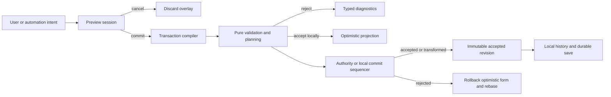

### `INV-04-001` One canonical writer

Reducers, UI controls, importers, plugins, collaboration handlers, undo, and recovery code may propose transactions; only the mutation engine may publish a new canonical document revision.

### `INV-04-002` Projection separation

At any time a client may hold:

1. an accepted document revision;
2. zero or more causally ordered pending local transactions;
3. at most one active local preview per compatible interaction channel;
4. a projected view derived by applying pending transactions and preview overlays.

These layers are distinguishable. Saving an accepted-only checkpoint never accidentally includes a preview. Saving a local recovery checkpoint explicitly identifies pending transactions. Collaboration never broadcasts raw preview frames unless a presence protocol independently chooses to do so.

## 4. Transaction and Operation Schemas

### `SCH-04-001` Transaction envelope

```ts
type Transaction = {
  transactionId: UUIDv7;
  documentId: DocumentId;
  actor: ActorRef;
  origin: "user" | "undo" | "redo" | "import" | "automation" |
          "migration" | "repair" | "collaboration";
  intent: {
    kind: RegisteredIntentKind;
    labelKey: string;
    affectedEntityIds: EntityId[];
    coalescingKey?: string;
  };
  base: {
    revisionId: RevisionId;
    semanticHash: SemanticHash;
    causalDependencies: TransactionId[];
  };
  operations: Operation[];
  preconditions: Precondition[];
  inverse: InverseDescriptor;
  policy: {
    conflictMode: "strict" | "rebase";
    failureMode: "atomic";
    durability: "accepted" | "local-recovery-required";
  };
  client: {
    sessionId: UUID;
    sequence: NonNegativeInteger;
    schemaVersion: PositiveInteger;
  };
};
```

`transactionId` is allocated once and retained across retries. `actor` is an authorization reference, not embedded credentials. Human-readable labels are localization keys and do not affect semantics. `failureMode` has only `atomic` in this contract.

### `SCH-04-002` Common operation envelope

```ts
type Operation<K extends string = string, P extends JsonObject = JsonObject> = {
  operationId: UUIDv7;
  transactionId: UUIDv7;
  ordinal: NonNegativeInteger;
  kind: K;
  target: StableAddress | RootCollectionAddress;
  expectedTargetKind?: string;
  preconditions: Precondition[];
  payload: P;
  extensionData: ExtensionMap;
};
```

Ordinals are contiguous from zero and define intra-transaction application order. Operation IDs are unique document-wide and cannot be reused with different bytes. Operations are JSON-safe and contain no runtime object, callback, selection query, or provider handle.

### `SCH-04-003` Preconditions

```ts
type Precondition =
  | { kind: "document-hash-is"; semanticHash: SemanticHash }
  | { kind: "entity-live"; address: StableAddress; expectedKind: string }
  | { kind: "entity-absent"; id: EntityId }
  | { kind: "property-equals"; address: StableAddress; valueHash: SemanticHash }
  | { kind: "order-neighborhood-is"; collection: StableAddress;
      entryId: OrderEntryId; beforeId: OrderEntryId | null; afterId: OrderEntryId | null }
  | { kind: "reference-count-is"; targetId: EntityId; count: NonNegativeInteger }
  | { kind: "feature-enabled"; featureId: FeatureId }
  | { kind: "permission-allows"; capability: string };
```

Document/entity/property/order/feature preconditions are semantic and are evaluated against the transaction's admitted base plus earlier operations in the same transaction where the precondition explicitly targets their output. `permission-allows` is authority-admission-only: the authority records the permission revision and decision in the accepted record, and deterministic replay verifies that recorded decision rather than querying current permissions. A mismatch is typed; it is never silently ignored.

### `SCH-04-004` Property operations

```ts
type PropertyOperation =
  | Operation<"property.set", {
      value: JsonValue;
      beforeValueHash?: SemanticHash;
    }>
  | Operation<"property.clear", {
      beforeValueHash?: SemanticHash;
    }>
  | Operation<"property.unset", {
      beforeValueHash?: SemanticHash;
    }>;
```

- `property.set` writes an explicit schema-valid value, including a valid empty string/list/map.
- `property.clear` writes the property's declared explicit-clear variant.
- `property.unset` removes an optional property so schema default/absence semantics apply.
- `null` is accepted only when the target schema declares null as a value.
- Relative numeric deltas may exist inside a preview controller but compile to final canonical values or semantic domain operations before commit.

### `SCH-04-005` Ordered-collection operations

```ts
type RelativePosition =
  | { at: "start" }
  | { at: "end" }
  | { beforeEntryId: OrderEntryId }
  | { afterEntryId: OrderEntryId };

type OrderedOperation =
  | Operation<"ordered.insert", {
      entryId: OrderEntryId;
      valueId: EntityId;
      position: RelativePosition;
    }>
  | Operation<"ordered.move", {
      entryId: OrderEntryId;
      position: RelativePosition;
    }>
  | Operation<"ordered.remove", {
      entryId: OrderEntryId;
      expectedValueId: EntityId;
    }>;
```

An anchor is evaluated by ID, not remembered index. Moving an entry relative to itself is invalid. Insertion requires a fresh entry ID. Removing an absent entry is an idempotent success only when the exact operation ID already has an accepted outcome; a new remove operation against absence fails `target-missing`.

When a concurrent edit removes an anchor, rebase uses the nearest surviving predecessor/successor recorded in the accepted operation context. If neither survives, the collection's registered fallback is start, end, or conflict; there is no universal guess.

### `SCH-04-006` Structural and semantic operation registry

| Family | Required kinds | Core payload semantics |
|---|---|---|
| Entity | `entity.create`, `entity.delete`, `entity.restore`, `entity.reparent` | Full validated entity or tombstone/inverse data; fresh IDs; explicit owner |
| Order | `ordered.insert`, `ordered.move`, `ordered.remove` | Stable entry ID and relative anchor |
| Property | `property.set`, `property.clear`, `property.unset` | One registered property address and explicit value semantics |
| Transform | `transform.set`, `frame.set` | Final values in declared parent space; no screen coordinates |
| Vector | `vector.point.set`, `vector.handle.set`, `vector.segment.convert`, `vector.path.split`, `vector.path.join` | Stable path/point/segment IDs and canonical geometry |
| Text | `text.insert`, `text.delete`, `text.replace`, `text.mark.set`, `text.block.split`, `text.block.merge` | Persistent marker IDs or registered algorithm-stable item anchors, Unicode scalar ranges, marks, and no bare durable UTF-16 index |
| Style stack | Property plus ordered operations over fill/stroke/effect sub-IDs | Stable layer identity; no whole-stack overwrite for a single-layer edit |
| Composition | `boolean.create`, `boolean.operation.set`, `mask.create`, `mask.members.set`, `composition.flatten` | Stable operands/members; flatten is explicit destructive conversion |
| Components | `component.instantiate`, `instance.override.set`, `instance.override.remove`, `instance.swap`, `instance.detach` | Complete ID remap and stable override address |
| Slides | `slide.create`, `slide.delete`, `slide.layout.set`, `placeholder.detach`, `placeholder.restore` | Master/layout/slot identities and reconciliation plan |
| Structured data | `table.*`, `chart.*`, `diagram.*`, `data-source.*` | Stable row/cell/series/node/edge IDs; domain invariants |
| Motion | `animation.step.*`, `transition.set`, `timing.set` | Stable step/target IDs and explicit timing |
| Review | `notes.*`, `comment.thread.*`, `comment.message.*` | Stable rich-text, anchor, thread, and message IDs |
| Assets | `asset.register`, `asset.reference.set`, `asset.reference.remove` | Durable descriptor/reference only; bytes staged by Volume 06 |

Each registered kind defines payload schema, target kinds, preconditions, apply, inverse, transform/rebase, conflict classification, unknown-field behavior, and resource limits. A generic arbitrary JSON patch is not a registered semantic operation.

### `INV-04-003` No index-addressed mutation

An operation may carry an ordinal for its place in a transaction, but it cannot target `slides[3]`, `fills[1]`, a character offset without stable text anchors, or an equivalent mutable index.

### `INV-04-004` No derived-data operation

Operations cannot set resolved styles, effective elements, layout results, boolean meshes, text measurements, tessellation, thumbnails, decoded media, hit regions, or render caches.

## 5. Preview and Commit

### `SCH-04-007` Preview session

```ts
type PreviewSession = {
  previewId: UUID;
  documentId: DocumentId;
  channel: "canvas" | "inspector" | "text" | "timeline" | "dialog" | "automation";
  intentKind: RegisteredIntentKind;
  baseRevisionId: RevisionId;
  baseSemanticHash: SemanticHash;
  targetIds: EntityId[];
  initialValues: Record<string, JsonValue>;
  overlay: PreviewOverlay;
  state: "active" | "committing" | "cancelled" | "committed" | "invalidated";
};
```

Preview overlays may use high-frequency deltas and renderer-ready values, but they are scoped to the preview ID and never become canonical by reference. Commit compiles the latest valid preview intent into canonical operations and revalidates against the current accepted/projected base.

### `SM-04-001` Preview lifecycle

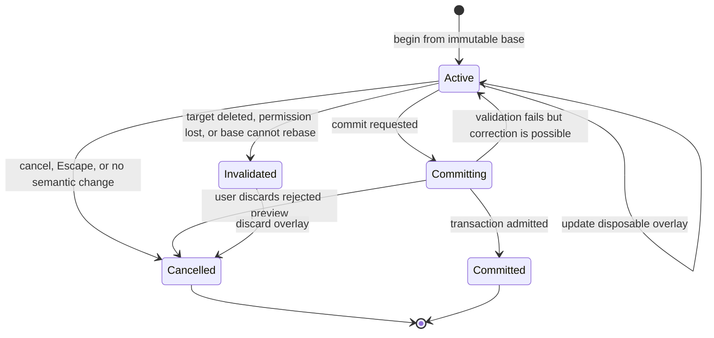

Pointer cancellation, lost capture, window blur, route change, target deletion, modal interruption, and tool switch have an explicit policy: commit only when the interaction contract says a completed intent exists; otherwise cancel. A preview timeout never auto-commits.

### `FLOW-04-001` Preview to commit

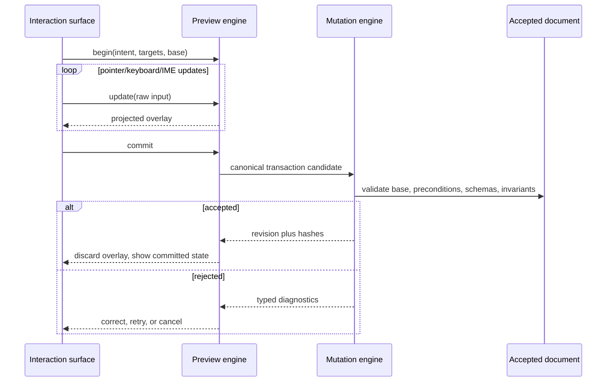

### `INV-04-005` Preview purity

Starting, updating, or cancelling a preview does not change accepted semantic hash, transaction log, undo stack, autosave dirty revision, or collaboration operation stream.

### `INV-04-006` Commit from intent, not pixels

The compiler derives operations from semantic targets and canonical values. It does not scrape the DOM, canvas pixels, CSS transforms, browser undo state, or rendered scene to discover the change.

## 6. Atomic Validation and Application

### `SCH-04-008` Transaction outcome

```ts
type TransactionOutcome =
  | {
      state: "accepted";
      transactionId: TransactionId;
      canonicalTransaction: Transaction;
      parentRevisionId: RevisionId;
      revisionId: RevisionId;
      beforeHash: SemanticHash;
      afterHash: SemanticHash;
      inverse: MaterializedInverse;
      diagnostics: Diagnostic[];
    }
  | {
      state: "no-op";
      transactionId: TransactionId;
      revisionId: RevisionId;
      semanticHash: SemanticHash;
      reason: "equal-semantic-state" | "already-applied";
    }
  | {
      state: "rejected";
      transactionId: TransactionId;
      acceptedRevisionId: RevisionId;
      code: RejectionCode;
      diagnostics: Diagnostic[];
      disposition: RejectionDisposition;
    };
```

### `FLOW-04-002` Atomic apply algorithm

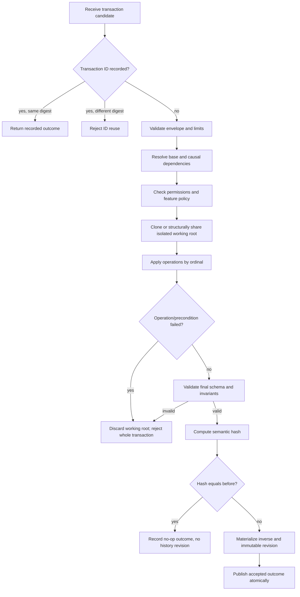

### `INV-04-007` No partial visibility

Observers see either the complete parent revision or the complete accepted child revision. Intermediate operation states are private to the apply workspace, even when later operations depend on earlier ones.

### `INV-04-008` Deterministic diagnostics

Given the same admitted base, transaction bytes, feature registry, permission decision, and resource policy, validation yields the same ordered diagnostic codes and addresses.

### Error and nil paths

| Condition | Outcome |
|---|---|
| `operations` empty | Reject malformed transaction; use no transaction for an intentional no-op |
| Target missing | Reject `target-missing`, unless a registered restore operation targets its tombstone |
| Target tombstoned | Reject `target-deleted` with tombstone ID |
| Target wrong kind | Reject `target-kind-mismatch` |
| Optional property absent on unset | New operation rejects `property-absent`; retried identical operation is idempotent |
| Explicit empty value | Validate and set as authored empty |
| Null not admitted by target schema | Reject `value-null-invalid` |
| Anchor removed during strict apply | Reject `order-anchor-missing` |
| Anchor removed during rebase | Apply registered neighborhood fallback or report conflict |
| One operation invalid | Reject all operations; publish none |
| Post-invariant failure | Reject all operations with related addresses |
| Equal before/after semantic hash | Record no-op outcome; no undo/history entry |
| Unknown operation kind | Reject mutable apply and preserve pending bytes for compatible retry only if policy allows |
| Resource limit exceeded | Reject `resource-limit` before unbounded allocation |

## 7. Inversion and Snapshot Fallback

### `SCH-04-009` Inverse descriptor

```ts
type InverseDescriptor =
  | { kind: "semantic"; strategyVersion: PositiveInteger }
  | {
      kind: "bounded-snapshot";
      strategyVersion: PositiveInteger;
      capturedAddresses: StableAddress[];
      maximumBytes: PositiveInteger;
      reasonCode: RegisteredSnapshotReason;
    }
  | { kind: "not-undoable"; reasonCode: string };

type MaterializedInverse = {
  sourceTransactionId: TransactionId;
  sourceAfterHash: SemanticHash;
  operations: Operation[];
  applicability: Precondition[];
  retainedAssetIds: AssetId[];
};
```

User-authored document transactions are undoable unless an accepted product requirement explicitly marks an irreversible boundary and requires confirmation. `not-undoable` is permitted for system compaction, external side effects, and migration bookkeeping, not as an escape hatch for ordinary editing.

Semantic inverse examples:

- set property -> set the captured prior tagged value, clear it, or unset it according to prior state;
- insert order entry -> remove that exact entry;
- move order entry -> move it into the captured stable neighborhood;
- create entity -> delete the created entity and its owned closure;
- delete entity -> restore the same identity, owned closure, prior order neighborhood, references, and tombstone disposition;
- text insert -> delete the inserted stable range; text delete -> reinsert captured text and marks at stable anchors;
- flatten or destructive conversion -> restore captured source entities and remove generated entities.

### `INV-04-009` Inverse sufficiency

An accepted transaction cannot depend on reconstructing prior state from the current renderer, an expired asset URL, or a future schema guess. Inverse material is captured before publication.

### `INV-04-010` Bounded fallback

A snapshot-backed inverse names exact canonical addresses and a maximum encoded size. Whole-application Store snapshots, runtime state, and unbounded binary assets are forbidden. Exceeding the bound rejects the original transaction or requires an explicit non-undoable product flow before mutation.

### `INV-04-011` Asset retention for history

Assets needed by any live inverse, pending transaction, checkpoint, or tombstone are pinned under Volume 06 and cannot be garbage-collected.

## 8. Coalescing and Interaction Granularity

### `SCH-04-010` Coalescing contract

```ts
type CoalescingPolicy = {
  key: string;
  intentKind: RegisteredIntentKind;
  actorId: ActorId;
  targetSetHash: SemanticHash;
  channel: PreviewSession["channel"];
  startBaseRevisionId: RevisionId;
  terminators: Array<"pointer-up" | "pointer-cancel" | "blur" | "enter" |
                     "escape" | "selection-change" | "tool-change" |
                     "remote-invalidation" | "explicit-commit">;
};
```

Coalescing occurs before acceptance, not by rewriting accepted history. All of the following are one transaction when they express one uninterrupted intent:

- drag move, resize, rotate, skew, crop, handle drag, point drag, multi-point drag;
- numeric scrub or slider drag over one stable target set and property set;
- freehand/path creation from pointer-down through completion;
- one text-edit session bounded by entry/exit, composition-safe commit, or explicit formatting command policy;
- one reorder drag, including autoscroll;
- one timeline step drag or duration scrub.

The following terminate coalescing: target-set change, property-family change, intervening accepted command, explicit commit, permission loss, target deletion, incompatible remote rebase, text composition boundary requiring durable commit, or interaction cancellation.

Keystroke coalescing may join adjacent text edits only while stable text anchors and marks remain compatible and no remote/local structural edit intervenes. A time window alone is insufficient.

### `INV-04-012` Intent-preserving coalescing

The coalesced transaction has the same canonical result as applying all valid preview updates in order, but its inverse restores the state before the first update and it produces exactly one local history entry.

### `INV-04-013` No cross-actor coalescing

Remote operations, transactions from another local tab, and system repairs are never folded into a user's local transaction.

## 9. Deterministic Replay and Idempotency

### `SCH-04-011` Revision and replay record

```ts
type AcceptedRevision = {
  revisionId: `sha256:${LowerHex64}`;
  documentId: DocumentId;
  parentRevisionId: RevisionId | null;
  parentSemanticHash: SemanticHash | null;
  transactionId: TransactionId;
  transactionDigest: `sha256:${LowerHex64}`;
  resultingSemanticHash: SemanticHash;
  logicalSequence: NonNegativeInteger;
  acceptedBy: AuthorityId;
  featureRegistryVersion: string;
};

revisionId = SHA256(canonicalRevisionHeader)
transactionDigest = SHA256(JCS(transactionSemanticProjection))
```

Wall-clock timestamps may be audit metadata but never choose application order or conflict winners. The authority assigns `logicalSequence` after dependency admission. The operation registry version is pinned or migration-compatible.

### `FLOW-04-003` Replay verification

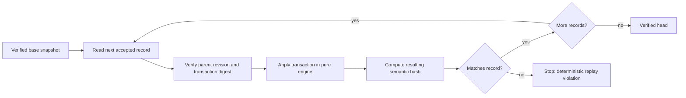

### `INV-04-014` Replay inputs

Replay cannot read current locale, time zone, random source, wall clock, network, filesystem, DOM, GPU, installed fonts, decoded media, selection, viewport, or provider state. Required external policy results are captured as accepted transaction inputs or represented by deterministic references.

### `INV-04-015` Exactly-once effect, at-least-once delivery

Transport may deliver transaction bytes multiple times. The mutation authority records `(documentId, transactionId, transactionDigest, outcome)` atomically with acceptance/rejection. Same ID and digest returns the recorded outcome; same ID with a different digest rejects `identity-reuse`.

### `INV-04-016` Canonical operation substitution

If authority transforms a submitted transaction, the accepted record contains the canonical transformed operations and links the submitted digest. All replicas replay the canonical form, not independent local transformations.

## 10. Local History, Undo, and Redo

### `SCH-04-012` Local history entry

```ts
type LocalHistoryEntry = {
  sourceTransactionId: TransactionId;
  actorId: ActorId;
  acceptedRevisionId: RevisionId;
  intentKind: RegisteredIntentKind;
  labelKey: string;
  inverse: MaterializedInverse;
  state: "applied" | "undo-pending" | "undone" | "redo-pending" |
         "partially-undone" | "blocked";
  undoTransactionId?: TransactionId;
  redoTransactionId?: TransactionId;
  diagnostics: Diagnostic[];
};
```

History is a local view over accepted transactions, not the document itself. Remote transactions and another actor's edits are not local undo entries. Selection and viewport restoration may be attached as non-document UI hints; failure to restore a hint does not fail document undo.

### `SM-04-002` Local undo/redo entry

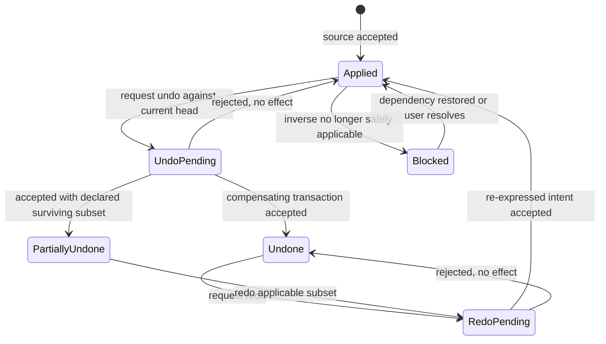

### `FLOW-04-004` Collaboration-safe local undo

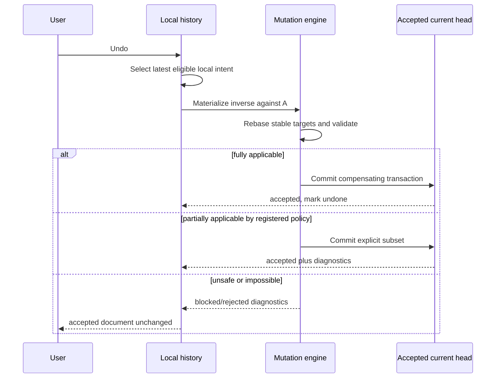

Examples:

- If a local transaction moved node A and a remote transaction recolored A, undo restores A's prior position and preserves the remote color.
- If a local transaction created A and remote work later references A, undoing creation follows the registered inbound-reference policy; it cannot silently delete remote dependent content.
- If a local transaction deleted A and a remote transaction used the freed visual space, undo restores A with its identity and authored coordinates; layout conflicts resolve through normal current-state validation, not old snapshot replacement.
- If the target was remotely deleted, a property-change inverse becomes blocked or redundant according to the operation family; it never recreates the target unless the source intent itself owned creation.

### `INV-04-017` Undo is forward history

Undo and redo create accepted transactions with fresh IDs and audit links. They do not move a shared document head backward or erase prior accepted records.

### `INV-04-018` Redo branch policy

Accepting a new local user transaction after an undo closes redo for incompatible undone entries. Compatible redo may remain only when its stable targets, dependencies, and intent semantics still validate; the policy cannot be based solely on stack position.

## 11. Pending, Remote Acceptance, Rejection, and Rebase

### `SCH-04-013` Rejection taxonomy and disposition

```ts
type RejectionCode =
  | "malformed" | "schema-invalid" | "unknown-operation" | "feature-disabled"
  | "permission-denied" | "policy-denied" | "quota-exceeded" | "resource-limit"
  | "base-unknown" | "base-stale" | "dependency-missing" | "target-missing"
  | "target-deleted" | "target-kind-mismatch" | "precondition-failed"
  | "order-anchor-missing" | "semantic-conflict" | "identity-reuse"
  | "integrity-failure" | "transport-uncertain";

type RejectionDisposition =
  | { action: "discard"; reason: string }
  | { action: "retry-same-id"; after: "transport" | "dependency" | "auth-refresh" }
  | { action: "rebase-new-transaction"; preservedIntent: JsonObject }
  | { action: "fork-local-copy"; recoveryCheckpointId: string }
  | { action: "user-resolution-required"; choices: string[] };
```

`transport-uncertain` is not authoritative rejection: the client must query outcome by transaction ID before retrying. Permission refresh may retry the same bytes/ID only when no semantic rebase occurred. Any changed transaction uses a fresh transaction ID and links the rejected source.

### `SM-04-003` Submitted transaction

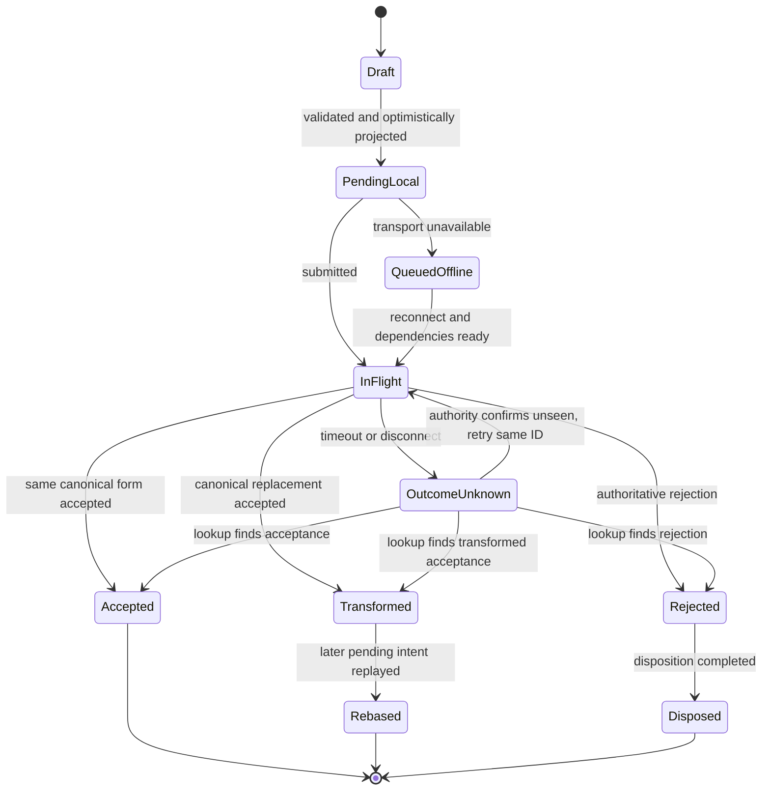

### `SM-04-004` Optimistic projection rebase

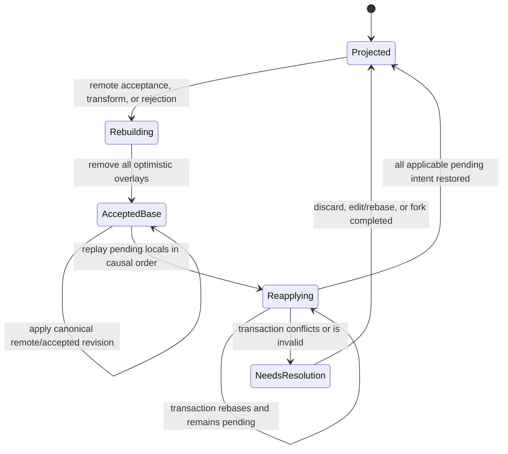

The rebuilding projection is published to observers atomically or under an explicit `rebasing` UI state; a user never edits an unexplained partial replay.

### `FLOW-04-005` Remote rejection

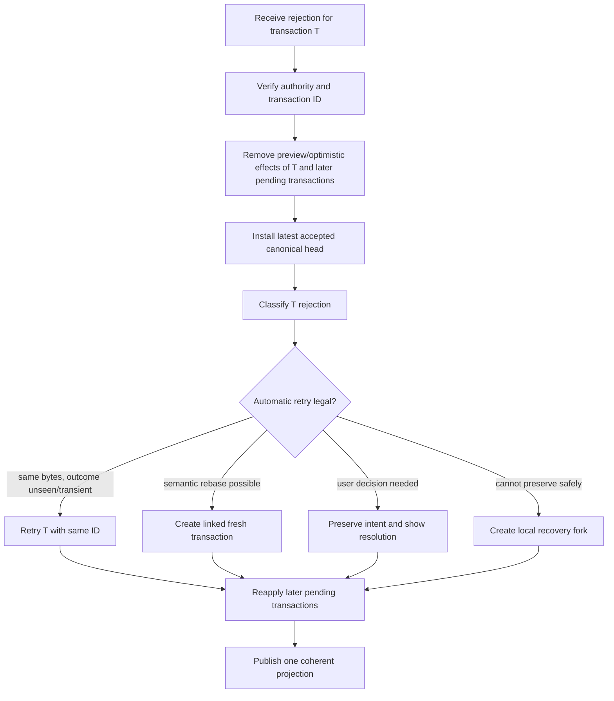

### `INV-04-019` Rejection does not masquerade as undo

Rejecting an unaccepted transaction removes its optimistic effect and does not create an undo entry. Undo applies only to accepted local history.

### `INV-04-020` Pending intent durability

A pending transaction that the user has been allowed to rely on is included in local recovery state until an authoritative outcome and disposition are durable. Closing a tab or losing connectivity cannot silently discard it.

## 12. Conflict and Rebase Policy

Operations on disjoint stable targets commute unless a cross-entity invariant says otherwise. "Last writer wins" is not a global policy.

| Concurrent relationship | Required policy |
|---|---|
| Different entities/properties | Commute when no shared invariant is affected |
| Same scalar property | Registered policy: strict conflict, authority order, or domain merge; policy is named in operation registry |
| Same ordered collection, different entries | Preserve both and resolve relative anchors deterministically |
| Same order entry moved twice | Authority order plus explicit transformed canonical position, or conflict |
| Edit versus delete same target | Delete makes edit inapplicable; edit remains diagnosable and may be recoverable, never redirected |
| Delete versus new inbound reference | Authority validates complete transaction order and reference policy; no dangling required reference is accepted |
| Text at distinct stable anchors | Merge according to text operation model |
| Text at same range/mark | Registered text conflict semantics, preserving authored characters where possible |
| Component source edit versus instance override | Source changes and valid override survive independently |
| Asset registration with same content hash | Idempotent descriptor merge if metadata is compatible; conflict otherwise |
| Layout change versus placeholder edit | Stable slot/address rebase; orphan and diagnose if no compatible slot remains |
| Animation reorder versus target delete | Preserve step as unresolved or delete it only through explicit cascade policy |

### `INV-04-021` Domain-policy registration

Every operation kind that can conflict defines transform/rebase behavior or declares strict conflict. Falling through to generic object merge is forbidden.

### `INV-04-022` Accepted-form authority

All clients eventually use the authority's accepted canonical transaction ordering and transformed payloads. Local timestamps and arrival order cannot independently decide accepted meaning.

## 13. History Retention, Compaction, and Recovery Handoff

Accepted transaction logs may be compacted only after a verified canonical checkpoint exists under Volume 06 and no supported undo, collaboration, audit, recovery, or unknown-feature horizon needs removed records.

### `SM-04-005` History retention

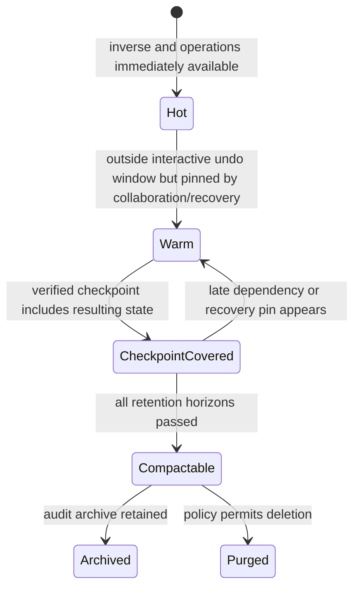

A UI count limit such as 50 entries is not a persistence or collaboration retention policy. Asset pins and tombstones follow the longest applicable horizon.

### `INV-04-023` Checkpoint before compaction

Compaction cannot remove the only material capable of reconstructing an admitted document or a retained inverse. The checkpoint semantic hash and revision chain are verified before log deletion.

## 14. Security and Resource Boundaries

1. Transactions are untrusted input regardless of origin.
2. Envelope size, operation count, nesting depth, string length, text insertion size, entity creation count, inverse size, and expansion cost have profile-specific limits.
3. Permission is checked at transaction admission and again for externally authoritative side effects; UI visibility is not authorization.
4. Operation extensions cannot execute code or bypass schema validation.
5. Diagnostics do not echo secrets, full authored values, access tokens, or signed URLs.
6. Replay sandboxes migrations/operation handlers according to Volume 13.
7. A rejected transaction cannot retain unauthorized document data in a user-visible recovery payload.

### `INV-04-024` Validation before allocation

Cheap envelope, count, and size checks precede expensive cloning, decoding, geometry, text shaping, or asset work.

## 15. Observation Contracts

Volume 14 sets thresholds. Mutation implementations emit the following bounded hooks:

| ID | Hook | Required dimensions and measurements |
|---|---|---|
| `OBS-04-001` | `mutation.preview` | intent kind, channel, target-count bucket, update latency, dropped-preview count, terminal state |
| `OBS-04-002` | `mutation.commit` | intent kind, operation-count bucket, validation/apply/hash durations, accepted/no-op/rejected outcome |
| `OBS-04-003` | `mutation.replay` | transaction-count bucket, entity-count bucket, duration, first mismatch sequence, outcome |
| `OBS-04-004` | `mutation.undo_redo` | intent kind, rebase duration, full/partial/blocked/rejected outcome, remote-intervening count bucket |
| `OBS-04-005` | `mutation.remote_outcome` | queue age bucket, attempts, transformed/rejected/accepted/unknown, rejection code, rebase duration |

Actor IDs, entity IDs, operation IDs, text, property values, comments, notes, URLs, and document titles are prohibited telemetry dimensions. Correlation uses ephemeral sampled trace IDs not recoverable as document identity.

## 16. Acceptance Criteria

By normative mapping, each `AC-04-NNN` evaluates exactly `REQ-04-NNN`; the shared suffix is the bidirectional requirement-to-acceptance link.

| ID | Pass condition |
|---|---|
| `AC-04-001` | Instrumented production-boundary tests prove every authored change emits exactly one transaction and direct canonical writes fail. |
| `AC-04-002` | Valid and malformed transaction-envelope fixtures produce deterministic acceptance or exact diagnostic codes. |
| `AC-04-003` | Every registered operation kind round-trips canonical JSON and rejects functions, cyclic data, non-contiguous ordinals, and ID reuse. |
| `AC-04-004` | A wrong revision or semantic hash cannot mutate the document and returns typed stale-base diagnostics. |
| `AC-04-005` | During move, resize, scrub, draw, timeline, and text previews, accepted semantic hash and history remain unchanged until commit. |
| `AC-04-006` | Escape, pointer cancel, lost capture, invalidated target, and explicit cancel restore accepted state with no transaction or dirty revision. |
| `AC-04-007` | A multi-operation fixture with failure at every ordinal proves no prefix becomes observable or durable. |
| `AC-04-008` | The same invalid operation fixture receives the same schema diagnostics through local, remote, undo, import, and automation admission. |
| `AC-04-009` | Reorder/reparent fixtures retain targetability while index-, name-, and DOM-addressed candidates are rejected. |
| `AC-04-010` | Property fixtures distinguish set-empty, set-null-when-valid, clear, unset, relative-preview compilation, and invalid null. |
| `AC-04-011` | Concurrent insert, move, remove, missing-anchor, and self-anchor fixtures produce registered deterministic order outcomes. |
| `AC-04-012` | Duplicate, paste, instantiate, detach, and import fixtures prove complete preallocated remaps and collision rejection. |
| `AC-04-013` | Delete fixtures cover no references, optional references, required references, cascade, tombstone, inverse, and asset pinning. |
| `AC-04-014` | At least one semantic fixture for every operation family validates, applies, inverts, replays, and round-trips. |
| `AC-04-015` | Precondition, permission, schema, invariant, and resource failures preserve the exact before hash and revision ID. |
| `AC-04-016` | Accepted outcomes include parent/child revision IDs, before/after hashes, canonical operations, inverse, and stable diagnostics. |
| `AC-04-017` | Every user transaction in the corpus materializes a valid inverse; bounded fallback rejects over-limit capture before mutation. |
| `AC-04-018` | Each declared continuous interaction creates one accepted history entry; each terminator starts a new eligible intent. |
| `AC-04-019` | Set-to-same-value, move-to-same-neighborhood, empty text replacement, and cancelled commands produce no accepted history revision. |
| `AC-04-020` | Repeated replay across fresh processes and permuted JSON key insertion produces identical outcomes, diagnostics, and hashes. |
| `AC-04-021` | At-least-once delivery fixtures apply each transaction once; same-ID/different-digest fixtures reject identity reuse. |
| `AC-04-022` | Missing parent, altered transaction bytes, altered result hash, and logical-sequence gap each stop chain verification at the exact record. |
| `AC-04-023` | Local history excludes remote, rejected, preview-only, migration, and non-undoable system transactions. |
| `AC-04-024` | Undo after remote edits reverses only local addressed intent and preserves unrelated and same-entity remote properties. |
| `AC-04-025` | Redo after compatible and incompatible intervening changes either reapplies the valid intent or reports exact blocked/partial diagnostics. |
| `AC-04-026` | Every rejection code removes optimistic effects and ends in one declared disposition without creating undo history. |
| `AC-04-027` | Transformed acceptance replaces optimistic bytes, yields the authority hash, and deterministically rebases later pending transactions. |
| `AC-04-028` | Offline close/reopen recovers pending transactions with IDs, dependencies, bases, ordering, and disposition state intact. |
| `AC-04-029` | Out-of-order dependency fixtures buffer until satisfiable and reject impossible dependencies without partial apply. |
| `AC-04-030` | Permission, policy, quota, schema, stale-base, conflict, missing-target, and transport outcomes remain machine-distinguishable. |
| `AC-04-031` | Migration and repair fixtures produce typed audit records, no user undo entry, deterministic output, and Volume 06 rollback material. |
| `AC-04-032` | Telemetry schema tests reject authored values and emit all required lifecycle timings and bounded outcome dimensions. |

## 17. Traceability

| Contract area | Parent capabilities | Primary schemas/invariants | Downstream owner |
|---|---|---|---|
| Transaction boundary | `ARC-010`, `ARC-011` | `SCH-04-001` through `SCH-04-004`, `INV-04-001` through `INV-04-008` | All authoring volumes |
| Stable structural operations | `ARC-002`, `DES-023` | `SCH-04-005`, `SCH-04-006`, `INV-04-003`, `INV-04-004` | Volumes 07 through 09 |
| Preview and coalescing | `DES-013` | `SCH-04-007`, `SCH-04-010`, `SM-04-001`, `FLOW-04-001` | Volumes 02, 08, 09 |
| Inversion and local history | `ARC-011`, `ARC-012` | `SCH-04-009`, `SCH-04-012`, `SM-04-002`, `FLOW-04-004` | Volume 07 |
| Replay and idempotency | `ARC-011`, `ARC-012` | `SCH-04-011`, `INV-04-014` through `INV-04-016`, `FLOW-04-003` | Volumes 06, 07, 15 |
| Rejection and rebase | `ARC-012`, `PRE-061`, `PRE-062` | `SCH-04-013`, `SM-04-003`, `SM-04-004`, `FLOW-04-005` | Volume 07 |
| Retention and recovery | `ARC-030`, `ARC-031` | `SM-04-005`, `INV-04-020`, `INV-04-023` | Volume 06 |

### 17.1 Supersession

Upon acceptance, this volume supersedes conflicting mutation and history claims in active core, shape, text, collaboration, and Store documents. Existing action dispatch, full-state snapshots, special text-history entries, and index-based synchronization may be used behind temporary adapters only when they compile to and are verified against this contract. They do not define a second mutation, undo, or collaboration model.

## 18. Open Decisions

| ID | Decision/question | Default in force | Owner | Review trigger | Affected requirements/contracts | Blocking class |
|---|---|---|---|---|---|---|
| `OD-04-001` | Which concurrency algorithm should each ordered and rich-text operation family use: operation transform, CRDT, or a hybrid? | The algorithm may vary by operation family. The typed operation envelopes, deterministic replay, idempotency, accepted-form authority, convergence outcomes, and Volumes 04/07 corpus are fixed; no algorithm-specific alternate semantics are conforming. | Document and Collaboration Engineering | Before implementing the first shared ordered or rich-text operation family, and whenever its algorithm changes | `REQ-04-011`, `REQ-04-014`, `REQ-04-020` through `REQ-04-022`, `REQ-04-027` through `REQ-04-029`, `SCH-04-005`, `SCH-04-006`, `SCH-04-011`, `INV-04-014` through `INV-04-016`, `INV-04-022` | `R1-blocking` |
| `OD-04-002` | Which scalar properties should use authority ordering instead of strict user-visible conflict? | Every scalar operation uses strict conflict unless its operation kind registers a deterministic domain policy with explicit precedence, diagnostics, and corpus coverage. | Document and Collaboration Engineering | Before any shared scalar operation is allowed to resolve without strict conflict | `REQ-04-010`, `REQ-04-027`, `REQ-04-030`, `SCH-04-004`, `SCH-04-013`, `INV-04-021`, `INV-04-022` | `pre-implementation` |
| `OD-04-003` | What maximum snapshot-backed inverse size applies to each document profile? | Semantic inverses are preferred. Snapshot-backed inverses are available only when the active document profile declares a finite maximum; if it does not, an edit requiring snapshot capture is rejected before mutation. | Document and Quality Engineering | Before a profile admits an operation family that can require a snapshot-backed inverse | `REQ-04-013`, `REQ-04-017`, `SCH-04-009`, `INV-04-010`, `INV-04-024` | `R1-blocking` |
| `OD-04-004` | May compatible redo survive arbitrary later local commands? | A redo entry survives later commands only while every stable target, dependency, permission, and intent precondition still validates. Otherwise it remains visible as blocked or partial and is not reapplied speculatively. | Document and Experience Engineering | Before redo is retained across a later accepted local command | `REQ-04-023` through `REQ-04-025`, `SCH-04-012`, `SM-04-002`, `INV-04-018` | `non-blocking` |
| `OD-04-005` | What checkpoint and audit retention horizons apply to accepted operations and inverses? | Accepted operations and required inverse material are retained until a verified covering checkpoint exists and every history, collaboration, recovery, audit, and asset pin is released. Without both proofs, compaction is forbidden. | Collaboration and Storage Engineering | Before operation-log or inverse compaction is enabled, or before a release profile sets a shorter horizon | `REQ-04-017`, `REQ-04-022`, `REQ-04-028`, `SCH-04-011`, `SM-04-005`, `INV-04-020`, `INV-04-023` | `pre-implementation` |
| `OD-04-006` | Should in-progress preview presence be broadcast to collaborators? | Preview presence is local-only. If a later profile enables broadcast, it remains ephemeral presence, is excluded from accepted operations and history, and cannot affect canonical resolution. | Collaboration and Experience Engineering | Before a collaborator live-preview or live-cursor payload includes uncommitted values | `REQ-04-005`, `REQ-04-006`, `SCH-04-007`, `SM-04-001`, `INV-04-002`, `INV-04-005` | `non-blocking` |
| `OD-04-007` | How should mixed-version clients negotiate operation-registry versions? | A client may submit only operation kinds and versions declared by the accepting authority. Unknown required operations are rejected with typed diagnostics and preserved where required; no client guesses, drops, or silently downgrades them. | Document and Collaboration Engineering | Before mixed-version collaboration or rolling client upgrades are enabled | `REQ-04-003`, `REQ-04-008`, `REQ-04-014`, `REQ-04-030`, `SCH-04-002`, `SCH-04-006`, `SCH-04-013` | `pre-implementation` |

## 19. Identifier Counts

| Namespace | Count | Range |
|---|---:|---|
| Requirements | 32 | `REQ-04-001` through `REQ-04-032` |
| Schemas | 13 | `SCH-04-001` through `SCH-04-013` |
| Invariants | 24 | `INV-04-001` through `INV-04-024` |
| State machines | 5 | `SM-04-001` through `SM-04-005` |
| Flows | 5 | `FLOW-04-001` through `FLOW-04-005` |
| Observation contracts | 5 | `OBS-04-001` through `OBS-04-005` |
| Acceptance criteria | 32 | `AC-04-001` through `AC-04-032` |
| Open decisions | 7 | `OD-04-001` through `OD-04-007` |

The counts above are normative inventory counts for this revision. Revisions add identifiers monotonically and never renumber accepted identifiers.
