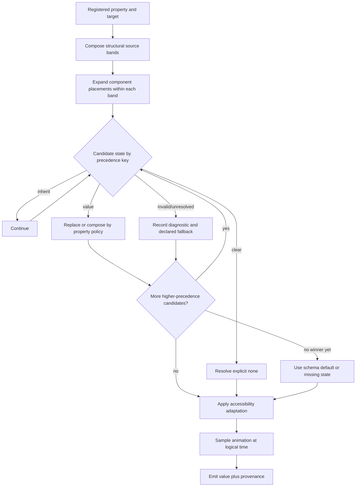
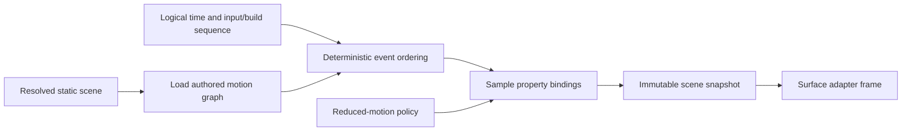
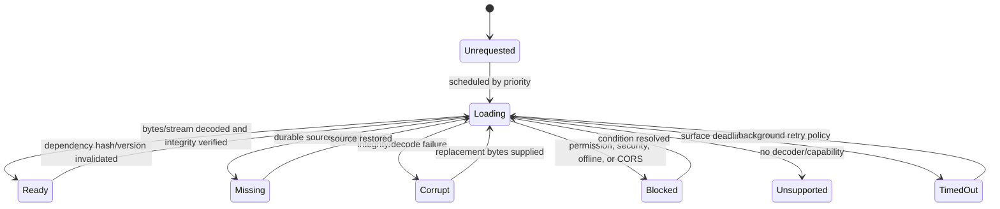
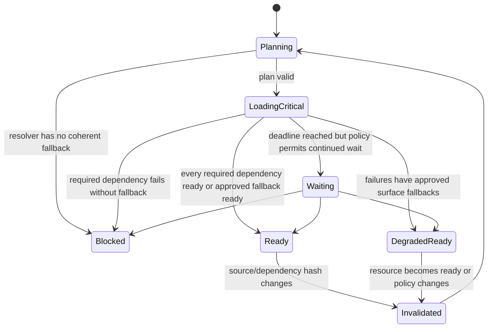
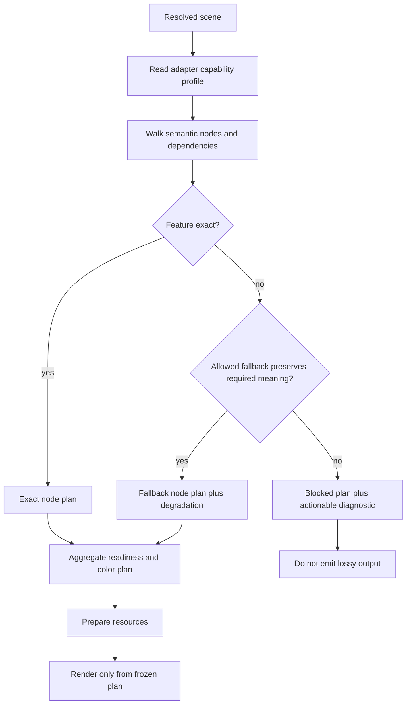
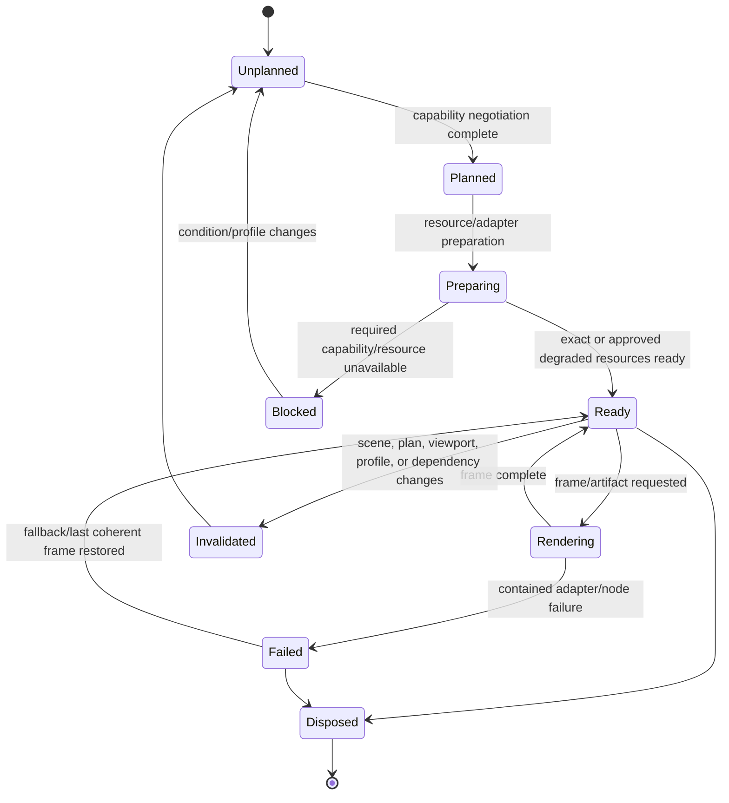

# Volume 05: Resolution, Scene, and Rendering

> **Specification ID:** `STORY-SPEC-05`  
> **Volume:** 05 (16 volumes total, 00-15)  
> **Status:** Normative draft  
> **Version:** 2.0.0-draft  
> **Owner:** Scene and Rendering Architecture  
> **Approvers:** Product, Design, Engineering, Quality, Accessibility, Security  
> **Last reviewed:** July 10, 2026  
> **Review cadence:** At every accepted resolver, scene, surface-adapter, or fidelity-contract change and at least once per release train  
> **Normative scope:** Resolution precedence and provenance, layout and geometry, renderer-neutral scene IR, text, paint, media, accessibility semantics, motion snapshots, readiness, surface capabilities, degradation, caching, and conformance  
> **Explicit non-ownership:** Authored document persistence, mutation algorithms, asset-byte durability, presentation control clocks, format-specific interchange mapping, implementation status, and release evidence  
> **Parent specification:** [Story Product Specification System](README.md)  
> **Governed by:** [Volume 00 - Governance and Traceability](00-governance-and-traceability.md)  
> **Supersedes:** Conflicting resolution, rendering, readiness, and cross-surface fidelity claims in active core, canvas, shapes, slides, presentation, transition, export, and storage specifications where this volume is more precise

## 1. Purpose and Authority

This volume defines how an immutable canonical Story document becomes one resolved, renderer-neutral semantic scene and how editor, thumbnail, presentation, presenter, export, print, recording, and interchange-preview surfaces consume that scene. It owns resolution precedence, provenance, layout and geometry resolution, scene IR, text/paint/media semantics, accessibility, motion snapshots, resource readiness, surface capability negotiation, degradation, adapter conformance, and render determinism.

It consumes [Volume 03](03-canonical-document-model.md) and never mutates it. Document changes use [Volume 04](04-mutation-history-and-determinism.md); asset bytes and package durability use [Volume 06](06-files-assets-and-recovery.md). Presentation control and clocks belong to Volume 10; export format mapping belongs to Volume 11; quality thresholds belong to Volume 14.

The key words **MUST**, **MUST NOT**, **SHOULD**, **SHOULD NOT**, and **MAY** are normative.

### 1.1 Adopted inputs and compatibility sources

This volume adopts compatible geometry semantics from the [shape architecture](../../specs/shapes/01-system-architecture.md), [shape coordinates](../../specs/shapes/03-coordinate-systems.md), and [shape rendering architecture](../../specs/shapes/16-rendering-architecture.md), plus presentation cleanliness and readiness behavior from [presentation rendering](../../specs/slides/presentation-mode/03-rendering-in-presentation-mode.md) and [transition readiness](../../specs/slides/transitions/03-performance-readiness-and-caching.md). [BaseRenderer](../../../src/core/renderer/BaseRenderer.js), [SlideView](../../../src/core/renderer/SlideView.js), [ElementFactory](../../../src/core/renderer/ElementFactory.js), [AssetReadiness](../../../src/core/presentation/AssetReadiness.js), and [Exporter](../../../src/core/export/Exporter.js) are adapter/compatibility evidence, not independent scene semantics.

### 1.2 Rendering doctrine

1. Resolve authored meaning once; adapt it many times.
2. The scene is semantic and renderer-neutral, not a DOM snapshot, SVG string, canvas display list, or GPU mesh.
3. Resolution is pure for a pinned input document, context, resolver version, and deterministic resource metadata.
4. Every resolved value retains source provenance and any fallback/degradation.
5. Surface capability differences are negotiated explicitly before painting.
6. Editor affordances and presenter controls are overlays, never slide-scene nodes.
7. Readiness derives from scene resource dependencies, not post-render DOM inspection.
8. Unsupported content is preserved and reported; it is never silently omitted or rasterized.

## 2. Atomic Requirements

| ID | Requirement | Parent capability | Acceptance |
|---|---|---|---|
| `REQ-05-001` | Every product surface **MUST** consume a scene produced by the canonical resolver contract in `SCH-05-001`. | [ARC-020](../product-spec.md#73-rendering-and-fidelity) | `AC-05-001` |
| `REQ-05-002` | Resolution **MUST** be non-mutating and deterministic for identical pinned inputs. | [ARC-003](../product-spec.md#71-canonical-document-model) | `AC-05-002` |
| `REQ-05-003` | Resolution precedence **MUST** follow `SCH-05-002` independently of object insertion order and renderer behavior. | [ARC-003](../product-spec.md#71-canonical-document-model) | `AC-05-003` |
| `REQ-05-004` | Every resolved property **MUST** retain its winning source, overridden sources, fallback state, and diagnostics according to `SCH-05-003`. | [DES-054](../product-spec.md#56-components-styles-and-variables) | `AC-05-004` |
| `REQ-05-005` | Inherit, explicit clear, authored empty, missing, invalid, unresolved, and unsupported states **MUST** remain distinguishable through resolution. | [ARC-003](../product-spec.md#71-canonical-document-model) | `AC-05-005` |
| `REQ-05-006` | Theme, style, variable, mode, alias, and fallback resolution **MUST** use one typed acyclic value-resolution pipeline. | [DES-053](../product-spec.md#56-components-styles-and-variables) | `AC-05-006` |
| `REQ-05-007` | Master, layout, placeholder, slide, and edition resolution **MUST** preserve stable source identity and valid local overrides. | [PRE-010](../product-spec.md#62-masters-layouts-themes-and-templates) | `AC-05-007` |
| `REQ-05-008` | Component, variant, property, nested-instance, and override resolution **MUST** preserve source editability and report orphaned addresses. | [DES-051](../product-spec.md#56-components-styles-and-variables) | `AC-05-008` |
| `REQ-05-009` | Narrative and audience-edition resolution **MUST** produce an explicit ordered presentation sequence without mutating base narratives or slides. | [PRE-001](../product-spec.md#61-slide-and-deck-organization) | `AC-05-009` |
| `REQ-05-010` | Layout and constraint resolution **MUST** produce finite canonical geometry using declared coordinate spaces and deterministic algorithms. | [DES-041](../product-spec.md#55-layout-and-responsive-design) | `AC-05-010` |
| `REQ-05-011` | The resolved scene **MUST** conform to the renderer-neutral root and node contracts in `SCH-05-005` through `SCH-05-007`. | [ARC-020](../product-spec.md#73-rendering-and-fidelity) | `AC-05-011` |
| `REQ-05-012` | Scene traversal and paint order **MUST** derive from semantic order and hierarchy, never from map order or adapter sorting. | [DES-070](../product-spec.md#58-layers-clipboard-and-interoperability) | `AC-05-012` |
| `REQ-05-013` | Geometry, clipping, masks, booleans, and transforms **MUST** have one backend-neutral semantic representation. | [DES-022](../product-spec.md#53-vector-and-shape-authoring) | `AC-05-013` |
| `REQ-05-014` | Fill, stroke, effect, blend, opacity, and compositing semantics **MUST** preserve ordered layer identity and explicit color space. | [DES-060](../product-spec.md#57-paint-effects-and-media) | `AC-05-014` |
| `REQ-05-015` | Text resolution **MUST** preserve structured text, shaping inputs, layout metrics, language, direction, fallback fonts, and semantic ranges independently of renderer markup. | [DES-033](../product-spec.md#54-text-and-typography) | `AC-05-015` |
| `REQ-05-016` | Tables, charts, diagrams, equations, and data-bound visuals **MUST** retain semantic structure and accessible descriptions alongside visual primitives. | [PRE-020](../product-spec.md#63-presentation-content-primitives) | `AC-05-016` |
| `REQ-05-017` | Media scene nodes **MUST** declare asset identity, crop/fit, poster, timing, captions, controls policy, and fallback without embedding provider URLs. | [PRE-023](../product-spec.md#63-presentation-content-primitives) | `AC-05-017` |
| `REQ-05-018` | Accessibility semantics and reading order **MUST** be part of the common scene rather than reconstructed independently by each surface. | [PRE-071](../product-spec.md#68-import-export-print-and-compatibility) | `AC-05-018` |
| `REQ-05-019` | Animation and transition evaluation **MUST** produce deterministic scene snapshots for the same authored timeline, input event sequence, and logical time. | [PRE-033](../product-spec.md#64-transitions-and-object-animation) | `AC-05-019` |
| `REQ-05-020` | The scene **MUST** expose a complete resource dependency and readiness plan before a time-critical surface presents it. | [ARC-022](../product-spec.md#73-rendering-and-fidelity) | `AC-05-020` |
| `REQ-05-021` | Resource readiness **MUST** distinguish ready, loading, missing, corrupt, blocked, unsupported, and timed-out states with feature-specific fallbacks. | [ARC-022](../product-spec.md#73-rendering-and-fidelity) | `AC-05-021` |
| `REQ-05-022` | Each surface adapter **MUST** declare capabilities and negotiate a `SurfacePlan` before emitting pixels or artifacts. | [ARC-021](../product-spec.md#73-rendering-and-fidelity) | `AC-05-022` |
| `REQ-05-023` | Surface-specific substitution, rasterization, flattening, omission, preservation-only handling, or blocking **MUST** create an addressable degradation record. | [ARC-021](../product-spec.md#73-rendering-and-fidelity) | `AC-05-023` |
| `REQ-05-024` | Each adapter **MUST** consume defined scene semantics instead of independently reinterpreting raw canonical document fields. | [ARC-020](../product-spec.md#73-rendering-and-fidelity) | `AC-05-024` |
| `REQ-05-025` | Editor, thumbnail, presentation, presenter, export, print, and recording content **MUST** be semantically equivalent after accounting for declared viewport, time, and degradation context. | [ARC-020](../product-spec.md#73-rendering-and-fidelity) | `AC-05-025` |
| `REQ-05-026` | Authoring affordances and presenter-private UI **MUST** be isolated from audience, export, print, and recording content scenes. | [PRE-043](../product-spec.md#65-notes-rehearsal-recording-and-presenter-tools) | `AC-05-026` |
| `REQ-05-027` | Empty scenes, hidden nodes, decorative nodes, unresolved opaque nodes, and fully clipped nodes **MUST** have explicit paint, hit-test, and accessibility behavior. | [ARC-020](../product-spec.md#73-rendering-and-fidelity) | `AC-05-027` |
| `REQ-05-028` | Scene and adapter caches **MUST** key on all semantic inputs, validate dependency hashes, and remain non-authoritative. | [DES-003](../product-spec.md#51-canvas-and-viewport) | `AC-05-028` |
| `REQ-05-029` | Rendering failures **MUST** be contained to the smallest addressable scene unit while preserving a coherent surface and diagnostics. | [ARC-021](../product-spec.md#73-rendering-and-fidelity) | `AC-05-029` |
| `REQ-05-030` | Cross-surface conformance **MUST** compare semantic captures as well as visual output for representative fixture corpora. | [ARC-020](../product-spec.md#73-rendering-and-fidelity) | `AC-05-030` |
| `REQ-05-031` | Render, scene, and resource hashes **MUST** be deterministic within a declared renderer/profile version and separate from the document semantic hash. | [ARC-020](../product-spec.md#73-rendering-and-fidelity) | `AC-05-031` |
| `REQ-05-032` | Resolution and rendering telemetry **MUST** expose bounded timing, cache, readiness, degradation, and failure hooks without authored content or asset locators. | [ARC-022](../product-spec.md#73-rendering-and-fidelity) | `AC-05-032` |

### 2.1 Applicability profiles

These profiles are part of every requirement in the stated range and identify its surfaces and lifecycle boundaries.

| Requirement range | Applies to surfaces | Lifecycle boundaries |
|---|---|---|
| `REQ-05-001` through `REQ-05-010` | Resolver consumers for editor, master/layout preview, thumbnail, audience, presenter, export, print, recording, and interchange preview | Select target/context, resolve inheritance/bindings/editions/layout, diagnose, cache, and invalidate |
| `REQ-05-011` through `REQ-05-019` | Common scene producers and every surface adapter | Emit/traverse scene, shape text/data/media, compose/clip/paint, expose semantics, and sample motion |
| `REQ-05-020` through `REQ-05-023` | Resource scheduler, presenter/audience runtime, export/print/recording preparation, and compatibility preflight | Plan dependencies, load/verify, meet deadline, fall back, block, and report degradation |
| `REQ-05-024` through `REQ-05-027` | Editor, thumbnail, presentation, presenter, export, print, recording, and interchange-preview adapters | Negotiate, prepare, render, hit-test, expose accessibility, isolate overlays, and dispose |
| `REQ-05-028` through `REQ-05-032` | Resolver/adapter caches, failure containment, fixture corpus, evidence, and observability | Key, reuse, invalidate, recompute, fail over, compare surfaces, hash, and measure |

## 3. Resolver Inputs and Outputs

### `SCH-05-001` Resolve request and result

```ts
type ResolveRequest = {
  document: Readonly<StoryDocument>;
  documentSemanticHash: SemanticHash;
  target:
    | { kind: "slide"; slideId: SlideId }
    | { kind: "master"; masterId: MasterId }
    | { kind: "layout"; layoutId: LayoutId }
    | { kind: "narrative-item"; narrativeId: NarrativeId; itemId: NarrativeItemId };
  context: ResolutionContext;
  resolverProfile: ResolverProfile;
};

type ResolutionContext = {
  editionId: EditionId | null;
  variableModes: Record<VariableCollectionId, VariableModeId>;
  locale: Bcp47Tag;
  colorProfile: ColorProfileId;
  accessibility: {
    reducedMotion: boolean;
    forcedColors: boolean;
    contrast: "normal" | "more";
  };
  logicalTimeMs: NonNegativeInteger;
  buildState: BuildState;
  deterministicSeed?: string;
};

type ResolveResult = {
  state: "resolved" | "partial" | "blocked";
  scene: SceneDocument | null;
  resolutionHash: ResolutionHash | null;
  resources: ResourcePlan;
  diagnostics: ResolutionDiagnostic[];
  provenanceIndex: Record<ResolvedAddress, ResolvedValueProvenance>;
  dependencyIndex: DependencyIndex;
};
```

The document must already be admitted under Volume 03. `logicalTimeMs` and `buildState` are explicit even for static scenes, where both are zero/initial. The resolver does no network, filesystem, DOM, font loading, image decoding, GPU work, or mutation.

### `INV-05-001` Complete input pinning

Every input capable of changing semantic scene output is represented in `ResolveRequest` or in a versioned pure resolver profile. Ambient process state is forbidden.

### `INV-05-002` Resolution immutability

The byte-for-byte canonical semantic projection of the input document is unchanged before and after resolution, including on error.

## 4. Resolution Precedence and Provenance

### `SCH-05-002` Resolution precedence pipeline

Resolution is a staged, nested precedence pipeline rather than one flat global rank. This prevents a slide-local variable or style binding from accidentally receiving lower precedence than an unrelated master literal.

| Phase | Lowest to highest precedence | Output |
|---:|---|---|
| 0 | Registered schema default, then presentation-theme/document default | Typed base values and source bands |
| 1 | Master, then layout, then slide-local source, then selected edition directive | Structurally composed nodes, slots, guides, backgrounds, and local candidates |
| 2 | For each component placement: selected definition/variant, component property values, nested-instance expansion, then instance overrides | Expanded source-linked component subtree |
| 3 | For each winning authored candidate: referenced reusable style, style-local authored overrides, variable binding in selected mode, alias chain, then typed fallback on failure | One typed static value with complete indirection provenance |
| 4 | Explicit accessibility adaptation permitted for the property and context | Accessible static value |
| 5 | Runtime animation sample at explicit logical time/build state | Final resolved value |

Within Phase 1, a component placement remains in its owning structural band: a component on a master does not outrank a slide-local value merely because component expansion is Phase 2. Phase 2 resolves the internals of that placement before the next higher structural override is considered. Component property injection precedes an instance override. A slide-local component instance and its overrides outrank inherited master/layout content at the same stable slot. Phase 3 dereferences the candidate selected by authored precedence; reusable styles and variables are value indirections, not independent global cascade layers.

Each property schema declares which phases/sources apply and whether candidates replace, merge, compose, or clear. The deterministic `precedenceKey` is a lexicographic integer tuple containing structural band, component nesting path, override tier, indirection depth, adaptation tier, and motion tier. Stable source identity breaks ties only where the property policy explicitly permits peers; display names and map order never break ties.

Resolution algorithm for a scalar cascade:

1. Compose structural candidates by source identity, slot identity, and explicit edition directive.
2. Expand component placements and apply component properties/overrides without escaping the owning structural band.
3. Select schema-permitted authored candidates by lexicographic `precedenceKey` and stable source order.
4. `inherit` contributes no winner and continues.
5. `clear` becomes the property's defined explicit-none winner and stops lower values from surfacing.
6. Dereference style and variable/alias chains for the selected candidate; retain every indirection in provenance.
7. Invalid or unresolved candidates produce diagnostics and follow their registered typed fallback policy; they do not silently become `inherit`.
8. Apply accessibility adaptation and animation only after static authored resolution.

Ordered child collections are not scalar cascades. Master, layout, component, slide, and edition collections compose by stable source identity, slot identity, explicit hide/detach/override records, and declared insertion bands. Same display name does not override.

### `SCH-05-003` Resolved value provenance

```ts
type ResolvedValue<T = JsonValue> = {
  state: "value" | "cleared" | "missing" | "invalid" | "unsupported";
  value?: T;
  provenance: ResolvedValueProvenance;
};

type ResolvedValueProvenance = {
  winner?: {
    precedenceKey: NonNegativeInteger[];
    sourceEntityId?: EntityId;
    sourceAddress: StableAddress | { kind: "schema-default"; token: string };
    sourceSemanticHash: SemanticHash;
  };
  considered: Array<{
    precedenceKey: NonNegativeInteger[];
    sourceEntityId?: EntityId;
    disposition: "won" | "overridden" | "inherited" | "cleared" |
                 "invalid" | "unresolved" | "inapplicable";
  }>;
  fallback?: { kind: string; source: string };
  diagnosticIds: string[];
};
```

Provenance is scene metadata, not canonical authored data. Adapters may omit it from production pixels but conformance/evidence surfaces must be able to inspect it.

### `INV-05-003` Explicit clear wins

At a schema-permitted higher rank, explicit clear suppresses lower inherited values. Authored empty remains a value and is not treated as clear.

### `INV-05-004` Invalid is not absent

Invalid, unresolved, or unsupported candidates create diagnostics and follow an explicit fallback. They cannot disappear into the cascade as though never authored.

### `INV-05-005` Provenance completeness

Every scene value that can differ by theme, master, layout, component, variable, instance, slide, edition, accessibility context, or animation has a provenance-index entry.

### `FLOW-05-001` Property resolution



## 5. Domain Resolution

### Variables, themes, and styles

Variable mode selection precedence is: explicit request context, edition mode selection, authored document default. Missing requested modes produce a diagnostic and use the collection default only when schema policy permits. Alias resolution is depth-bounded and cycle-detecting. Fallbacks remain typed. Colors are converted into the request color profile through a versioned deterministic transform; source color values remain in provenance.

### Masters, layouts, and slides


Master nodes occupy the master source band, layout nodes the layout band, and slide nodes the local band unless an authored insertion relationship says otherwise. Hiding background graphics suppresses the permitted inherited bands without deleting sources. Placeholder content binds by stable `slotId`; detach becomes an independent slide node. Missing layouts or slots produce addressable partial/blocked outcomes, never same-name substitution.

### Components and instances

Component expansion uses definition identity, selected variant tuple, typed component-property values, nested instance references, and stable overrides. The expansion stack detects cycles. Each expanded scene node has both a unique scene node ID and a source lineage. A hidden nested node remains in provenance but not the paint tree. Detach is already authored as independent nodes by Volume 04; resolution never detaches implicitly.

### Editions and narratives

Edition directives apply in persisted directive order after the base narrative is selected and validated. The result is an ordered sequence of resolved item instances with stable playback-instance IDs derived from edition, narrative item, occurrence, and resolver version. Excluded content does not enter the selected sequence but remains in the document. Substitution retains both base and winning source provenance.

### `INV-05-006` Source identity survives expansion

Every resolved node links to its canonical source lineage: document entity, inheritance slot, component definition/instance nesting, slide placement, edition directive, and animation target as applicable.

### `INV-05-007` Acyclic expansion

Variable alias, component expansion, parent hierarchy, layout dependency, data binding, and effect dependency graphs are cycle-checked. A cycle yields an exact path and bounded fallback/block; recursion until stack exhaustion is forbidden.

## 6. Layout, Geometry, and Coordinate Spaces

### `SCH-05-004` Coordinate spaces

| Space | Purpose | Unit/origin |
|---|---|---|
| Document/page | Canonical slide geometry | Story design units, page top-left |
| Parent-local | Child authored frame and transform | Story design units, parent top-left |
| Node-local | Geometry paths, text boxes, paint coordinates | Story design units, node frame top-left |
| Scene-world | Fully composed resolved geometry | Story design units, page top-left |
| Surface-logical | Adapter viewport before device scaling | CSS px, print points, export units, or video pixels as declared |
| Device | Physical raster samples | Device pixels |

The resolver emits local geometry and exact local-to-parent/world matrices. The surface adapter owns world-to-surface and device transforms. Screen coordinates never enter canonical or common scene geometry.

```ts
type ResolvedGeometry = {
  localBounds: Rect;
  localToParent: Matrix3x3;
  localToWorld: Matrix3x3;
  visualBoundsWorld: Rect;
  interactionBoundsWorld: Rect;
  geometry:
    | { kind: "rect"; cornerRadii: [DU, DU, DU, DU]; smoothing: number }
    | { kind: "ellipse"; startDeg: number; sweepDeg: number; innerRatio: number }
    | { kind: "path"; contours: PathContour[]; fillRule: "nonzero" | "evenodd" }
    | { kind: "line"; from: Point; to: Point }
    | { kind: "semantic-layout"; fragmentRefs: SceneNodeId[] };
};
```

Auto Layout and constraints resolve through a versioned algorithm over finite canonical inputs. The algorithm declares intrinsic-size dependencies, min/max clamping, hug/fill/fixed behavior, wrapping, absolute children, gap distribution, and overflow. Iterative intrinsic sizing has a fixed convergence rule, iteration cap, and deterministic non-convergence diagnostic.

Booleans and masks retain source lineage while emitting derived path/clip semantics. Derived geometry is cacheable and hashable but never written back to the document. Degenerate geometry follows the shape numeric policy: it may emit an empty paint geometry with interaction metadata and diagnostic, but not NaN or infinity.

### `INV-05-008` Finite scene numerics

Every emitted matrix, bound, path coordinate, paint parameter, text metric, and time is finite and within profile limits. Invalid geometry cannot reach an adapter.

### `INV-05-009` Transform consistency

For each node, composing ancestor local-to-parent matrices equals the emitted local-to-world matrix within the declared deterministic numeric tolerance.

### `INV-05-010` Visual and interaction bounds differ explicitly

Stroke/effect expansion influences visual bounds; editor hit slop may influence interaction bounds. Neither silently changes authored frame or geometry.

## 7. Renderer-Neutral Scene IR

### `SCH-05-005` Scene root

```ts
type SceneDocument = {
  kind: "story.scene";
  sceneSchemaVersion: PositiveInteger;
  resolverVersion: string;
  sourceDocumentId: DocumentId;
  sourceSemanticHash: SemanticHash;
  targetKey: string;
  contextHash: SemanticHash;
  viewport: {
    width: PositiveDU;
    height: PositiveDU;
    background: ResolvedPaintStack;
    colorProfile: ColorProfileId;
  };
  rootNodeIds: SceneNodeId[];
  nodesById: Record<SceneNodeId, SceneNodeIR>;
  resources: ResourcePlan;
  semantics: SceneSemantics;
  motion: SceneMotionGraph;
  degradation: DegradationRecord[];
  diagnostics: ResolutionDiagnostic[];
};
```

Scene IDs are deterministic for a pinned resolution input and distinguish repeated component/narrative instances while retaining source lineage. Maps are lookup indexes; `rootNodeIds` and each group's `childIds` define paint/traversal order.

### `SCH-05-006` Common scene node

```ts
type SceneNodeIR = {
  sceneNodeId: SceneNodeId;
  kind: SceneNodeKind;
  source: {
    primaryAddress: StableAddress;
    lineage: StableAddress[];
    sourceEntityIds: EntityId[];
  };
  parentSceneNodeId: SceneNodeId | null;
  childIds: SceneNodeId[];
  visibility: "visible" | "hidden" | "build-hidden" | "fully-clipped";
  geometry: ResolvedGeometry;
  compositing: ResolvedCompositing;
  paints: ResolvedPaintStack;
  clip?: ClipIR;
  content: NodeContentIR;
  semantics: NodeSemantics;
  motionBindings: MotionBindingId[];
  hitTest: HitTestIR;
  diagnostics: string[];
};

type SceneNodeKind =
  | "shape" | "text" | "image" | "video" | "audio" | "group" | "frame"
  | "boolean" | "mask" | "svg" | "code-visual" | "table" | "chart"
  | "diagram" | "equation" | "component-instance" | "opaque";

type NodeContentIR =
  | { kind: "none" }
  | { kind: "shape" }
  | { kind: "text"; value: TextIR }
  | { kind: "media"; value: MediaIR }
  | { kind: "structured"; value: StructuredContentIR }
  | { kind: "component-instance"; sourceInstanceId: EntityId }
  | { kind: "code-visual"; programAddress: StableAddress;
      deterministicSeed: string; logicalTimeMs: NonNegativeInteger }
  | { kind: "opaque"; value: OpaqueContentIR };
```

Groups and frames keep hierarchy. Adapters may flatten for a target only through a `SurfacePlan` degradation/conversion step; flattening is not the common scene.

### `SCH-05-007` Compositing, paint, and effects

```ts
type ResolvedCompositing = {
  opacity: number;
  blendMode: BlendMode;
  isolated: boolean;
  knockout: "none" | "shallow" | "deep";
};

type ResolvedPaintStack = {
  layers: Array<{
    sourceSubEntityId: SubEntityId;
    visible: boolean;
    opacity: number;
    blendMode: BlendMode;
    paint: PaintIR;
  }>;
  strokes: StrokeIR[];
  effects: EffectIR[];
};

type PaintIR =
  | { kind: "none" }
  | { kind: "solid"; color: ColorIR }
  | { kind: "linear-gradient" | "radial-gradient" | "angular-gradient" |
            "diamond-gradient"; transform: Matrix3x3; stops: GradientStopIR[];
      interpolation: ColorInterpolation }
  | { kind: "image"; assetId: AssetId; transform: Matrix3x3;
      fit: "fill" | "fit" | "crop" | "tile"; sampling: SamplingPolicy }
  | { kind: "video"; assetId: AssetId; posterAssetId?: AssetId;
      transform: Matrix3x3; playback: MediaPlaybackIR }
  | { kind: "code"; programRef: StableAddress; deterministicSeed: string;
      timePolicy: "static" | "timeline" };
```

Gradient stops are in stable authored order with normalized offsets and explicit interpolation color space. Strokes declare width, alignment, cap, join, miter limit, dash pattern/offset, arrowheads, paint, and scale behavior. Effects declare ordered source ID, effect kind, parameters, clipping, color space, and bounds expansion. Adapter-native CSS or SVG syntax is not scene data.

### `INV-05-011` Scene closure

Every referenced scene node, motion binding, semantic node, and resource descriptor resolves within the scene/result indexes or has a typed unresolved state and diagnostic.

### `INV-05-012` Paint order

For each child collection, earlier IDs paint below later IDs unless an effect/compositing group explicitly defines an offscreen composition. Adapters cannot sort by source ID, kind, DOM convenience, or z-index heuristic.

## 8. Text and Structured Semantics

### `SCH-05-008` Text IR

```ts
type TextIR = {
  richTextSourceId: EntityId;
  box: { width: DU; height: DU; sizing: "auto-width" | "auto-height" | "fixed" };
  paragraphs: Array<{
    sourceBlockId: EntityId;
    language: Bcp47Tag;
    direction: "ltr" | "rtl";
    writingMode: "horizontal-tb" | "vertical-rl" | "vertical-lr";
    paragraphStyle: ResolvedParagraphStyle;
    runs: Array<{
      sourceRunId: EntityId;
      text: string;
      style: ResolvedCharacterStyle;
      fontRequest: FontRequest;
      semanticRange: { startScalar: integer; endScalar: integer };
    }>;
  }>;
  shaping: {
    engineVersion: string;
    lineBreakVersion: string;
    fallbackPolicyVersion: string;
    fontDependencies: FontDependency[];
  };
  layout: TextLayoutIR;
};
```

`TextLayoutIR` contains deterministic lines, glyph runs, cluster mappings, baselines, advances, bounds, caret stops, overflow, columns, tabs, and list markers. It may reference glyph IDs scoped to a pinned font file hash; it does not contain DOM nodes. Missing-font fallback is explicit in each `FontDependency` and degradation record.

Text shaping depends on exact font bytes, feature settings, variation axes, locale, direction, line-breaking rules, and engine versions. If exact shaping is required but font bytes are unavailable, resolution is partial/blocked according to surface policy; substituting an installed font without recording it is forbidden.

### `SCH-05-009` Structured-content IR

```ts
type StructuredContentIR =
  | { kind: "table"; rows: TableRowIR[]; columns: TableColumnIR[];
      cells: TableCellIR[]; headerSemantics: HeaderSemantics }
  | { kind: "chart"; chartType: string; series: ChartSeriesIR[];
      axes: AxisIR[]; legend: LegendIR; dataTable: AccessibleDataTable }
  | { kind: "diagram"; semanticNodes: DiagramNodeIR[]; edges: DiagramEdgeIR[];
      visualNodeIds: SceneNodeId[]; readingOrder: SceneNodeId[] }
  | { kind: "equation"; mathSource: string; mathSemantics: MathSemanticTree;
      visualFragments: GeometryFragmentIR[] };
```

Adapters use visual fragments for paint and semantic structure for accessibility/export. A rasterized chart still carries its accessible data table and degradation. A generated diagram layout does not replace semantic graph identity.

### `INV-05-013` Text-semantic preservation

Glyph order, DOM order, and visual fragment order do not replace source text order, Unicode content, paragraph/list structure, or accessible reading order.

### `INV-05-014` Structured visual/semantic pairing

Every visual fragment generated from a table, chart, diagram, or equation links back to the stable semantic source item(s) it represents.

## 9. Media, Opaque Content, and Accessibility

### `SCH-05-010` Media and opaque content

```ts
type MediaIR = {
  mediaKind: "image" | "video" | "audio";
  assetId: AssetId;
  posterAssetId?: AssetId;
  crop: Rect;
  fit: "fill" | "fit" | "crop" | "tile";
  transform: Matrix3x3;
  filters: FilterIR[];
  playback?: {
    trimStartMs: integer;
    trimEndMs?: integer;
    volume: number;
    muted: boolean;
    loop: boolean;
    autoplay: boolean;
    playbackRate: number;
  };
  captions?: { assetId: AssetId; language: Bcp47Tag; kind: "captions" | "subtitles" }[];
  fallback: MediaFallbackIR;
};

type OpaqueContentIR = {
  sourceAddress: StableAddress;
  requiredFeature?: FeatureId;
  declaredBounds: Rect;
  previewAssetId?: AssetId;
  preservationState: "preserved" | "corrupt";
};
```

Scene media references asset IDs only. Resource adapters resolve authorized bytes/streams outside the scene. Opaque content may paint a verified preview, bounding placeholder, or nothing according to the negotiated plan, but always yields a degradation record and remains represented semantically.

### `SCH-05-011` Scene semantics

```ts
type SceneSemantics = {
  rootSemanticIds: SemanticNodeId[];
  nodesById: Record<SemanticNodeId, {
    id: SemanticNodeId;
    role: string;
    sourceAddress: StableAddress;
    label?: string;
    description?: string;
    language: Bcp47Tag;
    decorative: boolean;
    readingOrder: SemanticNodeId[];
    relationships: Record<string, SemanticNodeId[]>;
    value?: JsonValue;
    actions?: string[];
  }>;
};
```

Decorative nodes are omitted from assistive reading order but remain paintable. Hidden/build-hidden nodes follow runtime accessibility visibility. Fully clipped content is not hit-testable or exposed unless its semantic contract explicitly requires an alternative representation. Presenter notes are a presenter-only semantic tree and never enter the audience scene.

### `INV-05-015` Audience privacy

Audience, export, print, recording, and shared-view scenes cannot contain presenter notes, private timers, upcoming-slide content beyond the selected output, file metadata UI, collaboration presence, comments unless explicitly exported, or editor selection/handles.

## 10. Motion and Deterministic Time

### `SCH-05-012` Scene motion graph

```ts
type SceneMotionGraph = {
  logicalTimeMs: NonNegativeInteger;
  buildState: BuildState;
  bindings: Record<MotionBindingId, {
    sourceAnimationStepId: EntityId;
    targetSceneNodeId: SceneNodeId;
    property: ResolvedAddress;
    sampler: MotionSamplerIR;
    reducedMotionBehavior: "preserve" | "instant" | "substitute" | "omit";
  }>;
  events: Array<{
    logicalTimeMs: integer;
    stableOrder: integer;
    kind: "build" | "media-cue" | "state-change" | "transition-boundary";
    sourceId: EntityId;
  }>;
};
```

Sampling is a pure function of authored motion, logical time, build/input event sequence, pinned interpolation profile, and deterministic seed where needed. Frame cadence does not change semantic end state. Media decode time, wall clock, `requestAnimationFrame` timing, and GPU timing do not choose event order.

Transitions resolve two scene snapshots plus a transition composition plan. If readiness or capability policy disables a transition, both source and destination scenes remain unchanged and the degradation records the substitution to a cut/none transition.

### `INV-05-016` Stable event order

Events sharing logical time sort by authored animation order and stable event kind order, then source identity as a final deterministic tie-breaker; arrival timing is irrelevant.

### `INV-05-017` Reduced-motion semantics

Reduced motion changes only properties/effects whose authored or product policy allows adaptation. It preserves final information state, build order, and user control, and records any substitution.

### `FLOW-05-002` Motion snapshot



## 11. Resource Plan and Readiness

### `SCH-05-013` Resource plan

```ts
type ResourcePlan = {
  planHash: ResourcePlanHash;
  dependencies: Record<ResourceKey, {
    key: ResourceKey;
    kind: "font" | "image" | "video" | "audio" | "svg" | "code" |
          "data" | "embed" | "profile";
    sourceAddress: StableAddress;
    assetId?: AssetId;
    integrityHash?: string;
    requiredFor: "resolve" | "first-paint" | "build" | "transition" |
                 "interaction" | "export" | "accessibility";
    priority: "critical" | "hot" | "warm" | "cold";
    fallback: ResourceFallback;
  }>;
  dependencyOrder: ResourceKey[];
};

type ResourceState =
  | { state: "unrequested" }
  | { state: "loading"; progress?: number }
  | { state: "ready"; verifiedHash?: string }
  | { state: "missing" }
  | { state: "corrupt"; expected?: string; actual?: string }
  | { state: "blocked"; reason: "permission" | "security" | "offline" | "cors" }
  | { state: "unsupported"; capability: string }
  | { state: "timed-out"; elapsedMs: integer };
```

Dependencies are derived before adapter paint. A resource can be ready for thumbnail poster paint but not ready for video playback; readiness is use-specific. Timeouts are policy decisions made by the runtime/surface and do not convert a missing/corrupt resource into ready.

### `SM-05-001` Resource readiness



### `SM-05-002` Scene readiness gate



Audience surfaces never expose loading UI inside the audience scene. Presenter/editor chrome may show readiness status. A navigation deadline may substitute a cut for a transition or a poster for video only when the negotiated plan declares that fallback. Blank content is not a generic fallback.

### `FLOW-05-003` Readiness-gated presentation

```mermaid
sequenceDiagram
    participant R as Resolver
    participant Q as Resource scheduler
    participant P as Surface planner
    participant A as Audience adapter
    R-->>Q: scene plus dependency plan
    P->>Q: required capabilities and deadline policy
    Q-->>P: per-use readiness states
    alt all critical ready
      P-->>A: exact surface plan
    else approved fallbacks ready
      P-->>A: degraded plan plus ledger
    else no coherent fallback
      P-->>A: block; keep prior coherent frame
    end
```

### `INV-05-018` Prior coherent frame

During time-critical navigation, a blocked incoming scene cannot replace the current coherent frame with partial, flashing, reordered, or blank content.

## 12. Surface Capabilities, Plans, and Adapters

### `SCH-05-014` Surface capability profile

```ts
type SurfaceKind = "editor" | "thumbnail" | "presentation" | "presenter" |
                   "export-svg" | "export-raster" | "export-pdf" | "print" |
                   "recording" | "interchange-preview";

type SurfaceCapabilities = {
  surface: SurfaceKind;
  profileVersion: string;
  colorProfiles: ColorProfileId[];
  maxRasterSize: { width: integer; height: integer; pixels: integer };
  geometryKinds: string[];
  paintKinds: string[];
  blendModes: string[];
  effects: string[];
  text: { live: boolean; shapingVersion?: string; embedFonts: boolean };
  media: { image: boolean; video: "live" | "poster" | "none";
           audio: boolean; captions: boolean };
  motion: { transitions: string[]; effects: string[]; deterministicFrames: boolean };
  semantics: { accessibilityTree: boolean; links: boolean; forms: boolean };
  interaction: { hitTesting: boolean; textEditing: boolean; controls: boolean };
};
```

### `SCH-05-015` Surface plan and degradation record

```ts
type SurfacePlan = {
  surface: SurfaceKind;
  sceneResolutionHash: ResolutionHash;
  capabilityProfileHash: string;
  outputColorProfile: ColorProfileId;
  nodePlans: Record<SceneNodeId, NodeSurfacePlan>;
  readinessRequirements: ResourceKey[];
  degradations: DegradationRecord[];
  state: "exact" | "degraded" | "blocked";
};

type DegradationRecord = {
  degradationId: UUIDv7;
  sourceAddress: StableAddress;
  sceneNodeId?: SceneNodeId;
  surface: SurfaceKind;
  feature: string;
  disposition: "substituted" | "rasterized" | "flattened" | "omitted" |
               "preserved-only" | "blocked";
  reasonCode: string;
  fallback?: string;
  reversible: boolean;
  userAction?: string;
};
```

Negotiation occurs before output. A plan is blocked when no allowed fallback preserves required meaning, security, or user expectation. Rasterization carries resolution, color, transparency, accessibility, and source-preservation policy; it is never an unreported default.

### Surface adapter contract

```ts
interface SurfaceAdapter<Output> {
  capabilities(): SurfaceCapabilities;
  plan(scene: SceneDocument, request: SurfaceRequest): SurfacePlan;
  prepare(plan: SurfacePlan, resources: ResourceResolver): Promise<PreparedSurface>;
  render(prepared: PreparedSurface, frame: SurfaceFrameContext): Promise<Output>;
  captureSemantics(output: Output): SurfaceSemanticCapture;
  dispose(): Promise<void>;
}
```

Adapters may choose DOM, SVG, Canvas 2D, WebGL, WebGPU, PDF operators, print APIs, or encoders. Those choices do not alter scene/document schemas. `prepare` may decode resources and compile shaders but cannot change the plan's semantic disposition.

### Surface-specific constraints

| Surface | Required distinction |
|---|---|
| Editor | Common content scene plus separate selection, guides, handles, caret, collaborators, and preview overlays; hit testing maps to scene/source IDs |
| Thumbnail | Same content at a pinned static build/time; no authoring affordances; declared simplification only through plan |
| Presentation | Audience-clean common content; fit/letterbox as one world-to-surface transform; readiness gated |
| Presenter | Audience scene preview plus separate private notes, next scene, diagnostics, and controls |
| Export/print | Common scene plus format capability plan, compatibility report, exact dimensions/color policy |
| Recording/video | Deterministic frame sequence from logical clock, synchronized media/audio/captions, no UI unless explicitly authored |

### `INV-05-019` Adapter semantic fidelity

An exact node plan paints and exposes the same geometry, order, color/profile meaning, text content/layout, media time, clipping, opacity, compositing, and accessibility semantics as the scene within declared numeric/raster tolerance.

### `INV-05-020` Overlay isolation

Editor/presenter/runtime overlays are in a separate surface overlay tree with explicit privacy and capture flags. They cannot be traversed as slide content or accidentally included in export/recording.

### `FLOW-05-004` Surface negotiation



## 13. Empty, Hidden, Missing, and Failure Behavior

| Scene state | Paint | Hit test | Accessibility | Diagnostics |
|---|---|---|---|---|
| Empty slide | Resolved background only | Slide/page target only in editor | Slide semantics | None unless empty violates a workflow rule |
| Empty group/frame | No child paint; own paint if authored | Own geometry when selectable | Exposed only with semantic role/name | None |
| Hidden node | No paint | Not hit-testable outside hidden-content authoring mode | Not exposed | Provenance retains authored hidden state |
| Build-hidden node | No current-frame paint | Runtime policy; editor may expose | Not audience-exposed until build | Motion state available |
| Fully clipped node | No pixels | Not hit-testable | Normally not exposed; alternative semantics may remain | Clip provenance |
| Decorative node | Paint normally | Editor hit-testable | Omitted from reading order | None |
| Missing optional asset | Declared placeholder/poster/fallback | Bounds according to fallback | Accessible missing-resource description | Addressable degradation |
| Corrupt embedded asset | Integrity-failure fallback | Bounds according to fallback | Error alternative | Fatal/degraded by surface policy |
| Unknown optional node | Verified preview/bounds/nothing per plan | Bounds if editor policy allows | Opaque role/label if known | Preserved-only degradation |
| Unknown required node | No lossy output | None | None | Blocked surface/document |
| Adapter node failure | Last coherent node/frame or deterministic error visual per plan | Failed node disabled | Error semantics if appropriate | Node-scoped diagnostic |

### `SM-05-003` Adapter lifecycle



### `INV-05-021` Failure containment

A node failure cannot corrupt sibling order, leak overlays, mutate the scene/document, or leave partially initialized media/code running. Adapter disposal releases listeners, timers, media, object URLs, GPU resources, and workers it owns.

## 14. Caching, Hashes, and Invalidation

### `SCH-05-016` Hashes and cache keys

```ts
type ResolutionHash = `sha256:${LowerHex64}`;
type SceneHash = `sha256:${LowerHex64}`;
type RenderHash = `sha256:${LowerHex64}`;

resolutionHash = SHA256(documentSemanticHash + targetKey + contextHash + resolverProfileHash)
sceneHash = SHA256(JCS(sceneSemanticProjection))
renderHash = SHA256(sceneHash + surfacePlanHash + adapterVersion + frameContextHash)
```

The scene semantic projection excludes provenance verbosity, diagnostics prose, cache metadata, runtime resource handles, and adapter objects but includes resolved semantic values, source-stable scene ordering, resource integrity identities, accessibility, and motion snapshot. A render hash describes intended adapter output inputs, not necessarily encoded-file bytes whose metadata/compression may differ.

Cache dependencies include document semantic hash, target, edition, variable modes, locale, accessibility context, color profile, logical time/build state or static-motion key, resolver/profile versions, font/asset integrity hashes, data snapshot hashes, capability profile, adapter version, and output parameters as applicable.

### `INV-05-022` No under-keyed cache

Omitting any semantic input from a cache key is a conformance failure even if visual fixtures happen to pass.

### `INV-05-023` Cache disposal is semantics-neutral

Clearing every scene, geometry, text, resource, and adapter cache and recomputing yields the same hashes and output semantics.

### `FLOW-05-005` Invalidation


Invalidation is dependency-driven and can be incremental. Correctness does not depend on incrementality; a full recompute is the reference result.

## 15. Cross-Surface Conformance

Conformance uses a corpus spanning every element kind, paint/effect/blend mode, hierarchy, mask/boolean, font/text feature, structured content family, media state, inheritance layer, component override, variable mode, edition directive, animation/transition, unknown feature, accessibility state, and failure fallback.

Each fixture captures:

1. canonical document semantic hash;
2. resolver request/context and versions;
3. scene semantic projection and hash;
4. provenance and dependency summaries;
5. resource states;
6. surface capability profile and plan;
7. degradation ledger;
8. surface semantic capture;
9. visual/artifact output and environment;
10. numeric/pixel comparison under Volume 14 tolerance.

### `SCH-05-017` Surface semantic capture

```ts
type SurfaceSemanticCapture = {
  surface: SurfaceKind;
  sceneHash: SceneHash;
  surfacePlanHash: string;
  paintedNodeOrder: SceneNodeId[];
  nodeBounds: Record<SceneNodeId, Rect>;
  textContent: Record<SceneNodeId, string>;
  resourceDispositions: Record<ResourceKey, ResourceState>;
  accessibilityTree: JsonObject | null;
  motionState: { logicalTimeMs: integer; buildStateHash: string };
  degradations: DegradationRecord[];
};
```

DOM presence alone is insufficient. Browser surfaces additionally prove visible, hit-testable paint where expected and absence where forbidden. Artifact surfaces parse the generated file and compare semantic/artifact structure, not screenshots alone.

### `INV-05-024` Semantic comparison before pixel comparison

A visual match cannot excuse missing text, accessibility, editability, media, animation, degradation, or source preservation. A semantic mismatch fails even when pixels are identical.

## 16. Observation Contracts

Volume 14 owns thresholds. These bounded hooks are mandatory:

| ID | Hook | Required dimensions and measurements |
|---|---|---|
| `OBS-05-001` | `scene.resolve` | target kind, document/entity-count profile, cold/warm, duration by cascade/layout/text/geometry/motion, outcome |
| `OBS-05-002` | `scene.cache` | cache layer, hit/miss/invalidation, dependency-count bucket, recompute duration |
| `OBS-05-003` | `scene.readiness` | surface, resource-kind/count buckets, critical-ready latency, fallback/block reason, deadline outcome |
| `OBS-05-004` | `surface.plan_render` | surface/profile, exact/degraded/blocked, plan/prepare/first-frame durations, frame budget misses |
| `OBS-05-005` | `surface.conformance` | fixture family, semantic mismatch class, pixel-tolerance outcome, adapter/profile version |

Document IDs, entity IDs, text, notes, comments, URLs, font family names where identifying, asset IDs, and resource locators are prohibited telemetry dimensions. Diagnostics exposed to users/evidence may retain stable addresses under Volume 13 access controls; telemetry may not.

## 17. Acceptance Criteria

By normative mapping, each `AC-05-NNN` evaluates exactly `REQ-05-NNN`; the shared suffix is the bidirectional requirement-to-acceptance link.

| ID | Pass condition |
|---|---|
| `AC-05-001` | Instrumented editor, thumbnail, presentation, presenter, SVG/raster/PDF export, print, and recording fixtures each receive a canonical scene and never bypass it. |
| `AC-05-002` | Repeated cold resolution in fresh processes yields identical scene semantic projections/hashes and leaves document bytes unchanged. |
| `AC-05-003` | A full precedence matrix proves each allowed rank wins/merges/clears exactly as declared regardless of JSON key order. |
| `AC-05-004` | Every precedence fixture reports the exact winner, considered losers, fallback, source hash, and diagnostics. |
| `AC-05-005` | Table-driven fixtures distinguish inherit, clear, empty, missing, invalid, unresolved, and unsupported through scene and provenance. |
| `AC-05-006` | Theme/style/variable fixtures cover mode choice, aliases, fallbacks, type mismatch, missing mode, and cycles deterministically. |
| `AC-05-007` | Master/layout/slide fixtures cover hidden graphics, background clear/inherit, stable slots, detach/restore, missing layout, and edition override. |
| `AC-05-008` | Component fixtures cover variants, nested instances, properties, source edits, valid overrides, orphan overrides, swaps, and expansion cycles. |
| `AC-05-009` | Narrative/edition fixtures produce deterministic sequences and repeated-instance IDs while base semantic hashes remain unchanged. |
| `AC-05-010` | Auto Layout/constraint fixtures converge to reference geometry, reject non-finite output, and report bounded non-convergence. |
| `AC-05-011` | Every registered canonical node kind maps to one valid scene kind with closed references and no backend-native syntax. |
| `AC-05-012` | Deliberately shuffled maps render in persisted semantic order across every adapter. |
| `AC-05-013` | Transform, path, boolean, mask, nested clip, and degenerate geometry fixtures share geometry/clip semantics across adapters. |
| `AC-05-014` | Ordered multi-fill/stroke/effect, blend, opacity, isolation, gradient, image/video/code paint, and color-profile fixtures preserve layer IDs/order. |
| `AC-05-015` | Text fixtures preserve Unicode, bidi, IME output, lists, tabs, columns, shaping inputs, exact font hashes, glyph/cluster maps, and missing-font degradation. |
| `AC-05-016` | Table/chart/diagram/equation fixtures pair visual fragments with stable semantics and accessible data/reading order on all capable surfaces. |
| `AC-05-017` | Media fixtures cover ready, poster, trim, crop, captions, muted/loop, missing, corrupt, blocked, offline, and unsupported states without provider URLs. |
| `AC-05-018` | Accessibility-tree captures agree across capable surfaces for labels, descriptions, language, reading order, decorative nodes, captions, and table headers. |
| `AC-05-019` | Rehearsal, audience, recording, and video-export snapshots match for identical time/build/input sequences, including equal-time events and reduced motion. |
| `AC-05-020` | Resource plans enumerate every font/media/data/embed needed for first paint, build, transition, export, and accessibility before paint begins. |
| `AC-05-021` | Each resource state follows `SM-05-001` and yields only its declared fallback/block behavior. |
| `AC-05-022` | Every adapter publishes a versioned capability profile and freezes a plan before rendering; changing profile invalidates the plan. |
| `AC-05-023` | Unsupported-feature fixtures always create addressable degradation records and block when no approved fallback exists. |
| `AC-05-024` | Static analysis/instrumentation proves adapters do not read canonical Store/document fields outside the scene/resource adapter boundary. |
| `AC-05-025` | Cross-surface semantic captures match node order, bounds, text, resources, motion, and accessibility except for declared plan differences. |
| `AC-05-026` | Audience/export/print/recording captures contain no editor chrome, handles, placeholders, notes, comments, presence, private controls, or file metadata. |
| `AC-05-027` | Empty, hidden, build-hidden, decorative, opaque, and fully clipped fixture expectations match paint, hit-test, and accessibility behavior. |
| `AC-05-028` | Mutating each cache dependency invalidates affected entries; clearing all caches preserves hashes and semantics. |
| `AC-05-029` | Injected resolver/resource/node/adapter failures retain the last coherent frame or declared fallback, release resources, and preserve sibling output. |
| `AC-05-030` | The conformance corpus records semantic, visual, and artifact evidence for every feature family and rejects semantic-equal-pixel counterexamples. |
| `AC-05-031` | Hash fixtures are stable across key order and cache state, change on semantic/context/profile changes, and remain separate from document/package hashes. |
| `AC-05-032` | Telemetry schema tests emit all mandatory bounded hooks and reject authored content, IDs, and resource locators. |

## 18. Traceability

| Contract area | Parent capabilities | Primary schemas/invariants | Downstream owner |
|---|---|---|---|
| Pure resolution and precedence | `ARC-003`, `DES-054`, `PRE-010` | `SCH-05-001` through `SCH-05-003`, `INV-05-001` through `INV-05-007` | Volumes 08, 09 |
| Layout and geometry | `DES-003`, `DES-022`, `DES-041` | `SCH-05-004`, `INV-05-008` through `INV-05-010` | Volumes 08, 14 |
| Common scene | `ARC-020`, `DES-060`, `DES-033` | `SCH-05-005` through `SCH-05-012`, `INV-05-011` through `INV-05-017` | Volumes 10, 11, 12 |
| Readiness and failure | `ARC-022`, `PRE-023`, `PRE-030` | `SCH-05-013`, `SM-05-001`, `SM-05-002`, `INV-05-018` | Volumes 06, 10 |
| Surface adapters and degradation | `ARC-020`, `ARC-021`, `PRE-071` | `SCH-05-014`, `SCH-05-015`, `SM-05-003`, `INV-05-019` through `INV-05-021` | Volumes 10, 11, 15 |
| Hashing and evidence | `ARC-020`, `ARC-021` | `SCH-05-016`, `SCH-05-017`, `INV-05-022` through `INV-05-024` | Volumes 14, 15 |

### 18.1 Supersession

Upon acceptance, this volume supersedes conflicting resolution and rendering claims in active core, canvas, shapes, slides, presentation, transition, export, and storage documents. DOM/SVG-first, Canvas, WebGL, and existing `SlideView`/export strategies may remain adapter implementation choices, but no renderer or exporter may own an alternate interpretation of canonical document semantics.

## 19. Open Decisions

| ID | Decision/question | Default in force | Owner | Review trigger | Affected requirements/contracts | Blocking class |
|---|---|---|---|---|---|---|
| `OD-05-001` | Which versioned deterministic text-shaping and line-breaking engine should exact surfaces use? | An exact surface uses one pinned engine/version plus exact font bytes. If either is unpinned or required metrics cannot be reproduced, the surface emits a declared blocked or degraded result and makes no exact-fidelity claim. | Typography and Rendering Engineering | Before the first R1 exact text surface is accepted or the shaping engine/version changes | `REQ-05-002`, `REQ-05-015`, `REQ-05-025`, `REQ-05-030`, `SCH-05-008`, `INV-05-013`, `INV-05-024` | `R1-blocking` |
| `OD-05-002` | Which reference color-management library and output-profile conversion rules should adapters use? | R1 exact comparison and output use sRGB. Source color-space identity is preserved; an unsupported input or output profile produces a degradation or block and is never silently interpreted as sRGB. | Color and Rendering Engineering | Before an adapter advertises non-sRGB exact output or the reference conversion implementation changes | `REQ-05-006`, `REQ-05-014`, `REQ-05-022`, `REQ-05-025`, `SCH-05-003`, `SCH-05-007`, `SCH-05-014`, `SCH-05-015` | `pre-implementation` |
| `OD-05-003` | Should code visuals resolve from deterministic sandbox programs, captured frames, or both? | Editor preview may run only a versioned sandbox with pinned inputs, seed, and logical time. Time-critical, offline, and export surfaces use that deterministic result only when reproducible; otherwise they use an explicit integrity-bound captured-frame fallback or block. | Rendering and Security Engineering | Before executable code visuals are admitted to any surface or interchange path | `REQ-05-016`, `REQ-05-019` through `REQ-05-023`, `SCH-05-009`, `SCH-05-013`, `SCH-05-015` | `pre-implementation` |
| `OD-05-004` | What common-scene representation should cover mesh gradients, advanced patterns, and future 3D content? | No unregistered advanced kind is interpreted. It remains opaque and preserved; a surface must preserve, explicitly degrade, rasterize through an approved fallback, or block rather than invent an approximation. | Scene and Rendering Engineering | Before any advanced paint, pattern, mesh, or 3D kind becomes editable or exact on a product surface | `REQ-05-011`, `REQ-05-013`, `REQ-05-014`, `REQ-05-023`, `SCH-05-005` through `SCH-05-007`, `SCH-05-015` | `non-blocking` |
| `OD-05-005` | What deadlines and last-coherent-frame policy should each surface use? | A deadline miss never exposes a partial or blank audience frame. A running surface retains its last coherent frame; a surface with no coherent frame blocks presentation until an approved complete fallback is ready. | Presentation Runtime and Quality Engineering | Before R1 presentation, recording, or export performance profiles are accepted, and whenever a surface deadline changes | `REQ-05-020`, `REQ-05-021`, `REQ-05-029`, `SM-05-001`, `SM-05-002`, `FLOW-05-003`, `INV-05-018`, `INV-05-021` | `R1-blocking` |
| `OD-05-006` | Should scene IR be persisted as an optional cache inside `.str`? | Writers do not persist scene IR in `.str`. Any future persisted scene entry is optional, disposable, integrity-bound cache data; readers may discard it and regenerate it, and it never overrides canonical document or asset data. | Scene and Storage Engineering | Before a native-package writer emits a scene/cache entry | `REQ-05-002`, `REQ-05-028`, `REQ-05-031`, `SCH-05-016`, `INV-05-022`, `INV-05-023` | `non-blocking` |
| `OD-05-007` | What pixel and numeric tolerances apply by adapter, color profile, and platform? | Semantic equality is exact and is evaluated before pixels. Each claimed adapter/profile/platform row uses the conservative tolerance published by Volume 14; a row with no published tolerance cannot pass visual conformance. | Quality and Rendering Engineering | Before accepting any R1 adapter/profile/platform evidence row or changing a tolerance | `REQ-05-025`, `REQ-05-030`, `REQ-05-031`, `SCH-05-017`, `INV-05-019`, `INV-05-024` | `R1-blocking` |
| `OD-05-008` | May presenter previews share prepared resources with the audience adapter across windows or processes? | Presenter and audience adapters use independent resource ownership and disposal. Sharing is disabled unless the resource is immutable, carries no presenter-private data, and remains valid after either adapter disposes its own view. | Presentation Runtime and Rendering Engineering | Before enabling a cross-window or cross-process prepared-resource cache | `REQ-05-020`, `REQ-05-026`, `REQ-05-028`, `SCH-05-011`, `SCH-05-013`, `INV-05-015`, `INV-05-020`, `INV-05-023` | `non-blocking` |

## 20. Identifier Counts

| Namespace | Count | Range |
|---|---:|---|
| Requirements | 32 | `REQ-05-001` through `REQ-05-032` |
| Schemas | 17 | `SCH-05-001` through `SCH-05-017` |
| Invariants | 24 | `INV-05-001` through `INV-05-024` |
| State machines | 3 | `SM-05-001` through `SM-05-003` |
| Flows | 5 | `FLOW-05-001` through `FLOW-05-005` |
| Observation contracts | 5 | `OBS-05-001` through `OBS-05-005` |
| Acceptance criteria | 32 | `AC-05-001` through `AC-05-032` |
| Open decisions | 8 | `OD-05-001` through `OD-05-008` |

The counts above are normative inventory counts for this revision. Revisions add identifiers monotonically and never renumber accepted identifiers.
