# Volume 06: Files, Assets, and Recovery

> **Specification ID:** `STORY-SPEC-06`  
> **Volume:** 06 (16 volumes total, 00-15)  
> **Status:** Normative draft  
> **Version:** 2.0.0-draft  
> **Owner:** Storage and Reliability Architecture  
> **Approvers:** Product, Design, Engineering, Quality, Accessibility, Security  
> **Last reviewed:** July 10, 2026  
> **Review cadence:** At every accepted native-format, provider, asset, autosave, checkpoint, or recovery change and at least once per release train  
> **Normative scope:** `.str` package structure, immutable revisions, copy-on-write staging, atomic publication, asset bytes and lifecycle, provider capability tiers, autosave, checkpoints, cross-tab ownership, cloud conflicts, recovery, migration retention, and cleanup  
> **Explicit non-ownership:** Canonical authored entity meaning, transaction semantics, scene rendering, collaboration permission authority, implementation status, and release evidence  
> **Parent specification:** [Story Product Specification System](README.md)  
> **Governed by:** [Volume 00 - Governance and Traceability](00-governance-and-traceability.md)  
> **Supersedes:** Conflicting native-file, ZIP-update, serializer, asset, autosave, cache, cloud-save, cross-tab, and recovery claims in active storage and collaboration specifications where this volume is more precise

## 1. Purpose and Authority

This volume defines durable Story storage: the canonical `.str` presentation package, immutable package revisions, atomic copy-on-write publication, document sharding, asset bytes and lifecycle, provider capabilities, local checkpoints, autosave, cross-tab write ownership, cloud conflicts, interrupted-save recovery, validation, garbage collection, and data-loss prevention.

It persists the canonical document from [Volume 03](03-canonical-document-model.md), accepted revisions and pending intent from [Volume 04](04-mutation-history-and-determinism.md), and optional disposable scene/preview caches from [Volume 05](05-resolution-scene-and-rendering.md). Collaboration authority belongs to Volume 07; trust policy belongs to Volume 13; latency/capacity thresholds belong to Volume 14.

The key words **MUST**, **MUST NOT**, **SHOULD**, **SHOULD NOT**, and **MAY** are normative.

### 1.1 Adopted inputs and compatibility sources

This volume adopts compatible goals from [file format and storage](../../specs/collaboration/storage/file-format-storage.md), [asset management](../../specs/collaboration/storage/asset-management.md), [progressive loading](../../specs/collaboration/storage/progressive-loading.md), [cross-tab coordination](../../specs/collaboration/storage/cross-tab-coordination.md), [collaborative save](../../specs/collaboration/storage/collaborative-save-protocol.md), and [cloud storage abstraction](../../specs/collaboration/storage/cloud-storage-abstraction.md). [PresentationSerializer](../../../src/core/storage/serialization/PresentationSerializer.js), [PresentationDeserializer](../../../src/core/storage/serialization/PresentationDeserializer.js), [ZipFileWriter](../../../src/core/storage/zip/ZipFileWriter.js), [FileSystemAccess](../../../src/core/storage/filesystem/FileSystemAccess.js), [AutosaveManager](../../../src/core/storage/autosave/AutosaveManager.js), [provider abstraction](../../../src/core/storage/providers/IStorageProvider.js), and [MediaAssetManager](../../../src/core/media/MediaAssetManager.js) are compatibility inputs, not alternate durability contracts.

### 1.2 Durability doctrine

1. `.str` is the singular native presentation extension and format family.
2. A durable save publishes an immutable verified revision; it never mutates the only good revision in place.
3. Incremental save means content-addressed reuse while building a new candidate, not appending to or patching the live ZIP.
4. A save captures one known accepted document revision and does not pause later editing.
5. Publication is atomic through filesystem replace or compare-and-swap of a head/version token; advisory locks alone are insufficient.
6. A destination that cannot safely replace or conditionally publish cannot overwrite the only durable copy.
7. Asset bytes are verified by content hash and retained by reachability/pins, not by object URL or fragile decrement-only counters.
8. Local recovery checkpoints and external file/cloud saves are distinct durability levels and are reported distinctly.
9. Recovery verifies and preserves candidates before choosing; it never repairs in place or discards a divergent valid branch silently.

## 2. Atomic Requirements

| ID | Requirement | Parent capability | Acceptance |
|---|---|---|---|
| `REQ-06-001` | Native Story presentations **MUST** use the `.str` extension, `application/x-story-presentation` media type, and one versioned package contract. | [ARC-032](../product-spec.md#74-storage-and-recovery) | `AC-06-001` |
| `REQ-06-002` | Every portable `.str` package **MUST** conform to the logical layout and path rules in `SCH-06-001`. | [ARC-032](../product-spec.md#74-storage-and-recovery) | `AC-06-002` |
| `REQ-06-003` | Every package **MUST** contain one valid bootstrap manifest conforming to `SCH-06-002` and pointing to one immutable head revision. | [ARC-032](../product-spec.md#74-storage-and-recovery) | `AC-06-003` |
| `REQ-06-004` | Every package revision **MUST** conform to `SCH-06-003` and bind document semantic hash, accepted document revision, parent package revision, object graph, and feature versions. | [ARC-030](../product-spec.md#74-storage-and-recovery) | `AC-06-004` |
| `REQ-06-005` | Canonical JSON and binary package objects **MUST** be content-addressed and integrity-verified according to `SCH-06-004`. | [ARC-030](../product-spec.md#74-storage-and-recovery) | `AC-06-005` |
| `REQ-06-006` | Package sharding **MUST** preserve canonical document meaning and semantic hash independently of chunk boundaries, compression, paths, or entry order. | [ARC-030](../product-spec.md#74-storage-and-recovery) | `AC-06-006` |
| `REQ-06-007` | Readers **MUST** validate container safety, manifest, feature compatibility, hashes, required objects, canonical schema, references, and semantic hash before mutable admission. | [ARC-030](../product-spec.md#74-storage-and-recovery) | `AC-06-007` |
| `REQ-06-008` | Readers **MUST** preserve compatible unknown manifest fields, indexed objects, extensions, and opaque document data across save/open. | [PRE-073](../product-spec.md#68-import-export-print-and-compatibility) | `AC-06-008` |
| `REQ-06-009` | Preview and derived-cache entries **MUST** be optional, integrity-bound, disposable, and incapable of overriding canonical document or asset objects. | [ARC-020](../product-spec.md#73-rendering-and-fidelity) | `AC-06-009` |
| `REQ-06-010` | A save **MUST** freeze one accepted canonical document revision and dependency closure without blocking subsequent document transactions. | [ARC-030](../product-spec.md#74-storage-and-recovery) | `AC-06-010` |
| `REQ-06-011` | Save assembly **MUST** use copy-on-write staging while leaving the only committed package untouched by append, patch, truncation, or rewrite. | [ARC-031](../product-spec.md#74-storage-and-recovery) | `AC-06-011` |
| `REQ-06-012` | A staged save candidate **MUST** be closed, reopened, and fully verified before it is eligible for publication. | [ARC-031](../product-spec.md#74-storage-and-recovery) | `AC-06-012` |
| `REQ-06-013` | Publishing a revision **MUST** use atomic replace or conditional compare-and-swap against an expected durable head/version token. | [ARC-031](../product-spec.md#74-storage-and-recovery) | `AC-06-013` |
| `REQ-06-014` | A destination lacking atomic replace and conditional publication **MUST** use a new sibling/copy or remain local-checkpoint-only while leaving the sole verified copy untouched. | [ARC-031](../product-spec.md#74-storage-and-recovery) | `AC-06-014` |
| `REQ-06-015` | A save acknowledgment **MUST** identify the committed package revision and durable destination version in a form recoverable after an ambiguous transport response. | [ARC-031](../product-spec.md#74-storage-and-recovery) | `AC-06-015` |
| `REQ-06-016` | Changes accepted after a save snapshot **MUST** remain dirty after that older snapshot is published. | [ARC-031](../product-spec.md#74-storage-and-recovery) | `AC-06-016` |
| `REQ-06-017` | Every storage provider **MUST** declare the capability and consistency profile in `SCH-06-008` before a save strategy is selected. | [ARC-031](../product-spec.md#74-storage-and-recovery) | `AC-06-017` |
| `REQ-06-018` | Cloud and external saves **MUST** detect head/version conflicts before replacement and reject unconditional last-writer-wins. | [ARC-031](../product-spec.md#74-storage-and-recovery) | `AC-06-018` |
| `REQ-06-019` | Resumable or multipart upload **MUST** preserve one save identity, expected head token, byte ranges, object hashes, and final candidate verification. | [ARC-031](../product-spec.md#74-storage-and-recovery) | `AC-06-019` |
| `REQ-06-020` | Cross-tab writers **MUST** use an atomic lease with a monotonically increasing fencing token plus a destination compare-and-swap or non-overlapping exclusive publication guard. | [ARC-031](../product-spec.md#74-storage-and-recovery) | `AC-06-020` |
| `REQ-06-021` | A stale or partitioned tab **MUST** be unable to publish after a newer fencing token or destination head has been issued. | [ARC-031](../product-spec.md#74-storage-and-recovery) | `AC-06-021` |
| `REQ-06-022` | Asset import **MUST** validate size, signature, media type, security policy, and full SHA-256 content identity before canonical registration. | [DES-062](../product-spec.md#57-paint-effects-and-media) | `AC-06-022` |
| `REQ-06-023` | Before transaction acceptance, referenced asset bytes **MUST** exist in verified durable local staging or a verified immutable remote object. | [ARC-030](../product-spec.md#74-storage-and-recovery) | `AC-06-023` |
| `REQ-06-024` | Original assets, generated variants, posters, proxies, and transcoded outputs **MUST** have distinct content identities and explicit provenance relationships. | [DES-062](../product-spec.md#57-paint-effects-and-media) | `AC-06-024` |
| `REQ-06-025` | Asset garbage collection **MUST** use verified reachability plus retention pins for live documents, revisions, inverses, pending transactions, checkpoints, uploads, and preserved unknown data. | [ARC-030](../product-spec.md#74-storage-and-recovery) | `AC-06-025` |
| `REQ-06-026` | Linked assets **MUST** retain durable locator, integrity, offline, permission, fallback, and embed/relink semantics distinct from embedded assets. | [DES-062](../product-spec.md#57-paint-effects-and-media) | `AC-06-026` |
| `REQ-06-027` | Each accepted semantic change **MUST** schedule a background local recovery checkpoint without performing unrelated storage work in the interaction hot path. | [ARC-031](../product-spec.md#74-storage-and-recovery) | `AC-06-027` |
| `REQ-06-028` | A recovery checkpoint **MUST** conform to `SCH-06-012` and preserve accepted state, eligible pending intent, staged assets, base lineage, and integrity. | [ARC-031](../product-spec.md#74-storage-and-recovery) | `AC-06-028` |
| `REQ-06-029` | Autosave status **MUST** distinguish dirty, locally checkpointed, externally publishing, externally saved, conflict, blocked, and failed states. | [ARC-031](../product-spec.md#74-storage-and-recovery) | `AC-06-029` |
| `REQ-06-030` | Autosave and manual save **MUST** serialize through one save coordinator while allowing newer snapshots to queue without mutating an in-flight candidate. | [ARC-031](../product-spec.md#74-storage-and-recovery) | `AC-06-030` |
| `REQ-06-031` | Startup and reopen **MUST** discover and independently verify committed heads, local checkpoints, interrupted-save journals, provider versions, and conflict copies before recovery choice. | [ARC-031](../product-spec.md#74-storage-and-recovery) | `AC-06-031` |
| `REQ-06-032` | Recovery **MUST** automatically choose a candidate only when ancestry and operation coverage prove it cannot discard accepted or eligible pending intent. | [ARC-031](../product-spec.md#74-storage-and-recovery) | `AC-06-032` |
| `REQ-06-033` | Divergent valid recovery candidates **MUST** remain preserved and require operation-level merge, explicit branch choice, or conflict-copy creation. | [ARC-031](../product-spec.md#74-storage-and-recovery) | `AC-06-033` |
| `REQ-06-034` | Corrupt, partial, newer-version, unknown-required-feature, missing-asset, permission, quota, offline, and canceled paths **MUST** have distinct non-destructive outcomes. | [ARC-031](../product-spec.md#74-storage-and-recovery) | `AC-06-034` |
| `REQ-06-035` | Migration **MUST** retain the original revision and commit migrated output as a new verified revision only after target validation and semantic checks. | [ARC-030](../product-spec.md#74-storage-and-recovery) | `AC-06-035` |
| `REQ-06-036` | Package and checkpoint cleanup **MUST** occur only after replacement durability, retention-horizon, and reachability proofs succeed. | [ARC-031](../product-spec.md#74-storage-and-recovery) | `AC-06-036` |
| `REQ-06-037` | Portable package generation **MUST** be deterministic at the logical object level even when ZIP byte layout, timestamps, or compression differ. | [ARC-032](../product-spec.md#74-storage-and-recovery) | `AC-06-037` |
| `REQ-06-038` | File and asset parsing **MUST** enforce bounded entry counts, sizes, expansion ratios, paths, nesting, and decoder work before expensive allocation. | [ARC-030](../product-spec.md#74-storage-and-recovery) | `AC-06-038` |
| `REQ-06-039` | Credentials, provider SDK objects, signed URLs, file handles, object URLs, decoded resources, and cache state **MUST NOT** enter canonical document or portable package semantics. | [ARC-001](../product-spec.md#71-canonical-document-model) | `AC-06-039` |
| `REQ-06-040` | Storage telemetry **MUST** expose bounded save, checkpoint, upload, conflict, recovery, integrity, and garbage-collection hooks without content, identities, or locators. | [ARC-031](../product-spec.md#74-storage-and-recovery) | `AC-06-040` |

### 2.1 Applicability profiles

These profiles are part of every requirement in the stated range and identify its surfaces and lifecycle boundaries.

| Requirement range | Applies to surfaces | Lifecycle boundaries |
|---|---|---|
| `REQ-06-001` through `REQ-06-009` | Portable `.str` readers/writers, file pickers/previews, migration, recovery, import/export, and artifact inspection | Identify, index, assemble, open, validate, preserve unknown data, migrate, reject, and round-trip |
| `REQ-06-010` through `REQ-06-021` | Manual save, autosave publisher, filesystem/cloud adapters, resumable upload, cross-tab coordination, and save status | Freeze snapshot, stage, verify, lease, publish, acknowledge, retry, conflict, fence, and retain dirty state |
| `REQ-06-022` through `REQ-06-026` | Local/clipboard/remote asset import, media registry, package object store, resolver resource adapter, history, and GC | Quarantine, validate, hash, stage, reference, derive variants, relink/embed, retain, and purge |
| `REQ-06-027` through `REQ-06-030` | Mutation-to-checkpoint bridge, local durable store, autosave UI/status, and save coordinator | Schedule, capture, checkpoint, retry, publish, supersede queued work, and report durability |
| `REQ-06-031` through `REQ-06-036` | Startup/open, provider history, save journals, migration, rollback, conflict copies, salvage, and cleanup | Discover, verify, classify ancestry, auto-recover, decide/merge/fork, rollback, migrate, retain, and clean up |
| `REQ-06-037` through `REQ-06-040` | Deterministic package generation, hostile-input parsing, trust boundaries, telemetry, and release evidence | Canonicalize, hash, bound work, cancel, redact, measure, and prove conformance |

## 3. Logical `.str` Package

### `SCH-06-001` Portable package layout

The portable representation is a ZIP64-capable archive. Physical entry order and compression are non-semantic. Paths are UTF-8 NFC, relative, slash-separated, case-sensitive, and unique after normalization.

```text
presentation.str
├── mimetype                                      # exact media type, stored
├── manifest.json                                 # bootstrap manifest
├── revisions/
│   └── sha256/<aa>/<package-revision-digest>.json
├── objects/
│   └── sha256/<aa>/<object-digest>               # canonical JSON or raw bytes
├── previews/
│   └── sha256/<aa>/<preview-digest>              # optional derived objects
├── extensions/
│   └── <reverse-dns>/<opaque-path>                # indexed extension objects
└── signatures/                                    # optional detached signatures
    └── <signature-id>.json
```

Required entries are `mimetype`, `manifest.json`, the head revision record, and every object transitively required by that revision. Empty directory entries are optional. Assets are objects; folders such as `images/` or `videos/` are presentation conveniences only and cannot be identity.

Forbidden entries include absolute paths, drive letters, `..`, empty segments, backslashes, control characters, non-normalized aliases, duplicate normalized names, symbolic/hard links, devices, encrypted entries without a registered encryption profile, and entries outside manifest/index coverage except recognized container metadata.

The `mimetype` bytes are exactly `application/x-story-presentation` with no BOM or newline. Readers identify format by content, not extension alone.

### `INV-06-001` Package path uniqueness

No two central-directory records, local headers, case variants where the destination is case-insensitive, or Unicode-normalization variants may address the same logical path.

### `INV-06-002` Manifest reachability

Every required object is reachable from the head revision; every required reachable object is indexed and present exactly once by digest. Unreachable optional entries cannot affect document meaning.

### `SCH-06-002` Bootstrap manifest

```ts
type StrManifest = {
  formatType: "story-presentation";
  mediaType: "application/x-story-presentation";
  packageFormatVersion: SemVer;
  minimumReaderVersion: SemVer;
  packageLineageId: UUIDv7;
  documentId: DocumentId;
  headPackageRevisionId: PackageRevisionId;
  headRevisionPath: string;
  requiredFeatures: FeatureId[];
  optionalFeatures: FeatureId[];
  contentRootHash: MerkleRootHash;
  objectIndex: Record<ObjectHash, ObjectDescriptor>;
  revisionIndex: Record<PackageRevisionId, RevisionSummary>;
  previewRefs: Record<string, ObjectHash>;
  extensionIndex: Record<string, ObjectHash>;
  limitsProfile: string;
  extensions: ExtensionMap;
};
```

The manifest is bootstrap metadata, not the document root. Titles, authors, counts, and thumbnails may appear only as non-authoritative indexed preview metadata. Readers verify them against canonical data before showing them as trusted content.

### `SCH-06-003` Immutable package revision

```ts
type PackageRevision = {
  kind: "story.package-revision";
  schemaVersion: PositiveInteger;
  packageRevisionId: PackageRevisionId;
  packageLineageId: UUIDv7;
  documentId: DocumentId;
  parentPackageRevisionIds: PackageRevisionId[];
  acceptedDocumentRevisionId: RevisionId;
  acceptedTransactionSequence: NonNegativeInteger;
  documentSemanticHash: SemanticHash;
  canonicalRoot: ObjectRef<"application/vnd.story.document-root+json">;
  shards: Record<ShardKey, ObjectRef<string>>;
  assets: Record<AssetId, ObjectRef<string>>;
  preservedObjects: Record<string, ObjectRef<string>>;
  optionalCaches: Record<string, ObjectRef<string>>;
  operationCoverage?: {
    checkpointRevisionId: RevisionId;
    throughSequence: NonNegativeInteger;
    logObjectRef?: ObjectRef<"application/vnd.story.operations+json">;
  };
  collaborationCoverage?: {
    authorityEpoch: string;
    throughSequence: NonNegativeInteger;
    snapshotId?: string;
    authoritySemanticHash: SemanticHash;
  };
  createdAt: IsoUtcInstant;
  writer: { appVersion: string; packageWriterVersion: string };
  integrity: {
    revisionPayloadHash: ObjectHash;
    objectGraphRootHash: MerkleRootHash;
  };
  extensions: ExtensionMap;
};
```

`packageRevisionId` is the SHA-256 digest of the canonical revision payload with `packageRevisionId`, display timestamp, writer display metadata, and signatures excluded according to a versioned projection. One package revision captures exactly one accepted document revision. Merge saves may have multiple package parents only when operation/document ancestry proves the merge.

`createdAt` is audit/display metadata and does not determine ancestry or conflict. `optionalCaches` can be discarded without changing revision/document validity.

### `INV-06-003` Revision immutability

An object stored under a package revision ID never changes. Correcting, migrating, compacting, or adding an asset produces a new package revision and head.

### `INV-06-004` Lineage separation

`documentId`, `packageLineageId`, accepted document `revisionId`, and `packageRevisionId` are distinct. Save As, Duplicate, Fork, and Export Copy declare which identities are retained or regenerated; filename never establishes lineage.

## 4. Objects, Shards, Integrity, and Unknown Data

### `SCH-06-004` Content-addressed object

```ts
type ObjectHash = `sha256:${LowerHex64}`;

type ObjectDescriptor = {
  hash: ObjectHash;
  path: string;
  mediaType: string;
  encodedLength: NonNegativeInteger;
  decodedLength: NonNegativeInteger;
  encoding: "identity" | "deflate";
  required: boolean;
  role: "document-root" | "document-shard" | "asset" | "operation-log" |
        "preview" | "cache" | "extension" | "preservation";
  featureId?: FeatureId;
};

type ObjectRef<M extends string> = {
  hash: ObjectHash;
  mediaType: M;
  decodedLength: NonNegativeInteger;
};
```

For JSON objects, hash input is UTF-8 RFC 8785 canonical JSON after schema-required NFC normalization. For binary objects, hash input is the exact decoded bytes. Compression, ZIP headers, path, timestamps, and provider metadata are excluded. The full 256-bit digest is identity; truncated display/cache keys are never durable identity.

### `SCH-06-005` Canonical document sharding

```ts
type DocumentRootObject = {
  kind: "story.document-root-index";
  schemaVersion: SemVer;
  documentId: DocumentId;
  semanticHash: SemanticHash;
  rootFields: JsonObject;
  collectionRefs: Record<string, Array<{
    rangeKey: string;
    objectRef: ObjectRef<"application/vnd.story.document-shard+json">;
    containedEntityIdsHash: ObjectHash;
  }>>;
};

type DocumentShardObject = {
  kind: "story.document-shard";
  ownerCollection: string;
  entities: JsonObject;
  orderData?: JsonObject;
  extensions: ExtensionMap;
};
```

Shards are an encoding of `StoryDocument`, not independent models. Reassembling all required shards yields exactly one Volume 03 root and semantic hash. A writer may change shard strategy without schema migration. Cross-shard references remain canonical typed IDs. Order data is never inferred from shard paths or manifest order.

Typical shard keys include root/library metadata, masters/layouts, individual slides or stable slide ranges, components, variable collections, motion, review, assets descriptors, tombstones, and preservation envelopes. This list is not a second canonical taxonomy.

### `SCH-06-006` Merkle object graph

```ts
leaf = SHA256(JCS({ logicalKey, objectHash, decodedLength, mediaType, required }))
contentRootHash = MerkleRoot(sortByUtf8ByteOrder(leaves))
```

The manifest content root covers every required revision/object mapping and every preserved unknown indexed object. Optional preview/cache leaves are covered by a separate optional root or marked optional so corruption cannot invalidate canonical content while still being detectable.

### `INV-06-005` Hash-before-use

No JSON object, asset, preview, operation log, extension, or cache is trusted before decoded length and SHA-256 match its descriptor. Streamed media may verify chunks plus a final whole-object digest under a registered profile; unverified bytes cannot be declared ready.

### `INV-06-006` Shard neutrality

Changing shard size, object path, compression, ZIP entry order, or physical byte offsets leaves the canonical semantic hash unchanged.

### Unknown fields and objects

- Unknown optional manifest fields are preserved in `extensions` or raw manifest preservation according to their namespace.
- Unknown indexed optional objects are copied byte-for-byte by object hash when not edited.
- Unknown required features prevent mutable open and lossy save.
- Unindexed unknown entries are quarantined and reported; they are not executed or silently adopted.
- If a writer cannot reproduce a compatible unknown container field exactly, it writes a conflict-safe copy and reports the preservation risk before replacing any source.

### `INV-06-007` Unknown-data closure

Known document edits cannot delete or rewrite compatible unknown objects outside the edited stable preservation address.

## 5. Open and Admission

### `FLOW-06-001` Open and verify

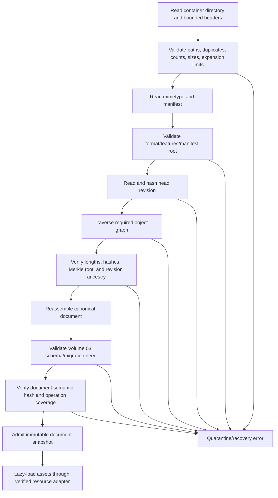

Preview metadata may be shown in an untrusted/read-only file picker before full admission. Mutable editing begins only after all required canonical JSON objects are loaded, verified, reassembled, and validated. Large asset bytes remain lazy because their descriptors and hashes are already admitted. A partial slide JSON cannot become a second partial canonical document.

### `SM-06-001` Package open

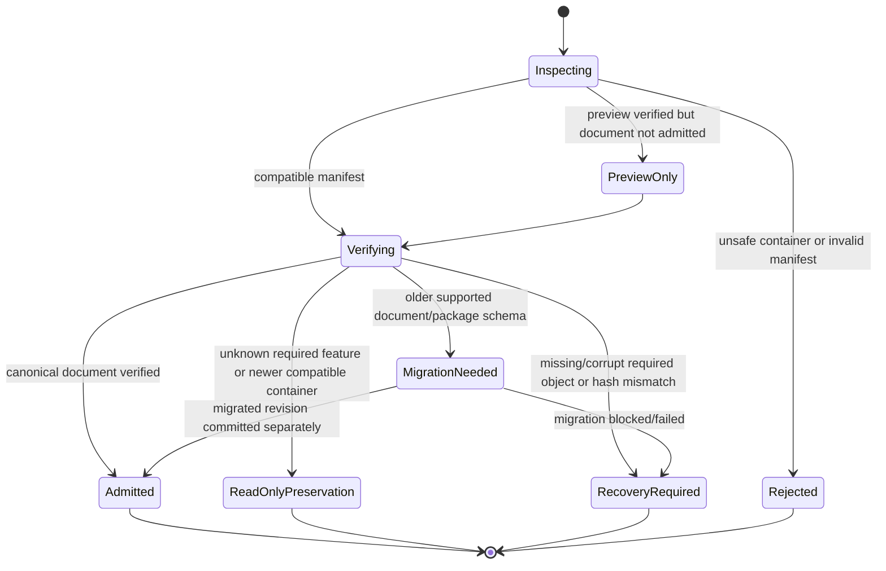

### Nil, empty, and error paths

| Condition | Required behavior |
|---|---|
| Zero-byte file | Reject as incomplete; search journals/provider history before declaring no recovery |
| Valid empty presentation | Admit when canonical root and required empty collections validate |
| Missing optional preview/cache | Ignore and regenerate lazily |
| Corrupt optional preview/cache | Discard, diagnose, regenerate; canonical revision remains valid |
| Missing required shard | Recovery required; no mutable partial admission |
| Missing embedded asset | Admit document only under missing-asset policy; mark resource failure and seek prior/recovery copies |
| Corrupt embedded asset | Integrity failure distinct from missing; never decode as trusted |
| Newer required feature | Read-only preservation or refusal; never lossy mutable save |
| User cancels open | No current document/handle mutation and no error classification |
| Permission lost after manifest | Stop reads, preserve local state, offer reauthorization/copy; do not treat as corruption |

## 6. Copy-on-Write Save and Atomic Publication

### `SCH-06-007` Save intent and journal

```ts
type SaveIntent = {
  saveId: UUIDv7;
  packageLineageId: UUIDv7;
  documentId: DocumentId;
  source: {
    acceptedDocumentRevisionId: RevisionId;
    acceptedTransactionSequence: NonNegativeInteger;
    documentSemanticHash: SemanticHash;
  };
  expectedDestination: {
    packageRevisionId: PackageRevisionId | null;
    providerVersionToken: string | null;
  };
  targetPackageRevisionId?: PackageRevisionId;
  candidateRef?: DurableLocalObjectRef;
  stagedObjectHashes: ObjectHash[];
  lease?: { leaseId: UUID; fencingToken: NonNegativeInteger };
  state: "planned" | "staging" | "candidate-verified" | "publishing" |
         "outcome-unknown" | "committed" | "conflict" | "failed" | "abandoned";
  attempt: PositiveInteger;
  failure?: { code: string; retryable: boolean };
  integrity: ObjectHash;
};
```

The journal is stored atomically in durable local recovery storage before publication. It contains no credentials or ephemeral signed URLs. Changes to journal state are append-new-record or transactional replacement; the journal itself cannot become the only copy of canonical content.

### `FLOW-06-002` Save pipeline

```mermaid
sequenceDiagram
    participant M as Mutation authority
    participant S as Save coordinator
    participant O as Object staging store
    participant V as Candidate verifier
    participant L as Cross-tab lease
    participant P as Destination provider
    M-->>S: immutable accepted revision Dn and hash
    S->>S: create durable save journal and pin Dn
    S->>O: canonicalize/shard; reuse verified hashes; stage missing objects
    O-->>S: complete object closure
    S->>O: assemble a new complete .str candidate
    S->>V: close, reopen, hash, reassemble, validate
    V-->>S: verified package revision Rn
    S->>L: acquire/renew fenced write lease
    L-->>S: fencing token f
    S->>P: publish Rn if expected head/provider token and fence are current
    alt committed
      P-->>S: durable receipt and new version token
      S->>P: read head/receipt and verify Rn
      S->>S: mark journal committed; update saved watermark; release pins
    else conflict
      P-->>S: current head/version
      S->>S: mark conflict; preserve candidate and both heads
    else response lost
      S->>S: mark outcome unknown
      S->>P: query by save ID/head/version before retry
    end
```

Save assembly may copy verified unchanged compressed entry bytes into a new candidate for performance. It must still create a new central directory and complete archive, verify each copied object's decoded hash, and leave the prior committed archive untouched.

No pre-save pause or collaborator flush defines correctness. The save captures the latest authority-accepted revision available at snapshot time. Later accepted local/remote operations remain outside the saved watermark and schedule another save.

### `SM-06-002` Save lifecycle

```mermaid
stateDiagram-v2
    [*] --> Planned
    Planned --> Staging: journal durable and source pinned
    Staging --> CandidateVerified: complete candidate reopens and validates
    Staging --> Failed: assembly/hash/quota failure
    CandidateVerified --> Publishing: lease and expected head acquired
    Publishing --> Committed: atomic publish receipt verified
    Publishing --> Conflict: expected head/version/fence mismatch
    Publishing --> OutcomeUnknown: disconnect or ambiguous response
    OutcomeUnknown --> Committed: head/save lookup proves commit
    OutcomeUnknown --> Conflict: different head proves no safe retry
    OutcomeUnknown --> Publishing: destination proves request unseen; retry same save ID
    CandidateVerified --> Abandoned: user cancels before publication
    Failed --> Staging: retryable condition resolved, same frozen source
    Conflict --> Abandoned: branch disposition recorded
    Committed --> [*]
    Abandoned --> [*]
```

### `SCH-06-008` Provider capability profile

```ts
type StorageProviderCapabilities = {
  providerId: string;
  profileVersion: string;
  objectModel: "filesystem" | "opaque-file" | "immutable-object-store";
  atomicReplace: boolean;
  conditionalWrite: "none" | "etag" | "generation" | "lease-and-generation";
  immutableCreate: boolean;
  atomicRename: boolean;
  durableClose: "documented" | "unknown";
  readAfterWrite: "strong" | "eventual";
  versionHistory: boolean;
  resumableUpload: boolean;
  rangeRead: boolean;
  serverIntegrity: "sha256" | "other" | "none";
  maximumObjectBytes?: integer;
  maximumRequestBytes?: integer;
  supportsFencingToken: boolean;
};
```

The adapter derives capabilities from documented provider guarantees and verified probes, not API method names. `createWritable().close()`, `replace`, `upload`, or a conflict-behavior flag does not imply atomicity or conditional safety without a declared guarantee.

### `SCH-06-009` Safe publication strategies

| Tier | Required provider guarantees | Publication protocol |
|---|---|---|
| A: revision/head store | immutable create + conditional head write | Upload missing immutable objects/revision; compare-and-swap head from expected token to new revision; verify head |
| B: atomic filesystem | sibling temporary file + durable close + atomic replace/rename | Write complete candidate to sibling temp; flush/close; reopen verify; atomically replace target; reopen target; retain prior backup until receipt |
| C: conditional opaque file | full-object conditional replace + provider version history or verified local recovery | Upload complete candidate with `If-Match`/generation; verify returned/current revision; preserve prior provider/local revision |
| D: unsafe destination | neither atomic replace nor conditional write | Create a new sibling/conflict copy; never overwrite sole verified object; update user-visible binding only after explicit safe choice |

In all tiers, staging and candidate assembly are copy-on-write. A logical head is one atomic pointer/version decision. Multiple file writes that can expose a mix of revisions are forbidden.

### `INV-06-008` Old-or-new visibility

After any crash or observer read during publication, a safe destination exposes either the complete verified prior head or the complete verified new head, never a mixture or truncated sole copy.

### `INV-06-009` Candidate isolation

Candidate paths/object IDs are not treated as current head by readers, recents, collaborators, or cleanup until publication succeeds.

### `INV-06-010` Saved watermark accuracy

`externallySavedThroughSequence` advances only after verified durable publication. Local checkpoint completion, upload progress, writable close without durable receipt, or optimistic UI cannot advance it.

### `INV-06-011` Ambiguous response safety

After timeout/disconnect, the same save is neither blindly repeated as a new revision nor declared failed. Outcome lookup by save/revision ID and destination head/version precedes retry or conflict handling.

## 7. Cross-Tab and Cross-Process Ownership

### `SCH-06-010` Fenced storage lease

```ts
type StorageLease = {
  packageLineageId: UUIDv7;
  leaseId: UUID;
  ownerSessionId: UUID;
  fencingToken: NonNegativeInteger;
  expiryMode: "renewable" | "callback-scoped";
  acquiredAt: IsoUtcInstant;
  expiresAt?: IsoUtcInstant;
  expectedPackageRevisionId: PackageRevisionId | null;
  state: "active" | "released" | "expired";
};
```

Lease acquisition occurs in a shared atomic coordinator (for example, a callback-scoped exclusive Web Lock plus transactional durable fencing counter). Every successful acquisition increments the fencing token. Renewable leases use heartbeats to extend liveness but cannot lower/reuse a token. Callback-scoped locks have no wall-clock expiry and cannot be reissued while their publication callback remains active. Destination publication uses one of two final guards:

1. providers with conditional writes compare expected head/version and the current fence/generation atomically;
2. atomic local filesystems hold a non-overlapping callback-scoped publication lock through close, atomic replace, and readback verification.

If neither final guard exists, the destination is Tier D and receives a sibling/conflict copy rather than an overwrite.

BroadcastChannel, storage events, heartbeats, timestamps, tab age, and random election delays are notification/liveness mechanisms only. They do not provide mutual exclusion or durability.

### `SM-06-003` Cross-tab writer

```mermaid
stateDiagram-v2
    [*] --> Observer
    Observer --> LeaseCandidate: save/checkpoint publication requested
    LeaseCandidate --> Writer: atomic lease and new fence acquired
    LeaseCandidate --> Follower: another current writer exists
    Writer --> Writer: stage/verify with lease renewal
    Writer --> FencedOut: renewable lease expires or newer token/head observed
    Writer --> Observer: publish complete and lease released
    Writer --> Observer: failure before publish, lease released
    Writer --> FencedOut: publication guard cannot be retained
    Follower --> LeaseCandidate: current writer releases/expires
    FencedOut --> Observer: preserve candidate; no publication
```

Followers may submit save requests and document operations through their proper channels. They cannot write the same local checkpoint head or external destination directly while another publication guard is current. If no atomic shared lease is available, tabs use single-writer mode; additional tabs are read-only or work on explicit forks with separate lineage.

### `INV-06-012` Fence monotonicity

A fencing token is never reused for a lineage. Under a CAS provider, any write from token $f$ is rejected after token $g > f$ exists, regardless of delayed heartbeat or network completion. Under callback-scoped local publication, token $g$ cannot be issued until the guarded publication for $f$ finishes or its context releases the lock.

### `FLOW-06-003` Fenced publish

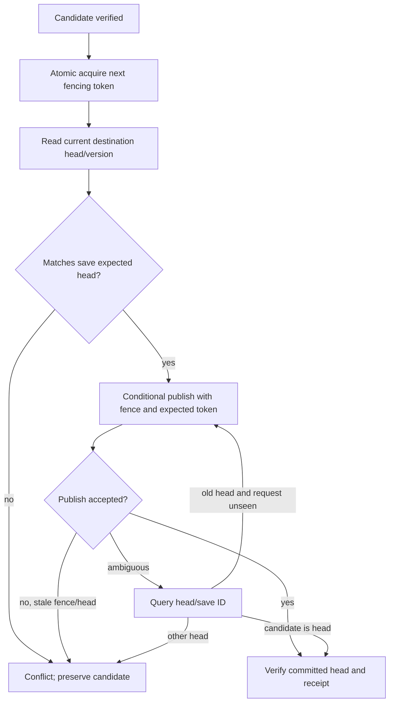

## 8. Asset Lifecycle

### `SCH-06-011` Asset storage record and pins

```ts
type StoredAssetObject = {
  assetId: `sha256:${LowerHex64}`;
  objectRef: ObjectRef<string>;
  detectedMediaType: string;
  declaredMediaType?: string;
  byteLength: NonNegativeInteger;
  validationProfile: string;
  securityState: "verified" | "quarantined" | "blocked";
  provenance?: {
    relation: "original" | "optimized-variant" | "poster" | "proxy" |
              "transcode" | "generated";
    sourceAssetIds: AssetId[];
    processProfile?: string;
  };
};

type AssetPin = {
  pinId: UUID;
  assetId: AssetId;
  reason: "live-document" | "package-revision" | "history-inverse" |
          "pending-transaction" | "recovery-checkpoint" | "save-candidate" |
          "upload-session" | "unknown-preservation" | "explicit-retention";
  ownerId: string;
  expiresAt?: IsoUtcInstant;
};
```

Reference counts may be cached but are not authority. The mark set is rebuilt from verified roots and pins. An object URL is a disposable runtime handle to verified bytes and has no persistence/reference meaning.

### `FLOW-06-004` Asset import and registration

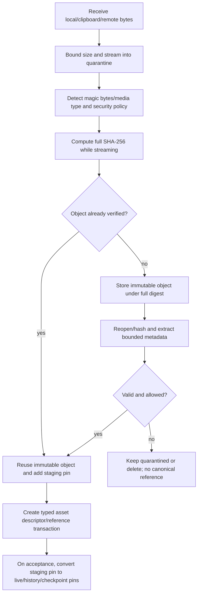

Remote URLs are fetched under Volume 13 trust/CORS/redirect/size policy. Declared MIME and filename extension are hints only. SVG, fonts, code, archives, and media parsers run under bounded sanitization/decoder policy. Hashing uses full decoded source bytes, not metadata or filename.

### `SM-06-004` Asset lifecycle

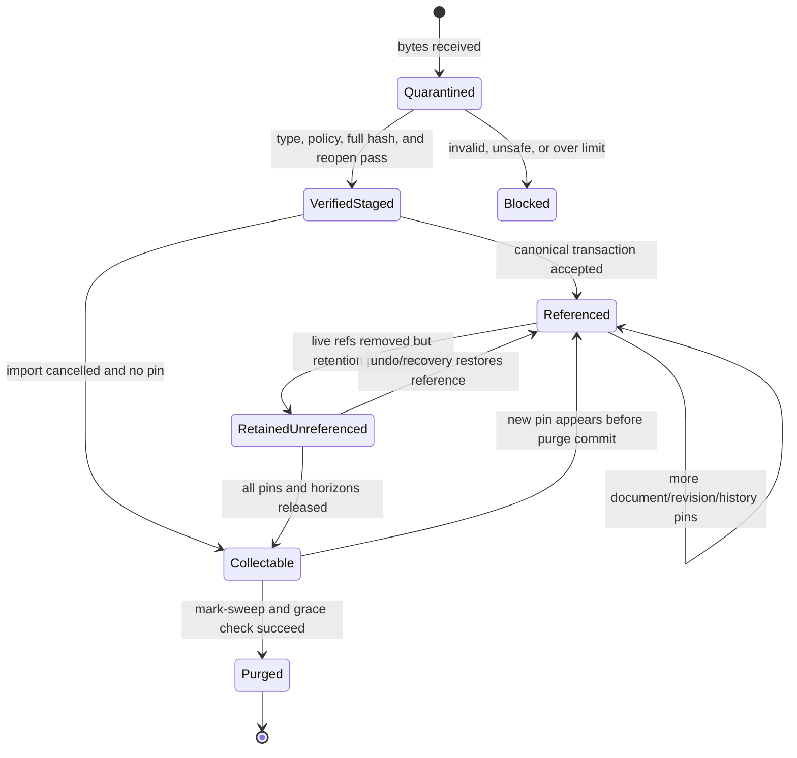

### `INV-06-013` Asset-before-reference

No accepted document state may introduce an embedded asset ID whose verified bytes are absent from durable local staging or an immutable remote object reachable by recovery.

### `INV-06-014` Original preservation

Optimization, poster extraction, thumbnailing, transcoding, color conversion, and proxy generation create new asset identities. They do not overwrite the original or silently redirect its ID.

### `INV-06-015` GC root completeness

Garbage collection marks from every live canonical head, retained package revision, history inverse, tombstone recovery payload, pending transaction, checkpoint, save candidate, upload session, unknown preserved object, and explicit retention policy before sweeping.

### `INV-06-016` GC race safety

Mark set and sweep commit are generation/fence protected. An asset pinned after marking but before deletion prevents deletion or is recoverable from an immutable lower tier.

### Linked assets

Linked assets keep canonical descriptors and optional embedded fallback, but access tokens/signed URLs are runtime provider state. On open/render, a linked asset may be `ready`, `offline`, `permission-denied`, `changed-integrity`, `missing`, or `blocked`. Relink changes the locator/integrity through a transaction. Embed copies verified bytes to a content-addressed object and changes storage mode through a transaction. Cache eviction does not alter the linked descriptor.

## 9. Local Checkpoints and Autosave

### `SCH-06-012` Recovery checkpoint

```ts
type RecoveryCheckpoint = {
  kind: "story.recovery-checkpoint";
  checkpointVersion: PositiveInteger;
  checkpointId: `sha256:${LowerHex64}`;
  documentId: DocumentId;
  packageLineageId: UUIDv7 | null;
  basePackageRevisionId: PackageRevisionId | null;
  acceptedDocumentRevisionId: RevisionId;
  acceptedThroughSequence: NonNegativeInteger;
  acceptedDocumentSemanticHash: SemanticHash;
  canonicalRootObjectRef: ObjectRef<"application/vnd.story.document-root+json">;
  pendingTransactions: Array<{
    transactionId: TransactionId;
    transactionDigest: ObjectHash;
    state: "queued-offline" | "in-flight" | "outcome-unknown" | "needs-resolution";
    objectRef: ObjectRef<"application/vnd.story.transaction+json">;
  }>;
  stagedAssetIds: AssetId[];
  reason: "debounced" | "interval" | "visibility-change" | "before-risky-action" |
          "before-migration" | "before-publish" | "manual";
  createdAt: IsoUtcInstant;
  integrity: { objectGraphRootHash: MerkleRootHash };
};
```

Checkpoint IDs derive from canonical payload excluding display time/reason where specified. Pending transaction bytes and states are preserved exactly under Volume 04; a checkpoint never promotes pending intent to accepted document content. Credentials, presence, selection, provider handles, and decoded assets are excluded.

Local checkpoint storage uses transactional object/head publication equivalent to Tier A: immutable objects/checkpoint first, then atomic compare-and-swap of the checkpoint head. A single overwritten IndexedDB blob without revision/journal retention is insufficient.

### `SM-06-005` Autosave durability

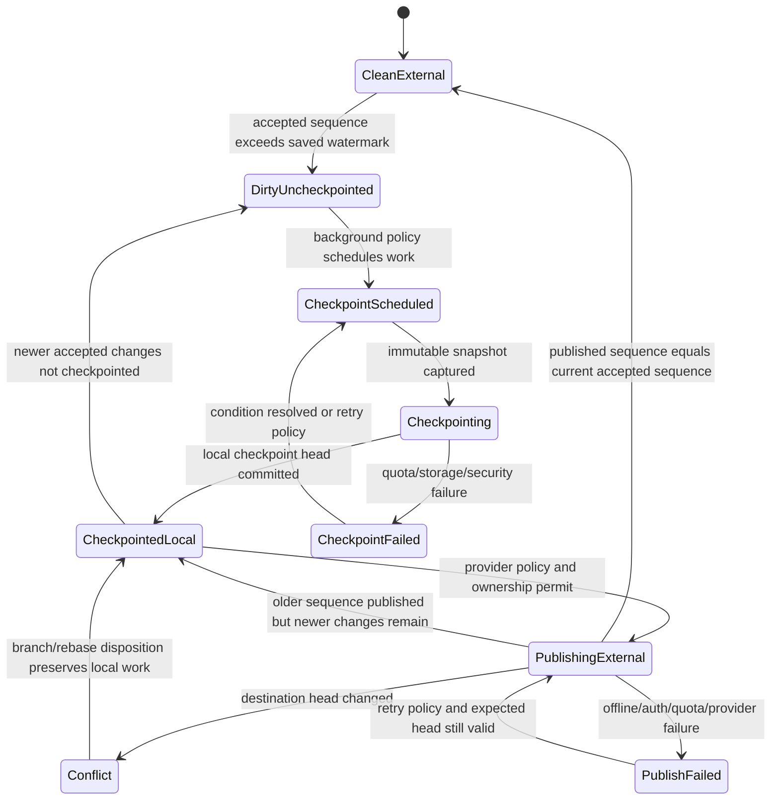

UI wording is owned by Volume 02, but it cannot label `CheckpointedLocal` as externally saved. `beforeunload` is a last warning, not the checkpoint mechanism; periodic/debounced checkpoints must make ordinary crash recovery independent of synchronous unload I/O.

### `FLOW-06-005` Changes during save

```mermaid
sequenceDiagram
    participant M as Mutation engine
    participant A as Autosave coordinator
    participant P as Publisher
    M-->>A: accepted sequence 40; mark dirty
    A->>A: freeze/checkpoint sequence 40
    A->>P: publish package for sequence 40
    M-->>A: accepted sequence 41 while publish runs
    A->>A: retain dirty watermark 41 and schedule next checkpoint
    P-->>A: sequence 40 durably committed
    A->>A: savedThrough=40; current=41; remain dirty
```

### `INV-06-017` Checkpoint monotonicity

For one branch, a checkpoint head cannot move to lower accepted sequence or lose pending transaction coverage unless an explicit branch/recovery decision creates a new lineage.

### `INV-06-018` In-flight snapshot isolation

An in-flight checkpoint/save owns immutable object references. New document edits or asset imports cannot mutate its bytes or closure.

### `INV-06-019` One coordinator, many triggers

Manual save, debounce, interval, visibility change, pre-migration, pre-publish, and recovery save enqueue through one coordinator. They may supersede an unstarted older snapshot, but cannot mutate or race an active candidate publication.

## 10. Cloud Publication and Conflict Handling

For an immutable object provider, objects upload by content hash and are safe to retry. The small head record is the only conditional mutation. For an opaque file provider, the complete `.str` candidate uploads as one object under a save ID and conditional version token. Multipart chunks are staging, never visible head.

### `SCH-06-013` Durable save receipt

```ts
type SaveReceipt = {
  saveId: UUIDv7;
  providerId: string;
  destinationOpaqueId: string;
  packageLineageId: UUIDv7;
  packageRevisionId: PackageRevisionId;
  documentSemanticHash: SemanticHash;
  acceptedThroughSequence: NonNegativeInteger;
  previousVersionToken: string | null;
  committedVersionToken: string;
  fencingToken?: NonNegativeInteger;
  committedAt: IsoUtcInstant;
  providerIntegrity?: string;
  verification: "head-readback" | "provider-strong-receipt" | "full-readback";
};
```

Opaque provider IDs and version tokens are runtime/recovery metadata, not portable document content. Receipts are stored in protected local metadata and may be mirrored in provider revision metadata where safe.

### `SM-06-006` Cloud publication

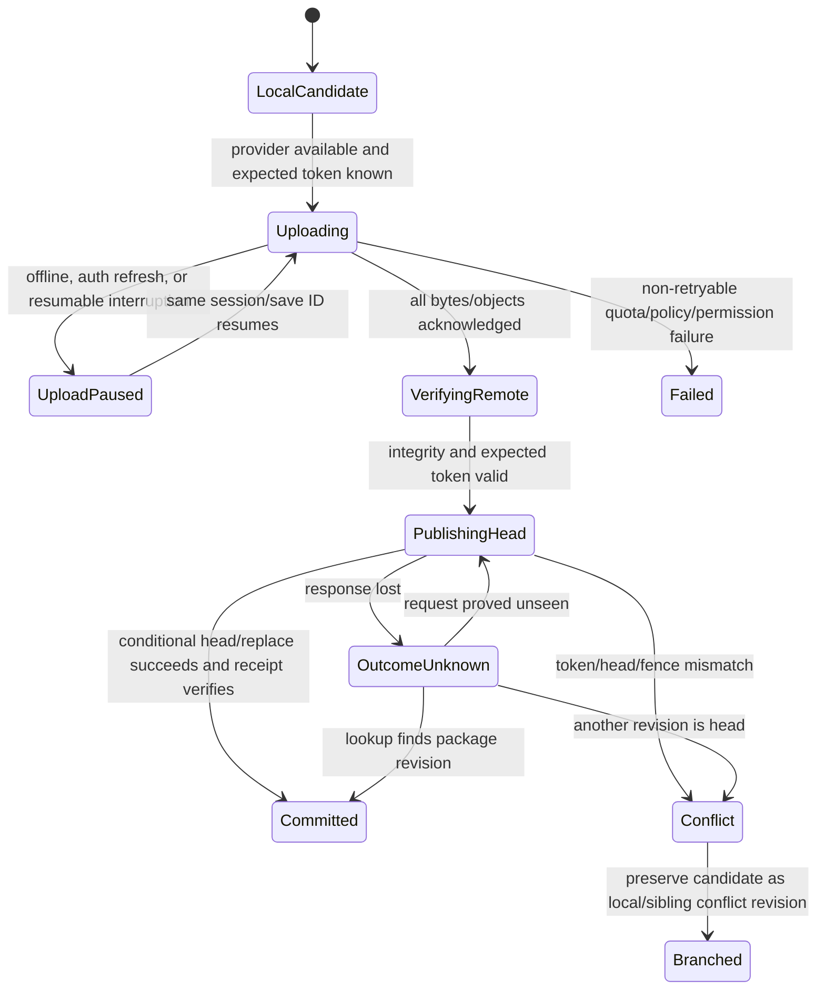

### Conflict classification

| Relationship | Safe automatic action |
|---|---|
| Remote head equals expected head | Publish candidate conditionally |
| Remote head equals candidate revision | Treat ambiguous request as committed after verification |
| Candidate accepted document revision is strict descendant of remote head and no unknown external edits | Rebuild candidate with remote package parent, then conditional publish |
| Remote accepted document revision is strict descendant of candidate | Keep local pending intent/checkpoint, update base, rebase via Volume 04/07, create new candidate |
| Same semantic document hash but different package encoding | Adopt/record current head; no content conflict |
| Divergent accepted operation ancestry | Preserve both; operation-level merge or explicit branch decision |
| Different document/package lineage at same filename/ID | Never overwrite; create conflict copy or require explicit replacement |
| Remote bytes corrupt or unverifiable | Preserve local candidate and remote evidence; recover through provider history/local checkpoints |

ZIP entry-level or JSON last-writer merge is forbidden. Conflict resolution occurs at accepted operations/canonical document entities, then creates a new complete revision.

### `INV-06-020` Conditional cloud write

Every mutable cloud head/file replacement carries the exact version/generation read for the save intent. A provider adapter that cannot do this uses Tier D.

### `INV-06-021` Resumable identity

Resuming upload cannot change candidate revision, expected destination token, chunk hashes, total length, or save ID. Any content change starts a new save intent/upload session.

## 11. Recovery and Rollback

### `SCH-06-014` Recovery candidate and classification

```ts
type RecoveryCandidate = {
  candidateId: string;
  source: "committed-head" | "provider-version" | "local-checkpoint" |
          "save-candidate" | "conflict-copy" | "manual-file";
  locationRef: ProtectedRuntimeRef;
  packageLineageId: UUIDv7 | null;
  packageRevisionId: PackageRevisionId | null;
  acceptedDocumentRevisionId: RevisionId;
  acceptedThroughSequence: NonNegativeInteger;
  documentSemanticHash: SemanticHash;
  pendingTransactionIds: TransactionId[];
  verification: "valid" | "partial" | "corrupt" | "incompatible" | "unavailable";
  relationshipToCommitted: "identical" | "ancestor" | "descendant" | "divergent" |
                           "different-lineage" | "unknown";
  diagnostics: Diagnostic[];
};
```

### `SM-06-007` Recovery selection

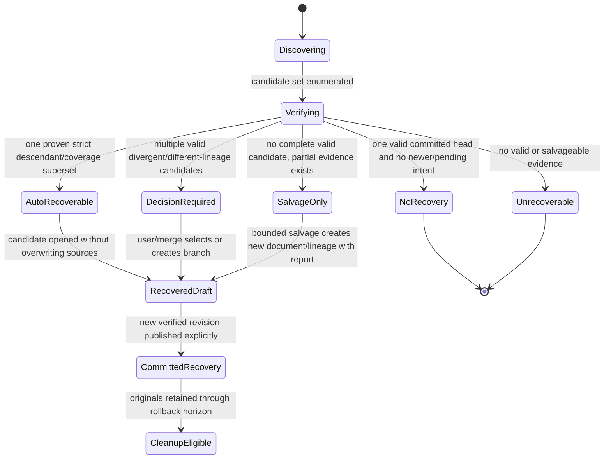

Auto-recovery is legal only when the selected candidate is a verified descendant or operation-coverage superset of every other candidate in the same branch and has no missing eligible pending transaction. Newer wall-clock time, larger file, greater sequence without valid ancestry, or provider precedence alone is insufficient.

Recovery opens a draft/branch first. It does not replace the committed head until the recovered canonical document, assets, pending intent disposition, and new candidate pass normal save validation. Source candidates and journals remain pinned through the rollback horizon.

### `FLOW-06-006` Interrupted-save recovery

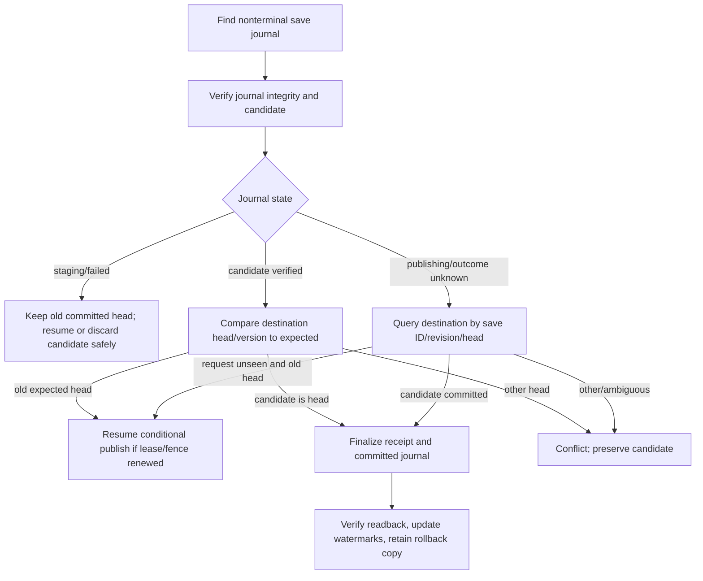

### Rollback

Rollback does not mutate an old revision. It selects a verified prior package/document revision and publishes a new child revision whose canonical content matches that prior semantic state, with a fresh package revision and audit link. Pending newer work is preserved as a checkpoint/branch until explicitly discarded.

### `INV-06-022` Recovery source preservation

Recovery, migration, rollback, and salvage never rewrite the only source evidence. Output is a new object/revision/lineage until verified publication succeeds.

### `INV-06-023` No timestamp winner

File modification time, checkpoint creation time, upload completion time, or provider clock cannot establish semantic ancestry or choose a recovery winner.

### `INV-06-024` Salvage honesty

Salvage reports every missing, corrupt, substituted, omitted, and preservation-only object/address. It cannot present a partial recovered document as a lossless reopen.

## 12. Migration, Retention, and Garbage Collection

Package migration may change manifest, revision, sharding, encoding, or object paths. Document migration follows Volume 03. Both use this sequence:

1. pin and verify source revision;
2. create pre-migration checkpoint;
3. run pure/versioned migration into new objects;
4. validate target package and canonical document;
5. compare required semantic preservation and unknown objects;
6. publish a new package revision conditionally;
7. retain source revision and migration report through rollback horizon.

### `SCH-06-015` Retention roots and sweep plan

```ts
type RetentionRoot = {
  rootId: string;
  kind: "head" | "provider-version" | "checkpoint" | "history" | "pending" |
        "candidate" | "conflict" | "migration-source" | "explicit-policy";
  objectHashes: ObjectHash[];
  assetIds: AssetId[];
  releaseCondition: string;
};

type SweepPlan = {
  generation: NonNegativeInteger;
  fencingToken: NonNegativeInteger;
  rootsHash: ObjectHash;
  markedObjectHashes: ObjectHash[];
  proposedDeletes: ObjectHash[];
  graceNotBefore: IsoUtcInstant;
};
```

Cleanup first recomputes roots, then marks transitively, builds a proposed plan, waits the policy grace period, rechecks roots under a current fence, and deletes only still-unreachable immutable objects. Provider version deletion additionally respects provider retention/legal-hold policy. Cache eviction is separate and may remove reproducible cache objects at any time.

### `SM-06-008` Garbage collection

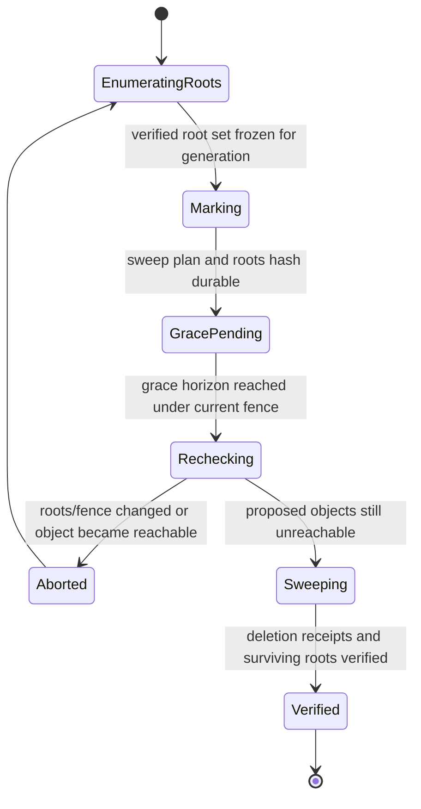

### `INV-06-025` Cleanup after durable successor

A prior candidate, checkpoint, revision, or asset cannot be released merely because a newer save started. The successor must be committed and verified, and all history/collaboration/recovery/unknown-data pins must be released.

### `INV-06-026` Cache is not recovery

An evictable LRU/file cache cannot be the sole holder of accepted content, pending transactions, staged asset bytes required by accepted state, or the latest recovery checkpoint.

## 13. Security and Resource Limits

Before expensive extraction or decode, readers enforce a versioned limits profile covering:

- maximum archive bytes, entry count, path length, nested object depth, JSON bytes, string length, and entity count;
- maximum per-entry decoded bytes, total decoded bytes, and compression expansion ratio;
- duplicate/local-header/central-directory consistency, overlapping ranges, unsupported data descriptors, CRC plus SHA-256, and ZIP64 bounds;
- no traversal, links, devices, executable auto-launch, network fetch during parse, or extension execution;
- media signature/MIME agreement, image dimensions/pixel count, font tables/glyph limits, SVG sanitization, code/embed isolation, and decoder time/memory budgets;
- cancellation and streaming backpressure for hashing, download, upload, extraction, migration, and verification.

Password/encryption, signatures, enterprise retention, and key management are defined with Volume 13. Until a profile is accepted, encrypted `.str` entries are unsupported and must not be mistaken for corruption. Package signatures never replace object hash/schema validation.

### `INV-06-027` Bounded failure

Malformed or adversarial input cannot cause unbounded memory, disk, CPU, decompression, recursion, network fetch, object creation, or diagnostic cardinality.

### `INV-06-028` Secrets stay external

OAuth tokens, refresh tokens, cookies, signed URLs, provider SDK state, local file handles, cross-tab channel secrets, and encryption keys are stored only in their protected runtime facilities and are never serialized into portable `.str`, canonical document, previews, or telemetry.

## 14. Observation Contracts

Volume 14 owns thresholds. These bounded hooks are mandatory:

| ID | Hook | Required dimensions and measurements |
|---|---|---|
| `OBS-06-001` | `storage.open_verify` | package profile, byte/entity/asset-count buckets, manifest/object/document/hash phases, outcome/recovery class |
| `OBS-06-002` | `storage.checkpoint` | reason, accepted-sequence lag bucket, bytes/objects reused/written, duration, quota/failure outcome |
| `OBS-06-003` | `storage.save_publish` | provider capability tier, snapshot-to-stage/verify/publish/readback durations, bytes reused/uploaded, outcome |
| `OBS-06-004` | `storage.asset` | import/load/verify/GC action, media-type class, byte bucket, dedupe/cache tier, outcome |
| `OBS-06-005` | `storage.conflict_recovery` | candidate-count bucket, ancestry class, automatic/decision/salvage outcome, data-loss diagnostic count |
| `OBS-06-006` | `storage.cross_tab` | lease acquisition latency, contention, fence rejection, stale-writer prevention, save-request outcome |

Document/package/entity/asset/user/provider object IDs, filenames, paths, URLs, content, notes, comments, credentials, and exact file sizes are prohibited telemetry dimensions. Evidence records may contain protected hashes/addresses under Volume 13/15 access policy; telemetry may not.

## 15. Acceptance Criteria

By normative mapping, each `AC-06-NNN` evaluates exactly `REQ-06-NNN`; the shared suffix is the bidirectional requirement-to-acceptance link.

| ID | Pass condition |
|---|---|
| `AC-06-001` | Content sniffing accepts only the canonical media type/manifest family; extension-only, wrong-format, and preference `.str` fixtures are distinguished. |
| `AC-06-002` | Package fixtures enforce required paths and reject traversal, aliases, duplicates, links, devices, and unindexed required entries. |
| `AC-06-003` | Missing, duplicate, malformed, wrong-lineage, and wrong-head manifests fail without partial admission. |
| `AC-06-004` | Revision fixtures verify parent links, accepted document revision/sequence, optional collaboration epoch/coverage, semantic hash, roots, features, and self-derived revision ID. |
| `AC-06-005` | Canonical JSON and binary fixtures detect one-byte corruption, wrong length, wrong media type, truncated digest identity, and hash/path substitution. |
| `AC-06-006` | Multiple shard sizes, paths, compression levels, and ZIP orders reconstruct byte-equivalent semantic projections and identical document hashes. |
| `AC-06-007` | Fault injection at every open phase prevents mutable admission and yields exact safe recovery/read-only/rejection outcomes. |
| `AC-06-008` | A future-compatible package survives known document edits and save/open with unknown fields/objects byte- or semantic-hash equivalent as required. |
| `AC-06-009` | Deleting/corrupting every preview/cache entry leaves canonical validation unchanged; a forged preview cannot override title/content/assets. |
| `AC-06-010` | Saving revision $n$ while revisions $n+1$ and $n+2$ commit publishes exactly $n$ and leaves later sequences dirty. |
| `AC-06-011` | Instrumented/fault-injected saves prove the committed source package is never opened for append, partial patch, or pre-verification truncate. |
| `AC-06-012` | Candidate corruption at each entry/header/object/hash/schema point blocks publication while the old head remains verified. |
| `AC-06-013` | Tier A/B/C crash tests at every write boundary expose exactly old or new verified head and reject stale expected tokens. |
| `AC-06-014` | Tier D fixtures create a sibling/conflict copy and never overwrite the only verified destination. |
| `AC-06-015` | Lost-response fixtures query by save/revision ID and classify committed, unseen-retryable, or conflict without duplicate application. |
| `AC-06-016` | Saved/checkpoint watermarks remain behind current accepted sequence whenever edits arrive during work. |
| `AC-06-017` | Provider contract tests prove each declared capability; strategy selection refuses stronger guarantees than the profile declares. |
| `AC-06-018` | External modification between snapshot and publish yields conflict with both candidates preserved and no unconditional overwrite. |
| `AC-06-019` | Multipart interruption/resume fixtures preserve save ID, candidate bytes, expected token, chunk map, and final full hash. |
| `AC-06-020` | Two headed browser tabs contend under CAS and callback-scoped local-file profiles; only the currently fenced/guarded writer publishes and followers receive the outcome. |
| `AC-06-021` | A paused old leader resumes after lease expiry/new fence and is rejected by fence/head checks without overwriting. |
| `AC-06-022` | Asset fixtures cover magic-byte mismatch, spoofed MIME, oversize, corrupt decoder input, unsupported type, duplicate bytes, and full-hash collision handling. |
| `AC-06-023` | Killing the app after asset-reference acceptance at each boundary still recovers verified bytes or prevents the reference transaction from acceptance. |
| `AC-06-024` | Original, variant, poster, proxy, and transcode fixtures have distinct hashes, explicit provenance, and no silent ID redirection. |
| `AC-06-025` | Mark-sweep fixtures retain assets referenced only by each root/pin family and purge only after every root/horizon is released. |
| `AC-06-026` | Linked-asset fixtures distinguish ready, offline, permission, integrity-change, missing, blocked, relink, embed, and fallback behavior. |
| `AC-06-027` | Interaction latency capture proves document commits only enqueue checkpoint work; hashing/serialization/provider I/O occurs off the interaction hot path. |
| `AC-06-028` | Crash/reopen checkpoints preserve accepted hash/sequence, pending transaction IDs/states, staged assets, lineage, and integrity without runtime state. |
| `AC-06-029` | State-machine tests never label local-only checkpoint as external save and distinguish conflict, blocked, quota, auth, offline, and failure. |
| `AC-06-030` | Concurrent manual/autosave triggers serialize publication, supersede only unstarted snapshots, and leave active candidate bytes immutable. |
| `AC-06-031` | Recovery discovery enumerates committed, prior provider, checkpoint, journal candidate, and conflict-copy fixtures and verifies each independently. |
| `AC-06-032` | Auto-recovery occurs only for a proven descendant/coverage superset; timestamp-only and sequence-without-ancestry candidates require decision. |
| `AC-06-033` | Divergent valid candidates remain reopenable after branch choice/merge and no source is deleted before rollback horizon. |
| `AC-06-034` | Every named failure class produces a distinct machine code, preserves recoverable work, and never converts cancel/permission/offline into corruption. |
| `AC-06-035` | Package/document migration fault injection retains source, rejects invalid target, is idempotent, and publishes only a new verified child revision. |
| `AC-06-036` | Cleanup crash/race tests retain old revisions/candidates/checkpoints until successor receipt and all root/pin/horizon checks pass. |
| `AC-06-037` | Equivalent logical packages with different ZIP timestamps/order/compression yield identical object, content-root, revision, and document semantic hashes. |
| `AC-06-038` | Zip-bomb, path, duplicate, overlap, deep JSON, huge dimensions, decoder timeout, cancellation, and backpressure fixtures stay within limits. |
| `AC-06-039` | Package/document scans find no credentials, handles, signed URLs, object URLs, SDK objects, decoded bytes, presence, selection, or cache authority. |
| `AC-06-040` | Telemetry schema tests emit every mandatory bounded hook and reject content, exact identities, paths, filenames, URLs, and credentials. |

## 16. Traceability

| Contract area | Parent capabilities | Primary schemas/invariants | Downstream owner |
|---|---|---|---|
| Native package and integrity | `ARC-032`, `ARC-030`, `PRE-073` | `SCH-06-001` through `SCH-06-006`, `INV-06-001` through `INV-06-007` | Volumes 11, 13, 15 |
| Copy-on-write save | `ARC-030`, `ARC-031` | `SCH-06-007` through `SCH-06-009`, `SM-06-002`, `FLOW-06-002`, `INV-06-008` through `INV-06-011` | Volume 14 |
| Cross-tab/cloud | `ARC-031`, `PRE-061` | `SCH-06-008` through `SCH-06-010`, `SCH-06-013`, `SM-06-003`, `SM-06-006`, `INV-06-012`, `INV-06-020`, `INV-06-021` | Volume 07 |
| Asset lifecycle | `ARC-030`, `ARC-022`, `DES-062` | `SCH-06-011`, `SM-06-004`, `FLOW-06-004`, `INV-06-013` through `INV-06-016` | Volumes 05, 09, 10 |
| Autosave/checkpoints | `ARC-031` | `SCH-06-012`, `SM-06-005`, `FLOW-06-005`, `INV-06-017` through `INV-06-019` | Volume 02 |
| Recovery/migration/cleanup | `ARC-030`, `ARC-031` | `SCH-06-014`, `SCH-06-015`, `SM-06-007`, `SM-06-008`, `FLOW-06-006`, `INV-06-022` through `INV-06-026` | Volumes 07, 13, 15 |

### 16.1 Supersession

Upon acceptance, this volume supersedes conflicting native-file, ZIP-update, serializer, asset, autosave, cache, cloud-save, cross-tab, and recovery claims in active storage/collaboration documents. Existing ZIP generation may remain a candidate-assembly mechanism only. Appending to a live archive, updating selected entries in the sole package, unconditional cloud replacement, timestamp-based leader election, and a single overwritten autosave blob are not conforming durability protocols.

## 17. Open Decisions

Copy-on-write candidate assembly and immutable old-or-new publication are fixed by `REQ-06-011` through `REQ-06-014`, `FLOW-06-002`, and `INV-06-008` through `INV-06-011`; none of the implementation choices below may vary that contract.

| ID | Decision/question | Default in force | Owner | Review trigger | Affected requirements/contracts | Blocking class |
|---|---|---|---|---|---|---|
| `OD-06-001` | What exact ZIP profile should define ZIP64 use, data descriptors, timestamps, and compression methods? | R1 writers emit ZIP32 archives with identity or deflate compression, no data descriptors, and non-semantic normalized timestamps. Content beyond ZIP32 bounds is rejected until a ZIP64 writer profile is accepted. Readers accept only a bounded safe subset, and logical object hashes remain authoritative. | Storage and Interchange Engineering | Before the first R1 native-package writer is accepted or ZIP64/another compression method is enabled | `REQ-06-001`, `REQ-06-002`, `REQ-06-005`, `REQ-06-037`, `REQ-06-038`, `SCH-06-001`, `SCH-06-004`, `INV-06-001` | `R1-blocking` |
| `OD-06-002` | Should portable `.str` retain multiple package revisions or only head plus selected recovery/history revisions? | A portable package contains the immutable head revision and only those predecessor revisions explicitly pinned for recovery or history. Unpinned history is not copied into the portable package and remains governed by verified local or provider retention. | Storage and Product Engineering | Before portable version-history export or an in-package retention profile is implemented | `REQ-06-003`, `REQ-06-004`, `REQ-06-025`, `REQ-06-036`, `SCH-06-003`, `SCH-06-015`, `INV-06-003` | `non-blocking` |
| `OD-06-003` | What shard strategy and maximum canonical JSON object size should writers use? | Writers use the versioned `SCH-06-005` shard map and the active limits profile. They never split at ad hoc byte offsets; if a required canonical object exceeds the declared maximum and has no registered semantic-neutral shard rule, save fails before publication. | Document Model and Storage Engineering | Before the first R1 native-package writer is accepted or a new shard family/object limit is introduced | `REQ-06-005` through `REQ-06-007`, `REQ-06-038`, `SCH-06-004` through `SCH-06-006`, `INV-06-005`, `INV-06-006` | `R1-blocking` |
| `OD-06-004` | Should browser-local durable staging use OPFS, IndexedDB object stores, or a tiered combination? | No backend is authoritative by name. The selected R1 backend must prove immutable objects, transactional or compare-and-swap heads, durable journals, crash recovery, and non-evictable storage semantics in the Volume 06 corpus; until then, no browser-local durable-checkpoint claim is allowed. | Storage Engineering | Before R1 browser-local checkpoint and interrupted-save recovery evidence is accepted | `REQ-06-010` through `REQ-06-013`, `REQ-06-023`, `REQ-06-027`, `REQ-06-028`, `SCH-06-007`, `SCH-06-012`, `INV-06-009` | `R1-blocking` |
| `OD-06-005` | Which capability guarantees and safe publication tier apply to each File System Access, OneDrive, Google Drive, or future provider adapter? | Every unproven capability is `false` or `unknown`, selecting the weakest safe tier in `SCH-06-009`. An adapter moves to a stronger tier only after its exact versioned capability profile passes contract probes. | Storage Integrations Engineering | Before enabling write publication for a provider or changing its API/capability profile | `REQ-06-013` through `REQ-06-021`, `SCH-06-008` through `SCH-06-010`, `INV-06-008` through `INV-06-012` | `pre-implementation` |
| `OD-06-006` | What encryption, signature, enterprise key, and retention profiles should `.str` support? | Encrypted entries and package signatures are unsupported until an explicit Volume 13 profile is accepted. Required SHA-256 object checks, schema validation, and semantic-hash validation always run and cannot be replaced by encryption or signatures. | Security and Storage Engineering | Before encrypted or signed `.str` packages, managed keys, or enterprise retention are advertised | `REQ-06-005`, `REQ-06-007`, `REQ-06-038`, `REQ-06-039`, `SCH-06-004`, `INV-06-005`, `INV-06-027`, `INV-06-028` | `non-blocking` |
| `OD-06-007` | What retention durations and storage quotas apply to recovery checkpoints, provider versions, and migration sources by document profile? | The latest valid checkpoint, committed head, unresolved conflict copies, eligible pending intent, active save candidates, and migration sources remain pinned until a profile explicitly releases them. Quota pressure never deletes a pinned root; it blocks new storage work with a distinct recoverable outcome. | Storage, Product, and Quality Engineering | Before automatic retention cleanup is enabled or an R1 storage-quota profile is accepted | `REQ-06-025`, `REQ-06-028`, `REQ-06-031` through `REQ-06-036`, `SCH-06-014`, `SCH-06-015`, `INV-06-015`, `INV-06-022`, `INV-06-025` | `R1-blocking` |
| `OD-06-008` | How should Save As affect package lineage and document/collaboration identity? | R1 exposes three explicit operations: **Move location**, **Create linked fork**, and **Create independent copy**. The selected operation declares every retained or regenerated identity before mutation; changing only the filename never changes lineage or identity. | Product Architecture, Collaboration, and Storage Engineering | Before Save As ships or a fourth identity disposition is proposed | `REQ-06-004`, `REQ-06-015`, `REQ-06-033`, `SCH-06-003`, `SCH-06-013`, `INV-06-004` | `non-blocking` |
| `OD-06-009` | Should managed cloud storage expose native immutable object/head form or store only portable opaque `.str` blobs? | Portable opaque `.str` is the interoperability baseline. A managed provider may use native immutable objects and a conditional head internally only when export and import reproduce the same verified portable package semantics and hashes. | Cloud Storage and Interchange Engineering | Before selecting the production managed-cloud persistence model | `REQ-06-001` through `REQ-06-008`, `REQ-06-013`, `REQ-06-018`, `SCH-06-001` through `SCH-06-009`, `INV-06-006` | `pre-implementation` |
| `OD-06-010` | What chunk-verification scheme should seekable large media use before final whole-object SHA-256 completes? | Until a registered chunk profile is accepted, media becomes ready and committable only after full-object SHA-256 verification. Range-read or uploaded chunks remain explicitly unverified and cannot satisfy asset-before-reference. | Media and Storage Engineering | Before progressive readiness or resumable verification is enabled for large media | `REQ-06-005`, `REQ-06-019`, `REQ-06-022`, `REQ-06-023`, `SCH-06-004`, `SCH-06-011`, `INV-06-005`, `INV-06-013`, `INV-06-021` | `non-blocking` |

## 18. Identifier Counts

| Namespace | Count | Range |
|---|---:|---|
| Requirements | 40 | `REQ-06-001` through `REQ-06-040` |
| Schemas | 15 | `SCH-06-001` through `SCH-06-015` |
| Invariants | 28 | `INV-06-001` through `INV-06-028` |
| State machines | 8 | `SM-06-001` through `SM-06-008` |
| Flows | 6 | `FLOW-06-001` through `FLOW-06-006` |
| Observation contracts | 6 | `OBS-06-001` through `OBS-06-006` |
| Acceptance criteria | 40 | `AC-06-001` through `AC-06-040` |
| Open decisions | 10 | `OD-06-001` through `OD-06-010` |

The counts above are normative inventory counts for this revision. Revisions add identifiers monotonically and never renumber accepted identifiers.
